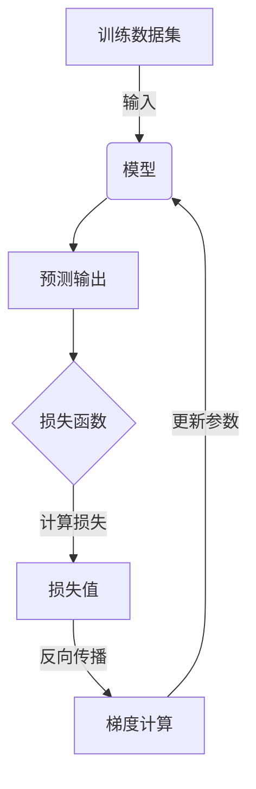

# 损失函数 (Loss Function) 原理与代码实例讲解

## 1.背景介绍

在机器学习和深度学习领域中,损失函数(Loss Function)扮演着至关重要的角色。它是一种用于评估模型预测值与真实值之间差异的度量标准。损失函数的选择和优化对于训练高质量的模型至关重要,因为它直接影响着模型的收敛性和泛化能力。

损失函数的概念源于最小化误差的思想。在监督学习中,我们希望模型能够尽可能精确地预测目标值。然而,由于数据的复杂性和模型的局限性,预测值与真实值之间通常存在一定的差距。损失函数旨在量化这种差距,为模型优化提供指导。

## 2.核心概念与联系

### 2.1 损失函数的作用

损失函数在机器学习和深度学习中具有以下作用:

1. **评估模型性能**: 损失函数可以用于评估模型的预测质量。较低的损失值通常意味着模型的预测更接近真实值,从而表现出更好的性能。

2. **优化模型参数**: 在模型训练过程中,我们通过最小化损失函数来优化模型参数。这个过程通常使用梯度下降等优化算法来迭代更新模型参数,直到损失函数达到最小值或满足其他停止条件。

3. **指导模型训练**: 损失函数的选择会影响模型的训练过程。不同的损失函数对于不同类型的问题可能具有不同的适用性,因此选择合适的损失函数对于获得良好的模型性能至关重要。

### 2.2 常见的损失函数类型

根据问题的类型和模型的输出形式,常见的损失函数包括但不限于:

1. **均方误差 (Mean Squared Error, MSE)**: 适用于回归问题,计算预测值与真实值之间的平方差。
2. **交叉熵损失 (Cross-Entropy Loss)**: 适用于分类问题,计算预测概率与真实标签之间的差异。
3. **Huber损失 (Huber Loss)**: 结合了均方误差和绝对误差的优点,对异常值更加鲁棒。
4. **Hinge损失 (Hinge Loss)**: 常用于支持向量机 (SVM) 中,最小化分类边界与最近训练样本之间的距离。

### 2.3 损失函数与优化算法的关系

在模型训练过程中,损失函数与优化算法密切相关。优化算法的目标是通过迭代调整模型参数,使得损失函数达到最小值。常见的优化算法包括梯度下降、随机梯度下降、Adam优化器等。

优化算法通过计算损失函数相对于模型参数的梯度,并沿着梯度的反方向更新参数,从而逐步减小损失函数的值。这个过程会持续进行,直到损失函数收敛或达到其他停止条件。

## 3.核心算法原理具体操作步骤

在深入探讨损失函数的具体算法原理之前,让我们先了解一下机器学习模型训练的基本流程:

上图展示了机器学习模型训练的核心步骤:

1. 将训练数据集输入到模型中。
2. 模型基于当前参数进行预测,得到预测输出。
3. 使用损失函数计算预测输出与真实标签之间的差异,得到损失值。
4. 通过反向传播算法计算损失值相对于模型参数的梯度。
5. 使用优化算法(如梯度下降)根据梯度更新模型参数。
6. 重复步骤2-5,直到损失函数收敛或达到其他停止条件。

接下来,我们将重点探讨损失函数的具体算法原理和操作步骤。

### 3.1 均方误差损失函数 (Mean Squared Error, MSE)

均方误差损失函数是回归问题中最常用的损失函数之一。它计算预测值与真实值之间的平方差,并对所有样本求平均。公式如下:

$$\text{MSE}(y, \hat{y}) = \frac{1}{n} \sum_{i=1}^{n} (y_i - \hat{y}_i)^2$$

其中:

- $y$ 表示真实值
- $\hat{y}$ 表示预测值
- $n$ 表示样本数量

均方误差损失函数的优点是计算简单,梯度易于计算。然而,它对异常值敏感,因为平方项会放大大的误差值。

### 3.2 交叉熵损失函数 (Cross-Entropy Loss)

交叉熵损失函数常用于分类问题,它衡量预测概率分布与真实标签分布之间的差异。对于二分类问题,交叉熵损失函数的公式如下:

$$\text{CE}(y, \hat{y}) = -y \log(\hat{y}) - (1 - y) \log(1 - \hat{y})$$

其中:

- $y$ 表示真实标签 (0 或 1)
- $\hat{y}$ 表示预测概率 (介于 0 和 1 之间)

对于多分类问题,交叉熵损失函数的公式如下:

$$\text{CE}(y, \hat{y}) = -\sum_{i=1}^{C} y_i \log(\hat{y}_i)$$

其中:

- $C$ 表示类别数量
- $y_i$ 表示第 $i$ 类的真实标签 (0 或 1)
- $\hat{y}_i$ 表示第 $i$ 类的预测概率

交叉熵损失函数的优点是它直接衡量预测概率分布与真实标签分布之间的差异,并且具有良好的数学性质,如凸性和可微性。这使得它在优化过程中表现出良好的收敛性能。

### 3.3 Huber损失函数 (Huber Loss)

Huber损失函数是一种结合了均方误差和绝对误差的损失函数,它对异常值更加鲁棒。Huber损失函数的公式如下:

$$\text{Huber}(y, \hat{y}) = \begin{cases}
\frac{1}{2}(y - \hat{y})^2, & \text{if } |y - \hat{y}| \leq \delta \\
\delta(|y - \hat{y}| - \frac{1}{2}\delta), & \text{otherwise}
\end{cases}$$

其中:

- $y$ 表示真实值
- $\hat{y}$ 表示预测值
- $\delta$ 是一个超参数,用于控制损失函数在均方误差和绝对误差之间的转换点

当预测误差小于 $\delta$ 时,Huber损失函数等同于均方误差损失函数。当预测误差大于 $\delta$ 时,它等同于绝对误差损失函数。这种设计使得Huber损失函数对异常值更加鲁棒,同时在小误差范围内保持了均方误差的平滑性和可微性。

### 3.4 Hinge损失函数 (Hinge Loss)

Hinge损失函数常用于支持向量机 (SVM) 中,它旨在最小化分类边界与最近训练样本之间的距离。Hinge损失函数的公式如下:

$$\text{Hinge}(y, \hat{y}) = \max(0, 1 - y \hat{y})$$

其中:

- $y$ 表示真实标签 (-1 或 1)
- $\hat{y}$ 表示预测值 (介于 -1 和 1 之间)

Hinge损失函数的优点是它直接优化分类边界,并且对于正确分类的样本不会产生惩罚。然而,它对于异常值不太鲁棒,并且在优化过程中可能会出现许多次不可微的情况。

## 4.数学模型和公式详细讲解举例说明

在前面的章节中,我们介绍了几种常见的损失函数及其公式。现在,让我们通过一些具体的例子来更深入地理解这些损失函数的数学模型和公式。

### 4.1 均方误差损失函数 (MSE) 示例

假设我们有一个线性回归模型,用于预测房价。我们有一个包含10个样本的训练数据集,其中每个样本包含房屋面积和真实房价。我们的目标是找到一条最佳拟合直线,使得预测房价与真实房价之间的均方误差最小。

给定以下数据:

| 样本编号 | 房屋面积 (平方米) | 真实房价 (万元) |
|----------|-------------------|-----------------|
| 1        | 80                | 50              |
| 2        | 120               | 80              |
| 3        | 90                | 60              |
| 4        | 100               | 70              |
| 5        | 110               | 75              |
| 6        | 130               | 90              |
| 7        | 95                | 65              |
| 8        | 85                | 55              |
| 9        | 115               | 80              |
| 10       | 105               | 75              |

我们可以使用均方误差损失函数来评估模型的性能:

$$\text{MSE} = \frac{1}{n} \sum_{i=1}^{n} (y_i - \hat{y}_i)^2$$

其中:

- $y_i$ 表示第 $i$ 个样本的真实房价
- $\hat{y}_i$ 表示第 $i$ 个样本的预测房价
- $n$ 表示样本数量 (在这个例子中为 10)

在训练过程中,我们的目标是通过调整模型参数 (即直线的斜率和截距),使得均方误差损失函数达到最小值。这可以通过梯度下降等优化算法来实现。

### 4.2 交叉熵损失函数 (CE) 示例

假设我们有一个二分类问题,需要判断一封电子邮件是否为垃圾邮件。我们训练了一个逻辑回归模型,该模型会输出一个介于 0 和 1 之间的概率值,表示该邮件被判定为垃圾邮件的概率。

给定以下数据:

| 样本编号 | 邮件内容 | 真实标签 (0 为正常邮件, 1 为垃圾邮件) | 预测概率 |
|----------|----------|---------------------------------------|----------|
| 1        | ...      | 0                                     | 0.2      |
| 2        | ...      | 1                                     | 0.7      |
| 3        | ...      | 0                                     | 0.1      |
| 4        | ...      | 1                                     | 0.9      |
| 5        | ...      | 0                                     | 0.3      |

我们可以使用二分类交叉熵损失函数来评估模型的性能:

$$\text{CE}(y, \hat{y}) = -y \log(\hat{y}) - (1 - y) \log(1 - \hat{y})$$

其中:

- $y$ 表示真实标签 (0 或 1)
- $\hat{y}$ 表示预测概率 (介于 0 和 1 之间)

对于第一个样本,真实标签为 0 (正常邮件),预测概率为 0.2。我们可以计算该样本的交叉熵损失如下:

$$\text{CE}(0, 0.2) = -(0 \log(0.2) + (1 - 0) \log(1 - 0.2)) = -\log(0.8) \approx 0.223$$

类似地,我们可以计算其他样本的交叉熵损失,并对所有样本的损失求平均,得到模型的总体损失值。在训练过程中,我们的目标是通过调整模型参数,使得交叉熵损失函数达到最小值。

### 4.3 Huber损失函数示例

假设我们有一个回归问题,需要预测某种机器的寿命。我们训练了一个线性回归模型,但由于数据中存在一些异常值,我们希望使用对异常值更加鲁棒的损失函数。

给定以下数据:

| 样本编号 | 特征值 | 真实机器寿命 (小时) | 预测机器寿命 (小时) |
|----------|--------|----------------------|----------------------|
| 1        | ...    | 5000                 | 5100                 |
| 2        | ...    | 5200                 | 5150                 |
| 3        | ...    | 4900                 | 5000                 |
| 4        | ...    | 10000                | 5500                 |
| 5        | ...    | 5100                 | 5050                 |

我们可以使用Huber损