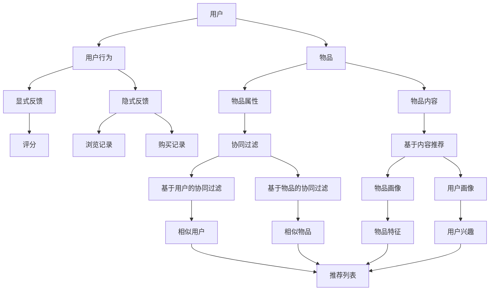

# 推荐系统(Recommender Systems) - 原理与代码实例讲解

## 1. 背景介绍
### 1.1 推荐系统的起源与发展
#### 1.1.1 早期的推荐系统
#### 1.1.2 协同过滤的出现
#### 1.1.3 深度学习时代的推荐系统

### 1.2 推荐系统的商业价值
#### 1.2.1 提升用户体验
#### 1.2.2 增加用户粘性
#### 1.2.3 提高转化率和营收

### 1.3 推荐系统的应用领域
#### 1.3.1 电商平台
#### 1.3.2 视频网站
#### 1.3.3 社交网络
#### 1.3.4 新闻资讯
#### 1.3.5 音乐和播客

## 2. 核心概念与联系
### 2.1 用户(User)
#### 2.1.1 用户属性
#### 2.1.2 用户行为

### 2.2 物品(Item) 
#### 2.2.1 物品属性
#### 2.2.2 物品内容

### 2.3 评分(Rating)与反馈(Feedback)
#### 2.3.1 显式反馈
#### 2.3.2 隐式反馈

### 2.4 相似度(Similarity)
#### 2.4.1 用户相似度
#### 2.4.2 物品相似度

### 2.5 冷启动(Cold Start)问题
#### 2.5.1 用户冷启动
#### 2.5.2 物品冷启动

### 2.6 推荐系统的评估指标
#### 2.6.1 准确率和召回率
#### 2.6.2 覆盖率和多样性
#### 2.6.3 新颖性和惊喜度

## 3. 核心算法原理具体操作步骤
### 3.1 基于协同过滤(Collaborative Filtering)的推荐算法
#### 3.1.1 基于用户的协同过滤(User-based CF)
##### 3.1.1.1 找到与目标用户相似的用户
##### 3.1.1.2 根据相似用户的偏好推荐物品
#### 3.1.2 基于物品的协同过滤(Item-based CF) 
##### 3.1.2.1 计算物品之间的相似度
##### 3.1.2.2 根据用户历史偏好的物品推荐相似物品

### 3.2 基于内容(Content-based)的推荐算法
#### 3.2.1 物品画像构建
#### 3.2.2 用户画像构建
#### 3.2.3 根据用户画像推荐相似物品

### 3.3 基于知识(Knowledge-based)的推荐算法
#### 3.3.1 构建领域知识图谱
#### 3.3.2 基于知识推理的推荐

### 3.4 混合(Hybrid)推荐算法
#### 3.4.1 加权混合
#### 3.4.2 分层混合
#### 3.4.3 特征组合

### 3.5 基于深度学习(Deep Learning)的推荐算法
#### 3.5.1 深度神经网络(DNN)
#### 3.5.2 卷积神经网络(CNN)
#### 3.5.3 循环神经网络(RNN)
#### 3.5.4 注意力机制(Attention)

## 4. 数学模型和公式详细讲解举例说明
### 4.1 相似度计算
#### 4.1.1 欧几里得距离
$d(x,y) = \sqrt{\sum_{i=1}^{n} (x_i - y_i)^2}$

#### 4.1.2 余弦相似度  
$\cos(\theta) = \frac{\mathbf{A} \cdot \mathbf{B}}{\|\mathbf{A}\| \|\mathbf{B}\|} = \frac{\sum_{i=1}^{n} A_i B_i}{\sqrt{\sum_{i=1}^{n} A_i^2} \sqrt{\sum_{i=1}^{n} B_i^2}}$

#### 4.1.3 皮尔逊相关系数
$r = \frac{\sum_{i=1}^{n} (x_i - \bar{x})(y_i - \bar{y})}{\sqrt{\sum_{i=1}^{n} (x_i - \bar{x})^2} \sqrt{\sum_{i=1}^{n} (y_i - \bar{y})^2}}$

### 4.2 矩阵分解(Matrix Factorization)
#### 4.2.1 奇异值分解(SVD) 
$$A = U \Sigma V^T$$

#### 4.2.2 非负矩阵分解(NMF)
$$V \approx WH, W \geq 0, H \geq 0$$

### 4.3 潜在因子模型(Latent Factor Model)
#### 4.3.1 概率潜在语义分析(PLSA)
$$P(d,w) = P(d) \sum_{z \in Z} P(w|z)P(z|d)$$

#### 4.3.2 潜在狄利克雷分配(LDA)  
$$P(\theta, \mathbf{z}, \mathbf{w} | \alpha, \beta) = P(\theta | \alpha) \prod_{n=1}^{N} P(z_n | \theta) P(w_n | z_n, \beta)$$

### 4.4 图嵌入(Graph Embedding)
#### 4.4.1 DeepWalk
#### 4.4.2 Node2Vec

## 5. 项目实践：代码实例和详细解释说明
### 5.1 基于 Python 的协同过滤推荐系统
#### 5.1.1 数据准备和预处理
#### 5.1.2 用户相似度计算
#### 5.1.3 物品相似度计算 
#### 5.1.4 生成推荐列表

### 5.2 基于 TensorFlow 的深度学习推荐系统
#### 5.2.1 数据准备和预处理
#### 5.2.2 构建深度神经网络模型
#### 5.2.3 模型训练和评估
#### 5.2.4 生成推荐列表

### 5.3 基于 Spark 的分布式推荐系统
#### 5.3.1 数据准备和预处理
#### 5.3.2 使用 Spark MLlib 进行协同过滤
#### 5.3.3 模型训练和评估
#### 5.3.4 生成推荐列表

## 6. 实际应用场景
### 6.1 电商平台商品推荐
#### 6.1.1 场景分析
#### 6.1.2 推荐策略设计
#### 6.1.3 效果评估

### 6.2 视频网站个性化推荐
#### 6.2.1 场景分析  
#### 6.2.2 推荐策略设计
#### 6.2.3 效果评估

### 6.3 社交网络好友推荐
#### 6.3.1 场景分析
#### 6.3.2 推荐策略设计 
#### 6.3.3 效果评估

## 7. 工具和资源推荐
### 7.1 开源推荐系统框架
#### 7.1.1 Apache Mahout
#### 7.1.2 LibRec
#### 7.1.3 Surprise
#### 7.1.4 LightFM

### 7.2 推荐系统数据集
#### 7.2.1 MovieLens
#### 7.2.2 Netflix Prize
#### 7.2.3 Amazon Product Data
#### 7.2.4 Yelp Dataset

### 7.3 学习资源
#### 7.3.1 书籍推荐
#### 7.3.2 在线课程
#### 7.3.3 论文与研究

## 8. 总结：未来发展趋势与挑战
### 8.1 个性化与隐私保护的平衡
### 8.2 跨领域推荐
### 8.3 实时推荐
### 8.4 对抗攻击与鲁棒性
### 8.5 可解释性与透明度

## 9. 附录：常见问题与解答
### 9.1 如何处理数据稀疏问题？
### 9.2 如何平衡准确性和多样性？
### 9.3 如何进行在线学习和更新？
### 9.4 如何评估推荐系统的效果？
### 9.5 如何选择合适的推荐算法？

推荐系统是一种信息过滤系统,旨在预测用户对物品的"评分"或"偏好"。通过分析用户的历史行为数据和物品的属性信息,推荐系统可以从海量的物品中挖掘出用户可能感兴趣的内容,从而提供个性化的推荐服务。

推荐系统的核心是建立用户和物品之间的联系。传统的推荐算法主要包括协同过滤和基于内容的推荐。协同过滤利用用户之间或物品之间的相似性,基于用户的历史行为为其推荐相似用户喜欢的物品或与其喜欢物品相似的其他物品。基于内容的推荐则通过分析物品的属性特征,为用户推荐与其历史偏好物品在内容上相似的其他物品。

随着深度学习技术的发展,推荐系统也迎来了新的突破。利用深度神经网络强大的表示学习能力,可以从海量的用户行为数据中自动提取高级特征,捕捉用户和物品之间复杂的非线性关系。结合注意力机制、图神经网络等技术,深度学习推荐模型能够更好地建模用户的动态偏好和物品的上下文信息。

在实际应用中,推荐系统需要根据具体场景选择合适的算法和模型。电商平台侧重于提高转化率和销量,视频网站追求用户粘性和观看时长,社交网络重点关注用户互动和社交关系。不同的业务目标和数据特点,对推荐系统的设计和优化提出了不同的要求。

未来,推荐系统还面临着许多挑战和机遇。在追求个性化推荐的同时,如何保护用户隐私,如何提高推荐的多样性和新颖性,如何增强推荐结果的可解释性和透明度,都是亟待解决的问题。跨领域推荐、实时推荐、对抗攻击等新的研究方向,也为推荐系统的发展带来了新的可能。

推荐系统作为人工智能技术与实际应用深度结合的典型案例,在帮助用户发现感兴趣信息、提升业务增长和用户体验方面发挥着越来越重要的作用。未来,推荐系统必将继续在理论研究和工程实践的道路上不断前行,为我们带来更加智能、高效、人性化的信息服务。

作者：禅与计算机程序设计艺术 / Zen and the Art of Computer Programming