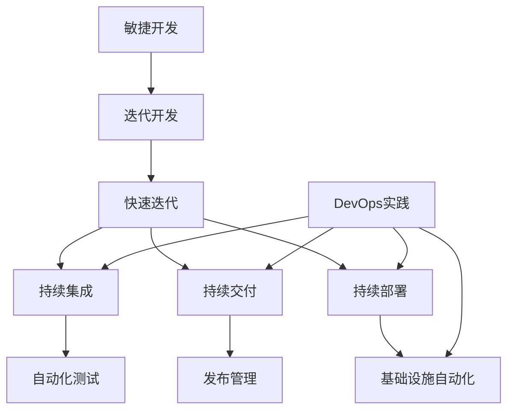

# 敏捷开发与快速迭代原理与代码实战案例讲解

## 1.背景介绍

### 1.1 软件开发的挑战

在当今快节奏的商业环境中,软件开发面临着许多挑战。用户需求不断变化,技术快速迭代,市场竞争激烈。传统的瀑布式软件开发模型已经无法满足当前的需求,因为它过于僵化,反应迟缓,难以适应需求的变化。

### 1.2 敏捷开发的兴起 

为了应对这些挑战,敏捷开发方法应运而生。敏捷开发强调迭代式、增量式的软件开发,鼓励频繁交付,紧密协作,快速响应变化。这种方法使得软件开发过程更加灵活,可以更好地适应不断变化的需求。

### 1.3 快速迭代的重要性

在敏捷开发中,快速迭代是一个关键概念。通过将软件开发过程划分为多个短周期的迭代,每个迭代都会交付一个可工作的软件版本,从而获得及时的反馈并进行调整。这种方式可以最大限度地减少风险,提高软件质量,并确保软件符合实际需求。

## 2.核心概念与联系



### 2.1 迭代开发

迭代开发是敏捷开发的核心实践。它将软件开发过程划分为多个短周期的迭代,每个迭代都包含需求分析、设计、编码、测试和交付等活动。每个迭代都会交付一个可工作的软件版本,从而获得及时的反馈并进行调整。

### 2.2 快速迭代

快速迭代是指在短时间内(通常为1-4周)完成一个完整的迭代周期。这种快速的迭代节奏可以确保软件开发团队能够及时响应需求变化,快速交付新功能,并持续改进软件质量。

### 2.3 持续集成

持续集成(Continuous Integration,CI)是一种实践,它要求开发人员频繁地将代码更改合并到主干分支,并通过自动化构建和测试来验证这些更改。这有助于尽早发现问题,降低集成风险,并确保代码始终处于可交付状态。

### 2.4 持续交付

持续交付(Continuous Delivery,CD)是指将经过自动化测试和验证的软件版本,准备好可以随时部署到生产环境。这种做法可以缩短从开发到部署的周期,提高软件交付的效率和质量。

### 2.5 持续部署

持续部署(Continuous Deployment)是指将经过验证的软件版本,自动部署到生产环境,无需人工干预。这种做法可以进一步缩短上线周期,加快软件交付速度,并降低人为错误的风险。

### 2.6 DevOps实践

DevOps是一种文化理念、运动和一组实践,旨在通过自动化流程来缩短软件开发生命周期,提高软件交付频率并确保部署质量。DevOps实践包括持续集成、持续交付、持续部署、基础设施自动化等,与敏捷开发和快速迭代密切相关。

## 3.核心算法原理具体操作步骤

### 3.1 迭代规划

在每个迭代开始时,团队需要进行迭代规划,确定本次迭代要完成的工作。这通常包括以下步骤:

1. 审视产品待办事项(Product Backlog),确定本次迭代的目标和范围。
2. 对用户故事进行估算和优先级排序。
3. 从产品待办事项中选择本次迭代要完成的用户故事。
4. 将选定的用户故事分解为具体的任务,并估算每个任务的工作量。
5. 制定迭代计划,分配任务给团队成员。

### 3.2 每日站立会议

每日站立会议(Daily Standup)是敏捷开发中的一种常见实践。在这种会议中,团队成员每天都会简短地回答三个问题:

1. 昨天完成了什么工作?
2. 今天计划完成什么工作?
3.是否遇到了任何阻碍或障碍?

这种会议有助于团队成员保持同步,及时发现并解决问题,提高团队协作效率。

### 3.3 迭代回顾

在每个迭代结束时,团队需要进行迭代回顾(Iteration Retrospective)。这是一个反思和改进的过程,包括以下步骤:

1. 回顾本次迭代的成功和失败。
2. 识别可以改进的领域。
3. 制定改进措施,以便在下一次迭代中实施。

迭代回顾有助于团队不断学习和改进,提高软件交付质量。

### 3.4 持续集成流程

持续集成流程通常包括以下步骤:

1. 开发人员将代码更改提交到版本控制系统(如Git)。
2. 持续集成服务器(如Jenkins)监测到代码更改,自动拉取最新代码。
3. 构建自动化脚本编译代码,运行单元测试和代码质量检查。
4. 如果构建和测试通过,可以自动部署到测试或暂存环境进行进一步测试。
5. 如果所有测试都通过,可以准备好部署到生产环境。

### 3.5 持续交付流程

持续交付流程在持续集成的基础上,增加了自动化的端到端测试和手动验证环节,具体步骤如下:

1. 完成持续集成流程,确保代码可以成功构建和通过单元测试。
2. 自动触发端到端测试,模拟真实的用户场景。
3. 如果端到端测试通过,将软件版本部署到暂存环境进行手动验证。
4. 如果手动验证通过,则将软件版本标记为可部署状态,准备好部署到生产环境。

### 3.6 持续部署流程

持续部署流程在持续交付的基础上,实现了完全自动化的部署,无需人工干预,具体步骤如下:

1. 完成持续交付流程,确保软件版本已经通过所有自动化测试和手动验证。
2. 持续部署工具(如AWS CodeDeploy)自动将已验证的软件版本部署到生产环境。
3. 自动化监控系统监测部署过程,并在出现问题时执行回滚或修复操作。
4. 部署完成后,自动触发烟雾测试(Smoke Tests)验证生产环境的基本功能。

## 4.数学模型和公式详细讲解举例说明

在敏捷开发和快速迭代中,有一些常用的数学模型和公式,可以帮助我们量化和优化软件开发过程。

### 4.1 故事点估算

在敏捷开发中,我们通常使用故事点(Story Points)来估算用户故事的工作量,而不是使用传统的工时估算。故事点是一种相对估算方法,它考虑了任务的复杂性、风险和不确定性等因素。

常用的故事点估算方法是斐波那契数列,例如:1、2、3、5、8、13、21等。这种非线性的估算方式可以更好地反映任务复杂度的指数级增长。

### 4.2 团队速率

团队速率(Team Velocity)是指团队在一个迭代中可以完成的故事点数量。它是根据过去几个迭代的实际完成情况计算得出的,可以用于预测未来迭代的工作量。

团队速率的计算公式如下:

$$
\text{团队速率} = \frac{\sum_{i=1}^{n} \text{已完成故事点}}{n}
$$

其中,n是考虑的迭代数量。

通过持续跟踪团队速率,我们可以评估团队的交付能力,并根据需要调整迭代计划和资源分配。

### 4.3 技术债务

技术债务(Technical Debt)是指为了快速交付软件而做出的一些妥协和权衡,导致代码质量下降、设计缺陷和技术缺陷等问题。这些问题会随着时间的推移而累积,最终会影响软件的可维护性和可扩展性。

我们可以使用以下公式来估算技术债务:

$$
\text{技术债务} = \sum_{i=1}^{n} \text{代码缺陷成本} + \sum_{j=1}^{m} \text{设计缺陷成本}
$$

其中,n是代码缺陷的数量,m是设计缺陷的数量。

通过定期评估和偿还技术债务,我们可以保持代码质量,降低未来的维护成本。

## 5.项目实践:代码实例和详细解释说明

为了更好地理解敏捷开发和快速迭代的实践,我们将通过一个简单的项目案例来演示相关概念和技术。

### 5.1 项目概述

我们将开发一个简单的在线购物网站,包括以下主要功能:

- 用户注册和登录
- 浏览和搜索商品
- 添加商品到购物车
- 下单和支付

### 5.2 迭代计划

我们将把整个项目划分为四个迭代,每个迭代为两周时间。具体计划如下:

**迭代1:**
- 用户注册和登录功能
- 基本的商品列表页面

**迭代2:**
- 商品搜索和过滤功能
- 购物车功能

**迭代3:**
- 下单和支付功能
- 订单管理页面

**迭代4:**
- 优化用户体验
- 性能优化和测试

### 5.3 持续集成和交付

我们将使用Jenkins作为持续集成和交付工具,并配置以下流水线:

1. 代码提交到Git仓库后,Jenkins自动拉取最新代码。
2. 使用Maven进行代码编译和单元测试。
3. 如果单元测试通过,自动部署到测试环境进行端到端测试。
4. 如果端到端测试通过,部署到暂存环境进行手动验证。
5. 手动验证通过后,标记为可部署状态,准备部署到生产环境。

### 5.4 代码示例

以下是一个简单的Java代码示例,实现了用户注册功能:

```java
import org.springframework.beans.factory.annotation.Autowired;
import org.springframework.stereotype.Service;

@Service
public class UserService {

    @Autowired
    private UserRepository userRepository;

    public void registerUser(String username, String password, String email) {
        // 检查用户名和电子邮件是否已被使用
        if (userRepository.existsByUsername(username) || userRepository.existsByEmail(email)) {
            throw new UserAlreadyExistsException();
        }

        // 创建新用户
        User user = new User(username, password, email);
        userRepository.save(user);
    }
}
```

在这个示例中,我们使用Spring框架实现了用户注册功能。`UserService`类提供了`registerUser`方法,用于创建新用户。在创建新用户之前,我们会检查用户名和电子邮件是否已被使用,以避免重复注册。

我们还可以为这个功能编写单元测试,确保代码的正确性:

```java
import org.junit.jupiter.api.Test;
import org.junit.jupiter.api.extension.ExtendWith;
import org.mockito.InjectMocks;
import org.mockito.Mock;
import org.mockito.junit.jupiter.MockitoExtension;

import static org.junit.jupiter.api.Assertions.assertThrows;
import static org.mockito.Mockito.when;

@ExtendWith(MockitoExtension.class)
public class UserServiceTest {

    @Mock
    private UserRepository userRepository;

    @InjectMocks
    private UserService userService;

    @Test
    public void testRegisterUser_Success() {
        String username = "testuser";
        String password = "password";
        String email = "test@example.com";

        when(userRepository.existsByUsername(username)).thenReturn(false);
        when(userRepository.existsByEmail(email)).thenReturn(false);

        userService.registerUser(username, password, email);
        // 可以进一步验证用户是否被正确保存
    }

    @Test
    public void testRegisterUser_UserAlreadyExists() {
        String username = "existinguser";
        String password = "password";
        String email = "existing@example.com";

        when(userRepository.existsByUsername(username)).thenReturn(