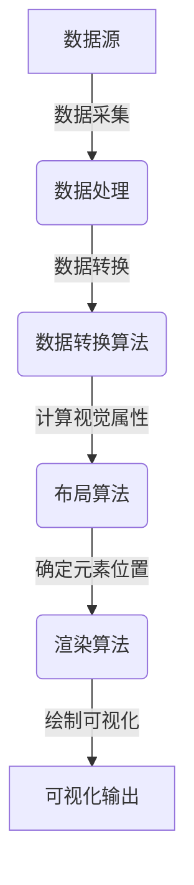

# 数据可视化 原理与代码实例讲解

## 1.背景介绍

在当今的数据时代，数据可视化已经成为一种强大的工具,可以帮助我们更好地理解和呈现复杂的数据。无论是在商业智能、科学研究还是日常生活中,数据可视化都扮演着至关重要的角色。通过将原始数据转化为直观的图形表示,我们可以更容易地发现数据中隐藏的模式、趋势和异常,从而获得更深入的洞察力。

数据可视化的应用范围广泛,从简单的条形图和饼图,到复杂的交互式仪表板和3D可视化。它不仅可以帮助我们更好地理解数据,还可以促进数据驱动的决策,提高工作效率和生产力。

随着数据量的不断增长和数据类型的多样化,数据可视化技术也在不断发展和演进。新兴的可视化技术,如增强现实(AR)和虚拟现实(VR),为数据可视化带来了全新的体验和应用场景。

## 2.核心概念与联系

数据可视化涉及多个核心概念,包括数据处理、视觉编码、交互设计和认知心理学等。这些概念相互关联,共同构建了数据可视化的理论基础。

### 2.1 数据处理

数据处理是数据可视化的基础,它包括数据采集、清洗、转换和聚合等步骤。高质量的数据处理可以确保可视化的准确性和有效性。常用的数据处理技术包括SQL、Python的Pandas库和Apache Spark等。

### 2.2 视觉编码

视觉编码是将数据映射到视觉元素(如颜色、形状、大小等)的过程。有效的视觉编码可以增强数据的可读性和可理解性。常用的视觉编码技术包括柱状图、散点图、热力图和树状图等。

### 2.3 交互设计

交互设计使用户能够与可视化进行交互,探索和操作数据。良好的交互设计可以提高可视化的用户体验和洞察力。常用的交互技术包括缩放、平移、过滤和钻取等。

### 2.4 认知心理学

认知心理学研究人类如何感知和理解视觉信息。将认知心理学原理应用于数据可视化设计,可以提高可视化的有效性和易用性。常用的认知心理学原理包括预AttentiveProcessing、gestalt原理和色彩理论等。

这些核心概念相互关联,共同构建了数据可视化的理论基础。数据处理为可视化提供了高质量的数据输入,视觉编码将数据转化为视觉表示,交互设计增强了用户与可视化的互动体验,而认知心理学则指导了可视化的设计和优化。

## 3.核心算法原理具体操作步骤

数据可视化的核心算法原理包括数据转换、布局算法和渲染算法等。这些算法确保了可视化的高效性和准确性。



### 3.1 数据转换算法

数据转换算法将原始数据转换为可视化所需的数据结构。常用的数据转换算法包括:

1. **层次数据转换**: 将分层数据(如树状结构)转换为可视化所需的节点链接数据结构。
2. **关系数据转换**: 将关系数据(如网络数据)转换为节点和边的数据结构。
3. **地理数据转换**: 将地理数据(如GIS数据)转换为可视化所需的坐标数据结构。

### 3.2 布局算法

布局算法根据数据的特征和可视化类型,计算每个视觉元素的位置和大小。常用的布局算法包括:

1. **力导向布局算法**: 用于网络数据的可视化,通过模拟物理力的作用来确定节点的位置。
2. **树状布局算法**: 用于层次数据的可视化,如树形图和缩放树形图。
3. **地理投影算法**: 用于地理数据的可视化,将球面坐标投影到平面上。

### 3.3 渲染算法

渲染算法根据布局算法的计算结果,绘制出最终的可视化图形。常用的渲染算法包括:

1. **矢量图形渲染**: 使用线条和形状绘制可视化图形,适用于静态图像和交互式可视化。
2. **栅格图形渲染**: 使用像素绘制可视化图形,适用于大规模数据集和高分辨率图像。
3. **WebGL渲染**: 利用GPU加速,实现高性能的交互式3D可视化。

这些核心算法共同构建了数据可视化的技术基础,确保了可视化的高效性、准确性和交互性。

## 4.数学模型和公式详细讲解举例说明

数据可视化中涉及多种数学模型和公式,用于量化和优化可视化的效果。以下是一些常见的数学模型和公式:

### 4.1 颜色模型

颜色是数据可视化中最常用的视觉编码通道之一。常用的颜色模型包括RGB模型和HSL模型。

1. **RGB模型**

RGB模型将颜色表示为红(R)、绿(G)和蓝(B)三个分量的线性组合。每个分量的取值范围为0到255(或0到1)。RGB模型的数学表达式如下:

$$
C = (R, G, B)
$$

其中,C表示颜色,R、G和B分别表示红、绿和蓝三个分量的值。

2. **HSL模型**

HSL模型将颜色表示为色相(H)、饱和度(S)和亮度(L)三个分量。色相范围为0到360度,饱和度和亮度的取值范围为0到1。HSL模型的数学表达式如下:

$$
C = (H, S, L)
$$

其中,C表示颜色,H、S和L分别表示色相、饱和度和亮度的值。

颜色模型在数据可视化中广泛应用,如热力图、地理可视化和分类编码等。选择合适的颜色模型和调色板可以提高可视化的可读性和美观性。

### 4.2 力导向布局算法

力导向布局算法是一种常用的网络可视化布局算法,它模拟物理力的作用来确定节点的位置。常见的力导向布局算法包括Fruchterman-Reingold算法和Kamada-Kawai算法。

1. **Fruchterman-Reingold算法**

Fruchterman-Reingold算法通过模拟库仑力和弹簧力来确定节点的位置。每个节点之间存在斥力,相连节点之间存在引力。算法的目标是最小化能量函数,使节点达到平衡状态。能量函数的数学表达式如下:

$$
E = \sum_{i<j} \frac{k^2}{d_{ij}} + \sum_{i\neq j} \frac{l^2}{d_{ij}}
$$

其中,E表示能量函数,k和l分别表示斥力和引力的强度,d<sub>ij</sub>表示节点i和节点j之间的距离。

2. **Kamada-Kawai算法**

Kamada-Kawai算法通过最小化总能量函数来确定节点的位置。能量函数考虑了节点之间的理想距离和实际距离之间的差异。能量函数的数学表达式如下:

$$
E = \sum_{i<j} \frac{1}{2}k_{ij}(l_{ij} - d_{ij})^2
$$

其中,E表示能量函数,k<sub>ij</sub>表示节点i和节点j之间的理想距离,l<sub>ij</sub>表示节点i和节点j之间的实际距离,d<sub>ij</sub>表示节点i和节点j之间的欧几里得距离。

力导向布局算法在社交网络分析、生物信息学和交通网络可视化等领域有广泛应用。选择合适的布局算法可以提高网络可视化的清晰度和可读性。

### 4.3 地理投影

地理投影是将球面坐标(经度和纬度)映射到平面坐标系的过程。常见的地理投影方法包括等角cylindrical投影、等积pseudocylindrical投影和等面积投影等。

1. **等角cylindrical投影**

等角cylindrical投影保持了球面上的角度不变,但会产生面积失真。常见的等角cylindrical投影包括Mercator投影和Gauss-Kruger投影。Mercator投影的数学表达式如下:

$$
x = R \lambda \\
y = R \ln \left( \tan \left( \frac{\pi}{4} + \frac{\phi}{2} \right) \right)
$$

其中,x和y表示平面坐标,R表示地球半径,λ表示经度,φ表示纬度。

2. **等积pseudocylindrical投影**

等积pseudocylindrical投影保持了球面上的面积不变,但会产生角度失真。常见的等积pseudocylindrical投影包括Sinusoidal投影和Mollweide投影。Sinusoidal投影的数学表达式如下:

$$
x = R \lambda \cos \phi \\
y = R \phi
$$

其中,x和y表示平面坐标,R表示地球半径,λ表示经度,φ表示纬度。

3. **等面积投影**

等面积投影保持了球面上的面积不变,但会产生角度和形状失真。常见的等面积投影包括Lambert等面积投影和Albers等面积投影。Lambert等面积投影的数学表达式如下:

$$
x = R \sqrt{\frac{2}{1-\cos \phi_0}} \sin \left( \frac{\lambda}{2} \right) \\
y = R \sqrt{\frac{2}{1-\cos \phi_0}} \sin \phi
$$

其中,x和y表示平面坐标,R表示地球半径,λ表示经度,φ表示纬度,φ<sub>0</sub>表示标准纬线。

选择合适的地理投影方法对于地理可视化至关重要,可以最大限度地减少失真,提高可视化的准确性和可读性。

通过上述数学模型和公式的详细讲解,我们可以更好地理解数据可视化中的核心概念和算法原理。这些数学基础为数据可视化提供了坚实的理论支撑,并指导了可视化的设计和优化。

## 5.项目实践:代码实例和详细解释说明

为了更好地理解数据可视化的原理和实现,我们将通过一个实际项目来进行代码实例和详细解释说明。在这个项目中,我们将使用Python的Matplotlib库和Seaborn库来可视化一个关于房价的数据集。

### 5.1 数据集介绍

我们将使用著名的"波士顿房价数据集"(Boston Housing Dataset)。这个数据集包含506个房屋的信息,包括房屋的面积、房间数量、年龄、邻近公园区的比例、低收入人群比例等特征,以及相应的房价。我们的目标是探索这些特征与房价之间的关系,并使用数据可视化技术来呈现我们的发现。

### 5.2 数据加载和预处理

首先,我们需要导入所需的库和加载数据集:

```python
import pandas as pd
import matplotlib.pyplot as plt
import seaborn as sns

# 加载数据集
housing_data = pd.read_csv("housing.csv")
```

接下来,我们可以查看数据集的基本信息和描述性统计:

```python
# 查看前5行数据
print(housing_data.head())

# 查看数据描述性统计
print(housing_data.describe())
```

根据需要,我们可以进行数据清洗和转换,如处理缺失值、标准化数据等。

### 5.3 可视化实现

#### 5.3.1 散点图

我们可以使用散点图来探索房价与其他特征之间的关系。以下代码绘制了房价与房屋面积之间的散点图:

```python
# 绘制散点图
plt.figure(figsize=(10, 6))
plt.scatter(housing_data['RM'], housing_data['MEDV'], alpha=0.5)
plt.xlabel('Average Number of Rooms (RM)')
plt.ylabel('Median Value (MEDV)')
plt.title('Relationship between Number of Rooms and Median Value')
plt.show()
```

在这个散点图中,我们可以观察到房价(MEDV)与房屋面积(RM)之间存在正相关