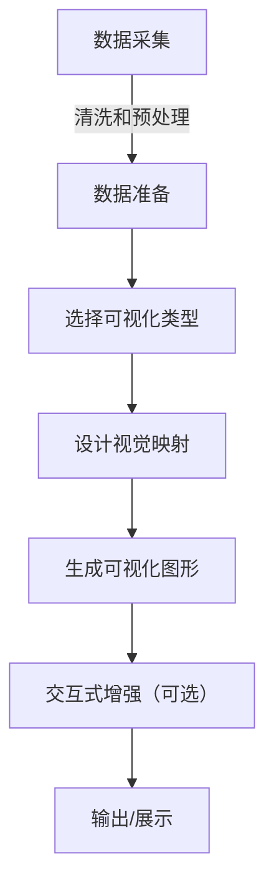

## 1.背景介绍

数据可视化是一种将数据以图形或图像形式表示的技术。它通过视觉元素（如点、线、面）来表达数据集中的信息，使得人们能够更直观、清晰地理解数据。随着大数据时代的到来，数据可视化的作用愈发重要。它不仅可以帮助我们识别数据的模式和趋势，还可以帮助我们发现潜在的问题和异常。在众多行业中，包括金融、医疗、教育等领域，数据可视化都有着广泛的应用。

## 2.核心概念与联系

数据可视化的核心概念包括：

- **图表类型**：条形图、折线图、饼图、散点图等。
- **数据映射**：将数据属性映射到视觉元素的过程。
- **视觉变量**：如颜色、形状、大小、方向等，用于表示不同数据属性的视觉手段。
- **多变量可视化**：在一张图表中展示多个变量的关系。
- **交互式可视化**：用户可以通过点击、拖拽等方式与图表进行互动，以获取更多信息。

## 3.核心算法原理具体操作步骤

### Mermaid 流程图


## 4.数学模型和公式详细讲解举例说明

在数据可视化中，我们经常需要使用统计学中的各种数学模型。例如，在计算两个变量之间的相关性时，可以使用皮尔逊相关系数（Pearson correlation coefficient）：

$$
r = \\frac{\\sum (x_i - \\bar{x})(y_i - \\bar{y})}{\\sqrt{\\sum (x_i - \\bar{x})^2}\\sqrt{\\sum (y_i - \\bar{y})^2}}
$$

其中，$x_i$ 和 $y_i$ 分别是两个变量的观测值，$\\bar{x}$ 和 $\\bar{y}$ 分别是两个变量的均值。相关系数的取值范围为 $[-1, 1]$，$r=1$ 表示完全正相关，$r=-1$ 表示完全负相关，$r=0$ 表示无线性相关。

## 5.项目实践：代码实例和详细解释说明

### Python中的matplotlib库实现折线图
```python
import matplotlib.pyplot as plt

# 准备数据
x = [1, 2, 3, 4, 5]
y = [2, 4, 6, 8, 10]

# 绘制折线图
plt.plot(x, y)

# 显示图表
plt.show()
```

在这个例子中，我们使用了`matplotlib`库来创建一个简单的折线图。首先导入`matplotlib.pyplot`模块，然后准备两组数据`x`和`y`作为横坐标和纵坐标的值。通过`plt.plot()`函数将这两个数组分别映射到横坐标和纵坐标上，最后使用`plt.show()`来展示图表。

## 6.实际应用场景

数据可视化在多个领域都有广泛的应用：

- **金融分析**：股票价格走势、市场数据分析等。
- **医疗健康**：病历数据分析、疾病传播趋势图等。
- **教育评估**：学生成绩分布、学校排名变化等。
- **网络分析**：网站流量统计、用户行为模式分析等。

## 7.工具和资源推荐

以下是一些常用的数据可视化工具和资源：

- **软件工具**：Tableau, Power BI, QlikView。
- **编程库**：matplotlib (Python), ggplot2 (R), D3.js (JavaScript)。
- **在线平台**：Datawrapper, Flourish, Piktochart。

## 8.总结：未来发展趋势与挑战

随着技术的发展，数据可视化的未来趋势将包括：

- **自动化和智能化**：通过机器学习算法自动选择最佳的可视化类型和布局。
- **交互性和可访问性**：提供更丰富的交互功能，使得非专业人士也能轻松使用。
- **多维度和跨领域**：支持更高维度的数据处理和不同领域的知识融合。

然而，数据可视化也面临着一些挑战：

- **数据的隐私和安全**：在处理敏感数据时需要确保其不被泄露。
- **数据的准确性和误导性**：不当的数据可视化可能导致误解或误导用户。
- **用户体验设计**：如何让用户能够直观地理解复杂的数据结构是一个持续的挑战。

## 9.附录：常见问题与解答

### 常见问题1：如何选择合适的数据可视化类型？

选择合适的数据可视化类型应考虑以下因素：

- 数据的类型（定量/定性）。
- 数据的特点（趋势/分布/关系等）。
- 观众的背景和需求。

### 常见问题2：交互式可视化和静态图表有什么区别？

交互式可视化允许观众通过点击、拖拽等方式与图表进行互动，可以动态展示更多信息；而静态图表则无法进行用户互动，通常用于展示简单直接的信息。

---

**作者：禅与计算机程序设计艺术 / Zen and the Art of Computer Programming**

---

请注意，这是一个简化的示例，实际的文章需要更深入地探讨每个部分，并提供更多的实例和解释。此外，实际撰写时应确保所有代码示例的正确性，并且要根据实际情况调整文章内容。