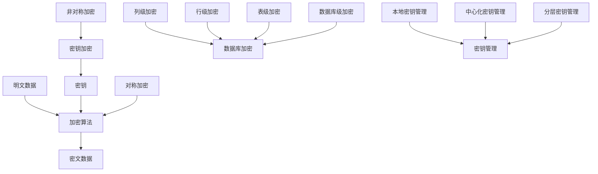

# 数据库加密系统设计与实现的设计与开发

## 1. 背景介绍

### 1.1 数据安全的重要性

在当今数字化时代,数据已成为企业和组织最宝贵的资产之一。随着数据量的不断增长和数据价值的日益凸显,数据安全问题也日益突出。数据泄露、数据窃取等安全事件频发,给企业和个人造成了巨大的经济损失和声誉损害。因此,保护数据安全,防止数据泄露已成为各行各业的重中之重。

### 1.2 数据库加密的必要性

数据库作为数据存储和管理的核心,其安全性尤为重要。未经加密的数据库面临诸多安全风险:

1. 黑客入侵:黑客可以通过网络漏洞、弱口令等方式入侵数据库,窃取敏感数据。
2. 内部威胁:内部人员可能出于各种目的,非法访问或泄露数据。
3. 数据篡改:攻击者可能恶意篡改数据,破坏数据完整性。

为了应对这些安全威胁,对数据库进行加密势在必行。通过加密,即使数据库被非法访问,攻击者也无法直接读取明文数据,大大降低了数据泄露的风险。

### 1.3 数据库加密系统的目标

一个完善的数据库加密系统应该达到以下目标:

1. 机密性:未经授权的用户无法读取加密数据的明文内容。
2. 完整性:防止加密数据被恶意篡改。 
3. 可用性:加密操作不应显著影响数据库的性能和可用性。
4. 灵活性:支持多种加密算法,满足不同安全级别的需求。
5. 易用性:加密过程对应用程序透明,尽量减少改造成本。

本文将详细阐述数据库加密系统的设计与实现,包括核心概念、架构设计、加密算法、密钥管理等关键技术,并给出具体的代码实例。通过本文,读者可以全面了解数据库加密系统的原理和实现,为构建安全可靠的数据库奠定基础。

## 2. 核心概念与关联

### 2.1 密码学基础

密码学是数据库加密的理论基础,主要涉及以下概念:

- 明文:未加密的原始数据。
- 密文:经过加密后的数据。
- 加密:将明文转换为密文的过程。
- 解密:将密文还原为明文的过程。
- 密钥:控制加密和解密过程的参数。
- 加密算法:定义加密和解密操作的数学函数。

### 2.2 对称加密与非对称加密

根据加解密使用的密钥是否相同,加密算法可分为对称加密和非对称加密两大类:

- 对称加密:加密和解密使用同一个密钥,如AES、3DES等。优点是速度快,缺点是密钥管理困难。
- 非对称加密:加密和解密使用不同的密钥(公钥和私钥),如RSA。优点是密钥管理方便,缺点是速度慢。

实际应用中,通常采用对称加密算法加密数据,用非对称加密算法加密对称密钥,兼顾效率和安全性。

### 2.3 数据库加密类型

数据库加密可以在不同粒度上进行,主要有以下几种类型:

- 列级加密:对表中某些敏感列进行加密,如身份证号、信用卡号等。
- 行级加密:对表中某些敏感行进行加密,如VIP用户信息等。
- 表级加密:对整张表进行加密。
- 数据库级加密:对整个数据库进行加密。

不同的加密粒度在安全性、性能、灵活性等方面各有优缺点,需要根据实际需求选择。

### 2.4 密钥管理

密钥管理是数据库加密的重要组成部分,涉及密钥的生成、存储、分发、更新、销毁等全生命周期管理。安全可靠的密钥管理是保证加密系统安全性的关键。常见的密钥管理方式有:

- 本地密钥管理:将密钥存储在本地文件或硬件中,由数据库管理系统直接管理。
- 中心化密钥管理:将密钥集中存储在密钥管理服务器中,数据库通过网络接口请求密钥。
- 分层密钥管理:将主密钥、数据加密密钥等按层次管理,主密钥加密数据密钥,数据密钥加密数据。

下图展示了这些核心概念之间的关联:



理解这些核心概念及其相互关系,是设计安全高效的数据库加密系统的基础。在后续章节中,我们将详细探讨数据库加密的核心算法原理、数学模型、系统架构和具体实现。

## 3. 核心算法原理与具体操作步骤

数据库加密涉及多种核心算法,本节重点介绍对称加密算法AES和非对称加密算法RSA的基本原理和操作步骤。

### 3.1 AES加密算法

AES(Advanced Encryption Standard)是目前应用最广泛的对称加密算法之一。AES使用分组密码体制,每个分组大小为128位,密钥长度可以是128位、192位或256位。AES加密过程包括以下几个步骤:

1. 密钥扩展:根据原始密钥生成轮密钥。
2. 初始轮:将明文与轮密钥进行异或运算。
3. 标准轮:重复执行以下操作:
   - 字节代换:使用S盒对每个字节进行非线性替换。
   - 行移位:对状态矩阵的每一行进行循环移位。
   - 列混淆:使用固定矩阵对状态矩阵进行线性变换。
   - 轮密钥加:将状态矩阵与轮密钥进行异或运算。
4. 最终轮:类似标准轮,但不执行列混淆操作。

AES解密过程与加密过程相反,使用逆向操作即可。AES的安全性基于其复杂的密钥扩展和非线性变换,在密钥长度足够的情况下,可以抵御已知的攻击方法。

### 3.2 RSA加密算法

RSA是最早的公钥密码体制,基于大整数因数分解的难度。RSA的密钥对包括公钥(n,e)和私钥(n,d),其中n是两个大质数p和q的乘积,e和d满足特定数学关系。RSA加密和解密的具体步骤如下:

加密:
1. 获取接收方的公钥(n,e)。
2. 将明文m转化为小于n的整数。
3. 计算密文c = m^e mod n。
4. 将密文c发送给接收方。

解密:
1. 收到密文c。
2. 使用私钥(n,d)计算明文m = c^d mod n。
3. 将整数m转化为原始明文。

RSA的安全性基于大整数因数分解问题的难度。当密钥长度足够大时(如2048位以上),RSA可以抵御已知的攻击方法。但RSA的计算速度较慢,因此通常用于加密少量关键数据,如对称密钥。

### 3.3 混合加密方案

为了兼顾安全性和效率,实际应用中常采用混合加密方案。具体步骤如下:

1. 发送方生成一个随机的对称密钥k。
2. 发送方使用对称密钥k加密明文数据m,得到密文c1。
3. 发送方使用接收方的公钥加密对称密钥k,得到密文c2。
4. 发送方将密文c1和c2发送给接收方。
5. 接收方使用私钥解密c2,得到对称密钥k。
6. 接收方使用对称密钥k解密c1,得到明文数据m。

这种方案结合了对称加密的高效和非对称加密的便捷性,广泛应用于各类加密系统中。

## 4. 数学模型和公式详解

本节详细介绍AES和RSA加密算法涉及的数学原理和公式,帮助读者深入理解算法的内在机制。

### 4.1 AES的数学基础

AES基于有限域GF(2^8)上的多项式运算。有限域上的加法定义为按位异或(XOR),乘法定义为多项式乘法模不可约多项式m(x)。AES中的S盒、列混淆等操作都是基于有限域运算实现的。

例如,AES的列混淆操作使用如下矩阵:
$$
\begin{bmatrix}
2 & 3 & 1 & 1 \\\\
1 & 2 & 3 & 1 \\\\
1 & 1 & 2 & 3 \\\\
3 & 1 & 1 & 2
\end{bmatrix}
$$

将状态矩阵的每一列视为GF(2^8)上的多项式,与固定矩阵相乘,得到混淆后的结果。这个过程可以表示为:

$$
\begin{bmatrix}
s'_0 \\\\
s'_1 \\\\
s'_2 \\\\
s'_3
\end{bmatrix} = 
\begin{bmatrix}
2 & 3 & 1 & 1 \\\\
1 & 2 & 3 & 1 \\\\
1 & 1 & 2 & 3 \\\\
3 & 1 & 1 & 2
\end{bmatrix}
\begin{bmatrix}
s_0 \\\\
s_1 \\\\
s_2 \\\\
s_3
\end{bmatrix}
$$

其中,$s_i$表示状态矩阵的第i个字节,$s'_i$表示混淆后的结果。

### 4.2 RSA的数学基础

RSA基于数论中的欧拉定理和费马小定理。欧拉定理指出,对于任意互质的整数a和n,有:

$$a^{\phi(n)} \equiv 1 \pmod{n}$$

其中,$\phi(n)$是欧拉函数,表示小于n且与n互质的正整数个数。

RSA的密钥生成步骤如下:

1. 随机选择两个大质数p和q,计算n=pq。
2. 计算欧拉函数$\phi(n)=(p-1)(q-1)$。
3. 选择一个与$\phi(n)$互质的整数e作为公钥。
4. 计算e关于$\phi(n)$的模反元素d作为私钥,即满足:
   $$ ed \equiv 1 \pmod{\phi(n)} $$

加密和解密过程可以表示为:

$$ c \equiv m^e \pmod{n} $$
$$ m \equiv c^d \pmod{n} $$

根据欧拉定理,可以证明解密过程确实可以还原出原始明文:

$$
\begin{aligned}
c^d & \equiv (m^e)^d \pmod{n} \\\\
& \equiv m^{ed} \pmod{n} \\\\
& \equiv m^{k\phi(n)+1} \pmod{n} \\\\
& \equiv m \cdot m^{k\phi(n)} \pmod{n} \\\\
& \equiv m \cdot 1^k \pmod{n} \\\\
& \equiv m \pmod{n}
\end{aligned}
$$

理解了AES和RSA的数学原理后,我们就可以更好地把握算法的安全性和局限性,为设计和实现数据库加密系统提供坚实的理论基础。

## 5. 项目实践:代码实例与详解

本节通过具体的Python代码实例,演示如何实现AES和RSA加密算法,并将其应用于数据库加密系统中。

### 5.1 AES加密实现

以下是使用Python实现AES加密和解密的示例代码:

```python
from Crypto.Cipher import AES
from Crypto.Random import get_random_bytes

def encrypt_aes(plaintext, key):
    cipher = AES.new(key, AES.MODE_EAX)
    ciphertext, tag = cipher.encrypt_and_digest(plaintext)