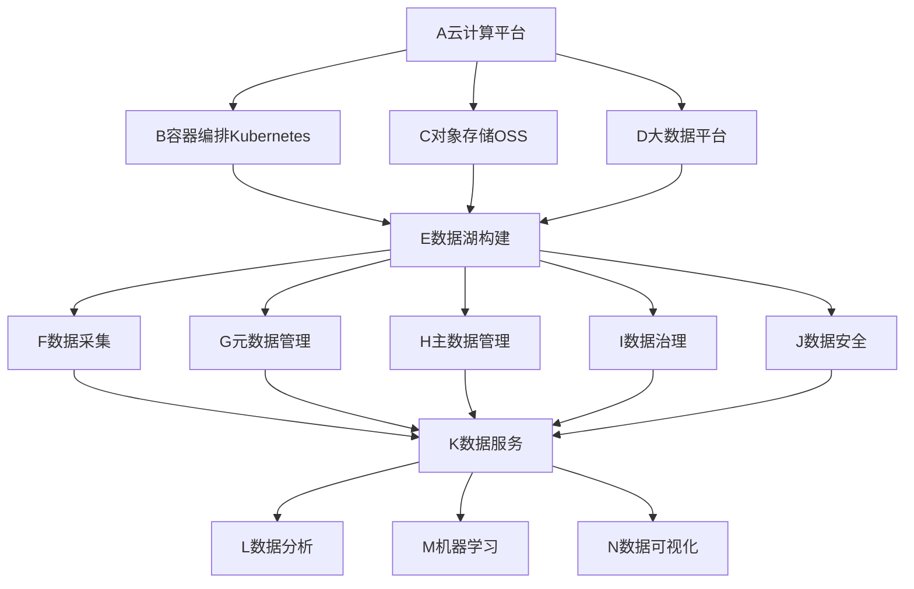

# 数据湖与云原生：拥抱云计算浪潮

## 1.背景介绍

### 1.1 数据爆炸与数据孤岛困境
随着互联网、物联网、移动互联网等技术的快速发展,数据呈现爆炸式增长。据IDC预测,到2025年全球数据圈将达到163ZB。面对海量数据,传统的数据架构和技术已难以满足企业数据管理和分析的需求。数据分散在各个业务系统和部门中,形成数据孤岛,数据难以共享和流通,数据价值难以充分挖掘。

### 1.2 大数据时代呼唤数据湖
大数据时代对企业数据管理和分析提出了新的挑战。企业需要打破数据孤岛,实现数据的集中管理和共享,快速响应业务需求变化。在这一背景下,数据湖(Data Lake)应运而生。数据湖是一种数据架构,旨在集中存储和管理企业的所有原始数据,包括结构化数据、半结构化数据和非结构化数据。通过对数据湖中的数据进行治理、质量管理、安全管控等,可以为数据分析、机器学习等提供高质量的数据。

### 1.3 云原生助力数据湖落地
云计算的发展为数据湖的落地提供了新的思路和技术手段。云原生(Cloud Native)是一种基于容器、微服务、DevOps等理念构建和运行应用的方式。它强调应用要充分利用云平台的弹性和分布式优势,实现高可用、高性能、可扩展等特性。将数据湖与云原生相结合,可以充分发挥二者的优势,加速企业数据战略落地。一方面,云平台为数据湖提供了海量存储、弹性计算等基础设施;另一方面,云原生技术栈如Kubernetes、Spark等为数据湖的构建和应用提供了灵活、高效的手段。

## 2.核心概念与联系

### 2.1 数据湖的定义与特征
数据湖是一个集中式的数据存储库,用于存储组织的所有结构化和非结构化数据,并以原始格式存储数据。与数据仓库不同,数据湖并不强调数据在写入时必须是结构化的,而是强调对原始数据的存储。数据湖的主要特征包括:

1. 数据集中:打破数据孤岛,集中存储企业各源系统数据
2. 数据全面:囊括结构化、半结构化、非结构化等各类数据
3. 数据原始:保留数据原貌,不做过多转换和处理,便于数据溯源
4. 数据共享:通过数据治理和安全策略,促进数据共享和价值挖掘

### 2.2 云原生的内涵与优势
云原生是一种构建和运行应用的方法,充分利用了云计算交付模式的优势。云原生技术有利于各个组织在公有云、私有云和混合云等新型动态环境中,构建和运行可弹性扩展的应用。云原生的核心理念包括:

1. 容器化:将应用和依赖打包到一个可移植的容器中,提高部署效率和一致性
2. 微服务化:将应用拆分为一组小型服务,每个服务独立开发、部署和扩展
3. DevOps:实现开发和运维的自动化和协同,加速应用交付和迭代
4. 持续交付:通过自动化测试和部署,实现应用的快速、可靠交付

云原生可以帮助企业实现应用的敏捷开发、弹性扩展、高可用等,从而更好地响应市场变化。

### 2.3 数据湖与云原生的关系
数据湖与云原生是两个相辅相成的概念。一方面,云原生为数据湖提供了理想的部署和运行环境。云平台的海量存储、弹性计算等能力,是构建数据湖的基础设施保障。Kubernetes等云原生技术,可以帮助数据湖实现敏捷开发、弹性扩展、容错恢复等关键特性。

另一方面,数据湖是云原生数据架构的重要组成。在云原生时代,企业的数据将呈现爆炸式增长,传统的数据架构已难以应对。而数据湖可以作为云原生数据架构的底座,为上层数据应用提供数据支撑。通过数据湖,可以实现云上数据的集中管理和共享,促进数据驱动的业务创新。

下图展示了数据湖与云原生的关系:



## 3.核心算法原理具体操作步骤

数据湖涉及的核心算法主要包括数据采集、元数据提取、数据治理等方面。下面以数据采集中的增量采集算法为例,介绍其原理和操作步骤。

增量采集是指在初始全量数据采集完成后,后续只采集新增和变化的数据,而不再重复采集已入湖的数据。这样可以减少数据传输量和采集时间,提高采集效率。增量采集的关键是如何识别新增和变化的数据。常见的方法有:

1. 基于时间戳:源系统数据表中有更新时间字段,可以根据时间戳判断数据是否有更新。
2. 基于版本号:源系统数据表中有版本号字段,可以根据版本号判断数据是否有更新。
3. 基于快照比对:将源系统数据与上次采集的快照数据进行比对,识别出差异数据。

以基于时间戳的增量采集为例,其基本步骤如下:

1. 记录上次采集的最大时间戳max_timestamp
2. 本次采集时,取出源系统数据表中更新时间大于max_timestamp的记录
3. 将新增和变化的数据写入数据湖
4. 更新max_timestamp为本次采集的最大时间戳
5. 定时触发下一次增量采集

增量采集的伪代码如下:

```python
def incremental_collect(src_table, lake_table, timestamp_col):
    # 获取上次采集的最大时间戳
    max_timestamp = get_max_timestamp(lake_table) 
    # 查询源表中的增量数据
    incremental_data = select_data(src_table, timestamp_col, max_timestamp)
    # 将增量数据写入数据湖
    write_data(lake_table, incremental_data) 
    # 更新最大时间戳
    update_max_timestamp(lake_table, incremental_data, timestamp_col)
```

## 4.数学模型和公式详细讲解举例说明

数据湖涉及的数学模型主要包括数据质量评估、数据血缘分析等。下面以数据质量评估中的完整性指标为例,介绍其数学模型和计算公式。

数据完整性是指数据记录的完整程度,即每条记录的各字段是否都有值。它可以用缺失值率来衡量,即:

$$
\text{Completeness} = 1 - \frac{\text{Number of missing values}}{\text{Total number of values}}
$$

其中,$\text{Number of missing values}$表示数据集中缺失值的数量,$\text{Total number of values}$表示数据集中值的总数量。

举例说明,假设有如下数据集:

| ID   | Name  | Age  | City |
| ---- | ----- | ---- | ---- |
| 1    | Alice | 25   |      |
| 2    | Bob   |      | BJ   |
| 3    | Chris | 30   | SH   |

该数据集共有12个值,其中有2个缺失值。则完整性指标为:

$$
\text{Completeness} = 1 - \frac{2}{12} = 0.83
$$

即该数据集的完整性为83%。

在数据湖的数据质量评估中,可以定期计算各数据表的完整性指标,并设置阈值。当完整性低于阈值时,可以触发告警,提示数据管理员及时修复数据质量问题。

## 5.项目实践：代码实例和详细解释说明

下面以使用Apache Spark构建数据湖为例,介绍数据湖的项目实践。

### 5.1 环境准备

首先需要准备Spark开发环境,包括:

1. 安装JDK 8+
2. 安装Scala 2.12+
3. 安装Spark 3.0+
4. 安装Hadoop 3.0+

### 5.2 数据采集

数据采集是将源系统数据导入数据湖的过程。以采集MySQL数据为例,可以使用Spark的JDBC数据源:

```scala
val jdbcDF = spark.read
  .format("jdbc")
  .option("url", "jdbc:mysql://localhost:3306/mydb")
  .option("dbtable", "mytable")
  .option("user", "root")
  .option("password", "123456")
  .load()
```

这段代码会读取MySQL的mydb数据库中的mytable表,返回一个DataFrame。之后可以将DataFrame写入数据湖,例如写入HDFS:

```scala
jdbcDF.write.format("parquet").save("hdfs:///datalake/mytable")
```

这会将数据以Parquet格式写入HDFS的/datalake/mytable目录。

### 5.3 元数据管理

元数据管理是对数据湖中数据的描述信息进行管理,包括数据的来源、Schema、权限等。可以使用Hive Metastore来存储元数据:

```scala
spark.sql("CREATE EXTERNAL TABLE IF NOT EXISTS mytable (id INT, name STRING, age INT) STORED AS PARQUET LOCATION 'hdfs:///datalake/mytable'")
```

这段代码会在Hive Metastore中创建一个外部表mytable,指向HDFS上的Parquet数据。

### 5.4 数据处理

对数据湖中的数据进行处理和分析是数据湖的核心价值所在。以使用Spark SQL进行数据分析为例:

```scala
val resultDF = spark.sql("SELECT name, AVG(age) AS avg_age FROM mytable GROUP BY name")
resultDF.show()
```

这段代码会对mytable表按name分组,计算每组的平均年龄,返回结果DataFrame并打印。

## 6.实际应用场景

数据湖在各行业都有广泛应用,下面列举几个典型场景:

### 6.1 金融风控

银行、保险等金融机构需要对客户的信用风险进行评估和控制。可以将各源系统的用户数据,如个人信息、信用记录、交易记录等汇聚到数据湖,然后使用机器学习算法构建用户画像和风险模型,及时识别和预警风险。

### 6.2 电商推荐

电商平台需要根据用户的浏览、购买历史,进行个性化商品推荐。可以将用户行为数据、商品信息汇聚到数据湖,使用协同过滤、内容过滤等算法进行用户画像和商品推荐。

### 6.3 工业制造

工业互联网时代,设备物联网、MES、ERP等系统会产生大量工业数据。可以将这些异构数据汇聚到数据湖,进行设备健康监测、产品质量分析、供应链优化等,提升生产效率和产品质量。

### 6.4 医疗健康

医疗机构需要管理患者的电子病历、影像、基因组等医疗数据。可以将这些数据汇聚到数据湖,进行疾病诊断、药物研发、精准医疗等应用,提升医疗服务水平。

## 7.工具和资源推荐

构建数据湖需要一系列开源和商业工具的支持,下面推荐一些常用的工具和资源:

### 7.1 数据存储
- HDFS:Hadoop分布式文件系统,可用于存储数据湖的原始数据
- AWS S3:亚马逊云对象存储服务,可用于云上数据湖存储
- Alluxio:开源的数据编排系统,可用于数据