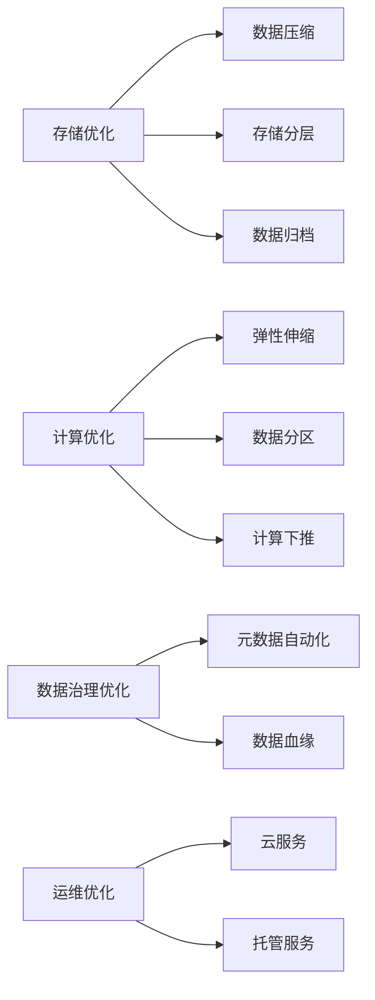

# 数据湖成本优化：降低存储与计算成本

## 1. 背景介绍
### 1.1 数据湖的兴起
在大数据时代,企业需要处理和分析海量的数据,传统的数据仓库架构已经无法满足快速增长的数据量和多样化的数据处理需求。数据湖(Data Lake)作为一种新兴的大数据存储和处理架构,能够以更低的成本存储和管理各种类型的原始数据,并支持灵活的数据分析和挖掘。

### 1.2 数据湖面临的成本挑战
虽然数据湖为企业带来了诸多好处,但同时也面临着成本优化的挑战:
1. 海量数据存储成本高
2. 数据处理和分析的计算资源成本高
3. 数据治理和元数据管理成本高
4. 数据安全和隐私保护成本高

因此,如何在保证数据湖功能和性能的前提下,降低存储和计算等各方面的成本,成为企业亟需解决的问题。

## 2. 核心概念与联系
### 2.1 数据湖的核心概念
- 数据湖(Data Lake):一个存储原始数据的集中式存储库,支持对结构化、半结构化和非结构化数据的存储。
- 对象存储(Object Storage):一种非结构化数据存储方式,通过RESTful API访问,具有高扩展性和低成本。
- 元数据(Metadata):描述数据属性和特征的数据,如数据的格式、来源、时间戳等。
- 数据分区(Data Partitioning):按照某些规则将数据划分成更小的部分,提高查询和处理效率。
- 数据生命周期管理(Data Lifecycle Management):根据数据的价值和访问频率,自动将数据在不同存储层之间迁移。

### 2.2 成本优化的关键因素
- 存储成本:选择合适的存储介质和存储层次,压缩和归档数据。
- 计算成本:使用弹性的计算资源,优化数据处理流程,减少数据移动。
- 数据治理成本:自动化元数据提取和管理,数据血缘追踪和影响分析。
- 运维成本:利用云服务和托管服务,减少基础设施和人力投入。

### 2.3 成本优化策略之间的联系


## 3. 核心算法原理与操作步骤
### 3.1 数据生命周期管理算法
#### 3.1.1 数据分层存储
根据数据的访问频率和存储成本,将数据划分为热、温、冷三个层次:
1. 热数据:访问频繁,存储在性能高但成本较高的介质上,如SSD。
2. 温数据:访问频率降低,存储在性能和成本均衡的介质上,如HDD。
3. 冷数据:很少访问,存储在成本低但访问延迟较高的介质上,如磁带、Glacier等。

#### 3.1.2 数据自动分层算法
1. 记录数据的访问时间和频率
2. 根据预设的时间阈值和频率阈值,判断数据所属的层次
3. 将数据自动迁移到对应的存储层
4. 定期扫描和调整数据的层次

### 3.2 数据分区优化算法
#### 3.2.1 分区粒度选择
1. 确定数据的查询和分析模式
2. 选择合适的分区粒度,如按天、小时、用户ID等
3. 过细的粒度会增加元数据管理开销,过粗的粒度会降低查询效率

#### 3.2.2 分区裁剪
1. 根据查询条件,过滤出需要扫描的分区
2. 跳过不需要的分区,减少数据读取和计算量
3. 使用分区字段作为过滤条件,提高分区裁剪的效果

### 3.3 数据压缩算法
#### 3.3.1 编码器选择
1. 根据数据的类型和特征,选择合适的编码器,如Snappy、GZIP、ZSTD等
2. 平衡压缩率和压缩/解压性能

#### 3.3.2 自适应压缩
1. 根据数据的大小和查询频率,动态调整压缩配置
2. 对于大文件和低频访问的数据,使用高压缩率的编码器
3. 对于小文件和高频访问的数据,使用低压缩率的编码器或不压缩

## 4. 数学模型与公式详解
### 4.1 数据生命周期管理模型
#### 4.1.1 成本模型
$$
C = \sum_{i=1}^{n} C_i \times S_i
$$
其中,$C$表示总存储成本,$n$表示存储层数,$C_i$表示第$i$层的单位存储成本,$S_i$表示第$i$层的数据量。

目标是在满足数据访问性能的前提下,最小化总存储成本$C$。

#### 4.1.2 访问频率模型
$$
F(t) = \frac{N(t)}{t}
$$
其中,$F(t)$表示数据在时间$t$内的访问频率,$N(t)$表示在时间$t$内数据被访问的次数。

根据阈值$F_1$和$F_2$,将数据划分为热、温、冷三个层次:
- 热数据:$F(t) \geq F_1$
- 温数据:$F_2 \leq F(t) < F_1$
- 冷数据:$F(t) < F_2$

### 4.2 数据压缩模型 
#### 4.2.1 压缩率计算
$$
r = \frac{S_o}{S_c}
$$
其中,$r$表示压缩率,$S_o$表示原始数据大小,$S_c$表示压缩后数据大小。

#### 4.2.2 压缩时间模型
$$
T_c = \alpha \times S_o
$$
其中,$T_c$表示压缩时间,$\alpha$表示压缩算法的时间复杂度,$S_o$表示原始数据大小。

不同的压缩算法,其时间复杂度$\alpha$不同,需要根据实际情况选择。

### 4.3 查询性能模型
#### 4.3.1 查询时间估计
$$
T_q = \beta \times S_q + \gamma \times N_q
$$
其中,$T_q$表示查询时间,$\beta$表示单位数据扫描时间,$S_q$表示查询涉及的数据量,$\gamma$表示单次随机I/O时间,$N_q$表示查询涉及的随机I/O次数。

$S_q$和$N_q$与数据分区粒度有关,合适的分区粒度可以减少不必要的数据扫描和随机I/O。

## 5. 项目实践
### 5.1 使用Apache Iceberg优化数据湖存储
Apache Iceberg是一个开源的表格式,用于大规模数据分析。它提供了以下特性:
- 支持ACID事务,保证数据一致性
- 支持快照隔离和时间旅行,方便数据版本管理
- 支持自动分区裁剪和数据剪枝,优化查询性能
- 支持数据压缩和编码,减少存储空间

下面是一个使用Iceberg创建表并插入数据的示例:
```python
from pyspark.sql import SparkSession

spark = SparkSession.builder \
    .config("spark.sql.catalog.my_catalog", "org.apache.iceberg.spark.SparkCatalog") \
    .config("spark.sql.catalog.my_catalog.type", "hadoop") \
    .config("spark.sql.catalog.my_catalog.warehouse", "hdfs://nn:8020/iceberg/warehouse") \
    .getOrCreate()

# 创建Iceberg表
spark.sql("""
    CREATE TABLE my_catalog.db.table (
        id bigint,
        data string,
        category string,
        ts timestamp 
    )
    USING iceberg
    PARTITIONED BY (days(ts), category)
""")

# 插入数据
spark.sql("""
    INSERT INTO my_catalog.db.table
    VALUES 
    (1, 'a', 'c1', '2022-01-01'),
    (2, 'b', 'c2', '2022-01-02'),
    (3, 'c', 'c1', '2022-01-03')
""")
```

### 5.2 使用Amazon S3 Intelligent-Tiering存储类实现自动分层
S3 Intelligent-Tiering 可根据访问模式自动优化数据在两个访问层之间的移动,以实现成本最佳性能。它会自动将未频繁访问的对象移至成本较低的层,并在访问模式发生变化时将它们移回频繁访问层。

下面是一个使用boto3库设置S3 Intelligent-Tiering存储类的示例:

```python
import boto3

s3 = boto3.client('s3')

# 创建一个新的存储桶,指定使用Intelligent-Tiering
s3.create_bucket(
    Bucket='my-bucket',
    CreateBucketConfiguration={
        'LocationConstraint': 'us-west-2'
    },
    ObjectOwnership='BucketOwnerEnforced'
)

bucket_name = 'my-bucket'
object_key = 'my-data.csv'
storage_class = 'INTELLIGENT_TIERING'

# 上传对象,指定存储类为Intelligent-Tiering  
s3.put_object(
    Bucket=bucket_name, 
    Key=object_key,
    Body=open('my-data.csv', 'rb'), 
    StorageClass=storage_class
)
```

## 6. 实际应用场景
### 6.1 物流轨迹数据分析
- 背景:物流公司每天生成海量的货物跟踪数据,需要实时分析货物状态和预警延误风险。
- 痛点:原始轨迹数据量大,分析和存储成本高。
- 解决方案:
  - 使用对象存储S3存储原始轨迹数据,利用Intelligent-Tiering自动分层。
  - 使用Iceberg格式对数据按照日期和区域进行分区,优化查询性能。
  - 使用Spark Streaming实时处理数据,并将聚合结果写入Iceberg表。
  - 使用Athena或Redshift Spectrum直接查询S3上的Iceberg表,进行交互式分析。

### 6.2 广告日志数据分析
- 背景:广告平台每天产生数TB的用户行为日志,需要分析广告投放效果和用户画像。
- 痛点:日志数据量大,种类多,分析和存储成本高。
- 解决方案:
  - 使用Kafka收集各种渠道的广告日志,并将原始日志备份到S3。
  - 使用Flink或Spark Streaming对数据进行清洗和转换,提取关键字段。
  - 将结构化数据写入Iceberg表,按照日期和广告主进行分区。
  - 对Iceberg表进行分层存储,热数据存储在S3标准层,冷数据存储在S3 Glacier。
  - 使用Presto或Hive进行联邦查询,将多个Iceberg表关联分析。

## 7. 工具和资源推荐
### 7.1 开源工具
- Apache Iceberg:一个开源的表格式,支持ACID事务和时间旅行。
- Apache Hudi:一个数据湖方案,提供插入、更新、删除和增量消费。
- Delta Lake:一个开源的存储层,用于构建Lakehouse架构。
- Apache Parquet:一种列式存储格式,可以高效压缩和编码数据。
- Apache Avro:一种行式存储格式,支持模式演进。

### 7.2 云服务 
- Amazon S3:提供对象存储服务,支持Intelligent-Tiering自动分层。
- Google Cloud Storage:提供对象存储服务,支持Lifecycle管理。
- Azure Blob Storage:提供对象存储服务,支持访问层自动转换。
- Databricks Lakehouse:一站式数据湖分析平台,支持Delta Lake。
- Snowflake:一个云原生数据仓库,支持半结构化数据存储和分析。

## 8. 总结与展望
### 8.1 成本优化最佳实践
- 采用云服务和托管服务,减少基础设施和运维投入。
- 使用对象存储和列式存储,降低存储成本。
- 对数据进行分层存储和自动生命周期管理,将冷数据转移到低成本介质。
- 对数据进行压缩和编码,平衡存储空间和访问