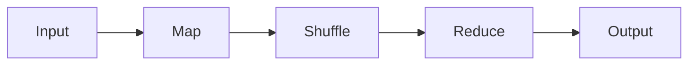
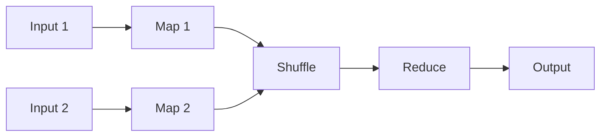

# 数据聚合：GROUPBY和COGROUP操作详解

## 1. 背景介绍
在大数据处理中,数据聚合是一项非常常见且重要的操作。它允许我们按照某些特定的维度或者条件对数据进行分组,并对每个组内的数据进行汇总计算,从而获得更高层次的统计信息和洞察。在诸如 Hadoop、Spark 等大数据处理框架中,GROUPBY 和 COGROUP 是两种最基本也是最常用的数据聚合操作。

### 1.1 数据聚合的重要性
在现实世界中,原始数据通常是杂乱无章、缺乏组织性的。数据聚合可以帮助我们:

- 归纳总结数据的内在规律和特征
- 发现不同维度之间的关联性
- 对数据进行压缩,减小数据规模
- 便于后续的分析挖掘和可视化展示

可以说,数据聚合是从原始数据中提炼知识和洞见的第一步,是大数据处理不可或缺的一个环节。

### 1.2 GROUPBY 和 COGROUP 概述
GROUPBY 和 COGROUP 是两种不同但又密切相关的数据聚合操作:

- GROUPBY 用于对单个数据集(如表、文件)按照一个或多个字段进行分组,并对每个组内的数据进行聚合计算。
- COGROUP 则用于将两个或多个数据集按照它们的 key 进行关联,并将具有相同 key 的数据分到一组,从而实现数据集之间的 join。

它们都是 MapReduce 计算模型中的核心操作,广泛应用于各种大数据处理场景中。

## 2. 核心概念与联系
要深入理解 GROUPBY 和 COGROUP,我们需要先了解一些核心概念:

### 2.1 Key-Value 数据模型
在大数据处理中,数据通常被抽象成 Key-Value 对的形式:

- Key 代表数据的某个维度或属性,用于数据分组和关联
- Value 则代表与 Key 关联的具体数据

例如,一条用户访问日志可以表示为:
```
(user_id, (timestamp, url, ip))
```
其中 user_id 是 Key,后面的元组则是 Value。

### 2.2 MapReduce 计算模型
MapReduce 是一种基于 Key-Value 数据模型的分布式计算框架,由 Map 和 Reduce 两个阶段组成:

- Map: 将输入数据转化为中间的 Key-Value 对
- Reduce: 对中间结果中具有相同 Key 的 Value 进行聚合计算

其计算流程可以用下图表示:



GROUPBY 和 COGROUP 都是在 Reduce 阶段完成的,但它们的 Shuffle 过程有所不同。

### 2.3 GROUPBY 与 COGROUP 的联系与区别
GROUPBY 和 COGROUP 的相同点在于:

- 都是对数据按照 Key 进行分组聚合
- 都在 Reduce 阶段完成核心逻辑

它们的主要区别在于:

- GROUPBY 操作单个数据集,COGROUP 操作多个数据集
- GROUPBY 的 Shuffle 过程只涉及单个数据集内部的数据交换,而 COGROUP 的 Shuffle 过程涉及不同数据集之间的数据关联

因此,可以将 GROUPBY 看做是 COGROUP 的一个特例,即只对一个数据集进行 COGROUP。

## 3. 核心算法原理与操作步骤
接下来,我们详细讲解 GROUPBY 和 COGROUP 的核心算法原理和具体操作步骤。

### 3.1 GROUPBY 原理与步骤
GROUPBY 分为以下几个步骤:

1. Map 阶段
   - 从输入数据中提取出 Key 和 Value
   - 将 Key-Value 对输出到 Shuffle 阶段
2. Shuffle 阶段  
   - 将具有相同 Key 的 Value 聚合到一起
   - 将聚合后的数据按 Key 分发给不同的 Reduce 任务
3. Reduce 阶段
   - 对每个 Key 对应的 Value 列表进行聚合计算
   - 输出最终的聚合结果

其数据流向如下图所示:


举个例子,假设我们有如下的用户访问日志数据:

```
001, 2022-01-01 12:00:00, /home
002, 2022-01-01 12:05:00, /product
001, 2022-01-01 12:10:00, /cart
003, 2022-01-01 12:15:00, /home
002, 2022-01-01 12:20:00, /order
```

我们要统计每个用户的访问次数。使用 GROUPBY 操作的步骤如下:

1. Map 阶段
   - 提取 user_id 作为 Key,1 作为 Value
   - 输出如 `(001, 1)`, `(002, 1)` 的 Key-Value 对 
2. Shuffle 阶段
   - 将相同 user_id 的 Value 聚合,如 `(001, [1, 1])`, `(002, [1, 1])`
   - 将数据按 user_id 发送给不同的 Reduce 任务
3. Reduce 阶段  
   - 对每个 user_id 的 Value 列表求和,得到每个用户的访问次数
   - 输出如 `(001, 2)`, `(002, 2)`, `(003, 1)` 的结果

可见,GROUPBY 的本质是以 Key 为纽带,对分散的数据进行聚合和归约。

### 3.2 COGROUP 原理与步骤
COGROUP 与 GROUPBY 的步骤类似,但需要对多个数据集进行处理:

1. Map 阶段
   - 对每个数据集分别提取出 Key 和 Value 
   - 为不同来源的 Value 打上标记,如 (user_id, (1, "D1"))
   - 将标记后的 Key-Value 对输出到 Shuffle 阶段
2. Shuffle 阶段
   - 将不同数据集中具有相同 Key 的 Value 聚合到一起 
   - 将聚合后的数据按 Key 分发给不同的 Reduce 任务
3. Reduce 阶段
   - 对每个 Key 下不同来源的 Value 列表分别进行处理
   - 输出最终的聚合结果

其数据流向如下图所示:



举个例子,假设我们有如下两个数据集:

```
// 用户基本信息
001, Alice, 20
002, Bob, 30
003, Chris, 25

// 用户访问日志
001, 2022-01-01 12:00:00, /home 
002, 2022-01-01 12:05:00, /product
001, 2022-01-01 12:10:00, /cart
003, 2022-01-01 12:15:00, /home
```

我们要将两个数据集按 user_id 关联,统计每个用户的年龄和访问次数。使用 COGROUP 操作的步骤如下:

1. Map 阶段
   - 对用户信息数据集,提取 user_id 为 Key,(name, age) 为 Value,并打上标记 "D1" 
   - 对访问日志数据集,提取 user_id 为 Key,1 为 Value,并打上标记 "D2"
   - 分别输出如 `(001, ("Alice", 20, "D1"))`, `(001, (1, "D2"))` 的 Key-Value 对
2. Shuffle 阶段 
   - 将两个数据集中相同 user_id 的 Value 聚合
   - 得到如 `(001, [("Alice", 20, "D1"), (1, "D2"), (1, "D2")])` 的结果
   - 将聚合数据按 user_id 发送给不同的 Reduce 任务
3. Reduce 阶段
   - 对每个 user_id,将来自 "D1" 的 Value 提取姓名和年龄,将来自 "D2" 的 Value 求和得到访问次数
   - 输出如 `(001, (Alice, 20, 2))`, `(002, (Bob, 30, 1))`, `(003, (Chris, 25, 1))` 的结果

可见,COGROUP 的本质是将不同数据集中的数据按 Key 进行关联,再对每个 Key 下的 Value 进行聚合计算。它是实现数据 join 的重要手段。

## 4. 数学模型与公式
GROUPBY 和 COGROUP 可以用一组高阶函数来描述其数学模型。

### 4.1 GROUPBY 的数学模型
假设输入数据集为 $D$,定义以下函数:

- $key(x)$: 从 $x \in D$ 中提取出 Key
- $value(x)$: 从 $x \in D$ 中提取出 Value
- $reduce(k, V)$: 对 Key $k$ 下的 Value 列表 $V$ 进行聚合计算

则 GROUPBY 可以表示为:

$$
GROUPBY(D) = \{(k, reduce(k, V)) | k \in keys(D), V = values(k, D)\}
$$

其中:

- $keys(D) = \{key(x) | x \in D\}$ 是 $D$ 中所有 Key 的集合
- $values(k, D) = [value(x) | x \in D, key(x) = k]$ 是 $D$ 中 Key 为 $k$ 的所有 Value 组成的列表

例如,对于数据集:

```
D = [
  (001, 1), 
  (002, 1),
  (001, 1),
  (003, 1),
  (002, 1)
]
```

假设 $reduce(k, V) = sum(V)$ 即对 Value 求和,则:

$$
\begin{aligned}
GROUPBY(D) &= \{(k, reduce(k, V)) | k \in keys(D), V = values(k, D)\} \\
&= \{(001, reduce(001, [1, 1])), (002, reduce(002, [1, 1])), (003, reduce(003, [1]))\} \\ 
&= \{(001, 2), (002, 2), (003, 1)\}
\end{aligned}
$$

### 4.2 COGROUP 的数学模型
假设有两个输入数据集 $D_1$ 和 $D_2$,定义以下函数:

- $key_i(x)$: 从 $x \in D_i$ 中提取出 Key
- $value_i(x)$: 从 $x \in D_i$ 中提取出 Value
- $reduce(k, V_1, V_2)$: 对 Key $k$ 下来自两个数据集的 Value 列表 $V_1$ 和 $V_2$ 进行聚合计算

则 COGROUP 可以表示为:

$$
COGROUP(D_1, D_2) = \{(k, reduce(k, V_1, V_2)) | k \in keys(D_1) \cup keys(D_2), V_1 = values(k, D_1), V_2 = values(k, D_2)\}
$$

其中:

- $keys(D_1) \cup keys(D_2)$ 是 $D_1$ 和 $D_2$ 中所有 Key 的并集
- $values(k, D_i) = [value_i(x) | x \in D_i, key_i(x) = k]$ 是 $D_i$ 中 Key 为 $k$ 的所有 Value 组成的列表

例如,对于两个数据集:

```
D1 = [
  (001, ("Alice", 20)), 
  (002, ("Bob", 30)),
  (003, ("Chris", 25))
]

D2 = [
  (001, 1),
  (002, 1), 
  (001, 1),
  (003, 1)
]
```

假设 $reduce(k, V_1, V_2) = (V_1[0], sum(V_2))$ 即提取用户信息和访问次数,则:

$$
\begin{aligned}
COGROUP(D_1, D_2) &= \{(k, reduce(k, V_1, V_2)) | k \in keys(D_1) \cup keys(D_2), V_1 = values(k, D_1), V_2 = values(k, D_2)\} \\
&= \{(001, reduce(001, [("Alice", 20)], [1, 1])), (002, reduce(002, [("Bob", 30)], [1])), (003, reduce(003, [("Chris", 25)], [1]))\} \\
&= \{(001, (("Alice", 20), 2)), (002, (("Bob", 30), 1)), (003, (("Chris", 25), 1))\}
\end{