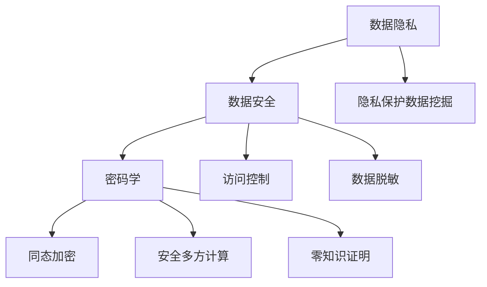

# 数据隐私保护和安全性的研究

## 1. 背景介绍
### 1.1 数据隐私保护和安全性的重要性
在当今数字时代,数据已经成为最宝贵的资源之一。随着互联网、物联网、云计算、大数据等技术的快速发展,数据的收集、存储、传输和处理变得越来越容易。然而,这也带来了数据隐私泄露和安全性问题的风险。保护个人隐私和确保数据安全已成为全球关注的焦点。

### 1.2 数据隐私泄露和安全事件频发
近年来,数据隐私泄露和安全事件频频发生。从Facebook的用户数据泄露丑闻,到Equifax的信用数据泄露事件,再到各种勒索软件和网络攻击,这些事件给个人、企业和社会带来了巨大的损失和负面影响。这凸显了加强数据隐私保护和安全性的迫切需求。

### 1.3 法律法规和标准的出台
为应对日益严峻的数据隐私和安全挑战,各国政府和国际组织纷纷出台相关法律法规和标准。如欧盟的《通用数据保护条例》(GDPR)、美国的《加州消费者隐私法案》(CCPA)、中国的《网络安全法》等。这些法律法规对个人数据的收集、使用、存储等方面提出了严格要求,旨在保护公民的数据权益。

### 1.4 技术创新和研究的必要性  
面对复杂多变的数据隐私和安全威胁,单靠法律法规还远远不够。我们还需要不断创新和研究新的技术和方法,来增强数据保护能力。这包括隐私保护数据挖掘、同态加密、安全多方计算、区块链等前沿技术,以及隐私和安全策略、风险评估、审计等管理措施。只有技术和管理双管齐下,才能构建起更加强大的数据隐私保护和安全防线。

## 2. 核心概念与联系
### 2.1 数据隐私
数据隐私是指个人信息不被未经授权的实体或个人访问、使用或共享的权利。它涉及个人对其数据收集、处理方式和用途的控制。常见的隐私数据包括姓名、地址、电话、邮箱、身份证号、银行账户、健康档案、网络浏览记录等。保护数据隐私是每个人的基本权利。

### 2.2 数据安全
数据安全是指保护数据免受未经授权的访问、使用、泄露、破坏、修改或破坏。它通过各种技术和管理措施来确保数据的机密性、完整性和可用性。数据安全涉及物理安全、网络安全、系统安全、应用安全、数据加密等多个层面。没有安全,就谈不上隐私。

### 2.3 数据脱敏
数据脱敏是指对敏感数据进行转换或者屏蔽,使得脱敏数据不再具有敏感属性,同时还能保持数据的可用性。常见的脱敏方法包括数据加密、数据替换、数据删除、随机噪声等。数据脱敏可以在一定程度上保护隐私,降低数据泄露的风险。

### 2.4 隐私保护数据挖掘
隐私保护数据挖掘(Privacy-Preserving Data Mining,PPDM)是在保护个人隐私的前提下,从大规模数据集中发现有价值的、先前未知的、可理解的模式和知识的过程。PPDM主要研究在不泄露个人隐私的情况下,如何有效地从分布式数据源中挖掘感兴趣的信息和知识。

### 2.5 密码学在数据安全中的应用
密码学是数据安全的重要基石。它利用数学算法对数据进行加密和解密,以防止未经授权方获取数据语义。常用的密码学算法包括对称加密(如AES)、非对称加密(如RSA)、哈希函数(如SHA256)、数字签名等。同态加密、安全多方计算、零知识证明等高级密码学技术在隐私保护中发挥着关键作用。

### 核心概念关系图

## 3. 核心算法原理具体操作步骤
### 3.1 差分隐私
差分隐私(Differential Privacy)是一种保护隐私的数据分析方法。它通过在原始数据中添加随机噪声,使得任何一条记录的有无都不会对分析结果产生显著影响,从而保护了个体隐私。差分隐私的核心思想是在保证数据有用性的同时,最大限度地降低隐私泄露风险。

差分隐私的实现步骤如下:
1. 定义隐私预算 $\epsilon$,它表示隐私泄露的上限。$\epsilon$ 越小,隐私保护程度越高。 
2. 定义全局敏感度 $\Delta f$,即在相邻数据集(仅一条记录不同)上,查询函数 $f$ 的最大变化量。
3. 根据 $\epsilon$ 和 $\Delta f$,选择合适的随机噪声分布(如拉普拉斯分布),向查询结果中添加噪声。
4. 噪声添加后的结果满足 $\epsilon$-差分隐私,可以安全地发布。

差分隐私的数学定义为:一个随机算法 $\mathcal{M}$ 满足 $\epsilon$-差分隐私,如果对于任意两个相邻数据集 $D_1$ 和 $D_2$,以及任意输出 $S \subseteq Range(\mathcal{M})$,有:

$$
Pr[\mathcal{M}(D_1) \in S] \leq e^{\epsilon} \cdot Pr[\mathcal{M}(D_2) \in S]
$$

其中,$\epsilon$ 是隐私预算,$Pr[\cdot]$ 表示概率。

### 3.2 同态加密
同态加密(Homomorphic Encryption)是一种允许在密文上直接进行计算的加密方案。它使得无需解密密文就能对加密数据进行处理,在保护隐私的同时实现数据的可用性。同态加密分为部分同态加密(如Paillier加密)和全同态加密(如BGV方案)。

以Paillier加密为例,其加法同态性质如下:

设 $m_1, m_2$ 是两个明文数据,$pk$ 是公钥,则有:

$$
\mathcal{D}_{sk}(\mathcal{E}_{pk}(m_1) \cdot \mathcal{E}_{pk}(m_2) \bmod n^2) = m_1 + m_2 \bmod n
$$

其中,$\mathcal{E}$ 表示加密算法,$\mathcal{D}$ 表示解密算法,$n$ 是Paillier密码系统的公共参数。

利用同态加密进行隐私保护计算的基本步骤如下:
1. 数据所有者用公钥 $pk$ 加密数据 $m_i$,得到密文 $c_i$。
2. 将密文 $c_i$ 发送给计算方。
3. 计算方在密文上执行同态操作,得到 $f(c_1, ..., c_n)$。
4. 将计算结果发回给数据所有者。  
5. 数据所有者用私钥 $sk$ 解密,得到明文结果 $f(m_1, ..., m_n)$。

在整个过程中,计算方无法获知原始数据和计算结果,从而保护了数据隐私。

### 3.3 安全多方计算
安全多方计算(Secure Multi-Party Computation,MPC)是一种允许多方在不泄露各自隐私数据的前提下,共同计算一个约定函数的分布式计算协议。MPC确保每一方只能获得最终的计算结果,而无法获取其他参与方的隐私数据。

以两方安全计算为例,设有两个参与方Alice和Bob,他们分别持有隐私数据 $x$ 和 $y$,想要共同计算一个函数 $f(x,y)$,且不泄露各自的隐私数据。基于Yao's Garbled Circuit的两方安全计算协议步骤如下:

1. Alice生成一个加扰电路(Garbled Circuit),对应函数 $f$。加扰电路使用两个随机密钥加密每一条线,并生成解密表。
2. Alice将加扰电路和自己加密的输入 $E(x)$ 发送给Bob。
3. Bob通过不经意传输(Oblivious Transfer)协议,在不泄露 $y$ 的情况下获得自己输入的加密 $E(y)$。
4. Bob利用 $E(x)$ 和 $E(y)$ 计算加扰电路,得到加密结果 $E(f(x,y))$。
5. Bob将 $E(f(x,y))$ 发回给Alice。Alice用私钥解密,得到 $f(x,y)$。
6. Alice将 $f(x,y)$ 分享给Bob。

MPC协议确保了整个计算过程中,双方的隐私数据 $x$ 和 $y$ 都没有泄露给对方,最终双方只获得约定的计算结果 $f(x,y)$。MPC可以扩展到多方参与的场景,在隐私保护数据聚合、隐私保护机器学习等领域有广泛应用。

## 4. 数学模型和公式详细讲解举例说明
### 4.1 密码学哈希函数
哈希函数是现代密码学的重要工具,广泛用于数据完整性验证、消息认证、数字签名等领域。一个安全的密码学哈希函数 $H$ 需要满足以下性质:

1. 抗原像攻击:对于任意输出 $y$,找到一个输入 $x$ 使得 $H(x)=y$ 在计算上是不可行的。
2. 抗第二原像攻击:给定一个输入 $x_1$,找到另一个输入 $x_2$ 使得 $H(x_1)=H(x_2)$ 在计算上是不可行的。 
3. 抗碰撞攻击:找到任意两个不同的输入 $x_1$ 和 $x_2$,使得 $H(x_1)=H(x_2)$ 在计算上是不可行的。

常见的密码学哈希函数有MD5、SHA-1、SHA-256等。以SHA-256为例,其数学模型如下:

设输入消息为 $M$,首先对 $M$ 进行填充,使其长度为512 bits的整数倍。然后将填充后的消息分割成若干个512 bits的块 $M_1, M_2, ..., M_n$。

定义8个初始哈希值:
$$
\begin{aligned}
H_0^{(0)} &= 0x6a09e667 \\
H_1^{(0)} &= 0xbb67ae85 \\  
H_2^{(0)} &= 0x3c6ef372 \\
H_3^{(0)} &= 0xa54ff53a \\
H_4^{(0)} &= 0x510e527f \\
H_5^{(0)} &= 0x9b05688c \\
H_6^{(0)} &= 0x1f83d9ab \\
H_7^{(0)} &= 0x5be0cd19
\end{aligned}
$$

对于每一个消息块 $M_i$,进行64轮哈希压缩,更新8个哈希值。第 $i$ 轮压缩函数为:

$$
\begin{aligned}
a &= H_0^{(i-1)} \\
b &= H_1^{(i-1)} \\
c &= H_2^{(i-1)} \\
d &= H_3^{(i-1)} \\  
e &= H_4^{(i-1)} \\
f &= H_5^{(i-1)} \\
g &= H_6^{(i-1)} \\
h &= H_7^{(i-1)} \\
\Sigma_0(x) &= (x \ggg 2) \oplus (x \ggg 13) \oplus (x \ggg 22) \\
\Sigma_1(x) &= (x \ggg 6) \oplus (x \ggg 11) \oplus (x \ggg 25) \\
Ch(x,y,z) &= (x \land y) \oplus (\lnot x \land z) \\
Maj(x,y,z) &= (x \land y) \oplus (x \land z) \oplus (y \land z) \\
T_1