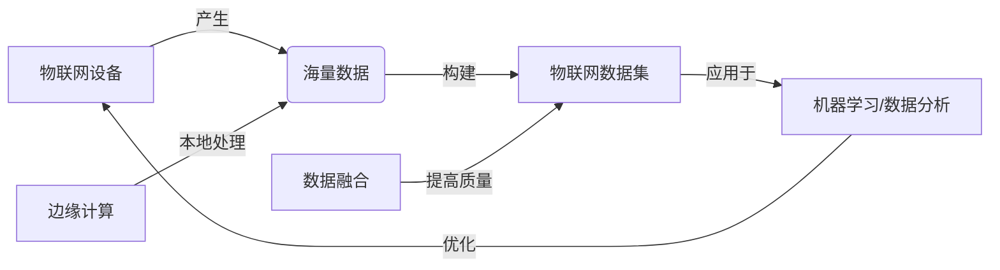

# 数据集与物联网：万物互联的数据洪流

## 1. 背景介绍

### 1.1 物联网的兴起与发展

物联网(Internet of Things, IoT)是一个正在迅速发展的领域,它通过将各种设备连接到互联网,实现了设备之间的通信和数据交换。随着传感器技术、无线通信和云计算的进步,物联网已经在各个行业得到广泛应用,如智慧城市、智能家居、工业自动化等。

### 1.2 数据集在物联网中的重要性

物联网设备产生了海量的数据,这些数据包含了有价值的信息和洞察。为了充分利用这些数据,我们需要建立高质量的数据集。数据集是机器学习和数据分析的基础,它们为算法提供了训练和测试的样本。在物联网领域,数据集可以帮助我们优化设备性能、预测故障、提高能源效率等。

### 1.3 数据集构建面临的挑战

构建物联网数据集面临许多挑战,例如:

- 数据量大:物联网设备产生的数据量非常庞大,对存储和处理能力提出了更高要求。
- 数据多样性:物联网数据来自不同类型的设备和传感器,数据格式和语义各不相同,需要进行标准化和统一。  
- 数据质量:物联网设备的数据可能存在噪声、缺失值、异常值等问题,需要进行数据清洗和预处理。
- 数据隐私:物联网数据可能包含敏感的个人信息,在数据收集和使用过程中需要注意隐私保护。

## 2. 核心概念与联系

### 2.1 物联网(Internet of Things, IoT)

物联网是一个由各种设备组成的网络,这些设备通过互联网连接,可以相互通信和交换数据。物联网设备包括传感器、执行器、嵌入式系统等,它们可以感知环境,执行操作,并与其他设备协同工作。

### 2.2 数据集(Dataset)

数据集是一组按照某种规则采集和整理的数据的集合。在机器学习和数据分析中,数据集用于训练和评估模型。一个典型的数据集包括特征(feature)和标签(label)两部分,特征是描述数据样本属性的变量,标签是我们希望预测的目标变量。

### 2.3 边缘计算(Edge Computing)  

边缘计算是一种分布式计算范式,它将计算和数据存储放在靠近数据源的网络边缘设备上。与传统的云计算相比,边缘计算可以减少数据传输的延迟,提高响应速度,并保护数据隐私。在物联网场景中,边缘计算可以在本地处理数据,减轻云端的压力。

### 2.4 数据融合(Data Fusion)

数据融合是将来自多个数据源的信息整合起来,以提高数据的质量和完整性。在物联网中,数据融合可以将不同设备和传感器的数据结合起来,消除冗余和不一致,从而得到更准确和全面的信息。

### 2.5 概念之间的联系

下面是一个用 Mermaid 绘制的概念关系图:



从图中可以看出,物联网设备产生海量数据,这些数据被用来构建物联网数据集。数据集可以应用于机器学习和数据分析,从而优化物联网设备的性能。边缘计算可以在本地处理数据,减轻云端压力。数据融合可以提高数据集的质量和完整性。

## 3. 核心算法原理具体操作步骤

在物联网数据集的构建和应用中,常用的算法包括数据预处理、特征工程、机器学习等。下面以数据预处理为例,介绍其具体操作步骤。

### 3.1 数据清洗

数据清洗是识别和纠正数据集中错误、不一致和不完整的过程。具体步骤如下:

1. 识别缺失值:检查每个特征是否存在缺失值,缺失值可以用特殊符号(如 NA)表示,也可能是空白。
2. 处理缺失值:对于缺失值,可以选择删除包含缺失值的样本,也可以用合适的值填充,如均值、中位数等。
3. 识别异常值:异常值是明显偏离其他数据点的值,可以通过统计方法(如 z-score)或可视化(如箱线图)来识别。
4. 处理异常值:对于异常值,可以选择删除或替换,也可以通过数据变换(如对数变换)来减少其影响。

### 3.2 数据集成

数据集成是将多个数据源的数据合并成一个一致的数据集的过程。具体步骤如下:

1. 数据抽取:从不同的数据源(如数据库、文件)中提取所需的数据。
2. 数据转换:将提取的数据转换成一致的格式,如时间格式、单位等。
3. 数据加载:将转换后的数据加载到目标数据集中。
4. 数据合并:将来自不同数据源的数据按照某个关键字(如时间戳、设备 ID)合并成一个数据集。

### 3.3 数据变换

数据变换是将数据从一种形式转换成另一种更适合分析的形式的过程。具体步骤如下:

1. 数据规范化:将数值特征缩放到一个固定的范围(如 0 到 1),以消除不同特征之间的量纲影响。常见的规范化方法有最小-最大规范化和 z-score 规范化。
2. 数据离散化:将连续特征转换成离散的类别或区间。离散化可以简化模型,提高可解释性。常见的离散化方法有等宽分箱和等频分箱。
3. 数据编码:将分类特征转换成数值。常见的编码方法有独热编码(One-Hot Encoding)和标签编码(Label Encoding)。

## 4. 数学模型和公式详细讲解举例说明

在物联网数据集的处理中,常用到一些数学模型和公式。下面以 z-score 规范化为例,详细讲解其数学原理。

### 4.1 z-score 规范化

z-score 规范化,也称为标准化,是一种常用的数据规范化方法。它将数据转换成均值为 0,标准差为 1 的分布。z-score 的计算公式为:

$$z = \frac{x - \mu}{\sigma}$$

其中,$x$ 是要转换的数据点,$\mu$ 是数据的均值,$\sigma$ 是数据的标准差。

标准差 $\sigma$ 的计算公式为:

$$\sigma = \sqrt{\frac{1}{n-1} \sum_{i=1}^{n} (x_i - \mu)^2}$$

其中,$n$ 是数据点的数量,$x_i$ 是第 $i$ 个数据点。

### 4.2 举例说明

假设我们有一个物联网设备的温度数据集,包含以下数据点:

```
[20.1, 21.5, 19.8, 22.3, 20.7]
```

首先,我们计算数据的均值 $\mu$:

$$\mu = \frac{20.1 + 21.5 + 19.8 + 22.3 + 20.7}{5} = 20.88$$

然后,我们计算数据的标准差 $\sigma$:

$$\sigma = \sqrt{\frac{1}{4} [(20.1-20.88)^2 + (21.5-20.88)^2 + (19.8-20.88)^2 + (22.3-20.88)^2 + (20.7-20.88)^2]} = 0.96$$

最后,我们对每个数据点应用 z-score 规范化:

```
z1 = (20.1 - 20.88) / 0.96 = -0.81
z2 = (21.5 - 20.88) / 0.96 = 0.65
z3 = (19.8 - 20.88) / 0.96 = -1.13
z4 = (22.3 - 20.88) / 0.96 = 1.48
z5 = (20.7 - 20.88) / 0.96 = -0.19
```

转换后的数据点为:

```
[-0.81, 0.65, -1.13, 1.48, -0.19]
```

可以看到,转换后的数据点均值接近 0,标准差接近 1。z-score 规范化使不同量纲的特征具有可比性,并且保留了数据的分布信息。

## 5. 项目实践：代码实例和详细解释说明

下面是一个使用 Python 进行物联网数据预处理的代码实例:

```python
import numpy as np
import pandas as pd

# 读取数据集
data = pd.read_csv('iot_data.csv')

# 查看数据集信息
print(data.info())

# 处理缺失值
data = data.dropna()  # 删除包含缺失值的行
# data = data.fillna(data.mean())  # 用均值填充缺失值

# 识别异常值
z_scores = np.abs((data - data.mean()) / data.std())
outliers = data[z_scores > 3]
print("异常值:")
print(outliers)

# 处理异常值
data = data[z_scores <= 3]  # 删除异常值
# data[z_scores > 3] = data.median()  # 用中位数替换异常值

# 数据规范化
data_norm = (data - data.min()) / (data.max() - data.min())  # 最小-最大规范化
# data_norm = (data - data.mean()) / data.std()  # z-score 规范化

# 数据离散化
data['temperature'] = pd.cut(data['temperature'], bins=[-np.inf, 20, 25, np.inf], labels=['low', 'medium', 'high'])

# 数据编码
data = pd.get_dummies(data, columns=['temperature'])  # 独热编码

# 保存处理后的数据集
data.to_csv('iot_data_processed.csv', index=False)
```

代码解释:

1. 首先,我们使用 pandas 库读取了一个名为 `iot_data.csv` 的物联网数据集。
2. 然后,我们查看了数据集的基本信息,如列名、数据类型、非空值数量等。
3. 接下来,我们处理缺失值。这里展示了两种方法:删除包含缺失值的行,或用均值填充缺失值。实际使用时,需要根据具体情况选择合适的方法。
4. 在识别异常值时,我们计算了每个数据点的 z-score,并找出了 z-score 大于 3 的异常值。
5. 对于异常值,我们可以选择删除或替换。这里展示了删除异常值和用中位数替换异常值两种方法。
6. 在数据规范化时,我们使用了最小-最大规范化,将数据缩放到 [0, 1] 的范围内。另一种常用的方法是 z-score 规范化。
7. 在数据离散化时,我们使用 pandas 的 `cut` 函数,将温度特征划分成了三个区间:低温、中温、高温。
8. 在数据编码时,我们使用了独热编码,为温度特征的每个类别创建了一个二进制特征。
9. 最后,我们将处理后的数据集保存为一个新的 CSV 文件。

这个代码实例展示了物联网数据预处理的常见步骤和方法。在实际项目中,我们需要根据具体的数据集和任务来选择合适的处理方法。

## 6. 实际应用场景

物联网数据集在各个领域都有广泛的应用,下面是一些具体的应用场景:

### 6.1 智慧城市

在智慧城市中,物联网数据集可以用于:

- 交通流量预测与优化:通过收集车辆的 GPS 数据和道路传感器数据,可以建立交通流量预测模型,优化交通信号灯的时间,减少拥堵。
- 环境监测:通过部署大量的环境传感器,可以实时监测城市的空气质量、噪音水平、温度等,为环境管理提供数据支持。
- 公共安全:通过分析监控摄像头的视频数据,可以实现异常行为检测、人群密度估计等,提高公共安全水平。

### 6.2 智能制造

在智能制造中,物联网数据集可以用于:

- 设备