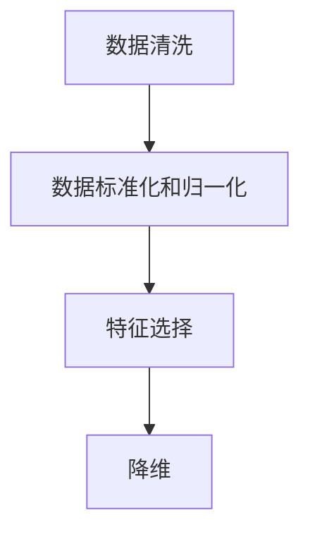

## 1. 背景介绍

在深度学习领域，神经网络的成功在很大程度上取决于其输入数据的质量。数据预处理是一种技术，它旨在提高数据的质量，以便神经网络可以从中获取更多的有用信息。这个过程通常包括数据清洗、标准化、归一化、特征选择和降维等步骤。

## 2. 核心概念与联系

数据预处理是一个复杂的过程，涉及到许多核心概念和步骤。首先，我们需要清洗数据，去除重复的数据、处理缺失值和异常值。然后，我们需要进行数据的标准化和归一化，将数据转换为一个标准的、适合神经网络处理的格式。接下来是特征选择，我们需要从原始数据中选择出最有用的特征，以减少计算复杂性和提高模型的性能。最后，我们可能需要进行降维，以进一步减少数据的复杂性。

## 3. 核心算法原理具体操作步骤

### 3.1 数据清洗

数据清洗的目标是去除重复数据、处理缺失值和异常值。这通常涉及到以下几个步骤：

- 去除重复数据：我们可以使用pandas库中的`drop_duplicates`函数来实现这一步。
- 处理缺失值：我们可以使用插值、平均值或者删除含有缺失值的记录来处理缺失值。
- 处理异常值：我们可以使用Z-score方法或者IQR方法来检测和处理异常值。

### 3.2 数据标准化和归一化

数据标准化和归一化的目标是将数据转换为一个标准的、适合神经网络处理的格式。标准化通常指的是将数据转换为均值为0、标准差为1的分布；而归一化通常指的是将数据转换到0-1的范围内。

- 数据标准化：我们