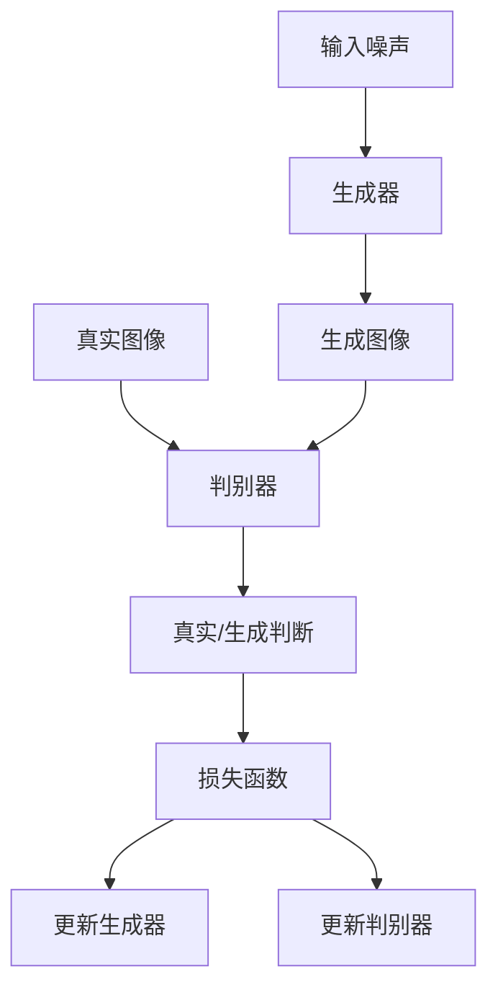
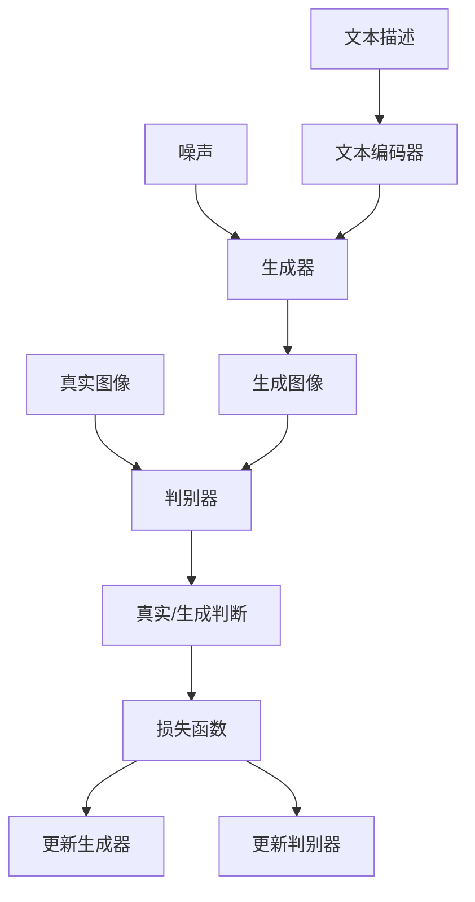

# 文本到图像生成：用文字描绘你的想象

## 1. 背景介绍

### 1.1 人工智能的新前沿

人工智能(AI)一直是科技界的热门话题,在过去几年中取得了长足进步。其中,生成式AI模型成为了新的焦点,展现出令人惊叹的创造力。文本到图像生成技术就是生成式AI的一个引人注目的应用,它可以根据文本描述生成相应的图像,为人类想象力打开了新的大门。

### 1.2 文本到图像生成的魅力

想象一下,只需输入一个简单的文本描述,就能生成出栩栩如生的图像,这难道不是一种全新的创作体验吗?无论你是艺术家、设计师,还是普通爱好者,都可以用文字勾勒出心中的画面。这种将语言转化为视觉的能力,不仅拓宽了人类的创造力边界,也为各行业带来了新的可能性。

### 1.3 应用前景广阔

文本到图像生成技术可以广泛应用于多个领域,例如视觉艺术创作、产品设计、视觉内容生成等。它为创意工作者提供了一种全新的工具,让他们能够快速实现构思,加速设计流程。同时,它也可以用于数据增强、辅助诊断等场景,为人工智能系统提供更多训练数据。

## 2. 核心概念与联系

### 2.1 生成对抗网络(GAN)

文本到图像生成技术主要基于生成对抗网络(Generative Adversarial Networks, GAN)这一深度学习架构。GAN包含两个神经网络:生成器(Generator)和判别器(Discriminator)。生成器的目标是生成逼真的图像,而判别器则需要区分生成的图像和真实图像。两个网络相互对抗,不断提高生成质量。



### 2.2 条件GAN

传统GAN生成的图像是随机的,无法控制生成内容。条件GAN(Conditional GAN)则引入了条件变量,使生成器能够根据文本描述或其他条件生成特定的图像。文本到图像生成技术就属于条件GAN的一种应用。



### 2.3 注意力机制

为了更好地关注文本描述中的关键信息,许多文本到图像生成模型采用了注意力机制(Attention Mechanism)。注意力机制能够自适应地分配不同词元的权重,使模型更多关注与生成图像相关的文本部分。

### 2.4 其他技术

除了GAN和注意力机制,文本到图像生成模型还采用了多种技术来提高生成质量,例如:

- 深层次特征映射(Deep Feature Mapping):将文本特征映射到图像特征空间。
- 多级生成(Multi-stage Generation):分多个阶段逐步生成图像。
- 样式迁移(Style Transfer):将文本描述的风格迁移到生成图像中。

## 3. 核心算法原理具体操作步骤

以下是一种典型的文本到图像生成模型的工作流程:

1. **文本编码**:将输入的文本描述通过编码器(如BERT、GPT等)转换为文本嵌入向量。
2. **噪声采样**:从一个潜在空间(如高斯分布)采样一个噪声向量。
3. **条件拼接**:将文本嵌入向量和噪声向量拼接在一起,作为生成器的输入。
4. **生成器前馈**:生成器网络对拼接向量进行前馈运算,生成一个初始图像。
5. **注意力机制**:计算文本嵌入向量和生成图像特征之间的注意力权重。
6. **残差连接**:将注意力加权后的文本嵌入向量与图像特征相加,得到条件图像特征。
7. **上采样**:利用上采样层(如反卷积层)将条件图像特征逐步上采样至目标分辨率。
8. **判别器判断**:判别器网络判断上一步生成的图像是真实的还是生成的。
9. **损失计算**:根据判别器的判断结果,计算生成器和判别器的损失函数。
10. **模型优化**:利用优化算法(如Adam)分别更新生成器和判别器的参数,使其朝着最小化损失函数的方向优化。
11. **迭代训练**:重复上述步骤,直到模型收敛或达到预期性能。

需要注意的是,不同的模型架构可能会有所差异,但总体思路是相似的。此外,还可以采用一些技巧来提升生成质量,如多阶段生成、注意力增强等。

## 4. 数学模型和公式详细讲解举例说明

### 4.1 生成对抗网络(GAN)

生成对抗网络由生成器G和判别器D组成,它们相互对抗地训练。生成器G的目标是生成逼真的图像,使判别器D无法将其与真实图像区分开来。而判别器D则需要正确判断输入图像是真实的还是生成的。两者的目标函数可以表示为:

$$\min_G \max_D V(D,G) = \mathbb{E}_{x\sim p_\text{data}(x)}[\log D(x)] + \mathbb{E}_{z\sim p_z(z)}[\log(1-D(G(z)))]$$

其中,$p_\text{data}(x)$是真实图像数据的分布,$p_z(z)$是生成器输入噪声的分布。在理想情况下,生成器G将学习到真实数据分布$p_\text{data}(x)$,而判别器D则将对所有真实图像输出1,对所有生成图像输出0。

### 4.2 条件GAN

对于文本到图像生成任务,我们需要引入条件变量,即文本描述。条件GAN的目标函数可以表示为:

$$\min_G \max_D V(D,G) = \mathbb{E}_{x\sim p_\text{data}(x)}[\log D(x|c)] + \mathbb{E}_{z\sim p_z(z)}[\log(1-D(G(z|c)))]$$

其中,$c$是文本描述的条件。生成器G需要根据噪声$z$和条件$c$生成图像,而判别器D则需要根据图像和条件$c$进行真实/生成的判断。

### 4.3 注意力机制

为了更好地利用文本信息,许多模型采用了注意力机制。注意力机制能够自适应地分配不同词元的权重,使模型更多关注与生成图像相关的文本部分。

假设文本描述的嵌入向量为$\mathbf{t} = [t_1, t_2, \ldots, t_n]$,生成图像的特征向量为$\mathbf{v}$,我们可以计算注意力权重$\alpha_i$如下:

$$\alpha_i = \frac{\exp(f(t_i, \mathbf{v}))}{\sum_{j=1}^n \exp(f(t_j, \mathbf{v}))}$$

其中,$f$是一个评分函数,用于衡量词元$t_i$与图像特征$\mathbf{v}$的相关性。常用的评分函数包括点积、加性注意力等。

然后,我们可以利用注意力权重对文本嵌入向量进行加权求和,得到条件向量$\mathbf{c}$:

$$\mathbf{c} = \sum_{i=1}^n \alpha_i t_i$$

条件向量$\mathbf{c}$将被送入生成器,用于生成条件图像。

### 4.4 损失函数

在训练过程中,生成器G和判别器D的损失函数通常由多个部分组成:

- 对抗损失(Adversarial Loss):这是GAN的核心损失,用于驱动生成器生成逼真图像,同时驱动判别器正确区分真实/生成图像。
- 感知损失(Perceptual Loss):衡量生成图像与真实图像在感知上的差异,常用预训练的图像分类网络提取特征。
- 像素损失(Pixel Loss):直接比较生成图像与真实图像在像素级别的差异,如L1或L2范数。

总的损失函数可以是上述多个部分的加权和:

$$\mathcal{L} = \lambda_1 \mathcal{L}_\text{adv} + \lambda_2 \mathcal{L}_\text{percep} + \lambda_3 \mathcal{L}_\text{pixel}$$

其中,$\lambda_1, \lambda_2, \lambda_3$是不同损失项的权重系数。在实际应用中,还可以根据具体需求添加其他正则项或辅助损失。

## 5. 项目实践:代码实例和详细解释说明

以下是一个使用PyTorch实现的简单文本到图像生成模型示例,仅供参考:

```python
import torch
import torch.nn as nn

# 文本编码器
class TextEncoder(nn.Module):
    def __init__(self, vocab_size, embed_dim, hidden_dim):
        super().__init__()
        self.embedding = nn.Embedding(vocab_size, embed_dim)
        self.rnn = nn.GRU(embed_dim, hidden_dim, batch_first=True)
        
    def forward(self, text):
        embeddings = self.embedding(text)
        _, hidden = self.rnn(embeddings)
        return hidden

# 生成器
class Generator(nn.Module):
    def __init__(self, noise_dim, text_dim, img_channels):
        super().__init__()
        self.proj = nn.Linear(noise_dim + text_dim, 128)
        self.main = nn.Sequential(
            nn.ConvTranspose2d(128, 64, 4, 2, 1),
            nn.ReLU(),
            nn.ConvTranspose2d(64, 32, 4, 2, 1),
            nn.ReLU(),
            nn.ConvTranspose2d(32, img_channels, 4, 2, 1),
            nn.Tanh()
        )
        
    def forward(self, noise, text_encoding):
        x = torch.cat([noise, text_encoding], dim=1)
        x = self.proj(x).unsqueeze(-1).unsqueeze(-1)
        img = self.main(x)
        return img

# 判别器
class Discriminator(nn.Module):
    def __init__(self, img_channels, text_dim):
        super().__init__()
        self.img = nn.Sequential(
            nn.Conv2d(img_channels, 32, 4, 2, 1),
            nn.LeakyReLU(0.2),
            nn.Conv2d(32, 64, 4, 2, 1),
            nn.LeakyReLU(0.2),
            nn.Conv2d(64, 128, 4, 2, 1),
            nn.LeakyReLU(0.2)
        )
        self.text_proj = nn.Linear(text_dim, 128)
        self.classifier = nn.Sequential(
            nn.Linear(128 * 4 * 4, 1),
            nn.Sigmoid()
        )
        
    def forward(self, img, text_encoding):
        img_feat = self.img(img).view(img.size(0), -1)
        text_feat = self.text_proj(text_encoding).unsqueeze(2).unsqueeze(3)
        feat = torch.cat([img_feat, text_feat.expand(-1, -1, 4, 4)], dim=1)
        out = self.classifier(feat.view(feat.size(0), -1))
        return out
```

这个示例模型包含三个主要部分:文本编码器、生成器和判别器。

1. **文本编码器**:将输入文本转换为固定长度的向量表示。这里使用了一个Embedding层和GRU层。
2. **生成器**:将噪声向量和文本编码向量拼接后,通过一系列转置卷积层生成图像。
3. **判别器**:将图像和文本编码向量作为输入,通过卷积层和全连接层判断输入是真实图像还是生成图像。

在训练过程中,我们可以采用标准的GAN训练策略,交替更新生成器和判别器的参数。具体的训练代码可以参考PyTorch的官方教程和其他开源实现。

需要注意的是,这只是一个简单的示例,实际应用中的模型通常会更加复杂和强大。例如,可以使用更先进的注