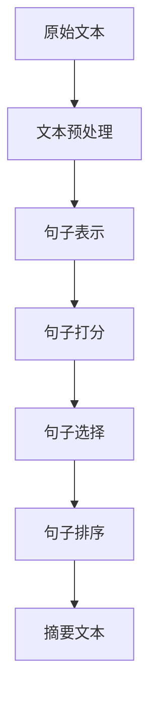
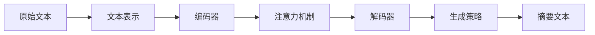

# 文本摘要(Text Summarization)原理与代码实战案例讲解

## 1.背景介绍

### 1.1 什么是文本摘要?

文本摘要(Text Summarization)是一种将长篇文本内容压缩并提取出最重要信息的任务。其目标是生成一个简明扼要的文本摘要,同时保留原文的核心内容和语义。这项技术在信息过载的时代显得尤为重要,可以帮助人们快速获取文本的关键信息,节省时间和精力。

文本摘要可分为两大类型:

- **提取式摘要(Extractive Summarization)**: 从原文中选取一些重要的句子或者词语,拼接成摘要。这种方法简单直接,但可能会导致语句不连贯。

- **生成式摘要(Abstractive Summarization)**: 深度理解原文的语义,并生成一个全新的摘要文本。这种方法可以产生更加流畅自然的摘要,但难度较大。

### 1.2 文本摘要的应用场景

文本摘要技术在许多领域都有广泛的应用:

- **新闻媒体**: 自动生成新闻标题和摘要,方便读者快速浏览。
- **科研文献**: 对论文进行自动摘要,帮助研究人员快速掌握论文核心内容。
- **客户服务**: 对用户反馈和评论进行自动摘要,提高工作效率。
- **法律文件**: 对庞大的法律文书进行摘要,方便律师快速查阅。
- **商业报告**: 对商业报告和分析进行摘要,为决策者提供信息支持。

## 2.核心概念与联系

### 2.1 文本表示

在进行文本摘要之前,需要将原始文本转换为机器可以理解的数值表示形式。常见的文本表示方法包括:

1. **One-Hot编码**: 将每个单词表示为一个向量,向量的维度等于词表的大小,只有该单词对应的维度为1,其他维度为0。缺点是维度过高,存在维度灾难问题。

2. **Word Embedding**: 将每个单词映射到一个低维的密集向量空间,相似的单词在向量空间中距离较近。常用的Word Embedding方法有Word2Vec、GloVe等。

3. **序列建模**: 将文本表示为单词序列,利用循环神经网络(RNN)或者Transformer等模型对序列进行建模。

### 2.2 注意力机制

注意力机制(Attention Mechanism)是文本摘要任务中一个关键概念。它允许模型在生成摘要时,对原文不同部分的重要性赋予不同的权重,从而更好地捕捉文本的核心内容。

常见的注意力机制包括:

- **Seq2Seq注意力**: 在序列到序列模型(Seq2Seq)中,解码器可以通过注意力机制关注编码器不同时间步的隐藏状态,捕捉与当前生成的单词相关的重要信息。

- **Self-Attention**: Transformer模型中使用的Self-Attention机制,允许单词之间进行全局关联,捕捉长距离依赖关系。

- **Multi-Head Attention**: 将注意力分成多个子空间,每个子空间关注不同的位置特征,最后将多个子空间的特征融合,可以提高模型的表现力。

### 2.3 生成策略

在生成式文本摘要中,需要采用特定的生成策略来控制摘要的生成过程。常见的生成策略包括:

1. **Greedy Search**: 在每个时间步,选择当前概率最大的单词作为输出。这种方法简单高效,但可能导致生成的摘要质量不佳。

2. **Beam Search**: 在每个时间步,保留概率最高的k个候选序列,最终选取概率最高的序列作为输出。可以提高生成质量,但计算代价较高。

3. **Top-k Sampling**: 在每个时间步,从概率分布的前k个最高概率单词中随机采样一个单词作为输出。可以增加生成的多样性。

4. **Top-p Sampling(Nucleus Sampling)**: 在每个时间步,从概率分布的最高概率部分(累积概率达到p)中随机采样一个单词作为输出。这种方法可以在多样性和质量之间达到平衡。

### 2.4 评估指标

评估文本摘要的质量是一项挑战性的任务。常用的评估指标包括:

- **ROUGE(Recall-Oriented Understudy for Gisting Evaluation)**: 基于n-gram的指标,计算生成摘要与参考摘要之间的重叠程度。包括ROUGE-N、ROUGE-L等变体。

- **BLEU(Bilingual Evaluation Understudy)**: 最初用于机器翻译评估,也可用于评估摘要质量。计算生成摘要与参考摘要之间的n-gram精确度。

- **BERTScore**: 基于预训练语言模型BERT,计算生成摘要与参考摘要之间的语义相似度。

- **人工评估**: 由人工专家对摘要的相关性、连贯性、无冗余性等方面进行主观评分。

## 3.核心算法原理具体操作步骤

### 3.1 提取式文本摘要

提取式文本摘要的核心思想是从原文中选取一些重要的句子或短语,拼接成摘要。常见的算法步骤如下:

1. **文本预处理**: 对原始文本进行分词、去停用词、词性标注等预处理操作。

2. **句子表示**: 将每个句子表示为数值向量,可以使用TF-IDF、Word Embedding等方法。

3. **句子打分**: 根据特定的打分函数(如TextRank、位置特征等)为每个句子赋予重要性分数。

4. **句子选择**: 根据句子分数,选取分数最高的前N个句子作为摘要。可以采用贪心算法或整数线性规划(ILP)等方法进行句子选择。

5. **句子排序**: 将选择的句子按照原文顺序或其他策略进行排序,生成最终的摘要文本。

提取式摘要算法简单高效,但可能存在语句不连贯、关键信息缺失等问题。



### 3.2 生成式文本摘要

生成式文本摘要旨在深度理解原文的语义,并生成一个全新的摘要文本。常见的算法步骤如下:

1. **文本表示**: 将原文表示为单词序列或其他结构化表示形式,如利用Word Embedding或预训练语言模型(BERT、GPT等)获取文本的向量表示。

2. **编码器(Encoder)**: 使用序列模型(如RNN、Transformer等)对原文进行编码,获取原文的上下文语义表示。

3. **注意力机制**: 在解码器端,通过注意力机制关注原文不同部分的重要信息,捕捉与当前生成的单词相关的上下文信息。

4. **解码器(Decoder)**: 根据编码器的输出和注意力权重,通过序列生成模型(如RNN或Transformer的解码器)生成摘要文本。

5. **生成策略**: 采用贪心搜索、Beam Search或其他采样策略,控制摘要的生成过程。

6. **训练目标**: 通常以最小化生成摘要与参考摘要之间的损失函数(如交叉熵损失)作为训练目标,使用强化学习等方法进一步优化模型。

生成式摘要算法能生成更加流畅自然的摘要,但训练和推理过程较为复杂,对计算资源要求较高。



## 4.数学模型和公式详细讲解举例说明

### 4.1 注意力机制

注意力机制是文本摘要任务中一个关键概念,它允许模型在生成摘要时,对原文不同部分的重要性赋予不同的权重。以下是注意力机制的数学表示:

给定一个查询向量 $q$ 和一组键值对 $(k_1, v_1), (k_2, v_2), ..., (k_n, v_n)$,注意力机制的计算过程如下:

1. 计算查询向量 $q$ 与每个键 $k_i$ 的相似性得分:

$$\text{score}(q, k_i) = q^T k_i$$

2. 对相似性得分进行软最大值(softmax)操作,获得注意力权重:

$$\alpha_i = \frac{\exp(\text{score}(q, k_i))}{\sum_{j=1}^{n}\exp(\text{score}(q, k_j))}$$

3. 根据注意力权重对值向量进行加权求和,得到注意力输出:

$$\text{attn}(q, (k_1, v_1), ..., (k_n, v_n)) = \sum_{i=1}^{n}\alpha_i v_i$$

在序列到序列模型(Seq2Seq)中,查询向量 $q$ 通常来自解码器的隐藏状态,键值对 $(k_i, v_i)$ 来自编码器在不同时间步的输出。注意力机制允许解码器关注与当前生成的单词相关的编码器输出,从而捕捉原文的重要信息。

### 4.2 交叉熵损失

在生成式文本摘要任务中,常将摘要生成问题建模为一个序列生成问题,以最小化生成摘要与参考摘要之间的交叉熵损失作为训练目标。

假设参考摘要为 $y = (y_1, y_2, ..., y_T)$,生成的摘要为 $\hat{y} = (\hat{y}_1, \hat{y}_2, ..., \hat{y}_T)$,其中 $y_t$ 和 $\hat{y}_t$ 分别表示在时间步 $t$ 的单词。交叉熵损失函数可以表示为:

$$\mathcal{L}(\theta) = -\frac{1}{T}\sum_{t=1}^{T}\log P(y_t|\hat{y}_{<t}; \theta)$$

其中 $\theta$ 表示模型参数, $P(y_t|\hat{y}_{<t}; \theta)$ 表示在给定之前生成的单词序列 $\hat{y}_{<t}$ 的条件下,正确预测第 $t$ 个单词 $y_t$ 的条件概率。

交叉熵损失函数可以看作是对数似然损失的一种特殊情况,它衡量了模型预测与实际标签之间的差异。通过最小化交叉熵损失,可以使模型更好地捕捉原文和摘要之间的语义关系,从而生成更加准确的摘要文本。

## 5.项目实践:代码实例和详细解释说明

在本节,我们将通过一个基于Transformer的生成式文本摘要项目,展示如何使用PyTorch实现文本摘要模型。

### 5.1 数据预处理

首先,我们需要对原始文本数据进行预处理,将其转换为模型可以接受的格式。以下是一个示例代码:

```python
import re
import nltk
from nltk.corpus import stopwords

# 下载必要的NLTK数据
nltk.download('punkt')
nltk.download('stopwords')

def preprocess_text(text):
    # 转换为小写
    text = text.lower()
    
    # 去除特殊字符
    text = re.sub(r'[^a-zA-Z0-9\s]', '', text)
    
    # 分词
    tokens = nltk.word_tokenize(text)
    
    # 去除停用词
    stop_words = set(stopwords.words('english'))
    tokens = [token for token in tokens if token not in stop_words]
    
    return tokens
```

在这个示例中,我们使用NLTK库对文本进行预处理,包括转换为小写、去除特殊字符、分词和去除停用词。你可以根据需要添加更多的预处理步骤,如词干提取或词性标注。

### 5.2 数据加载

接下来,我们需要将预处理后的文本数据加载到PyTorch的Dataset中,以便模型可以进行训练和推理。以下是一个示例代码:

```python
import torch
from torch.utils.data import Dataset

class SummarizationDataset(Dataset):
    def __init__(self, texts, summaries, tokenizer, max_len):
        