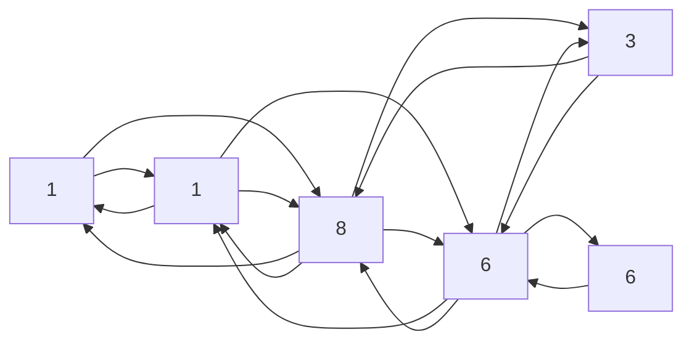

# 最短路径 原理与代码实例讲解

## 1.背景介绍

在现实生活中,我们经常会遇到寻找最短路径的问题。比如规划城市道路网络时,需要找到两点之间的最短路径;在网络通信中,需要寻找两个节点之间的最短路径来传输数据;在机器人导航中,需要计算机器人从起点到终点的最短路径。因此,最短路径问题在许多领域都有着广泛的应用,是计算机科学中一个非常重要和基础的问题。

## 2.核心概念与联系

### 2.1 图的基本概念

图(Graph)是一种非线性的数据结构,由一组顶点(Vertex)和连接这些顶点的边(Edge)组成。在图论中,我们通常使用G=(V,E)来表示一个图,其中V是顶点集合,E是边集合。

根据边是否有方向,图可分为无向图(Undirected Graph)和有向图(Directed Graph)。在无向图中,边没有方向,任意两个顶点之间的连接是双向的。而在有向图中,边是有方向的,连接是单向的。

另外,根据边是否带权值,图可分为无权图(Unweighted Graph)和有权图(Weighted Graph)。在无权图中,边没有权值;而在有权图中,每条边都有一个与之相关的权值(Weight),通常表示该边的长度、时间或代价等。

最短路径问题就是在一个有权图中,找到两个顶点之间的路径,使得该路径的总权值最小。

### 2.2 最短路径算法分类

根据问题的不同,最短路径算法可以分为以下几类:

1. **单源最短路径(Single-Source Shortest Path)**:给定一个源顶点,求解从该源顶点到其他所有顶点的最短路径。典型算法有Dijkstra算法和Bellman-Ford算法。

2. **单目标最短路径(Single-Destination Shortest Path)**:给定一个目标顶点,求解从其他所有顶点到该目标顶点的最短路径。可以通过反向应用单源最短路径算法来解决。

3. **所有对最短路径(All-Pairs Shortest Path)**:求解图中任意两个顶点之间的最短路径。典型算法有Floyd-Warshall算法和Johnson算法。

4. **多源最短路径(Multi-Source Shortest Path)**:给定多个源顶点,求解从这些源顶点到其他所有顶点的最短路径。

本文将重点介绍单源最短路径问题及其经典算法Dijkstra算法。

## 3.核心算法原理具体操作步骤

### 3.1 Dijkstra算法原理

Dijkstra算法是解决单源最短路径问题的一种经典算法,由荷兰计算机科学家艾兹赫尔·戴克斯特拉(Edsger Dijkstra)在1959年提出。该算法适用于有向或无向的加权图,但要求边的权值为非负值。

算法的基本思想是从源顶点开始,逐步扩展到其他顶点,并维护一个距离集合,记录从源顶点到每个顶点的当前最短距离。每次选择距离集合中距离最小的顶点,并通过该顶点来更新其他顶点到源顶点的距离。算法重复这个过程,直到所有顶点的最短距离都被找到。

Dijkstra算法的伪代码如下:

```
函数 Dijkstra(图G, 源顶点src):
    初始化所有顶点的距离为无穷大
    将源顶点src的距离设置为0
    
    创建一个优先级队列Q
    将所有顶点加入Q中
    
    while Q不为空:
        从Q中取出距离最小的顶点u
        
        for 每个与u相邻的顶点v:
            新距离 = u的距离 + 边(u,v)的权值
            if 新距离 < v的当前距离:
                更新v的距离为新距离
                更新v在Q中的位置
    
    返回所有顶点的最短距离
```

该算法的时间复杂度为O((V+E)logV),其中V是顶点数,E是边数。当使用二叉堆作为优先级队列时,算法的时间复杂度可以达到这个上界。

### 3.2 Dijkstra算法实现

下面是使用Python实现Dijkstra算法的代码示例:

```python
import heapq

def dijkstra(graph, start):
    distances = {vertex: float('infinity') for vertex in graph}
    distances[start] = 0
    pq = [(0, start)]

    while pq:
        current_dist, current_vertex = heapq.heappop(pq)

        if current_dist > distances[current_vertex]:
            continue

        for neighbor, weight in graph[current_vertex].items():
            distance = current_dist + weight
            if distance < distances[neighbor]:
                distances[neighbor] = distance
                heapq.heappush(pq, (distance, neighbor))

    return distances

# 示例用法
graph = {
    'A': {'B': 5, 'C': 1},
    'B': {'A': 5, 'C': 2, 'D': 1},
    'C': {'A': 1, 'B': 2, 'D': 4, 'E': 8},
    'D': {'B': 1, 'C': 4, 'E': 3, 'F': 6},
    'E': {'C': 8, 'D': 3},
    'F': {'D': 6}
}

start_vertex = 'A'
distances = dijkstra(graph, start_vertex)
print(f"从顶点 {start_vertex} 到其他顶点的最短距离:")
for vertex, distance in distances.items():
    print(f"{vertex}: {distance}")
```

在这个示例中,我们首先定义了一个有向加权图,其中顶点之间的距离表示为边的权值。然后,我们调用`dijkstra`函数,传入图和起始顶点,并打印从起始顶点到其他所有顶点的最短距离。

该实现使用了Python的`heapq`模块来实现优先级队列,从而获得较好的时间复杂度。

## 4.数学模型和公式详细讲解举例说明

在介绍Dijkstra算法的数学模型之前,我们先定义一些符号和术语:

- G=(V,E)表示一个有向加权图,其中V是顶点集合,E是边集合。
- n=|V|表示图中顶点的数量。
- m=|E|表示图中边的数量。
- w(u,v)表示从顶点u到顶点v的边的权值(Weight)。
- d(u,v)表示从顶点u到顶点v的最短路径长度。
- s表示源顶点(Source Vertex)。

Dijkstra算法的目标是找到从源顶点s到图中所有其他顶点的最短路径长度d(s,v)。

为了实现这个目标,我们需要引入两个集合:

- S:已确定最短路径长度的顶点集合。
- Q=V-S:还未确定最短路径长度的顶点集合。

算法的基本思想是不断从Q中选取一个顶点u,将它加入S中,并使用u来更新Q中其他顶点到源顶点s的最短路径长度。

具体地,我们定义d[v]表示当前从s到v的最短路径长度的估计值。初始时,对于所有v∈V,我们设置:

$$
d[v]=\begin{cases}
0, &\text{if }v=s\\
\infty, &\text{if }v\neq s
\end{cases}
$$

在算法的每一步中,我们从Q中选取一个顶点u,使得d[u]是Q中最小的值。然后,我们将u加入S,并对于每个u的邻居v∈Q,更新d[v]的值:

$$
d[v]=\min\{d[v],d[u]+w(u,v)\}
$$

这个过程重复进行,直到Q变为空集。此时,对于每个v∈V,d[v]就是从s到v的最短路径长度。

为了更好地理解Dijkstra算法的数学模型,我们来看一个具体的例子。假设我们有一个如下所示的有向加权图:



我们将源顶点设为A,运行Dijkstra算法后,从A到其他顶点的最短路径长度如下:

- d(A,A) = 0
- d(A,B) = 5
- d(A,C) = 1
- d(A,D) = 6
- d(A,E) = 9
- d(A,F) = 12

可以看出,Dijkstra算法能够正确地找到从源顶点A到其他所有顶点的最短路径长度。

## 5.项目实践:代码实例和详细解释说明

为了更好地理解Dijkstra算法的实现,我们将通过一个实际的项目示例来讲解算法的代码。在这个示例中,我们将构建一个简单的路径规划系统,用于计算两个城市之间的最短路径。

### 5.1 项目概述

假设我们有一个包含多个城市的地图,每对城市之间都有一条或多条道路相连,并且每条道路都有一个已知的距离。我们的目标是编写一个程序,能够计算出任意两个城市之间的最短路径距离。

为了实现这个目标,我们将使用Dijkstra算法作为核心算法。我们将首先构建一个有向加权图来表示城市之间的道路网络,然后使用Dijkstra算法计算任意两个城市之间的最短路径距离。

### 5.2 数据结构

在实现Dijkstra算法之前,我们需要先定义一些数据结构来表示城市和道路。

首先,我们定义一个`City`类来表示城市:

```python
class City:
    def __init__(self, name):
        self.name = name
        self.roads = {}

    def add_road(self, city, distance):
        self.roads[city] = distance
```

每个`City`对象都有一个名称和一个`roads`字典,用于存储与其他城市相连的道路及其距离。`add_road`方法可以用于添加一条新的道路。

接下来,我们定义一个`Map`类来表示整个城市地图:

```python
class Map:
    def __init__(self):
        self.cities = {}

    def add_city(self, city):
        self.cities[city.name] = city

    def get_city(self, name):
        return self.cities.get(name)
```

`Map`类包含一个`cities`字典,用于存储所有的城市对象。`add_city`方法可以用于添加一个新的城市,而`get_city`方法可以用于获取一个已存在的城市对象。

### 5.3 Dijkstra算法实现

现在,我们可以开始实现Dijkstra算法了。我们将定义一个`dijkstra`函数,它接受一个`Map`对象和一个起始城市作为输入,并返回一个字典,其中包含从起始城市到所有其他城市的最短路径距离。

```python
import heapq

def dijkstra(map, start_city):
    distances = {city.name: float('inf') for city in map.cities.values()}
    distances[start_city.name] = 0
    pq = [(0, start_city.name)]

    while pq:
        current_dist, current_city_name = heapq.heappop(pq)
        current_city = map.get_city(current_city_name)

        if current_dist > distances[current_city_name]:
            continue

        for neighbor, weight in current_city.roads.items():
            neighbor_city = map.get_city(neighbor.name)
            distance = current_dist + weight
            if distance < distances[neighbor_city.name]:
                distances[neighbor_city.name] = distance
                heapq.heappush(pq, (distance, neighbor_city.name))

    return distances
```

这个实现与之前介绍的Dijkstra算法的伪代码非常相似。我们首先初始化一个`distances`字典,用于存储从起始城市到每个城市的当前最短距离估计值。然后,我们创建一个优先级队列`pq`,并将起始城市及其距离0加入队列。

在主循环中,我们从`pq`中取出距离最小的城市`current_city`。对于`current_city`的每个邻居`neighbor_city`,我们计算从起始城市到`neighbor_city`的新距离`distance`。如果`distance`比`neighbor_city`当前的距离估计值小,我们就更新`distances`字典并将`neighbor_city`及其新距离加入`pq`。

最后,当`