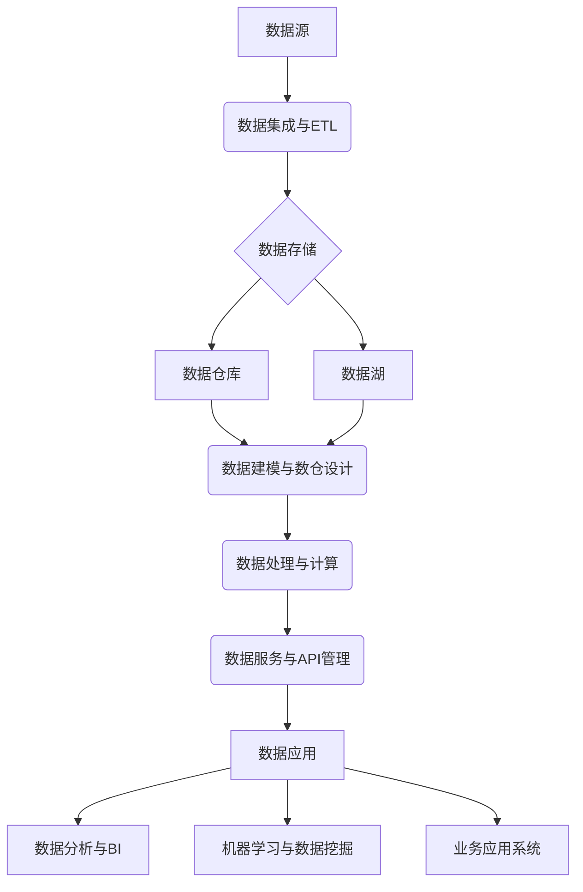

# 构建数据中台：数据治理的核心引擎

## 1. 背景介绍
### 1.1 数据中台的起源与发展
#### 1.1.1 数据孤岛问题的出现
#### 1.1.2 数据中台概念的提出
#### 1.1.3 数据中台的发展历程

### 1.2 数据中台的定义与特点  
#### 1.2.1 数据中台的定义
#### 1.2.2 数据中台的核心特点
#### 1.2.3 数据中台与传统数据平台的区别

### 1.3 数据中台在企业数字化转型中的重要性
#### 1.3.1 数据驱动决策的必要性
#### 1.3.2 数据中台对业务创新的推动作用
#### 1.3.3 数据中台在数据治理中的核心地位

## 2. 核心概念与联系
### 2.1 数据治理
#### 2.1.1 数据治理的定义
#### 2.1.2 数据治理的目标
#### 2.1.3 数据治理的主要内容

### 2.2 主数据管理
#### 2.2.1 主数据的概念
#### 2.2.2 主数据管理的重要性
#### 2.2.3 主数据管理与数据中台的关系

### 2.3 元数据管理
#### 2.3.1 元数据的概念
#### 2.3.2 元数据管理的作用
#### 2.3.3 元数据管理在数据中台中的应用

### 2.4 数据质量管理
#### 2.4.1 数据质量的定义
#### 2.4.2 数据质量管理的必要性
#### 2.4.3 数据质量管理在数据中台中的实践

### 2.5 数据安全与隐私保护
#### 2.5.1 数据安全与隐私的重要性
#### 2.5.2 数据安全与隐私保护的主要措施
#### 2.5.3 数据中台在数据安全与隐私保护中的作用

## 3. 核心算法原理具体操作步骤
### 3.1 数据集成与ETL
#### 3.1.1 数据集成的概念与作用
#### 3.1.2 ETL的基本原理
#### 3.1.3 数据集成与ETL在数据中台中的应用

### 3.2 数据建模与数仓设计
#### 3.2.1 数据建模的基本概念
#### 3.2.2 维度建模与事实建模
#### 3.2.3 数据仓库的分层架构设计

### 3.3 数据处理与计算
#### 3.3.1 批处理与流处理
#### 3.3.2 分布式计算框架（如Hadoop、Spark等）
#### 3.3.3 数据处理与计算在数据中台中的应用

### 3.4 数据服务与API管理
#### 3.4.1 数据服务的概念与作用
#### 3.4.2 API管理的重要性
#### 3.4.3 数据服务与API管理在数据中台中的实践

## 4. 数学模型和公式详细讲解举例说明
### 4.1 数据质量评估模型
#### 4.1.1 数据完整性评估模型
#### 4.1.2 数据准确性评估模型
#### 4.1.3 数据一致性评估模型

### 4.2 数据治理成熟度模型
#### 4.2.1 数据治理成熟度模型的概念
#### 4.2.2 数据治理成熟度模型的维度与级别
#### 4.2.3 数据治理成熟度模型的应用

### 4.3 数据价值评估模型
#### 4.3.1 数据资产价值评估模型
#### 4.3.2 数据应用价值评估模型
#### 4.3.3 数据价值评估模型的应用

## 5. 项目实践：代码实例和详细解释说明
### 5.1 数据集成与ETL实践
#### 5.1.1 使用Kettle进行数据集成
#### 5.1.2 使用DataX进行数据同步
#### 5.1.3 使用Hive进行ETL处理

### 5.2 数据建模与数仓设计实践
#### 5.2.1 使用ErWin进行数据建模
#### 5.2.2 使用Hadoop和Hive构建数据仓库
#### 5.2.3 使用Kylin进行OLAP分析

### 5.3 数据处理与计算实践
#### 5.3.1 使用Spark进行数据处理
#### 5.3.2 使用Flink进行流处理
#### 5.3.3 使用TensorFlow进行机器学习

### 5.4 数据服务与API管理实践
#### 5.4.1 使用Spring Boot构建数据服务
#### 5.4.2 使用Swagger进行API文档管理
#### 5.4.3 使用Kong进行API网关管理

## 6. 实际应用场景
### 6.1 电商行业的数据中台应用
#### 6.1.1 客户360度视图
#### 6.1.2 个性化推荐
#### 6.1.3 供应链优化

### 6.2 金融行业的数据中台应用
#### 6.2.1 风险控制
#### 6.2.2 反欺诈
#### 6.2.3 智能营销

### 6.3 制造业的数据中台应用
#### 6.3.1 设备预测性维护
#### 6.3.2 质量管理
#### 6.3.3 供应链优化

## 7. 工具和资源推荐
### 7.1 数据集成与ETL工具
#### 7.1.1 Kettle
#### 7.1.2 DataX
#### 7.1.3 Hive

### 7.2 数据建模与数仓设计工具
#### 7.2.1 ErWin
#### 7.2.2 PowerDesigner
#### 7.2.3 Hadoop和Hive

### 7.3 数据处理与计算工具
#### 7.3.1 Spark
#### 7.3.2 Flink
#### 7.3.3 TensorFlow

### 7.4 数据服务与API管理工具
#### 7.4.1 Spring Boot
#### 7.4.2 Swagger
#### 7.4.3 Kong

## 8. 总结：未来发展趋势与挑战
### 8.1 数据中台的未来发展趋势
#### 8.1.1 数据中台与人工智能的融合
#### 8.1.2 数据中台的云化与服务化
#### 8.1.3 数据中台的行业化与垂直化

### 8.2 数据中台面临的挑战
#### 8.2.1 数据质量与安全问题
#### 8.2.2 数据治理与组织变革
#### 8.2.3 数据中台的技术架构与集成

## 9. 附录：常见问题与解答
### 9.1 如何评估企业是否需要构建数据中台？
### 9.2 数据中台的建设周期与成本如何？
### 9.3 数据中台与数据仓库有何区别？
### 9.4 如何选择合适的数据中台技术架构？
### 9.5 数据中台的数据治理应该如何开展？

数据中台是企业数字化转型的核心引擎,是连接数据与业务的桥梁。它通过对企业内外部数据进行采集、集成、存储、计算、服务等一系列处理,为企业提供统一、标准、高质量的数据资产,支撑企业的数据分析、数据挖掘、机器学习等数据应用,进而推动业务创新与优化。

数据中台的建设离不开数据治理。数据治理是指对企业的数据资产进行管理和控制,确保数据的质量、安全、价值等,支持企业的数据战略目标。数据治理包括主数据管理、元数据管理、数据质量管理、数据安全与隐私保护等多个方面。通过数据治理,企业可以建立起统一的数据标准,提高数据的一致性和可信度,降低数据风险,最大化数据价值。

数据中台的核心算法和技术包括数据集成与ETL、数据建模与数仓设计、数据处理与计算、数据服务与API管理等。数据集成与ETL负责将企业内外部的异构数据源进行采集、清洗、转换、加载,形成统一的数据视图。数据建模与数仓设计负责对数据进行建模,设计符合业务需求的数据仓库架构。数据处理与计算负责对数据进行批处理、流处理、机器学习等计算分析。数据服务与API管理负责将数据以服务的形式提供给业务应用系统。

数据中台在电商、金融、制造等行业有广泛的应用。在电商行业,数据中台可以支持客户360度视图、个性化推荐、供应链优化等应用场景。在金融行业,数据中台可以支持风险控制、反欺诈、智能营销等应用场景。在制造业,数据中台可以支持设备预测性维护、质量管理、供应链优化等应用场景。

未来,数据中台将与人工智能进一步融合,实现数据的智能化处理和应用。数据中台也将向云化和服务化方向发展,提供更加灵活、弹性的数据服务。同时,数据中台将向行业化和垂直化方向发展,提供面向特定行业和领域的数据解决方案。

当然,数据中台的建设也面临诸多挑战,如数据质量与安全问题、数据治理与组织变革、技术架构与集成等。企业需要制定明确的数据战略,建立数据治理体系,选择合适的技术架构,持续优化数据中台,才能真正发挥数据中台的价值,推动业务创新与增长。

作者：禅与计算机程序设计艺术 / Zen and the Art of Computer Programming