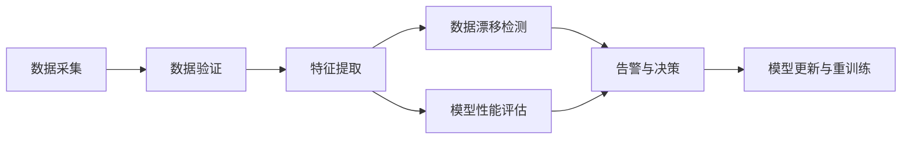

# 模型监控：保障模型稳定运行

## 1. 背景介绍

随着人工智能技术的飞速发展,越来越多的企业开始将机器学习模型应用到生产环境中。然而,模型在线上环境的表现往往会与离线训练和评估时的结果存在差异。数据分布的变化、模型漂移等因素都可能导致模型性能下降,影响业务的正常运行。因此,对线上模型进行持续的监控与管理,及时发现和解决潜在问题,对于保障模型的稳定运行至关重要。

本文将深入探讨模型监控的核心概念、关键技术以及最佳实践,帮助读者全面了解如何有效地监控和管理线上机器学习模型,确保其长期稳定运行。

## 2. 核心概念与联系

### 2.1 模型监控的定义与目标

模型监控是指对已部署到生产环境中的机器学习模型进行持续的监测、分析和管理的过程。其主要目标包括:

- 实时监测模型性能指标,及时发现异常情况
- 分析模型输入数据的分布变化,识别潜在的数据漂移问题  
- 评估模型预测结果的质量,确保输出符合预期
- 追踪模型资源消耗情况,优化资源配置
- 提供可视化的监控面板,方便团队实时了解模型运行状态

### 2.2 模型漂移与数据漂移

模型漂移(Model Drift)和数据漂移(Data Drift)是模型监控中两个重要的概念。

- 模型漂移:指模型在训练后,其性能随时间推移而逐渐下降的现象。可能的原因包括数据分布变化、模型过拟合等。
- 数据漂移:指输入数据的统计特性发生变化,导致模型难以适应新的数据分布。常见的数据漂移类型有协变量漂移和概念漂移。

及时发现和应对模型漂移与数据漂移,是保障模型稳定运行的关键。

### 2.3 模型监控的关键指标

为全面评估模型的运行状况,需要从多个维度设置监控指标,主要包括:

- 性能指标:准确率、精确率、召回率、F1值、AUC等
- 数据质量指标:缺失值比例、异常值比例、数据分布情况等
- 资源消耗指标:CPU使用率、内存占用、请求延迟、吞吐量等
- 业务指标:转化率、用户满意度等

根据业务场景和模型特点,选择合适的关键指标进行重点监控。

## 3. 核心算法原理与具体操作步骤

### 3.1 数据漂移检测算法

数据漂移检测是模型监控的重要环节。常用的数据漂移检测算法包括:

#### 3.1.1 KL散度(Kullback-Leibler Divergence)

KL散度用于衡量两个概率分布之间的差异性。对于模型输入数据,可以计算训练集和线上数据在各个特征上的KL散度,当散度超过设定阈值时,说明发生了数据漂移。

具体步骤如下:

1. 对训练集和线上数据的每个特征,估计其概率密度函数$p(x)$和$q(x)$
2. 计算每个特征的KL散度:

$$KL(p||q) = \int p(x) \log \frac{p(x)}{q(x)} dx$$

3. 判断KL散度是否超过预设阈值,确定是否发生数据漂移

#### 3.1.2 Kolmogorov-Smirnov检验

KS检验是一种非参数检验方法,用于判断两组数据是否来自同一分布。对于模型监控,可以使用KS检验比较训练集和线上数据在每个特征上的分布差异。

具体步骤如下:

1. 对每个特征,计算训练集和线上数据的经验分布函数$F_1(x)$和$F_2(x)$
2. 计算两个经验分布函数之间的最大垂直距离:

$$D_{n,m} = \sup_{x} |F_1(x) - F_2(x)|$$

3. 根据样本大小和显著性水平,查表得到临界值$D_{\alpha}$
4. 若$D_{n,m} > D_{\alpha}$,则认为两组数据分布存在显著差异,发生了数据漂移

### 3.2 模型性能评估方法

#### 3.2.1 混淆矩阵

混淆矩阵是评估分类模型性能的常用工具。通过比较预测标签和真实标签,可以得到以下四个指标:

- TP(True Positive):真实为正,预测也为正
- FP(False Positive):真实为负,预测为正
- TN(True Negative):真实为负,预测也为负
- FN(False Negative):真实为正,预测为负

基于混淆矩阵,可以计算出准确率、精确率、召回率、F1值等常用评估指标。

#### 3.2.2 ROC曲线和AUC

ROC曲线反映了分类模型在不同阈值下的性能表现。横轴为假正率(FPR),纵轴为真正率(TPR)。AUC则表示ROC曲线下的面积,是模型整体性能的一个度量。

绘制ROC曲线的步骤:

1. 对模型输出的概率值按降序排列
2. 从高到低选取不同的阈值,计算每个阈值下的TPR和FPR
3. 以FPR为横轴,TPR为纵轴绘制曲线
4. 计算曲线下面积得到AUC值

AUC越接近1,说明模型性能越好。在模型监控中,通过跟踪AUC的变化趋势,可以及时发现模型性能下降问题。

### 3.3 模型监控流程

下图展示了一个典型的模型监控流程:

1. 数据采集:收集线上模型的输入和输出数据,并存储到数据库或日志系统中
2. 数据验证:检查数据的完整性、合法性,清洗异常数据
3. 特征提取:从原始数据中提取出模型监控所需的特征
4. 数据漂移检测:使用KL散度、KS检验等算法,判断数据分布是否发生漂移
5. 模型性能评估:计算混淆矩阵、ROC曲线等指标,评估模型的性能表现
6. 告警与决策:根据数据漂移和性能下降情况,触发告警,决定是否需要更新模型
7. 模型更新与重训练:使用最新数据对模型进行重新训练,并部署更新后的模型

## 4. 数学模型和公式详细讲解举例说明

本节将详细介绍KL散度和KS检验的数学原理,并给出具体的计算示例。

### 4.1 KL散度的数学定义与性质

KL散度(Kullback-Leibler Divergence)度量了两个概率分布$P(x)$和$Q(x)$之间的差异性。其数学定义为:

$$KL(P||Q) = \int P(x) \log \frac{P(x)}{Q(x)} dx$$

KL散度满足以下性质:

- 非负性:$KL(P||Q) \geq 0$
- 非对称性:$KL(P||Q) \neq KL(Q||P)$
- 当且仅当$P=Q$时,$KL(P||Q)=0$

下面通过一个简单例子来说明KL散度的计算过程。

假设训练集和线上数据的某个特征$x$服从高斯分布,参数分别为$\mu_1=0,\sigma_1=1$和$\mu_2=1,\sigma_2=1$。则两个分布的概率密度函数为:

$$P(x) = \frac{1}{\sqrt{2\pi}} \exp(-\frac{x^2}{2})$$

$$Q(x) = \frac{1}{\sqrt{2\pi}} \exp(-\frac{(x-1)^2}{2})$$

代入KL散度公式,可得:

$$KL(P||Q) = \int \frac{1}{\sqrt{2\pi}} \exp(-\frac{x^2}{2}) \log \frac{\exp(-\frac{x^2}{2})}{\exp(-\frac{(x-1)^2}{2})} dx$$

化简得:

$$KL(P||Q) = \int \frac{1}{\sqrt{2\pi}} \exp(-\frac{x^2}{2}) \frac{(x-1)^2-x^2}{2} dx = \frac{1}{2}$$

可见,当两个高斯分布的均值相差1个标准差时,其KL散度为0.5。在实际应用中,可根据经验设置KL散度阈值,判断是否发生数据漂移。

### 4.2 KS检验的数学原理与步骤

KS检验(Kolmogorov-Smirnov Test)是一种非参数检验方法,用于判断两组数据是否来自同一分布。其基本思想是比较两组数据的经验分布函数之间的最大垂直距离。

假设有两组独立的样本$X_1,X_2,\dots,X_n$和$Y_1,Y_2,\dots,Y_m$,分别来自分布函数为$F(x)$和$G(x)$的总体。定义经验分布函数:

$$F_n(x) = \frac{1}{n} \sum_{i=1}^n I(X_i \leq x)$$

$$G_m(x) = \frac{1}{m} \sum_{i=1}^m I(Y_i \leq x)$$

其中,$I(\cdot)$为示性函数。

KS检验统计量为两个经验分布函数之间的最大垂直距离:

$$D_{n,m} = \sup_{x} |F_n(x) - G_m(x)|$$

在原假设$H_0: F(x)=G(x)$下,KS检验统计量的极限分布为:

$$\lim_{n,m \to \infty} P(\sqrt{\frac{nm}{n+m}} D_{n,m} \leq t) = 1 - 2 \sum_{k=1}^{\infty} (-1)^{k-1} \exp(-2k^2t^2)$$

根据显著性水平$\alpha$,可查表得到拒绝域的临界值$t_{\alpha}$。当$\sqrt{\frac{nm}{n+m}} D_{n,m} > t_{\alpha}$时,拒绝原假设,认为两组数据来自不同的分布。

下面通过一个具体例子来说明KS检验的计算步骤。

假设训练集和线上数据的某个特征分别为:

- 训练集: 1.2, 1.5, 1.8, 2.0, 2.2
- 线上数据: 1.0, 1.3, 1.6, 1.9, 2.1

首先,计算两组数据的经验分布函数:

$$F_5(x) = \begin{cases}
0, & x < 1.2 \\
0.2, & 1.2 \leq x < 1.5 \\
0.4, & 1.5 \leq x < 1.8 \\
0.6, & 1.8 \leq x < 2.0 \\
0.8, & 2.0 \leq x < 2.2 \\
1, & x \geq 2.2
\end{cases}$$

$$G_5(x) = \begin{cases}
0, & x < 1.0 \\
0.2, & 1.0 \leq x < 1.3 \\
0.4, & 1.3 \leq x < 1.6 \\
0.6, & 1.6 \leq x < 1.9 \\
0.8, & 1.9 \leq x < 2.1 \\
1, & x \geq 2.1
\end{cases}$$

然后,计算KS检验统计量:

$$D_{5,5} = \max(0.2, 0.2, 0.2, 0.2, 0.2) = 0.2$$

设显著性水平$\alpha=0.05$,查表得临界值$t_{0.05}=1.36$。

$$\sqrt{\frac{5 \times 5}{5+5}} \times 0.2 = 0.447 < 1.36$$

故接受原假设,认为训练集和线上数据来自同一分布,未发生数据漂移。

## 5. 项目实践：代码实例和详细解释说明

下面以Python为例,演示如何使用代码实现数据漂移检测和模型性能评估。

### 5.1 数据漂移检测

使用scipy库中的ks_2samp函数,可以方便地进