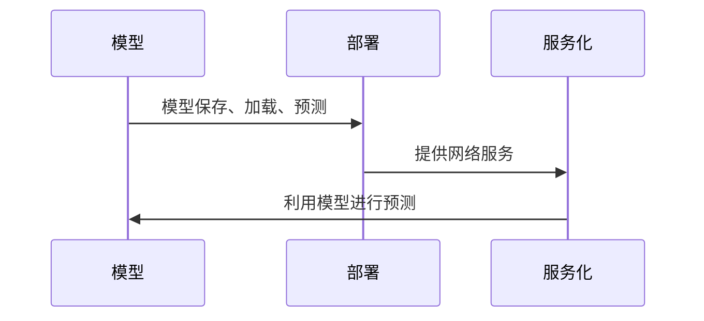

## 1.背景介绍

随着人工智能的飞速发展，模型的部署与服务化已经成为了AI项目中不可或缺的一环。然而，对于许多开发者来说，如何有效地实现模型的部署与服务化仍是一个具有挑战性的问题。这篇文章将从原理到实践，全面解析模型部署与服务化的关键环节。

## 2.核心概念与联系

**模型部署**是指将训练好的模型集成到实际的生产环境中，使其能够对实际问题进行预测。这个过程包括模型的保存、加载、预测等步骤。

**服务化**则是指将模型部署后，通过网络服务的方式提供模型预测的功能。这样，其他应用就可以通过网络请求，利用模型进行预测，而无需关心模型的具体实现细节。

模型部署与服务化是相辅相成的两个过程，部署让模型能够在实际环境中运行，服务化让模型的预测功能能够被广泛应用。



## 3.核心算法原理具体操作步骤

模型部署与服务化的步骤主要包括：模型训练、模型保存、模型加载、模型预测、服务部署、服务请求与响应。

1. **模型训练**：使用数据集对模型进行训练，得到可以进行预测的模型。
2. **模型保存**：将训练好的模型保存到文件中，以便后续加载使用。
3. **模型加载**：在需要进行预测时，从文件中加载模型。
4. **模型预测**：使用加载的模型对输入数据进行预测，得到预测结果。
5. **服务部署**：将模型预测功能封装为网络服务，并部署到服务器上。
6. **服务请求与响应**：其他应用通过网络请求，向服务发送预测请求，服务收到请求后，使用模型进行预测，然后将预测结果返回给请求方。

## 4.数学模型和公式详细讲解举例说明

在模型部署与服务化过程中，虽然不涉及复杂的数学模型和公式，但是模型的预测功能是基于模型的数学原理实现的。例如，对于线性回归模型，其预测函数可以表示为：

$$
y = \beta_0 + \beta_1x_1 + \beta_2x_2 + \cdots + \beta_nx_n
$$

其中，$y$是预测结果，$x_1,x_2,\cdots,x_n$是输入变量，$\beta_0,\beta_1,\cdots,\beta_n$是模型参数。

## 5.项目实践：代码实例和详细解释说明

接下来，我们将通过一个简单的线性回归模型的部署与服务化示例，来具体说明这个过程。

```python
# 模型训练
from sklearn.linear_model import LinearRegression
from sklearn.datasets import make_regression
X, y = make_regression(n_samples=100, n_features=1, noise=0.1)
model = LinearRegression().fit(X, y)

# 模型保存
import joblib
joblib.dump(model, 'model.pkl')

# 模型加载
model = joblib.load('model.pkl')

# 模型预测
y_pred = model.predict(X)

# 服务部署
from flask import Flask, request
app = Flask(__name__)
@app.route('/predict', methods=['POST'])
def predict():
    data = request.get_json(force=True)
    prediction = model.predict([data['input']])
    return {'prediction': prediction.tolist()}

if __name__ == '__main__':
    app.run(port=5000)
```

这段代码首先训练了一个线性回归模型，然后将模型保存到文件中。在需要进行预测时，从文件中加载模型，然后使用模型进行预测。最后，将模型的预测功能封装为一个网络服务，并部署到本地的5000端口上。

## 6.实际应用场景

模型部署与服务化在许多实际应用中都有广泛的应用，例如：

- **推荐系统**：推荐系统需要根据用户的历史行为和兴趣，预测用户可能喜欢的商品或服务。这就需要将推荐模型部署到实际的生产环境中，并通过网络服务的方式提供推荐功能。
- **风险控制**：风险控制系统需要对用户的行为进行预测，以判断是否存在风险。这就需要将风险预测模型部署到实际的生产环境中，并通过网络服务的方式提供风险预测功能。

## 7.工具和资源推荐

- **Flask**：Flask是一个轻量级的Web服务框架，可以非常方便地将模型的预测功能封装为网络服务。
- **Docker**：Docker可以将应用及其依赖环境打包成一个容器，方便应用的部署和迁移。
- **Kubernetes**：Kubernetes是一个开源的容器编排平台，可以实现服务的自动部署、扩缩容、滚动更新等功能。

## 8.总结：未来发展趋势与挑战

随着AI的应用越来越广泛，模型部署与服务化的重要性也越来越高。未来，随着云计算、边缘计算等技术的发展，模型部署与服务化将会有更多的可能性和挑战。

## 9.附录：常见问题与解答

**Q: 模型部署与服务化有什么好的工具推荐？**

A: Flask、Docker和Kubernetes是非常好的工具，可以方便地实现模型的部署与服务化。

**Q: 模型部署与服务化在实际应用中有哪些挑战？**

A: 在实际应用中，可能会遇到模型版本管理、模型更新、服务扩缩容等问题，需要有合适的解决方案。

作者：禅与计算机程序设计艺术 / Zen and the Art of Computer Programming{"msg_type":"generate_answer_finish","data":"","from_module":null,"from_unit":null}