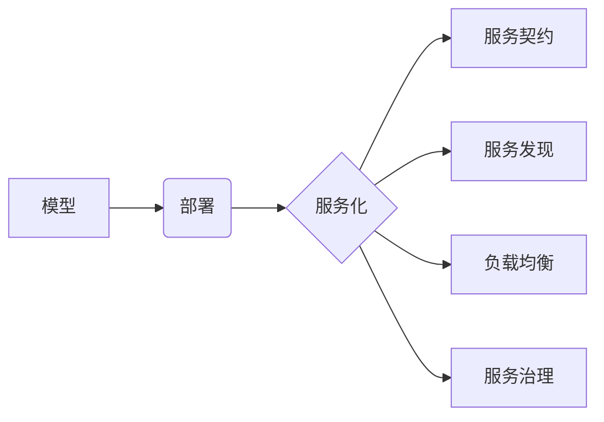

# 模型部署与服务化原理与代码实战案例讲解

## 1. 背景介绍

### 1.1 机器学习模型部署的重要性

在当今数据驱动的世界中,机器学习已经成为各个行业的关键技术。然而,训练出高性能的机器学习模型只是故事的一半。为了让这些模型在现实世界中发挥作用,我们需要将它们部署到生产环境中,并以服务的形式提供给最终用户。这就是模型部署和服务化的重要性所在。

### 1.2 模型部署面临的挑战

尽管模型部署至关重要,但它也面临着诸多挑战:

- 模型的可扩展性和高可用性
- 模型版本管理与更新
- 模型服务的监控与日志记录  
- 不同编程语言和框架之间的兼容性
- 模型安全性与隐私保护

### 1.3 模型服务化的优势

通过将机器学习模型封装成标准化的服务,我们可以获得以下优势:

- 解耦模型开发与应用开发,提高迭代效率
- 方便模型的复用和集成,促进跨团队协作
- 统一模型服务的管理与监控,保障服务质量
- 支持多种调用方式,满足不同场景需求

## 2. 核心概念与联系

### 2.1 模型
在机器学习中,模型指的是通过训练数据学习到的一组参数或规则,用于对新数据进行预测或决策。常见的模型类型包括:

- 监督学习:线性回归、逻辑回归、决策树、支持向量机等
- 非监督学习:聚类、降维、异常检测等  
- 深度学习:卷积神经网络(CNN)、循环神经网络(RNN)、Transformer等

### 2.2 部署
部署是指将训练好的模型应用到生产环境中,使其能够为最终用户提供服务的过程。部署需要考虑以下几个方面:

- 运行环境:操作系统、硬件配置、依赖库等
- 资源管理:CPU、GPU、内存、存储等计算资源的分配与调度
- 服务架构:单体应用、微服务、Serverless等  
- 自动化:持续集成与持续部署(CI/CD)、基础设施即代码(IaC)等

### 2.3 服务化
服务化是指将功能或资源封装成标准化的服务单元,通过网络API向外部提供调用。服务化的关键要素包括:

- 服务契约:定义服务的接口规范,包括输入输出格式、错误码等
- 服务发现:让服务消费者能够动态地找到可用的服务提供者
- 负载均衡:将请求均匀分发到多个服务实例上,提高服务的并发处理能力
- 服务治理:对服务的全生命周期进行管理,包括服务注册、下线、限流、降级等

### 2.4 核心概念之间的联系



从上图可以看出,模型是机器学习的核心产出,需要通过部署让其在生产环境中运行,并以服务化的方式提供给外部调用。服务化需要定义清晰的服务契约,实现服务发现和负载均衡,并对服务进行全生命周期的治理。

## 3. 核心算法原理与具体操作步骤

### 3.1 模型序列化与反序列化

为了将训练好的模型保存到磁盘,并在部署时重新加载,我们需要对模型进行序列化和反序列化。不同的机器学习框架提供了不同的序列化格式和API,例如:

- Pickle:Python内置的序列化库,可以将Python对象转换为二进制格式。但Pickle存在安全隐患,不建议用于生产环境。
- Joblib:基于Pickle的序列化库,支持大数据的高效存储与加载。适用于Scikit-learn等传统机器学习框架。  
- SavedModel:TensorFlow提供的模型序列化格式,支持跨平台和跨语言。
- ONNX:开放的神经网络交换格式,可以在不同的深度学习框架之间交换模型。

以下是使用Joblib进行模型序列化和反序列化的示例代码:

```python
from sklearn import svm
from sklearn import datasets
from joblib import dump, load

# 训练SVM模型
iris = datasets.load_iris()
clf = svm.SVC()
clf.fit(iris.data, iris.target)

# 序列化模型到磁盘
dump(clf, 'model.joblib') 

# 从磁盘反序列化模型
clf = load('model.joblib')  
```

### 3.2 在线推理

在线推理是指将部署的模型用于实时地对新数据进行预测。为了提高推理性能,我们通常采用以下优化方法:

- 模型压缩:通过量化、剪枝、知识蒸馏等技术,在保持模型精度的同时降低模型的体积和计算量。
- 模型编译:将模型转换为底层硬件(如CPU、GPU)可以直接执行的格式,减少运行时的解释开销。
- 批量推理:将多个请求合并为一个批次,提高GPU等硬件的利用率。
- 模型缓存:将常用的模型参数或中间结果缓存在内存中,减少重复计算。

以下是使用TensorFlow Serving进行在线推理的示例代码:

```python
import grpc
import tensorflow as tf
from tensorflow_serving.apis import predict_pb2
from tensorflow_serving.apis import prediction_service_pb2_grpc

# 创建gRPC通道
channel = grpc.insecure_channel('localhost:8500')
stub = prediction_service_pb2_grpc.PredictionServiceStub(channel)

# 创建请求
request = predict_pb2.PredictRequest()
request.model_spec.name = 'mnist'
request.model_spec.signature_name = 'serving_default'
request.inputs['images'].CopyFrom(tf.make_tensor_proto(image_data, shape=[1, 28, 28]))

# 发送请求并获取响应
result = stub.Predict(request, 10.0)  
```

### 3.3 模型更新

为了让部署的模型能够持续学习和进化,我们需要定期对模型进行更新。常见的模型更新方式包括:

- 全量更新:停止当前模型的服务,用新训练的模型完全替换旧模型,再重新启动服务。优点是实现简单,缺点是服务会中断。
- 增量更新:在不停止服务的情况下,动态加载新的模型版本。新版本与旧版本并存,逐步接管流量,直到完全替换旧版本。优点是服务不中断,缺点是实现复杂。
- 影子更新:新版本模型与旧版本并行运行,接收相同的请求,但只将旧版本的结果返回给用户。通过比较两个版本的预测结果,验证新版本的正确性,再进行替换。优点是风险可控,缺点是资源开销大。

以下是使用TensorFlow Serving进行模型增量更新的示例代码:

```bash
# 将新版本模型复制到模型仓库目录
cp -r new_model_dir /models/mnist 

# 修改模型配置文件
echo "model_config_list {
  config {
    name: 'mnist'
    base_path: '/models/mnist'
    model_platform: 'tensorflow'
    model_version_policy {
      specific {
        versions: 1
        versions: 2
      }
    }
  }
}" > /models/mnist/mnist_config.txt

# 重新加载模型配置
curl -X POST http://localhost:8501/v1/models/mnist/versions/2/reload
```

## 4. 数学模型和公式详解

### 4.1 线性回归

线性回归是一种基本的监督学习算法,用于拟合连续型目标变量与特征之间的线性关系。其数学模型为:

$$y = w^Tx + b$$

其中,$y$为目标变量,$x$为特征向量,$w$为权重向量,$b$为偏置项。

线性回归的目标是找到最优的$w$和$b$,使得预测值与真实值之间的均方误差最小化:

$$\min_{w,b} \frac{1}{N} \sum_{i=1}^N (y_i - w^Tx_i - b)^2$$

其中,$N$为样本数量,$y_i$为第$i$个样本的真实值,$x_i$为第$i$个样本的特征向量。

求解上述最优化问题的常用方法有:

- 正规方程:令损失函数对$w$和$b$的偏导数为0,直接求解闭式解。
- 梯度下降:迭代地沿着损失函数下降的方向更新$w$和$b$,直到收敛。

以下是使用Scikit-learn实现线性回归的示例代码:

```python
from sklearn.linear_model import LinearRegression

# 训练线性回归模型
reg = LinearRegression().fit(X_train, y_train)

# 预测测试集
y_pred = reg.predict(X_test)

# 评估模型性能  
from sklearn.metrics import mean_squared_error, r2_score
print('Mean squared error: %.2f' % mean_squared_error(y_test, y_pred))
print('Coefficient of determination: %.2f' % r2_score(y_test, y_pred))
```

### 4.2 逻辑回归

逻辑回归是一种常用的分类算法,特别适用于二分类问题。其核心思想是将特征通过Sigmoid函数映射到(0,1)区间,得到样本属于正类的概率。

逻辑回归的数学模型为:

$$p(y=1|x) = \frac{1}{1+e^{-(w^Tx+b)}}$$

其中,$p(y=1|x)$表示样本$x$属于正类的概率,$w$和$b$为待学习的参数。

逻辑回归的目标是最大化似然函数,等价于最小化交叉熵损失:

$$\min_{w,b} -\frac{1}{N} \sum_{i=1}^N [y_i \log p(y_i=1|x_i) + (1-y_i) \log (1-p(y_i=1|x_i))]$$

其中,$y_i \in {0,1}$为样本$x_i$的真实标签。

求解上述最优化问题的常用方法是梯度下降及其变种(如随机梯度下降、小批量梯度下降等)。

以下是使用Scikit-learn实现逻辑回归的示例代码:

```python
from sklearn.linear_model import LogisticRegression

# 训练逻辑回归模型
clf = LogisticRegression().fit(X_train, y_train)

# 预测测试集
y_pred = clf.predict(X_test)

# 评估模型性能
from sklearn.metrics import accuracy_score, precision_score, recall_score, f1_score  
print('Accuracy: %.2f' % accuracy_score(y_test, y_pred))
print('Precision: %.2f' % precision_score(y_test, y_pred))  
print('Recall: %.2f' % recall_score(y_test, y_pred))
print('F1 score: %.2f' % f1_score(y_test, y_pred))
```

## 5. 项目实践:模型部署与服务化

### 5.1 模型训练与序列化

首先,我们使用Scikit-learn训练一个简单的逻辑回归模型,并将其序列化到磁盘:

```python
from sklearn.datasets import load_iris
from sklearn.linear_model import LogisticRegression
from joblib import dump

# 加载数据集
X, y = load_iris(return_X_y=True)

# 训练逻辑回归模型  
clf = LogisticRegression()
clf.fit(X, y)

# 序列化模型到磁盘
dump(clf, 'model.joblib')
```

### 5.2 模型部署与服务化

接下来,我们使用Flask框架将训练好的模型部署为RESTful API服务:

```python
from flask import Flask, request, jsonify
from joblib import load

app = Flask(__name__)

# 加载模型
clf = load('model.joblib')

@app.route('/predict', methods=['POST'])
def predict():
    # 解析请求数据  
    data = request.get_json(force=True)
    X = data['X']
    
    # 调用模型进行预测
    y_pred = clf.predict(X)
    
    # 返回预测结果
    return jsonify({'y_pred': y_pred.tolist()})

if __name__ == '__main__':
    app.run(host='0.0.0.0', port=5000)
```

在上述代码中,我们定义了一个`/predict`接口,接收JSON格式的请求数据,调用模型进行预测,并将结果以JSON格式返回。

### 5.3 客户端调用

最后,我们编写一个简单的Python客户端来调用已部署的模