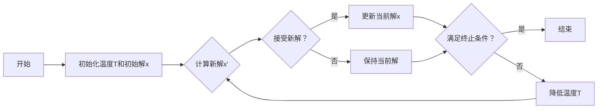

## 1.背景介绍

模拟退火算法是一种随机搜索算法，它模仿固体物质的退火过程，通过概率性的搜索策略寻找问题的全局最优解。这种算法在1983年由S. Kirkpatrick, C. D. Gelatt 和 M. P. Vecchi首次提出，被广泛应用于组合优化问题，如旅行商问题(TSP)、图的着色问题、作业调度问题等。

## 2.核心概念与联系

模拟退火算法的核心概念包括“能量”、“温度”和“冷却过程”。这些概念都源于固体物质的退火过程。

- 能量：在模拟退火算法中，解的优劣被视为其“能量”。优解对应低能量，劣解对应高能量。
- 温度：温度是模拟退火算法中的一个参数，它影响了解的接受概率。温度高时，接受劣解的概率较大；温度低时，接受劣解的概率较小。
- 冷却过程：模拟退火算法的过程就是一个不断降低温度的过程，即“冷却过程”。在冷却过程中，算法通过随机搜索和接受一些劣解，来跳出局部最优，寻找全局最优。



## 3.核心算法原理具体操作步骤

模拟退火算法的具体操作步骤如下：

1. 初始化：设定初始解x，初始温度T，温度下降系数α，终止温度T_min。
2. 对当前解x进行扰动，得到新解x'。
3. 计算新解x'的能量E'和当前解x的能量E，以及它们的能量差ΔE=E'-E。
4. 如果ΔE<0，即新解优于当前解，则接受新解；否则，以概率$exp(-\Delta E/T)$接受新解。
5. 降低温度：$T=\alpha T$。
6. 如果温度T未低于T_min，返回步骤2；否则，算法结束，输出当前解x。

## 4.数学模型和公式详细讲解举例说明

在模拟退火算法中，接受新解的概率是一个重要的概念。这个概率由Metropolis准则给出，形式为：

$$
P(\Delta E)=\left\{\begin{array}{ll}
1 & \text { if } \Delta E<0 \\
\exp \left(-\frac{\Delta E}{T}\right) & \text { if } \Delta E \geq 0
\end{array}\right.
$$

其中，$\Delta E=E'-E$是新解和当前解的能量差，T是当前的温度。这个公式表明，如果新解优于当前解（即$\Delta E<0$），则直接接受新解；否则，以一定概率接受新解，这个概率随着能量差的增大而减小，随着温度的增大而增大。

## 5.项目实践：代码实例和详细解释说明

下面是一个使用Python实现的模拟退火算法的简单例子，用于求解函数$f(x)=x^2$的最小值。

```python
import math
import random

def simulated_annealing():
    x = random.uniform(-10, 10)  # 初始解
    T = 1e5  # 初始温度
    T_min = 1e-3  # 终止温度
    alpha = 0.99  # 温度下降系数
    while T > T_min:
        x_new = x + random.uniform(-1, 1)  # 扰动当前解
        E = x**2  # 当前解的能量
        E_new = x_new**2  # 新解的能量
        delta_E = E_new - E  # 能量差
        if delta_E < 0 or math.exp(-delta_E/T) > random.random():
            x = x_new  # 接受新解
        T *= alpha  # 降低温度
    return x

print(simulated_annealing())
```

## 6.实际应用场景

模拟退火算法在诸多领域都有广泛的应用，包括：

- 旅行商问题（TSP）：在给定一组城市和每对城市之间的距离后，旅行商问题要求找出一条最短的路线，使得旅行商访问每个城市一次并回到原城市。
- 图的着色问题：给定一个无向连通图，图的着色问题要求用最少的颜色对图的所有顶点进行着色，使得任意两个相邻的顶点颜色不同。
- 作业调度问题：在作业调度问题中，有n个作业需要在m台机器上加工处理，每个作业的加工顺序已知，目标是找出一种调度方案，使得所有作业的完成时间最早。

## 7.工具和资源推荐

- Python：Python是一种高级的、动态类型的编程语言，它有丰富的科学计算和数据分析库，如NumPy、SciPy、Pandas等，非常适合实现和测试模拟退火算法。
- Matplotlib：Matplotlib是Python的一个绘图库，可以用来绘制模拟退火算法的搜索过程和结果。

## 8.总结：未来发展趋势与挑战

模拟退火算法是一种有效的随机搜索算法，它能在一定程度上避免陷入局部最优，寻找到全局最优解。然而，它也有一些挑战和局限性，例如参数设置（如初始温度、温度下降系数等）对算法性能的影响较大，且没有通用的参数设置方法；对于一些复杂的问题，算法的收敛速度可能较慢。未来的研究可以从改进算法的搜索策略、设计自适应的参数设置方法、结合其他优化算法等方向进行。

## 9.附录：常见问题与解答

Q: 模拟退火算法和遗传算法有什么区别？

A: 模拟退火算法和遗传算法都是随机搜索算法，但它们的搜索策略不同。模拟退火算法是一种基于概率的单点搜索算法，它通过随机扰动当前解来生成新解；遗传算法是一种基于群体的搜索算法，它通过选择、交叉和变异操作来生成新的解集。

作者：禅与计算机程序设计艺术 / Zen and the Art of Computer Programming