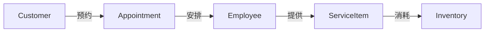

# 汽车美容管理系统详细设计与具体代码实现

## 1. 背景介绍

随着汽车保有量的不断增长,汽车美容行业也迎来了快速发展的机遇。然而,传统的汽车美容店管理模式效率低下,难以适应日益激烈的市场竞争。因此,开发一套功能完善、易于操作的汽车美容管理系统势在必行。

本文将详细阐述汽车美容管理系统的设计思路和具体实现过程,重点介绍系统架构、核心算法、数据库设计以及关键功能模块的代码实现。通过本文的学习,读者可以掌握开发类似系统的核心技术和最佳实践。

### 1.1 系统目标

汽车美容管理系统旨在实现以下目标:

- 提高汽车美容店的管理效率,减少人工操作的错误率
- 为客户提供便捷的预约、结算等服务,提升客户满意度  
- 加强库存管理,避免物料积压或短缺
- 完善员工管理,合理分配任务,提高工作积极性
- 为管理层提供数据统计和分析功能,辅助决策

### 1.2 系统功能概述

汽车美容管理系统主要包括以下功能模块:

- 客户管理:客户信息录入、查询、修改等
- 预约管理:美容项目预约、预约查询、预约提醒等
- 结算管理:美容项目结算、会员卡管理、优惠活动等
- 库存管理:物料信息录入、出入库管理、库存预警等
- 员工管理:员工信息管理、工作安排、绩效考核等
- 统计分析:营业额统计、客户消费分析、员工业绩统计等

## 2. 核心概念与联系

在汽车美容管理系统中,有几个核心概念需要理解和把握:

### 2.1 客户(Customer)

客户是汽车美容店的服务对象,系统需要记录客户的基本信息、消费记录、会员等级等。通过对客户数据的分析,可以实现精准营销和个性化服务。

### 2.2 预约(Appointment)  

预约是客户享受汽车美容服务的重要途径。系统应当支持多种预约方式(如电话预约、网上预约),并能够智能地安排预约时间,避免资源冲突。

### 2.3 美容项目(Service Item)

美容项目是汽车美容店提供的核心产品,一般包括洗车、打蜡、内饰清洁、镀晶等。系统需要维护一个标准的服务项目库,同时允许灵活定制套餐。

### 2.4 库存(Inventory)

库存管理是汽车美容店的重要环节。系统要能够准确记录各种物料(如洗车液、蜡、毛巾等)的库存量,并及时预警,避免脱销或积压。

### 2.5 员工(Employee)  

员工是汽车美容店服务的提供者。系统应支持员工信息管理,合理分配工作任务,并进行绩效考核和奖惩管理。

以上几个核心概念之间存在着紧密的联系,可用下图表示:



从图中可以看出,客户通过预约享受美容服务,预约由员工来执行,员工提供的服务项目会消耗相应的库存物料。几个概念环环相扣,缺一不可。

## 3. 核心算法原理具体操作步骤

汽车美容管理系统涉及到的核心算法主要有两个:预约时间安排算法和库存预警算法。下面详细介绍它们的原理和实现步骤。

### 3.1 预约时间安排算法

#### 3.1.1 算法原理

预约时间安排问题本质上是一个约束满足问题(CSP)。我们需要在满足以下约束条件的前提下,为每个预约安排执行时间:

1. 同一员工在同一时间只能服务一个客户
2. 一个工位在同一时间只能服务一个客户
3. 要考虑员工的工作时间(如上班时间、休息时间)
4. 连续的预约之间要留有足够的准备时间(如30分钟) 
5. 客户可指定服务时间范围,如上午、下午

在诸多约束条件下,还要尽可能提高设备和人员的利用率,以接待更多的客户。这是一个NP-hard问题,难以找到最优解,但可以使用启发式算法找到次优解。

#### 3.1.2 算法步骤

1. 将时间划分为若干个时间槽,如每30分钟一个槽。每个员工每天有若干个可用的服务时间槽。

2. 根据客户偏好,初步确定每个预约的目标时间范围(如上午、下午)。

3. 按照预约的先后顺序,逐个为预约分配时间槽。具体策略如下:
   
   3.1 优先满足客户的时间偏好。
   
   3.2 优先选择空闲员工较多的时间槽。
   
   3.3 相邻的预约间隔至少1个时间槽。
   
   3.4 如果无法满足当前预约,则尝试调整之前的预约时间,或推荐其他时段。

4. 分配完成后,检查是否有员工的工作时间超出上班时间,如果有则重新分配。  

5. 将排好的时间槽结果反馈给客户,由客户确认。

### 3.2 库存预警算法

#### 3.2.1 算法原理

库存预警的目的是及时发现物料短缺风险,避免因缺货导致服务中断。预警的关键是准确预测未来一段时间内的物料消耗量。常见的预测方法有:

- 移动平均法:取最近n个周期的消耗量平均值作为预测值
- 指数平滑法:在移动平均的基础上,赋予近期数据更高的权重
- 趋势外推法:通过历史数据拟合出消耗量的发展趋势,外推到未来

考虑到汽车美容的消耗量受季节、节假日等因素影响,本系统采用多元线性回归模型进行预测,同时结合安全库存策略,设置合理的预警阈值。

#### 3.2.2 算法步骤

1. 数据准备:收集历史数据,包括每日的物料消耗量、服务车辆数、各类服务项目的销售量、节假日等特殊时点。

2. 特征选择:分析各因素与物料消耗量的相关性,筛选出相关性较高的特征作为模型输入。

3. 数据预处理:对缺失值进行插补,对异常值进行平滑,对数据进行归一化。

4. 模型训练:将数据划分为训练集和测试集,使用多元线性回归算法训练预测模型,通过交叉验证选择最佳的模型参数。

5. 模型评估:在测试集上评估模型的预测精度,用MAE、RMSE等指标衡量。

6. 预警阈值设置:根据物料的采购周期、采购成本、缺货损失等因素,设定安全库存水平和预警阈值。

7. 滚动预测:每天更新最新的销售数据,用训练好的模型预测未来一周的消耗量,并与当前库存量比较,如低于预警阈值则发出预警通知。

## 4. 数学模型和公式详细讲解举例说明

### 4.1 多元线性回归模型

多元线性回归模型用于预测库存消耗量,其一般形式为:

$$y=\beta_0+\beta_1x_1+\beta_2x_2+...+\beta_kx_k+\epsilon$$

其中,$y$为因变量(库存消耗量),$x_1,x_2,...,x_k$为自变量(影响消耗的特征),$ beta_0,\beta_1,...,\beta_k$为模型参数,$ psilon$为随机误差。

通过最小二乘法可估计出模型参数:

$$\hat{\beta}=(X^TX)^{-1}X^Ty$$

其中,$X$为特征矩阵,$y$为目标向量。

假设我们选取服务车辆数、洗车项目销量、打蜡项目销量、是否周末等4个特征,建立的模型形式如下:

$$Sales=\beta_0+\beta_1Vehicles+\beta_2Washing+\beta_3Waxing+\beta_4Weekend+\epsilon$$

训练数据如下:

| 日期 | 服务车辆数 | 洗车项目销量 | 打蜡项目销量 | 是否周末 | 洗车液消耗量(L) |
|---|---|---|---|---|---|
| 1 | 50 | 35 | 20 | 0 | 80 |
| 2 | 80 | 60 | 30 | 1 | 130 |
| 3 | 60 | 40 | 25 | 0 | 95 |
| ... | ... | ... | ... | ... | ... |

根据训练数据估计出模型参数后,就可以用模型来预测库存消耗量了。假设某天的特征值为:

$$[Vehicles,Washing,Waxing,Weekend]=[70,55,25,0]$$

代入模型:

$$\begin{aligned}
Sales&=\beta_0+\beta_1\times70+\beta_2\times55+\beta_3\times25+\beta_4\times0\\
&=120(假设)
\end{aligned}$$

即预测当天的洗车液消耗量为120L。如果当前库存量低于120L,则需要发出预警通知。

### 4.2 预警阈值计算

预警阈值的计算需要综合考虑安全库存和采购提前期。安全库存用公式表示为:

$$SS=Z\times\sigma\times\sqrt{LT}$$

其中,$SS$为安全库存,$Z$为服务水平对应的标准差倍数(如95%服务水平对应Z=1.65),$\sigma$为需求标准差,$LT$为采购提前期。

例如,假设某物料的日需求量服从均值为100,标准差为20的正态分布,采购提前期为3天,目标服务水平为98%,则其安全库存为:

$$SS=2.05\times20\times\sqrt{3}=71(件)$$

预警阈值还需要考虑采购提前期内的需求量,可按如下公式计算:  

$$Alert=SS+\overline{D}\times LT$$

其中,$Alert$为预警阈值,$\overline{D}$为日均需求量,$LT$为采购提前期。

延续上例,假设日均需求量为100件,则预警阈值为:

$$Alert=71+100\times 3=371(件)$$

即当前库存量低于371件时,就需要发出预警通知,通知采购部门及时补货。这样可以在保证较高服务水平的同时,降低库存成本。

## 5. 项目实践:代码实例和详细解释说明

下面以库存预警模块为例,给出部分核心代码的实现。该模块基于Python语言和MySQL数据库开发。

### 5.1 数据准备

首先,从数据库中读取历史销售数据和库存数据。假设数据表结构如下:

```sql
-- 销售记录表
CREATE TABLE sales_record (
    id INT PRIMARY KEY AUTO_INCREMENT,
    date DATE,
    vehicle_num INT,
    washing_qty INT,
    waxing_qty INT,
    is_weekend BOOLEAN
);

-- 库存记录表 
CREATE TABLE inventory_record (
    id INT PRIMARY KEY AUTO_INCREMENT,
    item_id INT,
    item_name VARCHAR(50),
    date DATE,
    stock_qty INT
);
```

使用Python的pymysql库读取数据:

```python
import pymysql

# 连接数据库
db = pymysql.connect(host='localhost', user='root', password='123456', database='car_beauty')
cursor = db.cursor()

# 查询销售记录
sales_sql = "SELECT date, vehicle_num, washing_qty, waxing_qty, is_weekend FROM sales_record"
cursor.execute(sales_sql)
sales_data = cursor.fetchall()

# 查询库存记录
inventory_sql = "SELECT item_id, item_name, date, stock_qty FROM inventory_record" 
cursor.execute(inventory_sql)
inventory_data = cursor.fetchall()

# 关闭数据库连接
db.close()
```

### 5.2 数据预处理

对数据进行清洗、转换、集成等预处理操作:

```python
import pandas as pd
from sklearn.preprocessing import MinMaxScaler

# 将销售记录转换为DataFrame
sales_df = pd.DataFrame(sales_data, columns=['date','vehicle','wash','wax','weekend'])

# 将库存记录转换为DataFrame  
inventory_df = pd.DataFrame(inventory_data, columns=['item_id','item_name','date','stock