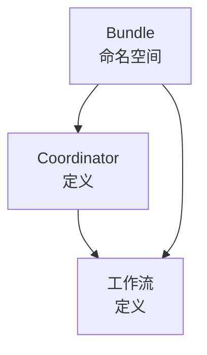

# 深入OozieBundle命名空间：有效管理你的工作流定义

## 1.背景介绍

在大数据处理领域,Apache Oozie是一个广泛使用的工作流调度系统,它用于管理Hadoop作业(如MapReduce、Pig、Hive和Sqoop等)。Oozie允许开发人员通过将多个作业组合成有向无环图(DAG)来定义工作流。然而,随着工作流数量和复杂性的增加,有效地管理和组织工作流定义变得至关重要。这就是OozieBundle命名空间发挥作用的地方。

OozieBundle命名空间是Oozie中的一个核心概念,它为工作流定义提供了一种逻辑分组和管理方式。通过将相关的工作流组织到同一个Bundle中,开发人员可以更好地管理和维护它们,从而提高效率和可维护性。

### 1.1 Oozie工作流管理的挑战

在深入探讨OozieBundle命名空间之前,让我们先了解一下在没有Bundle的情况下管理Oozie工作流所面临的一些挑战:

1. **工作流组织混乱**: 随着时间的推移,Oozie可能会包含大量的工作流定义。如果没有适当的组织结构,这些工作流就会变得难以管理和跟踪。

2. **版本控制困难**: 每个工作流定义都是一个独立的XML文件。当需要对工作流进行更改时,管理不同版本的工作流定义会变得非常困难。

3. **缺乏上下文信息**: 单个工作流定义通常缺乏足够的上下文信息,难以理解其在更大范围内的用途和重要性。

4. **协作困难**: 如果多个开发人员在同一个项目中工作,他们可能会不小心修改或覆盖彼此的工作流定义,从而导致冲突和错误。

通过引入OozieBundle命名空间,Oozie提供了一种解决这些挑战的方法。

## 2.核心概念与联系

### 2.1 Bundle

Bundle是OozieBundle命名空间中的核心概念。它是一个逻辑容器,用于组织和管理相关的工作流定义。每个Bundle都有一个唯一的名称,并包含一个或多个工作流定义。

Bundle提供了以下主要优点:

1. **逻辑分组**: 相关的工作流定义可以组织在同一个Bundle中,使它们更易于管理和维护。

2. **版本控制**: Bundle支持版本控制,因此您可以跟踪和管理Bundle的不同版本。

3. **上下文信息**: Bundle可以包含元数据,如描述、创建者和创建日期等,这些信息有助于提供上下文和背景信息。

4. **协作支持**: 多个开发人员可以在同一个Bundle上协作,而不会相互干扰或覆盖彼此的工作。

### 2.2 Coordinator和Bundle的关系

在Oozie中,Coordinator用于定义和调度重复运行的工作流。Coordinator本身也是一种工作流,但它专门用于管理周期性作业。

Coordinator和Bundle之间存在以下关系:

1. **一对多关系**: 一个Bundle可以包含多个Coordinator定义。

2. **嵌套结构**: Coordinator定义可以嵌套在Bundle中,从而使它们与相关的工作流定义保持在一起。

3. **版本控制**: Bundle的版本控制也适用于嵌套在其中的Coordinator定义。

通过将Coordinator定义嵌套在Bundle中,您可以更好地组织和管理周期性作业,并与相关的工作流定义保持一致。这种结构有助于提高可维护性和可理解性。

### 2.3 Mermaid流程图

下面的Mermaid流程图展示了Bundle、Coordinator和工作流之间的关系:



在这个流程图中,Bundle是一个逻辑容器,它可以包含一个或多个Coordinator定义和工作流定义。Coordinator定义用于定义和调度周期性作业,而工作流定义则表示实际要执行的作业。

## 3.核心算法原理具体操作步骤

### 3.1 创建Bundle

要在Oozie中创建一个新的Bundle,您需要遵循以下步骤:

1. 在Oozie的工作空间目录中创建一个新的Bundle目录。通常,Bundle目录的命名约定为`bundle-name`。

2. 在Bundle目录中创建一个`bundle.xml`文件,该文件是Bundle定义的主要入口点。

3. 在`bundle.xml`文件中定义Bundle的元数据,如名称、描述和创建者等。

4. 将相关的工作流定义(XML文件)和Coordinator定义(XML文件)添加到Bundle目录中。

以下是一个`bundle.xml`文件的示例:

```xml
<bundle-app name="my-bundle" xmlns="uri:oozie:bundle:0.2">
  <description>My Bundle Description</description>
  <creator>John Doe</creator>
  <coordinator>
    <app-path>${nameNode}/user/${user.name}/bundles/my-bundle/coordinators/coord.xml</app-path>
  </coordinator>
  <workflow>
    <app-path>${nameNode}/user/${user.name}/bundles/my-bundle/workflows/workflow.xml</app-path>
  </workflow>
</bundle-app>
```

在这个示例中,Bundle包含一个Coordinator定义(`coord.xml`)和一个工作流定义(`workflow.xml`)。`app-path`元素指定了每个定义文件的路径。

### 3.2 提交和管理Bundle

创建Bundle后,您可以使用Oozie命令行界面或Web UI将其提交到Oozie服务器。以下是使用命令行界面提交Bundle的命令:

```
oozie job -oozie http://oozie-server:11000/oozie -config /path/to/job.properties -bundle /path/to/bundle.xml
```

在这个命令中,`-oozie`选项指定Oozie服务器的URL,`-config`选项指定包含作业属性的配置文件,`-bundle`选项指定Bundle定义文件的路径。

提交Bundle后,您可以使用Oozie命令行界面或Web UI来监控和管理Bundle的执行。例如,您可以查看Bundle的状态、重新运行失败的工作流或Coordinator,甚至可以暂停或杀死正在运行的Bundle。

### 3.3 更新和版本控制Bundle

由于Bundle支持版本控制,因此您可以轻松地更新和管理Bundle的不同版本。要更新Bundle,您需要执行以下步骤:

1. 修改Bundle目录中的工作流定义、Coordinator定义或`bundle.xml`文件。

2. 在`bundle.xml`文件中更新Bundle的版本号。

3. 使用更新后的`bundle.xml`文件重新提交Bundle。

Oozie会自动检测到Bundle的新版本,并相应地更新和管理它。您可以在Oozie Web UI或命令行界面中查看Bundle的版本历史记录。

## 4.数学模型和公式详细讲解举例说明

在大数据处理领域,数学模型和公式通常用于优化作业调度和资源分配。虽然OozieBundle命名空间本身不直接涉及复杂的数学模型,但我们可以探讨一些与工作流调度相关的概念和公式。

### 4.1 工作流调度问题

工作流调度是一个经典的组合优化问题,其目标是确定一组作业的最佳执行顺序,同时满足一些约束条件,如资源限制、优先级和依赖关系等。这个问题可以用数学模型和公式来表示和求解。

假设我们有一个工作流$W$,它由$n$个作业$J_1, J_2, \ldots, J_n$组成。每个作业$J_i$都有一个执行时间$t_i$和一个优先级$p_i$。此外,作业之间可能存在依赖关系,表示某些作业必须在其他作业之前执行。

我们可以使用一个$n \times n$的矩阵$D$来表示作业之间的依赖关系,其中$D_{ij}=1$表示作业$J_i$必须在作业$J_j$之前执行,否则$D_{ij}=0$。

我们的目标是找到一种作业执行顺序,使得总执行时间最小化,同时满足所有依赖关系约束。这可以表示为以下优化问题:

$$
\begin{aligned}
\min & \sum_{i=1}^n t_i x_i \\
\text{s.t.} & \sum_{i=1}^n x_i = n \\
& x_i + x_j \leq 1 + n(1 - D_{ij}), \quad \forall i, j \\
& x_i \in \{0, 1\}, \quad \forall i
\end{aligned}
$$

其中,$x_i$是一个二进制变量,表示作业$J_i$是否被选择执行。第一个约束确保所有作业都被执行,第二个约束强制满足依赖关系。

这个问题是一个经典的旅行商问题(TSP)的变体,属于NP-hard问题,因此很难在合理的时间内找到最优解。在实践中,我们通常使用启发式算法或近似算法来求解这类问题。

### 4.2 作业调度算法

作业调度算法是一种用于解决工作流调度问题的启发式算法。这些算法通常基于一些优先级规则来确定作业的执行顺序,例如最短作业优先(SJF)、最长作业优先(LJF)、最高响应比优先(HRN)等。

以最短作业优先(SJF)算法为例,它的基本思想是每次选择执行时间最短的作业。算法的伪代码如下:

```
SJF(作业列表 jobs):
    排序 jobs 按执行时间升序
    调度列表 schedule = []
    
    while jobs 不为空:
        选择执行时间最短的作业 j
        将 j 添加到 schedule
        从 jobs 中移除 j
        
    return schedule
```

虽然SJF算法简单且易于实现,但它忽略了作业之间的依赖关系和优先级。在实际应用中,我们通常需要结合多个因素来设计更加复杂的调度算法。

## 5.项目实践:代码实例和详细解释说明

为了更好地理解OozieBundle命名空间的使用,让我们通过一个实际项目示例来演示如何创建和管理Bundle。在这个示例中,我们将创建一个Bundle,它包含一个Coordinator定义和两个工作流定义。

### 5.1 项目结构

我们的项目结构如下:

```
my-bundle/
├── bundle.xml
├── coordinators/
│   └── coord.xml
├── workflows/
│   ├── workflow1.xml
│   └── workflow2.xml
└── lib/
    └── my-workflow.jar
```

- `bundle.xml`是Bundle定义文件。
- `coordinators/`目录包含Coordinator定义文件`coord.xml`。
- `workflows/`目录包含两个工作流定义文件`workflow1.xml`和`workflow2.xml`。
- `lib/`目录包含工作流所需的JAR文件。

### 5.2 Bundle定义

`bundle.xml`文件定义了Bundle的元数据和包含的工作流和Coordinator。以下是`bundle.xml`的内容:

```xml
<bundle-app name="my-bundle" xmlns="uri:oozie:bundle:0.2">
  <description>My Bundle Example</description>
  <creator>John Doe</creator>
  <coordinator>
    <app-path>${nameNode}/user/${user.name}/bundles/my-bundle/coordinators/coord.xml</app-path>
  </coordinator>
  <workflow>
    <app-path>${nameNode}/user/${user.name}/bundles/my-bundle/workflows/workflow1.xml</app-path>
  </workflow>
  <workflow>
    <app-path>${nameNode}/user/${user.name}/bundles/my-bundle/workflows/workflow2.xml</app-path>
  </workflow>
</bundle-app>
```

在这个示例中,Bundle包含一个Coordinator定义(`coord.xml`)和两个工作流定义(`workflow1.xml`和`workflow2.xml`)。

### 5.3 Coordinator定义

`coordinators/coord.xml`文件定义了一个Coordinator,它每天运行一次,并触发两个工作流的执行。以下是`coord.xml`的内容:

```xml
<coordinator-app name="my-coordinator" frequency="${coord:days(1)}" start="2023-06-01T00:00Z" end="2023-06-30T23:59Z" timezone="UTC" xmlns="uri:oozie:coordinator:0.4">
  <controls>
    <timeout>10</timeout>
    <concurrency>1</concurrency>
    <execution>FIFO</execution>
  </controls>
  <action>
    <workflow>
      <app-path>${nameNode}/user/${user.name}/bundles/my-bundle/workflows/workflow1.xml</app-path>
    </workflow>
    <workflow>
      <app-path>${nameNode}/user/${user.name}/bundles/my-bundle/workflows/workflow2.xml</app-