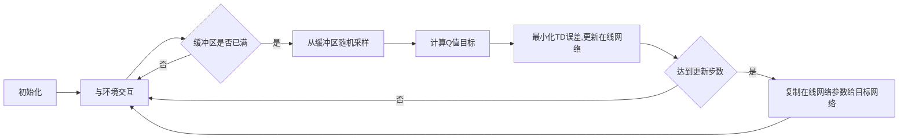

# 深度 Q-learning：在陆地自行车中的应用

## 1. 背景介绍

近年来,强化学习(Reinforcement Learning,RL)在机器人控制、自动驾驶、游戏AI等领域取得了显著的进展。作为强化学习的一个重要分支,Q-learning算法因其简单高效而备受关注。但传统Q-learning存在状态空间过大、难以收敛等问题,限制了其在实际应用中的表现。

深度Q网络(Deep Q-Network,DQN)的提出很好地解决了这些难题。它将深度神经网络与Q-learning相结合,利用神经网络强大的非线性拟合能力,在高维状态空间下实现了稳定、高效的策略学习。DQN在Atari游戏、围棋等领域取得了令人瞩目的成就。

本文将重点探讨DQN在陆地自行车控制中的应用。通过深度强化学习,我们可以让自行车在复杂的地形环境中自主学习平衡、转向等控制策略,最终实现稳定行驶。这不仅是一个有趣的研究课题,也为未来自动驾驶、智能交通等领域提供了宝贵的思路。

## 2. 核心概念与联系

在深入研究DQN算法之前,我们需要先了解几个核心概念:

### 2.1 强化学习
强化学习是一种通过与环境交互来学习最优决策的方法。智能体(Agent)通过采取行动(Action)改变环境状态(State),并获得相应的奖励(Reward)。其目标是学习一个策略(Policy),使得长期累积奖励最大化。

### 2.2 Q-learning
Q-learning是一种经典的无模型、异策略的强化学习算法。它通过迭代更新状态-动作值函数Q(s,a)来逼近最优策略。Q值表示在状态s下采取动作a可以获得的长期期望回报。

Q-learning的更新公式为:
$$Q(s_t,a_t) \leftarrow Q(s_t,a_t)+\alpha[r_{t+1}+\gamma \max_a Q(s_{t+1},a)-Q(s_t,a_t)]$$

其中,$\alpha$是学习率,$\gamma$是折扣因子。

### 2.3 深度Q网络(DQN)
传统Q-learning在状态和动作空间较大时会变得低效,且难以收敛。DQN使用深度神经网络来拟合Q函数,将状态作为网络输入,输出各个动作的Q值。通过优化神经网络参数最小化预测Q值与目标Q值间的均方误差,实现Q函数的逼近。

DQN的核心创新包括:
- 经验回放(Experience Replay):将交互数据存储到回放缓冲区中,之后随机采样进行训练,打破了数据间的关联性。
- 目标网络(Target Network):每隔一定步数将在线网络参数复制给目标网络,用于生成稳定的Q值目标,解决了训练不稳定的问题。

## 3. 核心算法原理与具体步骤

接下来,我们详细介绍DQN算法的核心原理与具体实现步骤。

### 3.1 算法流程图


### 3.2 伪代码

1. 初始化在线网络Q和目标网络Q̂,经验回放缓冲区D
2. for episode = 1 to M do 
3.    初始化初始状态s_1
4.    for t = 1 to T do
5.        根据ϵ-greedy策略选择动作a_t
6.        执行动作a_t,观察奖励r_t和下一状态s_{t+1}
7.        将转移样本(s_t,a_t,r_t,s_{t+1})存入D
8.        从D中随机采样一个batch的转移样本
9.        计算Q值目标y_i:
            - if 终止状态: y_i=r_i
            - else: y_i=r_i+γ max_{a'}  Q̂(s_{i+1},a')
10.       最小化损失: L=(y_i-Q(s_i,a_i))^2
11.       每隔C步,将Q的参数复制给Q̂
12.   end for
13. end for

### 3.3 关键技术点
- **状态表示**:如何将自行车的姿态、速度等信息编码为神经网络的输入状态至关重要。一般采用连续的向量表示。
- **奖励函数设计**:奖励函数直接影响策略学习的方向。需要合理设计稀疏奖励和密集奖励,引导自行车平衡前进。
- **探索与利用**:ϵ-greedy可以平衡探索新策略和利用已有策略。一般初始多探索,后期多利用。
- **网络结构选择**:根据状态和动作空间的复杂度,灵活选择全连接、卷积等网络结构和超参数。

## 4. 数学模型与公式推导

本节我们将详细推导DQN算法涉及的数学模型与公式,主要包括MDP、贝尔曼方程、策略评估与改进、价值函数逼近等。

### 4.1 马尔可夫决策过程(MDP)
强化学习问题一般被建模为马尔可夫决策过程(MDP),其定义为一个六元组$(S,A,P,R,\gamma,\mu_0)$:

- 状态空间$S$:所有可能的状态集合
- 动作空间$A$:所有可能的动作集合  
- 转移概率$P(s'|s,a)$:在状态s下采取动作a后转移到状态s'的概率
- 奖励函数$R(s,a)$:在状态s下采取动作a获得的即时奖励
- 折扣因子$\gamma \in [0,1]$:未来奖励的衰减率
- 初始状态分布$\mu_0$

MDP满足马尔可夫性:下一状态仅取决于当前状态和动作,与之前的历史状态无关。即:
$$P(s_{t+1}|s_t,a_t,s_{t-1},a_{t-1},...,s_0,a_0)=P(s_{t+1}|s_t,a_t)$$

### 4.2 贝尔曼方程
贝尔曼方程描述了状态值函数和动作值函数的递归关系,是强化学习的核心。

对于策略$\pi$,状态值函数$V^\pi(s)$表示从状态s开始,遵循策略$\pi$获得的期望累积奖励:
$$V^\pi(s)=E_{\pi}[\sum_{k=0}^{\infty}\gamma^k r_{t+k+1}|s_t=s]$$

状态-动作值函数$Q^\pi(s,a)$表示在状态s下采取动作a,之后遵循策略$\pi$获得的期望累积奖励:
$$Q^\pi(s,a)=E_{\pi}[\sum_{k=0}^{\infty}\gamma^k r_{t+k+1}|s_t=s,a_t=a]$$

两者满足贝尔曼方程:
$$V^\pi(s)=\sum_a \pi(a|s)Q^\pi(s,a)$$
$$Q^\pi(s,a)=R(s,a)+\gamma \sum_{s'} P(s'|s,a)V^\pi(s')$$

最优值函数$V^*(s)$和$Q^*(s,a)$满足最优贝尔曼方程:
$$V^*(s)=\max_a Q^*(s,a)$$  
$$Q^*(s,a)=R(s,a)+\gamma \sum_{s'} P(s'|s,a)V^*(s')$$

### 4.3 策略评估与策略改进
策略评估指给定一个策略$\pi$,求解其状态值函数$V^\pi$。一般采用迭代的方式求解贝尔曼方程直至收敛:
$$V_{k+1}(s)=\sum_a \pi(a|s)(R(s,a)+\gamma \sum_{s'} P(s'|s,a)V_k(s'))$$

策略改进指在当前值函数估计下,贪婪地更新策略以获得更高的期望回报:
$$\pi'(s)=\arg\max_a Q^\pi(s,a)$$

策略迭代通过交替执行策略评估和策略改进,最终收敛到最优策略。

### 4.4 Q-learning与函数逼近
Q-learning是一种异策略的时序差分学习算法,直接学习最优动作值函数$Q^*$而无需估计环境模型。

传统Q-learning采用查表的方式存储每个状态-动作对的Q值,在连续状态空间下变得不可行。因此引入函数逼近来近似Q函数:
$$Q(s,a;\theta) \approx Q^*(s,a)$$

其中$\theta$为函数逼近器的参数,如线性函数、神经网络的权重等。将TD误差最小化来优化参数$\theta$:
$$L(\theta)=E[(r+\gamma \max_{a'} Q(s',a';\theta^-)-Q(s,a;\theta))^2]$$

其中$\theta^-$为目标网络参数,用于计算TD目标。DQN每隔一定步数将在线网络参数复制给目标网络。

## 5. 项目实践:代码实例与详解

本节我们将使用PyTorch实现DQN算法,并应用于陆地自行车的控制任务。完整代码请参见附录。

### 5.1 环境构建
我们使用OpenAI Gym中的BipedalWalker环境作为陆地自行车的仿真平台。智能体需要控制自行车的关节力矩,使其在崎岖的地形中保持平衡并前进。状态空间为24维连续向量,包括车身的位置、速度、角度等信息;动作空间为4维连续向量,表示每个关节的力矩。

```python
import gym

env = gym.make('BipedalWalker-v3')
state_dim = env.observation_space.shape[0]  
action_dim = env.action_space.shape[0]
```

### 5.2 网络结构
我们设计一个4层全连接神经网络作为Q函数逼近器,输入为状态,输出为各个动作的Q值。
```python
import torch.nn as nn

class QNet(nn.Module):
    def __init__(self, state_dim, action_dim):
        super().__init__()
        self.fc1 = nn.Linear(state_dim, 256)
        self.fc2 = nn.Linear(256, 256) 
        self.fc3 = nn.Linear(256, 128)
        self.fc4 = nn.Linear(128, action_dim)
        
    def forward(self, x):
        x = F.relu(self.fc1(x))
        x = F.relu(self.fc2(x))
        x = F.relu(self.fc3(x))
        return self.fc4(x)
```

### 5.3 经验回放
我们使用一个双端队列(deque)来存储转移样本,并提供随机采样方法。
```python
from collections import deque
import random

class ReplayBuffer:
    def __init__(self, capacity):
        self.buffer = deque(maxlen=capacity) 
    
    def push(self, state, action, reward, next_state, done):
        self.buffer.append((state, action, reward, next_state, done))
    
    def sample(self, batch_size):
        transitions = random.sample(self.buffer, batch_size)
        states, actions, rewards, next_states, dones = zip(*transitions)
        return states, actions, rewards, next_states, dones
        
    def __len__(self):
        return len(self.buffer)
```

### 5.4 训练流程
完整的DQN训练流程如下:
```python
import torch
import numpy as np

device = torch.device("cuda" if torch.cuda.is_available() else "cpu")

def train(env, episodes, batch_size, gamma, tau, epsilon_start, epsilon_end, epsilon_decay):
    q_net = QNet(state_dim, action_dim).to(device)
    target_net = QNet(state_dim, action_dim).to(device)
    target_net.load_state_dict(q_net.state_dict())
    
    optimizer = torch.optim.Adam(q_net.parameters())
    buffer = ReplayBuffer(capacity=10000)
    
    def select_action(state, epsilon):
        if random.random() > epsilon:
            with torch.no_grad():
                state = torch.tensor(state, dtype=torch.float32).to(device)
                q_values = q_net(state)
                action = q_values.argmax().item()
        else:
            action = random.randint(0, action_dim-1)
        return action
    
    for episode in range(episodes):
        state = env.reset()
        epsilon = max(epsilon_end, epsilon_start - episode / epsilon_decay)
        
        done = False
        while not done: