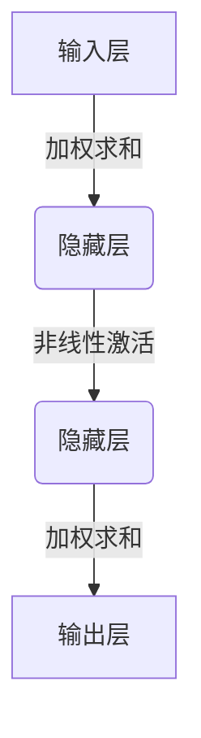

# 深度学习：AIGC的引擎

## 1. 背景介绍

### 1.1 人工智能的崛起

人工智能(AI)的发展已经成为当今科技领域最具革命性和颠覆性的力量之一。从最初的专家系统和机器学习算法,到近年来深度学习技术的飞速发展,AI已经渗透到我们生活的方方面面。无论是语音助手、自动驾驶汽车,还是医疗诊断和金融风险评估,AI都在发挥着越来越重要的作用。

### 1.2 AIGC的兴起

在AI的多个分支中,AIGC(AI生成内容)凭借其强大的创作能力和广阔的应用前景,正成为焦点。AIGC指的是利用人工智能技术自动生成文本、图像、音频、视频等多种形式的内容。其中,以深度学习为核心的生成式AI模型是AIGC的关键驱动力。

### 1.3 深度学习:AIGC的引擎

深度学习作为机器学习的一个新的研究热点,正在推动AIGC的快速发展。它通过构建深层次的神经网络模型,模拟人脑的工作原理,从大量数据中自动学习特征表示,并用于各种复杂任务的建模和预测。深度学习在自然语言处理、计算机视觉、语音识别等领域取得了突破性的进展,为AIGC提供了强大的技术支撑。

## 2. 核心概念与联系

### 2.1 神经网络

神经网络是深度学习的核心概念,它是一种受生物神经系统启发而设计的数学模型。神经网络由大量互连的节点(神经元)组成,每个节点都会对输入数据进行加权求和,再通过激活函数进行非线性转换,产生输出。通过对网络进行训练,可以自动学习到输入和输出之间的映射关系。



### 2.2 深度学习与传统机器学习的区别

与传统的机器学习算法相比,深度学习具有以下特点:

1. **自动特征提取**: 传统机器学习需要人工设计特征,而深度学习可以自动从原始数据中学习到有效的特征表示。
2. **端到端学习**: 深度学习模型可以直接从原始输入数据到最终输出进行端到端的训练,无需分阶段处理。
3. **深层次结构**: 深度学习模型通过构建深层次的网络结构,能够捕捉数据中更加抽象和复杂的模式。

### 2.3 深度学习在AIGC中的作用

深度学习是AIGC的核心驱动力,它在以下几个方面发挥着关键作用:

1. **自然语言生成(NLG)**: 基于序列到序列(Seq2Seq)模型,可以生成连贯、流畅的自然语言文本。
2. **图像生成**: 生成对抗网络(GAN)和变分自编码器(VAE)等模型可以生成逼真的图像。
3. **音频/视频生成**: 基于递归神经网络(RNN)和卷积神经网络(CNN)等模型,可以生成语音、音乐和视频内容。
4. **多模态融合**: 通过融合不同模态的数据(如文本、图像、语音等),可以生成更加丰富和多样化的内容。

## 3. 核心算法原理具体操作步骤

### 3.1 监督学习

监督学习是深度学习中最常见的范式,它的目标是从标注的训练数据中学习出一个映射函数,使得在新的输入数据上能够预测出正确的输出。常见的监督学习任务包括分类、回归等。

1. **数据准备**: 收集并准备标注好的训练数据集。
2. **模型构建**: 根据任务类型选择合适的网络结构,如全连接网络、卷积神经网络等。
3. **模型训练**: 使用优化算法(如梯度下降)不断调整网络参数,使模型在训练数据上的损失函数值最小化。
4. **模型评估**: 在保留的测试数据集上评估模型的性能指标。
5. **模型调优**: 根据评估结果,通过调整超参数、增加训练数据等方式优化模型。

### 3.2 无监督学习

无监督学习旨在直接从未标注的原始数据中发现内在的模式和结构。常见的无监督学习任务包括聚类、降维和生成模型等。

1. **数据准备**: 收集原始未标注的训练数据集。
2. **模型构建**: 选择合适的网络结构,如自编码器、生成对抗网络等。
3. **模型训练**: 使用特定的训练策略和损失函数,让模型捕捉数据的内在分布。
4. **模型评估**: 使用特定的评估指标,如重构误差、生成质量等,评估模型的性能。
5. **模型调优**: 根据评估结果,调整超参数、优化训练策略等,提高模型性能。

### 3.3 强化学习

强化学习是一种基于环境交互的学习范式,智能体通过试错不断优化其策略,以maximizeize长期的累积奖励。

1. **环境构建**: 定义智能体的状态空间、动作空间和奖励函数。
2. **模型构建**: 选择合适的模型结构,如深度Q网络(DQN)、策略梯度等。
3. **模型训练**: 通过与环境交互,根据奖励信号不断优化策略模型。
4. **模型评估**: 在测试环境中评估智能体的表现,如累积奖励、成功率等。
5. **模型调优**: 根据评估结果,调整超参数、优化探索策略等,提高智能体的性能。

### 3.4 迁移学习

迁移学习旨在将在一个领域学习到的知识迁移到另一个相关领域,以提高模型的泛化能力和学习效率。

1. **源域数据准备**: 收集并准备源领域的标注数据集。
2. **预训练模型**: 在源领域数据上训练一个初始模型。
3. **目标域数据准备**: 收集并准备目标领域的数据集。
4. **模型微调**: 在目标领域数据上对预训练模型进行微调,使其适应新的任务。
5. **模型评估**: 在目标领域的测试数据集上评估模型的性能。

## 4. 数学模型和公式详细讲解举例说明

### 4.1 神经网络模型

神经网络是深度学习的核心模型,它由多层神经元组成,每层神经元接收上一层的输出作为输入,并通过加权求和和非线性激活函数计算输出。

对于单个神经元,其数学表达式如下:

$$
y = f\left(\sum_{i=1}^{n}w_ix_i + b\right)
$$

其中:
- $x_i$是第$i$个输入
- $w_i$是第$i$个输入对应的权重
- $b$是偏置项
- $f$是非线性激活函数,如Sigmoid、ReLU等

对于整个神经网络,它由多层神经元组成,每层的输出作为下一层的输入。假设网络有$L$层,第$l$层有$N_l$个神经元,则第$l$层的输出可表示为:

$$
\mathbf{y}^{(l)} = f\left(\mathbf{W}^{(l)}\mathbf{y}^{(l-1)} + \mathbf{b}^{(l)}\right)
$$

其中:
- $\mathbf{y}^{(l)}$是第$l$层的输出向量
- $\mathbf{W}^{(l)}$是第$l$层的权重矩阵
- $\mathbf{b}^{(l)}$是第$l$层的偏置向量
- $f$是逐元素应用的非线性激活函数

通过反向传播算法,可以计算出每个权重对于损失函数的梯度,并使用优化算法(如梯度下降)不断调整网络参数,使得损失函数最小化。

### 4.2 卷积神经网络

卷积神经网络(CNN)是一种专门用于处理网格结构数据(如图像、序列等)的神经网络,它通过局部连接和权重共享的方式,大大减少了网络参数的数量,提高了计算效率。

卷积层是CNN的核心部分,它对输入数据进行卷积操作,提取局部特征。对于二维图像数据,卷积操作可以表示为:

$$
y_{i,j} = \sum_{m}\sum_{n}w_{m,n}x_{i+m,j+n} + b
$$

其中:
- $x$是输入特征图
- $w$是卷积核(滤波器)的权重
- $b$是偏置项
- $y$是输出特征图

通过堆叠多个卷积层、池化层和全连接层,CNN可以逐层提取更高级的特征表示,最终用于分类、检测等任务。

### 4.3 循环神经网络

循环神经网络(RNN)是一种专门用于处理序列数据(如文本、语音等)的神经网络。与传统的前馈神经网络不同,RNN在隐藏层之间引入了循环连接,使得网络能够捕捉序列数据中的长期依赖关系。

对于一个长度为$T$的序列$\{x_1, x_2, \dots, x_T\}$,在时间步$t$,RNN的隐藏状态$h_t$可以表示为:

$$
h_t = f\left(W_{hx}x_t + W_{hh}h_{t-1} + b_h\right)
$$

其中:
- $x_t$是时间步$t$的输入
- $h_{t-1}$是前一时间步的隐藏状态
- $W_{hx}$和$W_{hh}$分别是输入和隐藏状态的权重矩阵
- $b_h$是偏置项
- $f$是非线性激活函数

通过引入门控机制(如LSTM和GRU),RNN可以更好地捕捉长期依赖关系,广泛应用于自然语言处理、语音识别等领域。

### 4.4 生成对抗网络

生成对抗网络(GAN)是一种无监督学习模型,它由一个生成器(Generator)和一个判别器(Discriminator)组成,两者通过对抗训练的方式,生成器学习生成逼真的数据分布,判别器学习区分真实数据和生成数据。

生成器$G$的目标是生成逼真的样本$\tilde{x} = G(z)$,使得判别器无法将其与真实样本$x$区分开来。判别器$D$的目标是正确区分真实样本$x$和生成样本$\tilde{x}$。

GAN的目标函数可以表示为:

$$
\begin{aligned}
\min_G \max_D V(D, G) &= \mathbb{E}_{x \sim p_{\text{data}}(x)}[\log D(x)] \\
&+ \mathbb{E}_{z \sim p_z(z)}[\log(1 - D(G(z)))]
\end{aligned}
$$

其中:
- $p_{\text{data}}(x)$是真实数据分布
- $p_z(z)$是噪声分布,通常为高斯分布或均匀分布
- $D(x)$表示判别器对样本$x$为真实数据的概率
- $G(z)$表示生成器根据噪声$z$生成的样本

通过交替优化生成器和判别器,GAN可以学习到数据的真实分布,并生成逼真的样本,广泛应用于图像生成、语音合成等领域。

## 5. 项目实践:代码实例和详细解释说明

### 5.1 基于PyTorch的图像分类示例

在这个示例中,我们将使用PyTorch构建一个卷积神经网络,用于对CIFAR-10数据集中的图像进行分类。

1. **导入必要的库**

```python
import torch
import torchvision
import torchvision.transforms as transforms
import torch.nn as nn
import torch.optim as optim
```

2. **准备数据集**

```python
# 定义数据预处理
transform = transforms.Compose([
    transforms.ToTensor(),
    transforms.Normalize((0.5, 0.5, 0.5), (0.5, 0.5, 0.5))
])

# 加载CIFAR-10数据集
trainset = torchvision.datasets.CIFAR10(root='./data', train=True, download=True, transform=transform)
trainloader = torch.utils.data.DataLoader(trainset, batch