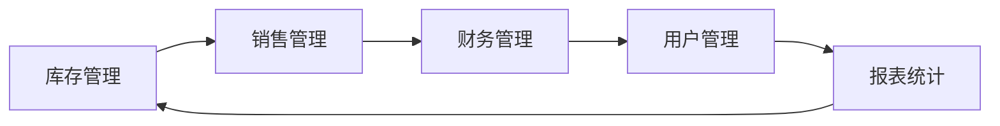

## 1.背景介绍

在当今的信息化社会，企业管理越来越依赖于计算机技术。无论是大型企业还是中小型企业，无论是生产型企业还是服务型企业，都需要一个高效的信息管理系统来提高工作效率，降低运营成本。烟花爆竹经销管理系统就是这样一种专门针对烟花爆竹行业的管理系统，它能够帮助企业实现库存管理、销售管理、财务管理等多个方面的信息化管理。

## 2.核心概念与联系

烟花爆竹经销管理系统的核心概念包括：库存管理、销售管理、财务管理、用户管理和报表统计等。这些概念之间的联系可以通过以下Mermaid流程图来表示：

## 3.核心算法原理具体操作步骤

烟花爆竹经销管理系统的核心算法主要包括：库存管理算法、销售管理算法、财务管理算法等。

库存管理算法主要负责跟踪和管理商品的库存状况。其具体操作步骤如下：

1. 当新的商品入库时，系统会自动将新入库的商品数量加入到库存中。
2. 当商品销售出库时，系统会自动将销售出库的商品数量从库存中扣除。
3. 当商品进行盘点时，系统会自动将盘点结果与库存进行对比，如果有差异，系统会自动调整库存。

销售管理算法主要负责管理商品的销售过程。其具体操作步骤如下：

1. 当客户下单购买商品时，系统会自动检查库存，如果库存充足，系统会自动将订单状态设置为“已确认”。
2. 当客户付款后，系统会自动将订单状态设置为“已付款”。
3. 当商品发货后，系统会自动将订单状态设置为“已发货”。

财务管理算法主要负责管理企