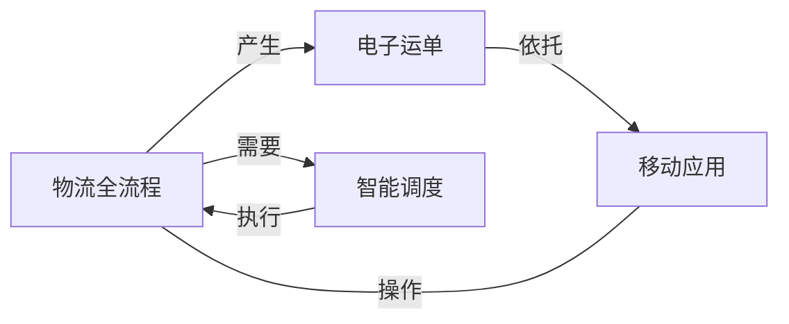

# 物流管理平台开发系统详细设计与具体代码实现

## 1. 背景介绍

随着电子商务的迅猛发展,物流行业也迎来了前所未有的机遇和挑战。高效、智能的物流管理系统成为各大物流企业的必备工具。本文将详细介绍一个完整的物流管理平台的系统设计与开发实现过程,为物流企业的信息化建设提供参考。

### 1.1 物流行业发展现状
#### 1.1.1 电商催生物流需求激增
#### 1.1.2 传统物流模式效率低下
#### 1.1.3 智能化物流成为发展趋势

### 1.2 物流管理系统的重要意义  
#### 1.2.1 提升物流运营效率
#### 1.2.2 降低物流成本
#### 1.2.3 增强客户满意度

### 1.3 物流管理平台开发目标
#### 1.3.1 实现物流全流程信息化管理
#### 1.3.2 提供智能调度与路径规划 
#### 1.3.3 支持多角色协同操作

## 2. 核心概念与关联

在物流管理平台的设计与开发中,有几个核心概念需要深入理解:

### 2.1 物流全流程
物流全流程包括:

- 揽收:从发货方收取货物 
- 分拣:对货物进行分类、打包
- 运输:通过各种运输方式将货物送达
- 派送:将货物送到收货方手中
- 签收:收货方确认收到货物

### 2.2 智能调度 
智能调度是指根据实际情况,利用算法实现车辆、人员的合理安排,提高物流效率。其中涉及:

- 订单池:所有待分配的订单
- 调度策略:车辆与订单的匹配规则
- 实时路况:考虑道路实时信息进行规划

### 2.3 电子运单  
电子运单是物流信息化的基础,包含:

- 基本信息:发货方、收货方、货物信息等
- 物流轨迹:反映货物的实时状态
- 电子签名:替代纸质签收单

### 2.4 移动应用
通过移动应用(APP)实现物流各环节的信息采集与共享,如:

- 揽收端:上门揽收,提交收货信息
- 派送端:扫描货物,上传派送状态
- 客户端:查询物流进度,确认签收

以上概念之间的关系可用下图表示:



## 3. 核心算法原理与操作步骤

智能调度是物流管理平台的核心功能之一,其中最关键的是订单分配与路径规划算法。下面以贪心算法为例,介绍其基本原理与实现步骤。

### 3.1 贪心算法原理
贪心算法的基本思路是,在每一步选择中都采取当前状态下最优的选择,从而希望结果是全局最优的。 

在订单分配场景中,我们可以每次选择一个未分配订单,将其分配给当前状态下最优的车辆。这里的"最优"可以有不同的衡量标准,如:

- 车辆当前位置距订单最近
- 车辆剩余容量最接近订单所需
- 订单分配后车辆行驶路径增量最小

### 3.2 算法步骤

1. 初始化车辆集合 $V$,订单集合 $O$
2. while $O$ 不为空:
   1. 选择 $o \in O$ 作为当前待分配订单
   2. 遍历每辆车 $v \in V$:
      1. 若 $v$ 不满足 $o$ 的容量限制,跳过
      2. 否则,计算 $v$ 分配 $o$ 后的成本 $cost(v,o)$
   3. 选择成本最小的车辆 $v^*$,将 $o$ 分配给它
   4. 从 $O$ 中移除 $o$,更新 $v^*$ 的状态
3. 输出车辆集合 $V$ 的分配结果

其中,计算车辆分配成本 $cost(v,o)$ 的方法可以有多种,一种常见做法是:
$$
cost(v,o) = \alpha \cdot d(v,o) + \beta \cdot \Delta t(v,o)
$$

- $d(v,o)$:车辆当前位置到订单取货点的距离
- $\Delta t(v,o)$:分配订单后车辆预计行驶时间的增量
- $\alpha,\beta$:距离、时间因子的权重系数

### 3.3 算法优化

以上贪心算法的缺陷在于只考虑了当前最优,未必能得到全局最优解。为此,我们可以引入一些优化措施:

- 降温接受:模拟退火思想,以一定概率接受次优解,跳出局部最优
- 禁忌搜索:记录已访问过的解,避免重复搜索
- 遗传算法:通过交叉、变异等操作,探索解空间

## 4. 数学模型与公式详解

在物流管理平台中,除了调度算法,还有一些常用的数学模型值得关注。

### 4.1 车辆路径规划模型

车辆路径规划可以抽象为经典的旅行商问题(TSP)。假设有 $n$ 个客户点,距离矩阵为 $D=[d_{ij}]$,其中 $d_{ij}$ 表示客户 $i$ 到 $j$ 的距离。我们希望找到一条最短的路径,访问每个客户点一次且仅一次。

该问题可以用整数规划模型描述:

$$
\begin{align}
\min \quad & \sum_{i=1}^n \sum_{j=1}^n d_{ij} x_{ij} \\
\text{s.t.} \quad & \sum_{i=1}^n x_{ij} = 1, \quad j=1,2,\dots,n \\
& \sum_{j=1}^n x_{ij} = 1, \quad i=1,2,\dots,n \\
& \sum_{i \in S, j \notin S} x_{ij} \ge 1, \quad \forall S \subset \{1,2,\dots,n\}, S \ne \emptyset \\
& x_{ij} \in \{0,1\}, \quad i,j=1,2,\dots,n
\end{align}
$$

其中,$x_{ij}$ 为决策变量,当车辆从 $i$ 直接到 $j$ 时取1,否则取0。目标函数即为最小化总路径长度。约束条件确保:
1. 每个客户点都被访问一次
2. 从每个客户点出发只能到达一个其他客户点
3. 防止产生子回路

### 4.2 库存管理模型

在运输过程中,中转仓库的库存管理十分重要。经典的经济订货量(EOQ)模型可以用于确定最优订货策略。假设年需求量为 $D$,单位持有成本为 $h$,单次订货成本为 $s$,则最优订货量 $Q^*$ 满足:

$$
Q^* = \sqrt{\frac{2Ds}{h}}
$$

相应地,最优订货周期 $T^*$ 为:

$$
T^* = \frac{Q^*}{D} = \sqrt{\frac{2s}{Dh}} 
$$

EOQ 模型的前提假设包括:需求速率固定、无库存短缺等,在实际应用中可以进行适当放宽。通过分析模型可知,订货量取决于订货成本与持有成本之比,订货频率则与需求量成反比。

## 5. 项目实践:代码实例与解析

下面我们以 Python 为例,演示如何实现一个简单的贪心调度算法。

```python
import numpy as np

class Order:
    def __init__(self, id, location, volume):
        self.id = id
        self.location = location  # 订单位置坐标
        self.volume = volume  # 订单货物体积
        
class Vehicle:
    def __init__(self, id, capacity, speed):
        self.id = id
        self.capacity = capacity  # 车辆最大载货量 
        self.speed = speed  # 车辆行驶速度
        self.location = None  # 车辆当前位置
        self.orders = []  # 已分配订单
        
    def add_order(self, order):
        self.orders.append(order)
        self.capacity -= order.volume
        
    def distance_to(self, order):
        return np.sqrt(np.sum((self.location - order.location)**2))
        
def greedy_dispatch(orders, vehicles):
    while orders:
        order = orders.pop(0)
        best_vehicle = None
        min_cost = float('inf')
        for vehicle in vehicles:
            if vehicle.capacity < order.volume:
                continue
            cost = vehicle.distance_to(order)
            if cost < min_cost:
                best_vehicle = vehicle
                min_cost = cost
        if best_vehicle:
            best_vehicle.add_order(order)
        else:
            print(f"Order {order.id} cannot be dispatched!")
            
    for vehicle in vehicles:
        print(f"Vehicle {vehicle.id}: {[order.id for order in vehicle.orders]}")
            
if __name__ == '__main__':
    orders = [Order(1, np.array([1,1]), 10), Order(2, np.array([3,3]), 15), Order(3, np.array([2,4]), 20)]
    vehicles = [Vehicle(1, 50, 1), Vehicle(2, 40, 1.5)]
    
    for i, vehicle in enumerate(vehicles):
        vehicle.location = np.array([i,0]) 
        
    greedy_dispatch(orders, vehicles)
```

代码解析:

1. 首先定义了 `Order` 和 `Vehicle` 两个类,分别表示订单和车辆,其中:
   - `Order` 包含了订单编号、位置、货物体积等属性
   - `Vehicle` 包含了车辆编号、载货量、速度、当前位置等属性,以及装载订单、计算与订单距离等方法
2. `greedy_dispatch` 函数实现了贪心调度的主要逻辑:
   - 每次取出一个订单,遍历所有车辆,选择距离最近且满足载货量的车辆
   - 若找到合适的车辆,则将订单分配给它;否则报错
   - 所有订单分配完成后,输出每辆车的分配结果
3. `__main__` 部分初始化了一些测试数据:
   - 3个订单,位置和体积各不相同
   - 2辆车,初始位置在 (0,0) 和 (1,0),载货量和速度不同
4. 调用 `greedy_dispatch` 函数,执行贪心调度,输出结果

可以看到,贪心算法的实现并不复杂,关键是根据具体问题选择合适的贪心策略。通过封装 `Order` 和 `Vehicle` 类,可以方便地扩展更多属性和方法。

## 6. 实际应用场景

物流管理平台可以应用于多种实际场景,例如:

### 6.1 电商物流
电商物流对时效性要求高,需要高度自动化的物流管理系统。常见的模式有:

- 自营物流:如京东物流,拥有完整的仓储、运输网络,对物流全流程进行管控
- 第三方物流:商家将物流环节外包给专业的物流公司,如顺丰、申通等
- 众包物流:利用社会闲散运力,如达达、蜂鸟即配等

### 6.2 冷链物流
冷链物流是指在恒温控制下,将温度敏感型货物从产地运输到消费地的全过程。其对运输工具、存储设施、温度监控等方面有特殊要求,需要专门的冷链物流管理系统。典型的应用有:

- 农产品冷链:从田间到餐桌,保证农产品新鲜度
- 医药冷链:疫苗、药品等对温度条件苛刻,须全程控温
- 生鲜电商:如每日优鲜、盒马鲜生等,从源头到用户家中,严格控制生鲜食品的温度和时间

### 6.3 国际物流
国际物流涉及多个国家和地区,需要协调海关、检验检疫、报关等多个环节,对物流管理系统的要求更高。常见的模式包括:

- 国际快递:如 DHL、FedEx、UPS 等,提供门到门服务
- 国际货代:负责货物的国际运输、仓储、报关等,如中外运、德邦等
- 跨境电商物流:随着跨境电商的兴起,国际物流也开始向 B2C 模式转变

不同的应用场景对物流管理平台的功