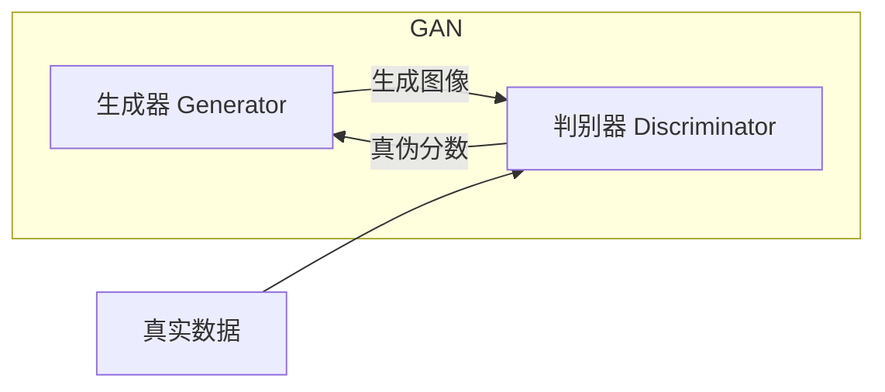
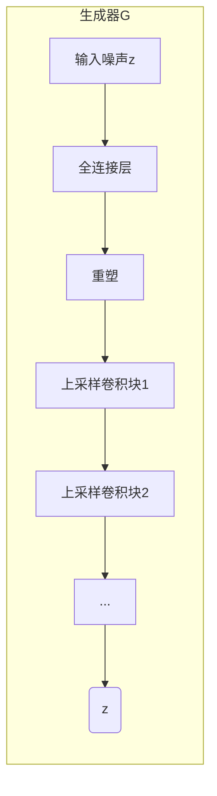
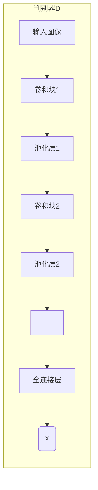
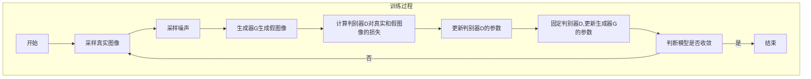

# 生成对抗网络:创造与欺骗的艺术,AI绘画的崛起

## 1.背景介绍

### 1.1 人工智能的崛起

人工智能(AI)已经成为当今科技发展的核心驱动力。从语音助手到自动驾驶汽车,AI无所不在地影响着我们的生活。在这场技术革命中,计算机视觉和图像生成是最令人兴奋的前沿领域之一。

### 1.2 图像生成的挑战

传统的图像生成方法通常依赖于手工设计的规则和特征,效果有限且缺乏创造力。随着深度学习的兴起,研究人员开始探索使用神经网络直接从数据中学习生成图像的方法。然而,这种方法面临着训练不稳定和生成图像质量低劣等挑战。

### 1.3 生成对抗网络的诞生

2014年,伊恩·古德费洛等人提出了生成对抗网络(Generative Adversarial Networks,GAN)的概念,开启了AI绘画的新纪元。GAN通过对抗训练的方式,使生成器和判别器相互竞争,从而学习生成逼真的图像。这种创新方法为图像生成领域带来了革命性的变化。

## 2.核心概念与联系

### 2.1 生成对抗网络的基本原理

生成对抗网络由两个神经网络组成:生成器(Generator)和判别器(Discriminator)。生成器的目标是生成逼真的图像,而判别器的目标是区分生成的图像和真实图像。

在训练过程中,生成器和判别器相互对抗,生成器试图欺骗判别器,而判别器则努力识别出生成的图像。通过这种对抗性训练,两个网络相互促进,最终达到生成器能够生成逼真图像,而判别器能够准确区分真伪图像的状态。



### 2.2 生成对抗网络的数学表示

生成对抗网络可以用一个minimax博弈来表示,生成器G试图最小化目标函数,而判别器D试图最大化目标函数:

$$\min_G \max_D V(D,G) = \mathbb{E}_{x\sim p_\text{data}(x)}[\log D(x)] + \mathbb{E}_{z\sim p_z(z)}[\log (1-D(G(z)))]$$

其中,$p_\text{data}$是真实数据分布,$p_z$是生成器输入的噪声分布。

### 2.3 条件生成对抗网络

条件生成对抗网络(Conditional GANs)是GAN的一种扩展,它允许在生成过程中提供额外的条件信息,例如类别标签或文本描述。这使得生成器能够根据特定条件生成相应的图像,大大扩展了GAN的应用范围。

## 3.核心算法原理具体操作步骤

### 3.1 生成器

生成器G是一个上采样卷积神经网络,它将随机噪声z作为输入,并生成与目标图像具有相同维度的张量输出G(z)。

1. 将随机噪声z输入到生成器网络。
2. 通过一系列上采样和卷积层,将低维噪声逐步转换为高维图像张量。
3. 最后一层通常使用Tanh激活函数,将像素值约束在[-1,1]范围内。



### 3.2 判别器

判别器D是一个普通的卷积神经网络分类器,它将真实图像x或生成图像G(z)作为输入,并输出一个标量D(x)或D(G(z)),表示输入图像为真实图像的概率。

1. 将真实图像x或生成图像G(z)输入到判别器网络。
2. 通过一系列卷积层和池化层提取图像特征。
3. 最后一层使用Sigmoid激活函数,输出一个0到1之间的标量,表示输入图像为真实图像的概率。



### 3.3 对抗训练过程

1. 从真实数据分布$p_\text{data}$中采样一批真实图像。
2. 从噪声分布$p_z$中采样一批随机噪声,并通过生成器G生成一批假图像。
3. 将真实图像和生成图像输入到判别器D,计算判别器的损失函数。
4. 更新判别器D的参数,使其能够更好地区分真实图像和生成图像。
5. 固定判别器D的参数,通过最小化判别器对生成图像的误判率来更新生成器G的参数。
6. 重复步骤1到5,直到模型收敛。



## 4.数学模型和公式详细讲解举例说明

### 4.1 生成对抗网络的目标函数

生成对抗网络的目标函数可以表示为:

$$\min_G \max_D V(D,G) = \mathbb{E}_{x\sim p_\text{data}(x)}[\log D(x)] + \mathbb{E}_{z\sim p_z(z)}[\log (1-D(G(z)))]$$

其中:

- $p_\text{data}$是真实数据分布
- $p_z$是生成器输入的噪声分布,通常为高斯分布或均匀分布
- $G(z)$是生成器输出的假图像
- $D(x)$是判别器对于输入图像$x$为真实图像的概率输出

这个目标函数可以分解为两个部分:

1. $\mathbb{E}_{x\sim p_\text{data}(x)}[\log D(x)]$:判别器对于真实数据的期望log概率,判别器希望这一项最大化,即对真实数据的判别概率尽可能接近1。

2. $\mathbb{E}_{z\sim p_z(z)}[\log (1-D(G(z)))]$:判别器对于生成数据的期望log(1-概率),判别器希望这一项最小化,即对生成数据的判别概率尽可能接近0。

生成器G的目标是最小化这个目标函数,即最大化$\mathbb{E}_{z\sim p_z(z)}[\log D(G(z))]$,使得生成的图像能够尽可能欺骗判别器。

判别器D的目标是最大化这个目标函数,即最大化对真实数据的判别概率,最小化对生成数据的判别概率。

通过这种对抗性训练,生成器和判别器相互促进,最终达到生成器能够生成逼真图像,而判别器能够准确区分真伪图像的状态。

### 4.2 交替训练策略

在实际训练中,通常采用交替训练的策略,即每一次迭代中分两步进行:

1. 固定生成器G的参数,仅更新判别器D的参数,使其能够更好地区分真实图像和生成图像。

   对于每个真实样本$x$,最大化$\log D(x)$;
   对于每个生成样本$G(z)$,最大化$\log(1-D(G(z)))$。

2. 固定判别器D的参数,仅更新生成器G的参数,使其能够生成更加逼真的图像,从而欺骗判别器。

   对于每个噪声输入$z$,最小化$\log(1-D(G(z)))$,即最大化$\log D(G(z))$。

通过这种交替训练,生成器和判别器相互促进,最终达到平衡状态。

### 4.3 例子:生成手写数字图像

让我们以生成手写数字图像为例,具体说明GAN的训练过程。假设我们有一个包含60000张手写数字图像的MNIST数据集,我们希望训练一个GAN模型,能够生成逼真的手写数字图像。

1. 初始化生成器G和判别器D的参数。

2. 从MNIST数据集中采样一批真实图像$x$。

3. 从高斯噪声分布$\mathcal{N}(0,1)$中采样一批随机噪声$z$,通过生成器G生成一批假图像$G(z)$。

4. 将真实图像$x$和生成图像$G(z)$输入到判别器D,计算判别器的交叉熵损失函数:

   $$\mathcal{L}_D = -\mathbb{E}_{x\sim p_\text{data}(x)}[\log D(x)] - \mathbb{E}_{z\sim p_z(z)}[\log (1-D(G(z)))]$$

5. 更新判别器D的参数,使其能够更好地区分真实图像和生成图像:

   $$\theta_D \leftarrow \theta_D - \eta \nabla_{\theta_D} \mathcal{L}_D$$

   其中$\eta$是学习率,$\nabla_{\theta_D}$是对判别器参数$\theta_D$的梯度。

6. 固定判别器D的参数,计算生成器G的损失函数:

   $$\mathcal{L}_G = -\mathbb{E}_{z\sim p_z(z)}[\log D(G(z))]$$

7. 更新生成器G的参数,使其能够生成更加逼真的图像:

   $$\theta_G \leftarrow \theta_G - \eta \nabla_{\theta_G} \mathcal{L}_G$$

8. 重复步骤2到7,直到模型收敛。

通过这种对抗训练,生成器G最终能够生成逼真的手写数字图像,而判别器D能够准确区分真伪图像。下图展示了一个经过训练的GAN模型生成的手写数字图像样本:

<p align="center">
  
</p>

可以看到,生成的图像质量非常逼真,与真实的手写数字图像几乎无法区分。这展示了GAN在图像生成任务上的强大能力。

## 5.项目实践:代码实例和详细解释说明

为了更好地理解生成对抗网络的原理和实现,我们将使用PyTorch框架构建一个简单的GAN模型,用于生成手写数字图像。

### 5.1 导入所需库

```python
import torch
import torch.nn as nn
import torch.optim as optim
from torchvision import datasets, transforms
```

### 5.2 定义生成器

生成器是一个全卷积网络,它将随机噪声作为输入,并生成与目标图像具有相同维度的张量输出。

```python
class Generator(nn.Module):
    def __init__(self, latent_dim, channels):
        super(Generator, self).__init__()
        self.latent_dim = latent_dim
        self.channels = channels

        self.main = nn.Sequential(
            nn.ConvTranspose2d(latent_dim, 512, 4, 1, 0, bias=False),
            nn.BatchNorm2d(512),
            nn.ReLU(True),
            nn.ConvTranspose2d(512, 256, 4, 2, 1, bias=False),
            nn.BatchNorm2d(256),
            nn.ReLU(True),
            nn.ConvTranspose2d(256, 128, 4, 2, 1, bias=False),
            nn.BatchNorm2d(128),
            nn.ReLU(True),
            nn.ConvTranspose2d(128, channels, 4, 2, 1, bias=False),
            nn.Ta