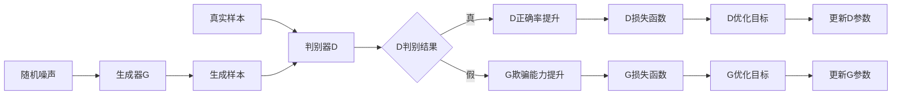

# 生成式对抗网络(GAN)原理与代码实战案例讲解

## 1. 背景介绍
### 1.1 生成式对抗网络(GAN)的起源与发展
生成式对抗网络(Generative Adversarial Networks, GANs)是近年来机器学习领域最具革命性的发明之一。它由 Ian Goodfellow 等人于2014年提出,旨在解决生成模型训练困难、生成效果不佳等问题。自诞生以来,GAN 在计算机视觉、自然语言处理等诸多领域取得了广泛应用,成为当前人工智能研究的热点之一。

### 1.2 GAN的应用场景
GAN 强大的生成能力使其在许多领域大放异彩,主要应用场景包括:

- 图像生成:利用 GAN 可以生成逼真的人脸、动物、风景等图像,在游戏、电影、设计等行业有广泛应用前景。
- 图像翻译:例如将素描图转换为彩色图像,白天街景转换为夜晚街景等。
- 图像超分辨率重建:将低分辨率图像转换为高分辨率,改善图像质量。
- 文本到图像生成:根据文本描述生成相应的图像,如将"白色的猫坐在草地上"转换为相应图像。
- 语音合成:利用 GAN 进行语音转换,如变声、语音合成等。

### 1.3 GAN的技术挑战
尽管 GAN 取得了瞩目成绩,但其发展过程中仍面临诸多技术挑战:

- 训练不稳定:GAN 采用对抗训练方式,在训练过程中容易出现梯度消失或梯度爆炸,导致训练崩溃。
- 模式崩溃:生成器可能只生成某一类相似的样本,缺乏多样性。
- 难以评估生成质量:缺乏客观的评价指标来衡量 GAN 生成样本的质量。
- 需要大量数据与算力:GAN 的训练需要海量数据和强大的硬件支持。

本文将从原理入手,深入浅出地讲解 GAN 的核心思想,并结合代码实例与应用场景,帮助读者全面掌握这一颠覆性技术。

## 2. 核心概念与联系
### 2.1 生成器与判别器
GAN 网络由两个核心部分组成:生成器(Generator)和判别器(Discriminator)。

- 生成器:接收一个随机噪声向量作为输入,将其映射到数据空间,生成与真实数据分布尽可能接近的样本。
- 判别器:接收一个样本(真实样本或生成样本),判断其是否为真实样本,对抗生成器。

生成器和判别器通常都是由神经网络构成,借助反向传播算法进行优化。

### 2.2 对抗博弈思想
GAN 的核心思想在于生成器和判别器之间的对抗博弈。

- 生成器努力生成以假乱真的样本欺骗判别器。
- 判别器则努力distinguishing between 真实样本和生成样本。 

在这个过程中,生成器和判别器的能力都在不断提升,最终达到动态平衡:生成器生成的样本与真实样本难以区分,判别器难以判定真伪。这个博弈过程可以用下面的 min-max 博弈公式表示:

$$\min_{G} \max_{D} V(D,G) = \mathbb{E}_{x \sim p_{data}(x)}[\log D(x)] + \mathbb{E}_{z \sim p_{z}(z)}[\log (1 - D(G(z)))]$$

其中,$G$ 表示生成器,$D$ 表示判别器,$p_{data}$ 表示真实数据分布,$p_z$ 表示随机噪声分布。

### 2.3 损失函数与优化目标
上述 min-max 博弈公式即为 GAN 的目标函数,生成器和判别器的优化目标为:

- 判别器:最大化 $V(D,G)$,即最大化正确区分真实样本和生成样本的概率。
- 生成器:最小化 $V(D,G)$,即最小化判别器正确判别的概率,让生成样本尽可能接近真实样本。

常用的损失函数主要有:

- 二元交叉熵损失:$L = -y\log(\hat{y}) - (1-y)\log(1-\hat{y})$
- Wasserstein 损失:$L = \mathbb{E}_{x \sim p_{data}}[f(x)] - \mathbb{E}_{z \sim p_z}[f(g(z))]$

其中,$y$ 表示样本标签(真实样本为1,生成样本为0),$\hat{y}$ 表示判别器输出的预测概率。$f$ 表示判别器最后一层去掉 sigmoid 函数。

下图展示了 GAN 的核心组件与训练流程:

## 3. 核心算法原理具体操作步骤
GAN 的训练过程可以分为以下几个关键步骤:

### 3.1 数据准备
1. 收集真实数据集,对数据进行清洗、预处理等操作。
2. 构建数据加载器,用于训练过程中批量读取数据。

### 3.2 搭建生成器与判别器网络
1. 根据任务需求设计生成器 G 和判别器 D 的网络结构。通常使用深度卷积网络作为 G 和 D 的主体。
2. 初始化 G 和 D 的网络参数。

### 3.3 设定训练超参数
1. 设置训练迭代次数、批量大小、学习率、优化器等超参数。
2. 定义 G 和 D 的损失函数,如二元交叉熵损失。

### 3.4 开始训练循环
1. 从真实数据集中采样一批真实样本。
2. 随机生成一批噪声向量,输入 G 生成一批生成样本。
3. 将真实样本和生成样本分别输入 D,得到其判别结果。
4. 计算 D 的损失:真实样本判定为真和生成样本判定为假的交叉熵损失。
5. 反向传播,更新 D 的参数,最大化其判别真伪的能力。
6. 随机生成一批噪声向量,输入 G 生成一批生成样本。
7. 将生成样本输入 D,得到其判别结果。
8. 计算 G 的损失:让 D 尽可能将 G 的生成样本判定为真实样本。
9. 反向传播,更新 G 的参数,最小化其生成样本被判别为假的概率。
10. 重复步骤4-9,直到模型收敛或达到预设的迭代次数。

### 3.5 模型评估与应用
1. 使用训练好的 G 生成样本,评估生成质量。常用的指标有 Inception Score(IS)和 Frechet Inception Distance(FID)。
2. 将训练好的 G 应用到实际任务中,如图像生成、图像翻译等。

## 4. 数学模型和公式详细讲解举例说明
### 4.1 GAN的目标函数
前面提到,GAN 的优化目标可以表示为一个 min-max 博弈问题:

$$\min_{G} \max_{D} V(D,G) = \mathbb{E}_{x \sim p_{data}(x)}[\log D(x)] + \mathbb{E}_{z \sim p_{z}(z)}[\log (1 - D(G(z)))]$$

这个公式可以这样理解:

- 判别器 D 的目标是最大化 $V(D,G)$,即最大化正确判别真实样本和生成样本的概率。
  - 对于真实样本 $x$,D 输出的概率 $D(x)$ 越接近1越好。
  - 对于生成样本 $G(z)$,D 输出的概率 $D(G(z))$ 越接近0越好。
- 生成器 G 的目标是最小化 $V(D,G)$,即最小化 D 正确判别的概率。
  - 对于生成样本 $G(z)$,G 希望 D 输出的概率 $D(G(z))$ 尽可能接近1。

举个例子,假设我们要训练一个 GAN 来生成手写数字图像:

- 真实样本 $x$ 来自 MNIST 数据集,是真实的手写数字图像。
- 生成样本 $G(z)$ 由生成器 G 生成,是尽可能模仿真实手写数字的图像。
- 判别器 D 接收一张图像,输出一个0到1之间的概率值,表示它认为这张图像是真实的概率。
- D 的目标是对于真实的 MNIST 图像,输出尽可能大的概率;对于 G 生成的图像,输出尽可能小的概率。
- G 的目标是让 D 尽可能将其生成的图像判定为真实图像。

通过这个博弈过程,G 和 D 的能力都在不断提升,最终 G 可以生成以假乱真的手写数字图像。

### 4.2 GAN的损失函数
GAN 的原始论文中使用了二元交叉熵损失函数:

- 判别器损失:

$$L_D = -\mathbb{E}_{x \sim p_{data}}[\log D(x)] - \mathbb{E}_{z \sim p_z}[\log(1-D(G(z)))]$$

- 生成器损失:

$$L_G = -\mathbb{E}_{z \sim p_z}[\log D(G(z))]$$

这里,$L_D$ 包含两项:

- $-\mathbb{E}_{x \sim p_{data}}[\log D(x)]$:对于真实样本 $x$,最大化 $D(x)$,让 D 尽可能将其判定为真。
- $-\mathbb{E}_{z \sim p_z}[\log(1-D(G(z)))]$:对于生成样本 $G(z)$,最大化 $1-D(G(z))$,让 D 尽可能将其判定为假。

$L_G$ 的目标是最小化 $-\log D(G(z))$,即让 D 尽可能将 G 生成的样本判定为真。

以手写数字生成为例:

- 对于真实的 MNIST 图像 $x$,D 输出 $D(x)=0.9$,则 $L_D$ 的第一项为 $-\log 0.9 \approx 0.105$。
- 对于 G 生成的图像 $G(z)$,D 输出 $D(G(z))=0.3$,则 $L_D$ 的第二项为 $-\log(1-0.3) \approx 0.357$。
- 此时判别器损失 $L_D \approx 0.105 + 0.357 = 0.462$。D 会调整参数以最小化该损失,提升判别真伪的能力。
- 假设 D 目前将 G 生成的图像 $G(z)$ 判定为真实的概率为0.3,则生成器损失 $L_G = -\log 0.3 \approx 1.204$。G 会调整参数以最小化该损失,让生成的图像更加逼真。

### 4.3 WGAN的损失函数
原始 GAN 使用二元交叉熵损失,训练过程中容易出现梯度消失、训练崩溃等问题。WGAN (Wasserstein GAN) 对判别器最后一层去掉了 sigmoid 函数,使用 Wasserstein 距离作为损失函数,改善了训练稳定性。

- 判别器损失(又称评论家 critic):

$$L_D = -\mathbb{E}_{x \sim p_{data}}[D(x)] + \mathbb{E}_{z \sim p_z}[D(G(z))]$$

- 生成器损失:

$$L_G = -\mathbb{E}_{z \sim p_z}[D(G(z))]$$

相比原始 GAN,WGAN 的损失函数有以下变化:

- 判别器 D 不再输出概率,而是输出一个实数值,称为评分 (score)。
- 判别器损失 $L_D$ 的目标是最大化真实样本的评分和生成样本的评分之差。
- 生成器损失 $L_G$ 的{"msg_type":"generate_answer_finish","data":"","from_module":null,"from_unit":null}