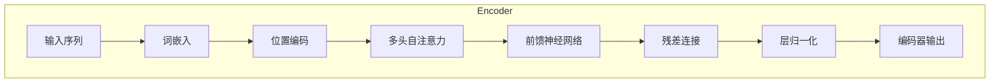
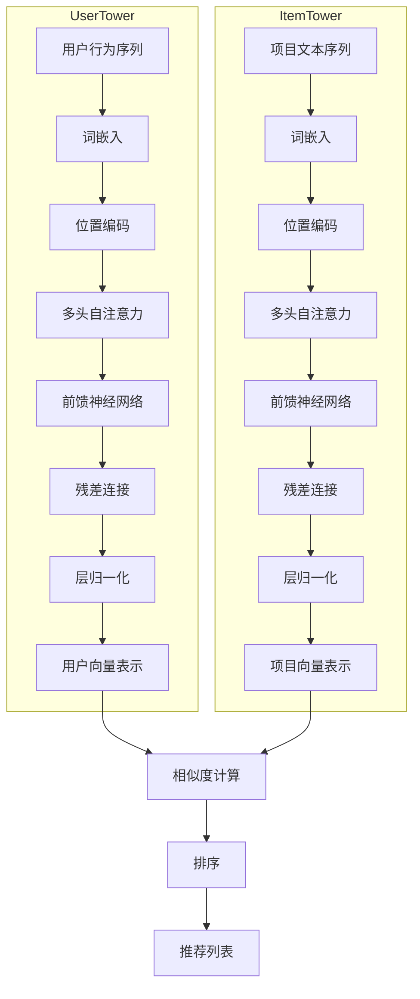

# 用Transformer实现智能推荐系统

## 1.背景介绍

### 1.1 推荐系统的重要性

在当今信息时代,我们每天都会接触到大量的数据和信息。然而,如何从海量信息中找到自己感兴趣的内容,一直是一个巨大的挑战。推荐系统应运而生,旨在帮助用户发现有价值的信息和产品。

推荐系统广泛应用于电子商务、社交媒体、在线视频、新闻等领域,为用户提供个性化的内容推荐。一个好的推荐系统不仅能提高用户体验,还可以带来巨大的商业价值。例如,亚马逊的个性化推荐系统可以增加用户购买率,为公司创造数十亿美元的收入。

### 1.2 推荐系统的发展历程

早期的推荐系统主要基于协同过滤算法,利用用户之间的相似性进行推荐。随着深度学习的兴起,基于神经网络的推荐系统逐渐成为主流。传统的矩阵分解、因子分解机等模型被广泛应用。

近年来,Transformer模型在自然语言处理领域取得了巨大成功,也开始被应用于推荐系统。Transformer能够有效捕捉序列数据中的长期依赖关系,并通过自注意力机制学习输入特征之间的相关性,从而提高推荐系统的准确性。

## 2.核心概念与联系

### 2.1 Transformer模型

Transformer是一种全新的基于注意力机制的序列到序列模型,由编码器(Encoder)和解码器(Decoder)组成。它不依赖于循环神经网络(RNN)和卷积神经网络(CNN),而是完全基于注意力机制来捕捉输入和输出之间的全局依赖关系。

Transformer的核心是多头自注意力机制,它允许模型同时关注输入序列的不同位置,捕捉长期依赖关系。此外,Transformer还引入了位置编码,使模型能够学习序列中每个位置的重要性。

### 2.2 Transformer在推荐系统中的应用

将Transformer应用于推荐系统,主要有以下两种思路:

1. **序列化输入**:将用户的历史行为(如浏览记录、购买记录等)序列化为输入,送入Transformer编码器。编码器输出的向量表示用户的兴趣,可用于预测用户对某个项目的偏好。

2. **双塔模型**:将用户和项目分别送入两个Transformer编码器,获得用户和项目的向量表示。然后计算两个向量的相似度,作为排序分数进行排序和推荐。

无论采用哪种方式,Transformer模型都能够有效捕捉用户行为序列和项目特征之间的高阶交互,提高推荐系统的准确性。

## 3.核心算法原理具体操作步骤 

### 3.1 Transformer编码器(Encoder)

Transformer编码器的主要组成部分包括:

1. **词嵌入(Word Embeddings)**: 将输入序列中的每个元素(如单词或项目ID)映射为向量表示。

2. **位置编码(Positional Encoding)**: 因为Transformer没有捕捉序列顺序的能力,所以需要添加位置编码,使模型能够根据元素在序列中的相对位置或绝对位置来编码其重要性。

3. **多头自注意力机制(Multi-Head Attention)**: 自注意力机制允许输入序列中的每个元素都关注与其相关的元素,捕捉长期依赖关系。多头注意力机制可以从不同的表示子空间关注不同的位置,增强模型的表达能力。

4. **前馈神经网络(Feed-Forward Network)**: 对每个位置的向量表示进行更深层次的非线性变换,捕捉更复杂的特征。

5. **层归一化(Layer Normalization)** 和 **残差连接(Residual Connection)**: 用于加速训练收敛并缓解梯度消失问题。

编码器是由多个相同的层堆叠而成,每一层都包含上述几个子模块。输入序列在编码器层中传播,最终输出一个向量序列,作为对输入序列的编码表示。

### 3.2 基于序列化输入的推荐系统

对于基于序列化输入的推荐系统,我们将用户的历史行为序列(如浏览记录、购买记录等)作为输入,送入Transformer编码器。编码器输出的向量表示用户的兴趣,可用于预测用户对某个项目的偏好。

具体步骤如下:

1. **数据预处理**: 将用户的历史行为数据序列化,构建输入序列。同时将项目ID转换为向量表示(如使用项目词嵌入)。

2. **输入Transformer编码器**: 将用户行为序列输入编码器,获得用户兴趣的向量表示。

3. **计算用户-项目相似度**: 对于每个候选项目,计算其向量表示与用户兴趣向量的相似度(如点积)。

4. **生成推荐列表**: 根据用户-项目相似度对候选项目进行排序,选取相似度最高的项目作为推荐列表。

该模型的优点是能够直接从用户的历史行为序列中学习用户兴趣,并且可以自然地融入序列行为数据。但缺点是对于新项目,由于没有足够的用户交互数据,无法获得项目的向量表示,会影响推荐质量。

### 3.3 双塔推荐模型

双塔推荐模型将用户和项目分别送入两个Transformer编码器,分别获得用户和项目的向量表示。然后计算两个向量的相似度,作为排序分数进行排序和推荐。

具体步骤如下:

1. **输入处理**: 将用户历史行为数据序列化,作为用户塔的输入;将项目的文本描述(如标题、简介等)序列化,作为项目塔的输入。

2. **双塔编码**: 用户序列和项目序列分别输入到两个Transformer编码器,获得用户向量和项目向量。

3. **计算相似度**: 对于每个用户-项目对,计算用户向量和项目向量的相似度(如点积)作为排序分数。

4. **生成推荐列表**: 根据排序分数对候选项目进行排序,选取分数最高的项目作为推荐列表。

双塔模型的优点是能够同时捕捉用户兴趣和项目特征,并通过计算相似度来匹配用户和项目。这种方式也适用于冷启动问题,即对于新项目,只要有文本描述,就可以通过项目塔获得向量表示。缺点是需要额外的项目数据(如文本描述),并且用户和项目向量是分开学习的,可能无法充分捕捉用户-项目交互。

## 4.数学模型和公式详细讲解举例说明

### 4.1 自注意力机制(Self-Attention)

自注意力机制是Transformer的核心,它允许输入序列中的每个元素都关注与其相关的元素,捕捉长期依赖关系。给定一个输入序列 $X = (x_1, x_2, \dots, x_n)$,自注意力机制计算每个元素的注意力权重,然后根据权重对其他元素进行加权求和,得到该元素的注意力表示。

对于序列中的第 $i$ 个元素 $x_i$,其注意力表示 $z_i$ 计算如下:

$$z_i = \sum_{j=1}^{n}\alpha_{ij}(x_jW^V)$$

其中, $\alpha_{ij}$ 是 $x_i$ 对 $x_j$ 的注意力权重, $W^V$ 是一个可学习的值向量。注意力权重 $\alpha_{ij}$ 的计算方式如下:

$$\alpha_{ij} = \frac{exp(e_{ij})}{\sum_{k=1}^{n}exp(e_{ik})}$$

$$e_{ij} = \frac{(x_iW^Q)(x_jW^K)^T}{\sqrt{d_k}}$$

这里, $W^Q$ 和 $W^K$ 分别是可学习的查询向量和键向量, $d_k$ 是缩放因子,用于防止点积的值过大导致梯度消失。

上述过程描述了单头自注意力机制。在实际应用中,通常使用多头自注意力机制,它可以从不同的表示子空间关注不同的位置,增强模型的表达能力。多头自注意力的计算过程如下:

1. 对输入序列 $X$ 进行线性投影,得到查询 $Q$、键 $K$ 和值 $V$ 矩阵。
2. 将 $Q$、$K$、$V$ 分别分成 $h$ 个头,每个头对应一个子空间。
3. 对每个头分别计算自注意力,得到 $h$ 个注意力表示。
4. 将 $h$ 个注意力表示拼接,再进行线性变换,得到最终的多头自注意力表示。

多头自注意力机制的数学表示如下:

$$MultiHead(Q, K, V) = Concat(head_1, \dots, head_h)W^O$$

$$head_i = Attention(QW_i^Q, KW_i^K, VW_i^V)$$

其中, $W_i^Q$、$W_i^K$、$W_i^V$ 和 $W^O$ 都是可学习的线性变换矩阵。

通过自注意力机制,Transformer能够有效地捕捉输入序列中元素之间的长期依赖关系,为推荐系统提供更准确的用户兴趣和项目特征表示。

### 4.2 位置编码(Positional Encoding)

由于Transformer没有像RNN那样的递归结构,无法直接捕捉序列的顺序信息。因此,需要在输入序列中引入位置编码,使模型能够根据元素在序列中的相对位置或绝对位置来编码其重要性。

位置编码是一个向量,其维度与词嵌入向量相同,用于对每个位置进行编码。对于序列中的第 $i$ 个位置,其位置编码 $PE(pos, 2i)$ 和 $PE(pos, 2i+1)$ 分别计算如下:

$$PE(pos, 2i) = sin(pos / 10000^{2i/d_{model}})$$

$$PE(pos, 2i+1) = cos(pos / 10000^{2i/d_{model}})$$

其中, $pos$ 是位置索引, $i$ 是维度索引, $d_{model}$ 是向量维度。

位置编码向量与词嵌入向量相加,作为Transformer的输入。通过这种方式,模型可以学习到每个位置的重要性,并捕捉序列的顺序信息。

### 4.3 相似度计算

在推荐系统中,我们需要计算用户向量和项目向量之间的相似度,作为排序分数。常用的相似度计算方法包括:

1. **内积(Dot Product)**: 计算两个向量的内积,内积越大,表示两个向量越相似。

   $$sim(u, i) = u^T i$$

2. **