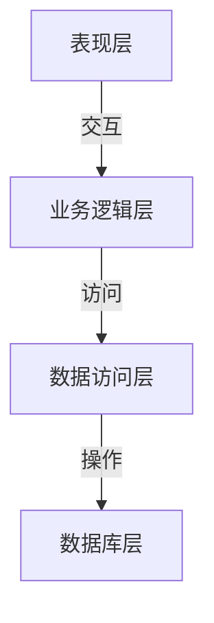

# 电子书店管理系统详细设计与具体代码实现

## 1. 背景介绍

随着互联网技术的快速发展和电子商务的兴起,线上购物已经成为人们生活中不可或缺的一部分。电子书店作为一种特殊的电子商务形式,为读者提供了方便、快捷的购书渠道。设计和实现一个高效、安全、易用的电子书店管理系统,对于满足用户需求、提高用户体验、增强企业竞争力至关重要。

### 1.1 电子书店的发展现状

电子书店的兴起源于互联网时代的到来,随着网络基础设施的完善和移动互联网的普及,电子书店获得了前所未有的发展机遇。与传统实体书店相比,电子书店具有无需实体店面、存货量大、选择范围广、方便快捷等优势。目前,亚马逊、谷歌、当当等知名公司已在电子书店领域占据重要地位。

### 1.2 电子书店管理系统的重要性

电子书店管理系统是电子书店运营的核心,涵盖了图书信息管理、订单处理、库存管理、支付系统集成、会员管理等多个模块。一个高质量的电子书店管理系统可以:

- 提高运营效率,降低人力成本
- 优化用户体验,增强用户粘性
- 保证数据安全,防止信息泄露
- 实现精准营销,提升销售业绩
- 支持系统扩展,适应未来发展需求

因此,设计和实现一套完善的电子书店管理系统,对于企业的长远发展至关重要。

## 2. 核心概念与联系

在深入探讨电子书店管理系统的设计与实现之前,我们需要了解一些核心概念及其之间的关系。

### 2.1 系统架构

系统架构是指系统的整体框架和组成结构,通常包括以下几个层面:

- **表现层(Presentation Layer)**: 负责与用户交互,展示数据和接收用户输入。通常采用 Web 界面或移动应用程序。
- **业务逻辑层(Business Logic Layer)**: 处理系统的核心业务逻辑,如订单处理、库存管理等。
- **数据访问层(Data Access Layer)**: 负责与数据库进行交互,执行数据查询、插入、更新和删除操作。
- **数据库层(Database Layer)**: 存储系统的所有数据,如图书信息、订单记录、用户信息等。

这些层次之间通过接口和服务相互调用和交互,构成了完整的系统架构。合理的架构设计有利于提高系统的可维护性、可扩展性和安全性。

### 2.2 核心模块

电子书店管理系统通常包含以下核心模块:

1. **图书信息管理模块**: 维护图书的基本信息、分类、库存等数据。
2. **订单管理模块**: 处理用户下单、支付、发货等流程。
3. **库存管理模块**: 跟踪图书库存变化,及时补货。
4. **会员管理模块**: 管理用户账号、积分、优惠券等信息。
5. **支付模块**: 集成第三方支付平台,处理在线支付。
6. **营销模块**: 实现促销活动、精准营销等功能。
7. **后台管理模块**: 提供系统配置、数据统计分析等管理功能。

这些模块相互协作,共同构成了完整的电子书店管理系统。合理划分模块有利于提高系统的可维护性和可扩展性。

### 2.3 关键技术

实现电子书店管理系统需要运用多种技术,包括但不限于:

- **Web 开发技术**: HTML、CSS、JavaScript、框架(React、Angular、Vue 等)
- **服务器端技术**: Java、Python、Node.js、Web 框架(Spring、Django、Express 等)
- **数据库技术**: 关系型数据库(MySQL、PostgreSQL 等)、NoSQL 数据库(MongoDB、Redis 等)
- **系统集成技术**: 消息队列(RabbitMQ、Kafka 等)、分布式系统、微服务架构
- **安全技术**: 身份认证、授权、加密、防火墙等
- **DevOps 技术**: 持续集成、持续交付、容器化(Docker)、云计算等

这些技术相互配合,共同实现了电子书店管理系统的各项功能和非功能需求。

## 3. 核心算法原理具体操作步骤  

在电子书店管理系统中,有几个核心算法和操作步骤值得重点关注。

### 3.1 推荐算法

推荐算法是电子商务系统中一个非常重要的功能,它可以根据用户的历史浏览记录、购买记录和其他用户的行为数据,为用户推荐感兴趣的图书。常见的推荐算法包括:

1. **协同过滤算法(Collaborative Filtering)**

   - **基于用户(User-based)**: 找到与目标用户有相似兴趣的其他用户,并推荐这些用户喜欢的图书。
   - **基于物品(Item-based)**: 找到与目标图书相似的其他图书,并推荐给用户。

2. **基于内容的推荐(Content-based)**

   分析图书的内容特征(主题、作者、流派等),并推荐与用户历史兴趣相似的图书。

3. **混合推荐算法(Hybrid)**

   将协同过滤和基于内容的推荐相结合,发挥各自的优势。

算法的具体实现步骤因算法而异,但通常包括数据预处理、相似度计算、评分预测和结果排序等环节。

### 3.2 库存管理算法

合理的库存管理对于电子书店的正常运营至关重要。常见的库存管理算法包括:

1. **经济订货量模型(Economic Order Quantity, EOQ)**

   确定每次订货的最佳数量,以平衡库存成本和订货成本。

2. **周期订货模型(Periodic Order Model)**

   按固定周期检查库存,当库存低于一定水平时补货。

3. **再订货点模型(Reorder Point Model)**

   设置一个再订货点,当库存降至该点时发出补货请求。

4. **ABC 分类管理**

   根据图书的重要性和价值,将其划分为 A、B、C 三类,对不同类别采取不同的管理策略。

这些算法需要考虑多种因素,如需求波动、供应商交货周期、库存成本等,并通过数学建模和优化求解最佳解。

### 3.3 支付流程

支付是电子商务系统中最关键的环节之一,需要保证安全性和可靠性。典型的支付流程如下:

1. 用户在网站下单,生成订单信息。
2. 系统调用第三方支付平台的支付接口,跳转到支付页面。
3. 用户在支付页面完成支付,支付平台通知系统支付结果。
4. 系统根据支付结果更新订单状态,并执行相应操作(如发货、积分处理等)。
5. 支付平台将支付结果通知给商户系统,完成整个支付流程。

在实现过程中,需要注意支付安全性、防止重复支付、支付异常处理等问题。通常采用消息队列、事务补偿等机制来保证支付的可靠性和一致性。

### 3.4 会员积分管理

会员积分是电子书店吸引用户、提高粘性的重要手段。会员积分管理的核心算法包括:

1. **积分计算**

   根据用户的消费金额、购买商品类型等,计算应获得的积分。

2. **积分兑换**

   用户可以使用积分兑换商品、优惠券等,需要制定合理的兑换策略。

3. **积分过期**

   为防止积分无限期累积,可设置积分有效期,过期作废。

4. **积分转移**

   允许用户在一定范围内转移或赠送积分。

这些算法需要结合具体的业务规则进行设计和实现,同时要考虑防作弊、数据一致性等问题。

## 4. 数学模型和公式详细讲解举例说明

在电子书店管理系统的设计和实现中,有一些重要的数学模型和公式需要引入。

### 4.1 相似度计算

在推荐算法中,计算用户或物品之间的相似度是一个关键步骤。常用的相似度计算方法包括:

1. **欧几里得距离(Euclidean Distance)**

   $$d(x, y) = \sqrt{\sum_{i=1}^{n}(x_i - y_i)^2}$$

   其中 $x$、$y$ 分别表示两个 $n$ 维向量,距离越小,相似度越高。

2. **余弦相似度(Cosine Similarity)**

   $$\text{sim}(x, y) = \frac{x \cdot y}{\|x\| \|y\|} = \frac{\sum_{i=1}^{n}x_i y_i}{\sqrt{\sum_{i=1}^{n}x_i^2} \sqrt{\sum_{i=1}^{n}y_i^2}}$$

   计算两个向量的夹角余弦值,余弦值越大,相似度越高。

3. **皮尔逊相关系数(Pearson Correlation Coefficient)**

   $$r_{xy} = \frac{\sum_{i=1}^{n}(x_i - \bar{x})(y_i - \bar{y})}{\sqrt{\sum_{i=1}^{n}(x_i - \bar{x})^2} \sqrt{\sum_{i=1}^{n}(y_i - \bar{y})^2}}$$

   度量两个变量之间的线性相关程度,值越接近 1 或 -1,相关性越强。

不同的相似度计算方法适用于不同的场景,需要根据具体数据特征进行选择和调优。

### 4.2 经济订货量模型

在库存管理中,经济订货量模型(EOQ)是一个经典模型,用于确定每次订货的最佳数量。模型的基本公式如下:

$$EOQ = \sqrt{\frac{2DC}{H}}$$

其中:

- $D$ 表示年度需求量
- $C$ 表示每次订货的固定成本
- $H$ 表示每单位商品的年度库存持有成本

该模型旨在平衡订货成本和库存持有成本,使总成本最小化。在实际应用中,还需要考虑安全库存、缺货成本等因素,对模型进行适当修正。

### 4.3 营销策略优化

在营销模块中,我们可以借助数学模型来优化营销策略,提高营销效果。例如,在促销活动中,可以使用线性规划模型来确定最佳的折扣组合:

$$\begin{aligned}
\max \quad & \sum_{i=1}^{n}p_i x_i \\
\text{s.t.} \quad & \sum_{i=1}^{n}c_i x_i \leq B \\
& 0 \leq x_i \leq 1, \quad i = 1, 2, \ldots, n
\end{aligned}$$

其中:

- $n$ 表示商品种类数
- $p_i$ 表示第 $i$ 种商品的利润
- $c_i$ 表示第 $i$ 种商品的成本
- $x_i$ 表示第 $i$ 种商品是否参与促销(0 或 1)
- $B$ 表示促销活动的总预算

目标函数是最大化总利润,约束条件包括预算限制和决策变量的取值范围。通过求解这个线性规划问题,我们可以得到最佳的促销商品组合。

上述只是数学模型在电子书店管理系统中的一些应用示例,在实际开发过程中,还可以引入更多的数学工具,如机器学习、优化理论等,为系统设计提供理论支撑。

## 5. 项目实践: 代码实例和详细解释说明

在上一节中,我们介绍了电子书店管理系统的一些核心算法和数学模型。接下来,我们将通过具体的代码实例,展示如何将这些理论应用到实际项目开发中。

为了便于说明,我们将使用 Java 作为编程语言,Spring Boot 作为 Web 框架,MySQL 作为数据库。当然,您也可以选择其他语言和框架进行开发。

### 5.1 系统架构和核心模块

我们将采用经典的三层架构设计,包括表现层(Web 层)、业务逻辑层(Service 层)和