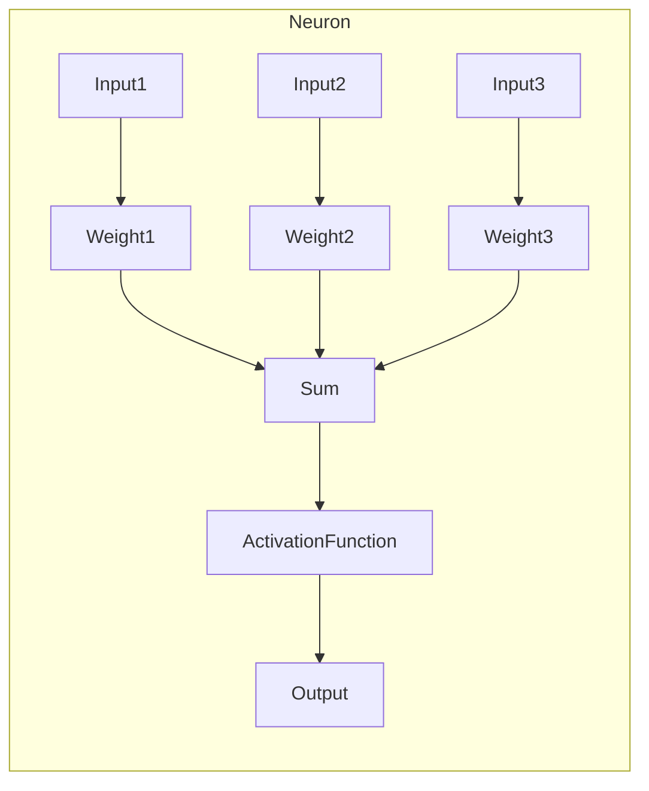
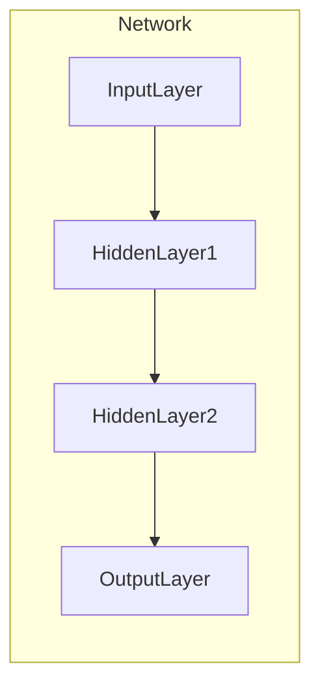
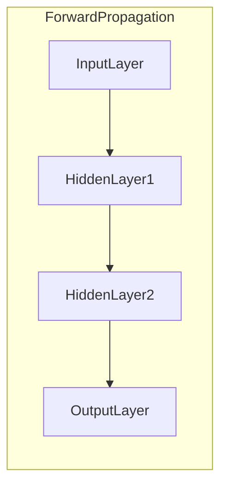
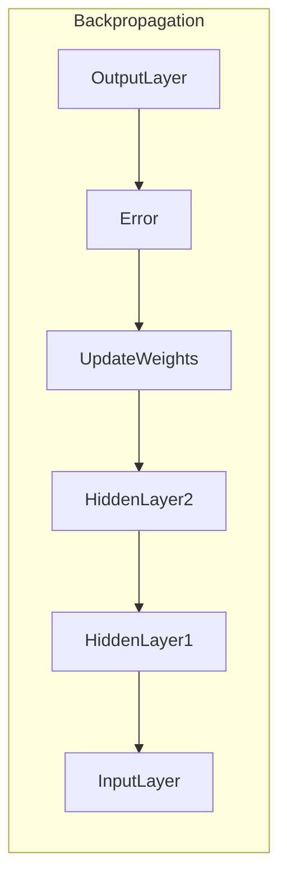
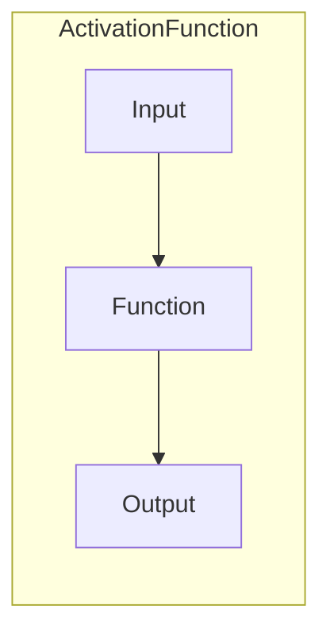

# 神经网络(Neural Networks) - 原理与代码实例讲解

## 1.背景介绍

神经网络是一种受生物神经系统启发而设计的机器学习模型。它由大量互连的节点(神经元)组成,这些节点能够从输入数据中学习并进行模式识别和数据处理。神经网络在各种领域都有广泛的应用,例如图像识别、自然语言处理、推荐系统等。

### 1.1 神经网络发展简史

早在1943年,神经科学家沃伦·麦卡洛克(Warren McCulloch)和数理逻辑学家沃尔特·皮茨(Walter Pitts)提出了第一个神经网络模型。1958年,弗兰克·罗森布拉特(Frank Rosenblatt)发明了感知器(Perceptron),这是第一个具有实际应用价值的神经网络模型。

1986年,由于反向传播算法(Backpropagation)的发明,多层感知器(Multi-Layer Perceptron)得到了广泛应用,推动了神经网络的发展。2012年,深度学习(Deep Learning)技术的出现,使得神经网络在计算机视觉、自然语言处理等领域取得了突破性进展。

### 1.2 神经网络的优势

与传统的机器学习算法相比,神经网络具有以下优势:

1. 自动学习特征: 神经网络能够自动从原始数据中学习特征,无需人工设计特征提取器。
2. 泛化能力强: 神经网络具有良好的泛化能力,能够很好地处理未见过的数据。
3. 高度非线性: 神经网络能够学习复杂的非线性映射关系。
4. 高度并行: 神经网络的计算过程是高度并行的,有利于提高计算效率。

## 2.核心概念与联系

### 2.1 神经元(Neuron)

神经元是神经网络的基本单元,它接收来自其他神经元或输入数据的信号,并根据激活函数(Activation Function)计算输出信号。每个神经元都有一个权重向量和一个偏置值,用于调节输入信号的重要性和影响输出的阈值。



### 2.2 层(Layer)

神经网络由多个层组成,每一层由多个神经元构成。根据层的位置和功能,可以分为输入层(Input Layer)、隐藏层(Hidden Layer)和输出层(Output Layer)。



### 2.3 前向传播(Forward Propagation)

前向传播是神经网络的基本工作机制。在这个过程中,输入数据从输入层开始,经过隐藏层的处理,最终到达输出层,得到预测结果。每个神经元的输出都是通过激活函数对加权输入求和后得到的。



### 2.4 反向传播(Backpropagation)

反向传播是神经网络训练过程中的关键算法。它通过计算输出误差对网络中每个权重的梯度,并使用优化算法(如梯度下降)来调整权重和偏置值,从而减小误差,提高模型的预测精度。



### 2.5 激活函数(Activation Function)

激活函数是神经网络中的一个非线性函数,它决定了神经元的输出。常用的激活函数包括Sigmoid函数、Tanh函数、ReLU(Rectified Linear Unit)函数等。选择合适的激活函数对于神经网络的性能有重要影响。



### 2.6 损失函数(Loss Function)

损失函数用于衡量模型预测值与真实值之间的差异。常用的损失函数有均方误差(Mean Squared Error)、交叉熵损失(Cross-Entropy Loss)等。在训练过程中,我们需要最小化损失函数,从而提高模型的预测精度。

### 2.7 优化算法(Optimization Algorithm)

优化算法用于调整神经网络中的权重和偏置值,以最小化损失函数。常用的优化算法包括随机梯度下降(Stochastic Gradient Descent)、动量优化(Momentum)、RMSProp、Adam等。选择合适的优化算法对于神经网络的收敛速度和性能有重要影响。

## 3.核心算法原理具体操作步骤

### 3.1 前向传播算法

前向传播算法是神经网络的基本工作机制,它将输入数据传递到输出层,得到预测结果。具体步骤如下:

1. 初始化网络权重和偏置值(通常使用小的随机值)。
2. 对于每个输入样本:
   a. 将输入数据传递到输入层。
   b. 对于每一隐藏层:
      - 计算每个神经元的加权输入之和。
      - 应用激活函数得到神经元的输出。
      - 将输出传递到下一层。
   c. 在输出层,得到预测结果。

下面是一个简单的前向传播算法Python实现示例:

```python
import numpy as np

def sigmoid(x):
    return 1 / (1 + np.exp(-x))

def forward_propagation(X, W1, b1, W2, b2):
    Z1 = np.dot(X, W1) + b1
    A1 = sigmoid(Z1)
    Z2 = np.dot(A1, W2) + b2
    A2 = sigmoid(Z2)
    return A2
```

### 3.2 反向传播算法

反向传播算法用于训练神经网络,通过计算误差梯度来调整网络权重和偏置值。具体步骤如下:

1. 执行前向传播,得到预测结果。
2. 计算输出层的误差。
3. 反向传播误差,计算每一层的误差梯度。
4. 使用优化算法(如梯度下降)更新网络权重和偏置值。
5. 重复步骤1-4,直到达到停止条件(如最大迭代次数或误差阈值)。

下面是一个简单的反向传播算法Python实现示例:

```python
import numpy as np

def sigmoid(x):
    return 1 / (1 + np.exp(-x))

def sigmoid_derivative(x):
    return x * (1 - x)

def backpropagation(X, y, W1, b1, W2, b2, learning_rate):
    m = X.shape[0]
    A1 = np.zeros((m, W1.shape[0]))
    A2 = np.zeros((m, W2.shape[1]))

    # Forward Propagation
    Z1 = np.dot(X, W1) + b1
    A1 = sigmoid(Z1)
    Z2 = np.dot(A1, W2) + b2
    A2 = sigmoid(Z2)

    # Backward Propagation
    dZ2 = A2 - y
    dW2 = np.dot(A1.T, dZ2) / m
    db2 = np.sum(dZ2, axis=0) / m
    dZ1 = np.dot(dZ2, W2.T) * sigmoid_derivative(A1)
    dW1 = np.dot(X.T, dZ1) / m
    db1 = np.sum(dZ1, axis=0) / m

    # Update Weights and Biases
    W2 -= learning_rate * dW2
    b2 -= learning_rate * db2
    W1 -= learning_rate * dW1
    b1 -= learning_rate * db1

    return W1, b1, W2, b2
```

## 4.数学模型和公式详细讲解举例说明

### 4.1 神经元数学模型

神经元是神经网络的基本单元,它接收来自其他神经元或输入数据的信号,并根据激活函数计算输出信号。

对于一个具有$n$个输入的神经元,其数学模型可以表示为:

$$
y = f\left(\sum_{i=1}^{n}w_ix_i + b\right)
$$

其中:

- $x_i$是第$i$个输入
- $w_i$是第$i$个输入对应的权重
- $b$是偏置值
- $f$是激活函数

常用的激活函数包括:

1. Sigmoid函数:

$$
f(x) = \frac{1}{1 + e^{-x}}
$$

2. Tanh函数:

$$
f(x) = \tanh(x) = \frac{e^x - e^{-x}}{e^x + e^{-x}}
$$

3. ReLU(Rectified Linear Unit)函数:

$$
f(x) = \max(0, x)
$$

### 4.2 前向传播公式

前向传播是神经网络的基本工作机制,它将输入数据传递到输出层,得到预测结果。

对于一个具有$L$层的神经网络,前向传播公式可以表示为:

$$
\begin{aligned}
a^{(0)} &= x \\
z^{(l)} &= W^{(l)}a^{(l-1)} + b^{(l)} \\
a^{(l)} &= f^{(l)}(z^{(l)})
\end{aligned}
$$

其中:

- $x$是输入数据
- $a^{(l)}$是第$l$层的激活值
- $z^{(l)}$是第$l$层的加权输入
- $W^{(l)}$是第$l$层的权重矩阵
- $b^{(l)}$是第$l$层的偏置向量
- $f^{(l)}$是第$l$层的激活函数

最终,输出层的激活值$a^{(L)}$就是神经网络的预测结果。

### 4.3 反向传播公式

反向传播算法用于训练神经网络,通过计算误差梯度来调整网络权重和偏置值。

对于一个具有$L$层的神经网络,反向传播公式可以表示为:

$$
\begin{aligned}
\delta^{(L)} &= \nabla_a C \odot f'^{(L)}(z^{(L)}) \\
\delta^{(l)} &= ((W^{(l+1)})^T \delta^{(l+1)}) \odot f'^{(l)}(z^{(l)}) \\
\frac{\partial C}{\partial W^{(l)}} &= \delta^{(l+1)}(a^{(l)})^T \\
\frac{\partial C}{\partial b^{(l)}} &= \delta^{(l+1)}
\end{aligned}
$$

其中:

- $C$是损失函数
- $\delta^{(l)}$是第$l$层的误差梯度
- $f'^{(l)}$是第$l$层激活函数的导数
- $\odot$表示元素wise乘积

通过计算每层的误差梯度,我们可以使用优化算法(如梯度下降)来更新网络权重和偏置值,从而最小化损失函数。

### 4.4 梯度下降公式

梯度下降是一种常用的优化算法,用于调整神经网络中的权重和偏置值,以最小化损失函数。

对于一个具有$L$层的神经网络,梯度下降公式可以表示为:

$$
\begin{aligned}
W^{(l)} &= W^{(l)} - \alpha \frac{\partial C}{\partial W^{(l)}} \\
b^{(l)} &= b^{(l)} - \alpha \frac{\partial C}{\partial b^{(l)}}
\end{aligned}
$$

其中:

- $\alpha$是学习率,控制更新步长的大小
- $\frac{\partial C}{\partial W^{(l)}}$和$\frac{\partial C}{\partial b^{(l)}}$分别是第$l$层权重和偏置的梯度

通过迭代更新权重和偏置值,神经网络可以逐步减小损失函数,提高预测精度。

## 5.项目实践：代码实例和详细解释说明

在这一部分,我们将通过一个实际的代码示例来展示如何构建和训练一个简单的神经网络。我们将使用Python和NumPy库来实现这个示例。

### 5.1 问题描述

我们将使用一个简单的二元分类问题来演示神经网络的工作原理。给定一个包含两个特征的数据集,我们需要训练一个神经网络模型来预测数据点所属的类别(0或1)。

### 5.2 数据准备

首先,我们需要生成一些示例数据。在这个{"msg_type":"generate_answer_finish","data":"","from_module":null,"from_unit":null}