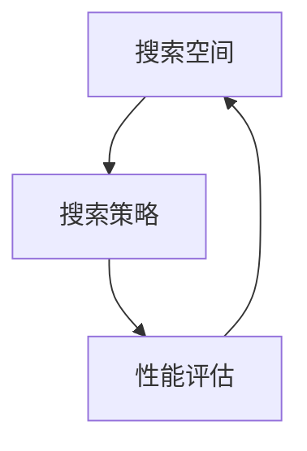

# 神经网络架构搜索NAS原理与代码实战案例讲解

## 1.背景介绍

### 1.1 神经网络架构搜索(NAS)的产生背景

近年来,深度学习在计算机视觉、自然语言处理等领域取得了巨大的成功。这些成功很大程度上归功于深度神经网络架构的设计。传统上,深度神经网络架构主要依赖人工设计,需要大量的专家知识和试错。为了减少人工设计的工作量,同时进一步提升深度学习的性能,神经网络架构搜索(Neural Architecture Search, NAS)应运而生。

### 1.2 NAS的定义与研究意义

NAS是一种自动设计深度神经网络架构的技术。它利用搜索算法,在给定的搜索空间内自动寻找最优的网络架构,从而取代人工设计。NAS的目标是找到在特定任务上性能最优的网络架构,同时兼顾模型的复杂度和效率。

NAS的研究意义主要体现在以下几个方面:

1. 提高深度学习的性能:通过自动搜索最优架构,NAS有望找到比人工设计更优的网络架构,从而进一步提升深度学习的性能。

2. 减少人工设计的工作量:传统的网络架构设计需要大量的人力和时间成本。NAS可以自动完成这一过程,大大减少人工设计的工作量。

3. 发现新的网络架构:NAS在搜索过程中可能会发现一些新颖的网络架构,这些架构可能具有独特的优势,有助于推动深度学习的发展。

4. 促进深度学习的应用:通过NAS,非专业人士也可以快速获得适合特定任务的高性能网络,降低了深度学习的使用门槛,有利于深度学习在更广泛的领域得到应用。

### 1.3 NAS的发展历程

NAS技术最早由Zoph等人在2017年提出。他们利用强化学习来搜索卷积神经网络和循环神经网络的最优架构,在图像分类和语言建模任务上取得了超越人工设计网络的性能。此后,NAS领域迅速发展,出现了一系列不同的NAS方法,如基于进化算法的NAS、基于梯度的可微NAS、基于强化学习的NAS等。同时,NAS的应用也从图像分类拓展到目标检测、语义分割、生成对抗网络等更多领域。

尽管NAS取得了长足的进展,但仍然面临着搜索效率低、计算开销大等挑战。为了解决这些问题,研究者们提出了一系列改进方法,如权重共享、代理模型、渐进式搜索等。这些改进使得NAS的搜索效率大大提高,使其更加实用化。

NAS作为一个新兴的研究方向,仍有许多值得探索的问题,如更高效的搜索策略、更灵活的搜索空间表示、跨任务的迁移学习等。相信随着研究的不断深入,NAS技术将在未来得到长足的发展,为深度学习的进步做出更大的贡献。

## 2.核心概念与联系

### 2.1 搜索空间

搜索空间定义了NAS算法可以探索的所有可能的网络架构。一个好的搜索空间应该包含优秀的网络架构,同时又不能过于庞大以至于难以搜索。搜索空间的设计需要考虑以下几个方面:

1. 基本单元的选择:搜索空间中的基本单元可以是卷积、池化、激活函数等操作,也可以是预定义的模块如Inception、ResNet等。

2. 基本单元的连接方式:基本单元之间的连接方式决定了网络的拓扑结构。常见的连接方式有链式、并行、跳跃连接等。

3. 超参数的选择:每个基本单元可能包含一些超参数,如卷积核大小、通道数等。搜索空间需要定义这些超参数的可选值。

4. 网络深度和宽度:搜索空间需要定义网络的深度和宽度范围。一般来说,更深更宽的网络有更强的表示能力,但也更难训练。

常见的搜索空间包括链式结构搜索空间、多分支结构搜索空间、基于图的搜索空间等。

### 2.2 搜索策略

搜索策略定义了NAS算法如何在搜索空间中探索以找到最优架构。常见的搜索策略包括:

1. 基于强化学习的搜索:将架构搜索看作一个强化学习问题,通过奖励函数引导智能体(控制器)生成高性能的网络架构。

2. 基于进化算法的搜索:利用进化算法的思想,通过选择、交叉、变异等操作不断优化网络架构的种群。

3. 基于梯度的搜索:将架构表示为一组连续的变量,通过梯度下降等优化算法直接对架构进行优化。

4. 基于贝叶斯优化的搜索:利用高斯过程等概率模型来建模架构与性能之间的关系,通过优化采集函数来选择下一个要评估的架构。

5. 基于随机搜索的方法:通过随机采样搜索空间来生成候选架构,然后评估它们的性能。

不同的搜索策略各有优缺点,需要根据具体问题选择合适的方法。

### 2.3 性能评估

性能评估是NAS的关键组成部分,它决定了搜索过程中如何评判候选架构的优劣。常见的性能评估指标包括:

1. 精度:在特定任务上,网络的预测结果与真实标签的一致性。

2. 模型复杂度:网络的参数量、计算量等,反映了模型的大小和推理效率。

3. 推理延迟:网络完成一次前向推理所需的时间,影响实时应用的性能。

由于训练和评估每个候选架构的代价很高,NAS往往需要引入一些加速技巧,如权重共享、代理模型、早停等。

### 2.4 核心概念之间的联系

搜索空间、搜索策略和性能评估是NAS的三个核心概念,它们相互影响,共同决定了NAS的性能:

- 搜索空间定义了搜索的范围和粒度,一个设计良好的搜索空间可以减小搜索难度,提高搜索效率。

- 搜索策略决定了如何在搜索空间中探索,一个高效的搜索策略可以快速定位优秀的架构。

- 性能评估为搜索提供了反馈和指导,准确高效的性能评估可以加速搜索进程。

因此,NAS的三个核心概念需要协同设计,才能最大限度地发挥NAS的性能。下图展示了三者之间的关系:

## 3.核心算法原理具体操作步骤

### 3.1 基于强化学习的NAS

基于强化学习的NAS将架构搜索看作一个序列决策问题。具体来说,它包含以下几个关键组件:

1. 状态空间:表示网络架构的当前状态,如已生成的层、超参数等。

2. 动作空间:表示可以对当前状态进行的操作,如添加卷积层、调整超参数等。

3. 转移函数:根据当前状态和所选动作,生成下一个状态。

4. 奖励函数:评估生成的完整网络架构在特定任务上的性能,给出奖励值。

5. 策略网络:一个神经网络,根据当前状态选择下一个动作。策略网络通过最大化累积奖励来学习。

具体的操作步骤如下:

1. 随机初始化策略网络的参数。

2. 根据当前策略生成一个完整的网络架构。

3. 在目标任务上训练和评估生成的网络,得到奖励值。

4. 将状态、动作、奖励作为样本,训练策略网络以最大化累积奖励。

5. 重复步骤2-4,直到达到预设的迭代次数或满足终止条件。

6. 返回搜索过程中发现的最优网络架构。

基于强化学习的NAS的优点是可以处理复杂的搜索空间,缺点是样本效率低,需要大量的训练和评估。

### 3.2 基于进化算法的NAS

基于进化算法的NAS利用自然进化的思想来优化网络架构。它维护一个网络架构的种群,通过选择、交叉、变异等操作不断更新种群,最终得到优秀的网络架构。

具体的操作步骤如下:

1. 随机初始化一个网络架构的种群。

2. 评估种群中每个网络架构在目标任务上的性能,得到适应度值。

3. 根据适应度值,通过选择算子从种群中选出一部分优秀的网络架构。

4. 对选出的网络架构进行交叉和变异,生成新的网络架构。

5. 将新生成的网络架构加入种群,替换一部分表现较差的网络架构。

6. 重复步骤2-5,直到达到预设的进化代数或满足终止条件。

7. 返回种群中适应度最高的网络架构。

基于进化算法的NAS的优点是易于实现和并行化,缺点是搜索效率较低,容易陷入局部最优。

### 3.3 基于梯度的NAS

基于梯度的NAS将网络架构表示为一组连续的变量,通过梯度下降等优化算法直接对架构进行优化。相比基于强化学习和进化算法的方法,基于梯度的NAS具有更高的样本效率。

DARTS是一种典型的基于梯度的NAS方法。它的具体操作步骤如下:

1. 定义一个超网络,包含所有候选操作的加权组合。权重由架构参数控制。

2. 随机初始化超网络的权重参数和架构参数。

3. 在训练集上训练超网络的权重参数,同时通过梯度下降更新架构参数。

4. 根据学习到的架构参数,对每个候选操作的权重进行softmax,得到最终的离散架构。

5. 在验证集上评估得到的离散架构,得到其性能。

6. 返回性能最优的离散架构。

基于梯度的NAS的优点是搜索效率高,可以利用现有的优化算法和硬件加速。缺点是搜索空间受限,超网络的训练可能不稳定。

## 4.数学模型和公式详细讲解举例说明

### 4.1 基于强化学习的NAS的数学模型

在基于强化学习的NAS中,策略网络可以用一个参数化的概率分布 $\pi_{\theta}(a|s)$ 来表示,其中 $\theta$ 为策略网络的参数, $s$ 为当前状态, $a$ 为动作。网络架构的生成过程可以看作一个马尔可夫决策过程(MDP),其状态转移概率为:

$$
P(s_{t+1}|s_t,a_t) = \begin{cases}
1, & \text{if } s_{t+1} = f(s_t,a_t) \\
0, & \text{otherwise}
\end{cases}
$$

其中 $f$ 为确定性的状态转移函数。

假设生成一个完整的网络架构需要 $T$ 个时间步,则整个生成过程的概率为:

$$
P(\mathbf{a}_{1:T}|\mathbf{s}_{1:T};\theta) = \prod_{t=1}^T \pi_{\theta}(a_t|s_t)
$$

策略网络的目标是最大化期望累积奖励:

$$
J(\theta) = \mathbb{E}_{\mathbf{a}_{1:T} \sim \pi_{\theta}}[R(\mathbf{a}_{1:T})]
$$

其中 $R(\mathbf{a}_{1:T})$ 为网络架构 $\mathbf{a}_{1:T}$ 在目标任务上的性能。

策略网络可以通过梯度上升来优化:

$$
\theta \leftarrow \theta + \alpha \nabla_{\theta} J(\theta)
$$

其中 $\alpha$ 为学习率。 $\nabla_{\theta} J(\theta)$ 可以通过策略梯度定理估计:

$$
\nabla_{\theta} J(\theta) = \mathbb{E}_{\mathbf{a}_{1:T} \sim \pi_{\theta}}[R(\math