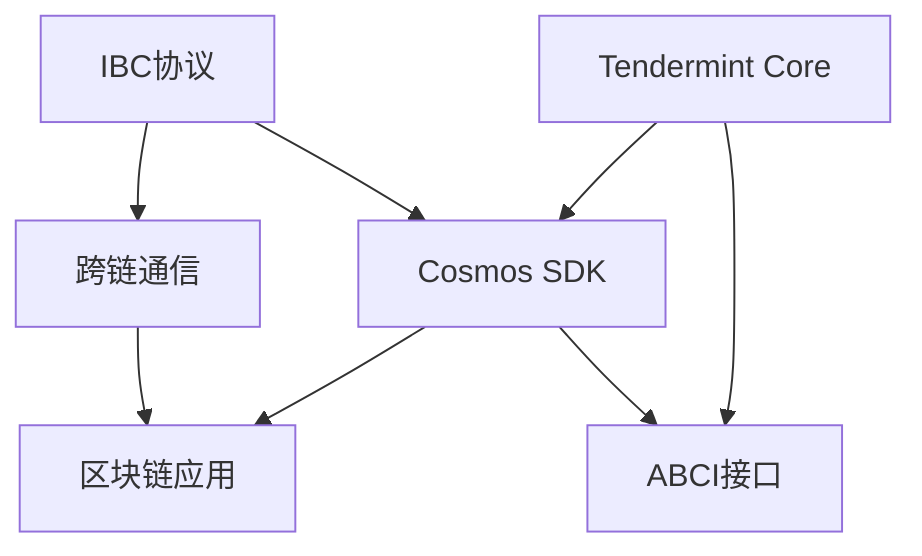

# 第九章：Cosmos应用案例

## 1. 背景介绍

### 1.1 区块链技术的兴起

区块链技术自比特币诞生以来,已经引起了各行各业的广泛关注。作为一种去中心化、不可篡改、高度透明的分布式账本技术,区块链在金融、供应链、医疗、教育等领域都有着广阔的应用前景。

### 1.2 Cosmos生态系统介绍  

Cosmos是一个由多个平行区块链组成的去中心化网络,旨在解决区块链之间互操作性和可扩展性的问题。通过Cosmos SDK和Tendermint共识引擎,开发者可以快速构建自己的区块链应用,并通过IBC协议实现与其他区块链的互联互通。

### 1.3 Cosmos在行业中的应用现状

目前,已经有越来越多的项目选择在Cosmos生态中进行开发和部署。这些项目覆盖了DeFi、NFT、游戏、隐私计算等多个领域,充分展示了Cosmos生态的活力和创新力。本章将重点介绍几个有代表性的Cosmos应用案例。

## 2. 核心概念与联系

### 2.1 Cosmos SDK

Cosmos SDK是一个用Go语言编写的开源框架,用于快速构建可定制的区块链应用。它提供了一系列标准化的模块和接口,开发者可以根据自己的需求灵活组合和扩展。

### 2.2 Tendermint Core

Tendermint Core是Cosmos生态的底层共识引擎,采用了BFT算法,可以在部分节点失效的情况下仍然保证系统的安全性和活性。Tendermint Core与应用层是解耦的,因此可以支持多种不同的应用。

### 2.3 IBC协议

IBC(Inter-Blockchain Communication)协议是Cosmos生态的一个关键创新,它为不同的区块链提供了一种标准化的通信方式。通过IBC,不同链上的资产可以自由流通,跨链DApp也能够实现。

### 2.4 概念之间的联系

下图展示了Cosmos SDK、Tendermint Core和IBC协议之间的关系:



从图中可以看出,Cosmos SDK构建在Tendermint Core之上,并通过ABCI接口与之交互。IBC协议则为Cosmos SDK提供了跨链通信的能力,最终使得区块链应用能够实现跨链互操作。

## 3. 核心算法原理具体操作步骤

### 3.1 Tendermint共识算法

Tendermint共识算法是Cosmos生态的核心,它主要包括以下几个步骤:

1. 提案阶段:先由一个proposer节点提出一个区块提案。 
2. 预投票阶段:所有节点对提案进行初步验证,并广播自己的投票结果。
3. 预提交阶段:如果有2/3以上的节点预投票通过,则进入预提交阶段,节点再次广播自己的投票。
4. 提交阶段:如果有2/3以上的节点预提交通过,则提案被正式接受,成为新的区块。

### 3.2 状态机复制

Tendermint共识保证了区块的一致性,但应用状态如何在各节点间同步呢?这就需要通过状态机复制来实现:

1. 交易在区块中被排序和打包。
2. 区块经过Tendermint共识后,被广播到所有节点。
3. 各节点按照相同的顺序执行区块中的交易,并更新自己的应用状态。
4. 由于共识算法保证了区块的一致性,因此所有诚实节点的状态最终都会趋于一致。

### 3.3 IBC跨链通信

IBC协议允许不同链上的模块相互发送数据包,其主要步骤如下:

1. 源链上的模块调用IBC接口,发送一个数据包到目标链。 
2. 源链将数据包以及相关元数据打包到一个IBC包中,提交到源链。
3. 源链上的IBC模块监听到这个包,并将其转发到目标链。
4. 目标链上的IBC模块收到包后,解析出原始数据,并调用相应的回调函数处理。
5. 目标链向源链返回一个确认数据包,完成整个通信过程。

## 4. 数学模型和公式详细讲解举例说明

### 4.1 BFT共识的数学模型

Tendermint共识算法是一种BFT(拜占庭容错)算法,其数学模型可以用下面的公式来表达:

$$
f(x)=\begin{cases}
1, & \text{if } x \geq 2N/3 \\
0, & \text{otherwise}
\end{cases}
$$

其中,$x$表示对某个提案投赞成票的节点数,$N$表示总节点数。当$x$大于等于$2N/3$时,提案被认为是通过的。这个公式保证了在不超过1/3的节点作恶的情况下,系统仍然能够正常工作。

举个例子,假设有4个节点A、B、C、D,其中A是提案节点。如果B、C都投了赞成票,而D投了反对票,那么$x=2,N=4$,因此$f(2)=0$,提案未通过。如果B、C、D都投了赞成票,那么$x=3,f(3)=1$,提案通过。

### 4.2 VDF的数学原理

VDF(Verifiable Delay Function)是一种用于引入可验证延迟的密码学原语,在Cosmos生态中主要用于防止长程攻击。其数学原理可以表示为:

$$
y=f(x,t)
$$

其中,$x$是VDF的输入,$t$是一个时间参数,$y$是VDF的输出。要求$f$是一个单向函数,即给定$x$和$t$,在$t$时间内可以高效计算$y$,但给定$y$,无法在多项式时间内计算出$x$。同时,$f$还需要满足可验证性,即存在一个高效的验证算法$V$:

$$
V(x,y,\pi)=\begin{cases}
1, & \text{if } y=f(x,t) \\
0, & \text{otherwise}
\end{cases}
$$

其中,$\pi$是一个证明,用于证明$y$确实是在$t$时间内通过$f$计算得到的。

举个例子,假设我们使用RSW VDF,其计算过程为:

$$
f(x,t)=x^{2^t} \bmod N
$$

其中$N$是一个大质数。假设$x=2,t=10,N=7$,那么:

$$
f(2,10)=2^{2^{10}} \bmod 7=2^{1024} \bmod 7=4
$$

验证过程则只需要计算$4^2 \bmod 7$是否等于$2$即可。

## 5. 项目实践：代码实例和详细解释说明

下面我们通过一个简单的Cosmos SDK模块来演示如何开发一个区块链应用。

### 5.1 定义状态

首先,我们需要定义模块的状态,也就是需要持久化存储的数据结构。在这个例子中,我们定义一个简单的`MsgCreatePost`结构体:

```go
type MsgCreatePost struct {
    Author string
    Title string
    Body string
}
```

### 5.2 定义消息类型

接下来,我们需要定义模块可以处理的消息类型。这里我们定义一个`MsgCreatePost`消息:

```go
func (msg MsgCreatePost) Route() string {
    return "blog"
}

func (msg MsgCreatePost) Type() string {
    return "create_post"
}

func (msg MsgCreatePost) ValidateBasic() error {
    if msg.Author == "" {
        return errors.New("author cannot be empty")
    }
    if msg.Title == "" {
        return errors.New("title cannot be empty")
    }
    if msg.Body == "" {
        return errors.New("body cannot be empty")
    }
    return nil
}
```

### 5.3 定义Handler

有了消息类型,我们还需要定义一个Handler来处理这些消息:

```go
func NewHandler(keeper Keeper) sdk.Handler {
    return func(ctx sdk.Context, msg sdk.Msg) (*sdk.Result, error) {
        switch msg := msg.(type) {
        case MsgCreatePost:
            return handleMsgCreatePost(ctx, keeper, msg)
        default:
            return nil, sdkerrors.Wrapf(sdkerrors.ErrUnknownRequest, "unrecognized blog message type: %T", msg)
        }
    }
}

func handleMsgCreatePost(ctx sdk.Context, keeper Keeper, msg MsgCreatePost) (*sdk.Result, error) {
    err := keeper.CreatePost(ctx, msg.Author, msg.Title, msg.Body)
    if err != nil {
        return nil, err
    }
    return &sdk.Result{}, nil
}
```

在`handleMsgCreatePost`函数中,我们调用了`keeper`的`CreatePost`方法来创建一个新的博客文章。`keeper`是一个封装了状态读写操作的对象。

### 5.4 集成到应用中

最后,我们需要将我们的模块集成到应用中:

```go
func NewApp(...) *blogApp {
    // ...
    
    app.blogKeeper = blog.NewKeeper(...)
    
    app.Router().AddRoute(blog.RouterKey, blog.NewHandler(app.blogKeeper))
    
    // ...
}
```

这里我们创建了一个`blogKeeper`,并将其传递给`NewHandler`函数创建消息处理器,最后将处理器注册到应用的路由中。

至此,一个简单的博客模块就开发完成了。当然,实际的应用会比这复杂得多,但基本原理是一样的。

## 6. 实际应用场景

Cosmos生态已经涌现出许多有趣的应用,下面列举几个代表性的例子:

### 6.1 Binance Chain

Binance Chain是由币安交易所开发的一条公链,旨在为数字资产的发行、交易提供一个高性能的平台。Binance Chain基于Cosmos SDK和Tendermint共识,并做了一些定制化的开发,以满足高频交易的需求。

### 6.2 Cosmos Hub

Cosmos Hub是Cosmos网络的核心枢纽,它连接了众多的区域性分区,并提供了跨链资产转移、跨链智能合约调用等功能。Cosmos Hub上运行的原生代币为ATOM,持有者可以通过质押ATOM来参与网络共识,并获得收益。

### 6.3 IRISnet

IRISnet是一个基于Cosmos SDK的区域性分区,主要关注于构建分布式商业应用。IRISnet提供了一些独特的功能,如服务定义、服务绑定、服务调用等,可以大大降低分布式应用的开发成本。

### 6.4 Akash Network

Akash Network是一个去中心化的云计算平台,用户可以在上面部署各种应用程序。与传统的中心化云平台相比,Akash Network具有更高的安全性、可用性和成本效益。同时,Akash token持有者还可以通过出租自己的计算资源来获得收益。

## 7. 工具和资源推荐

### 7.1 开发工具

- Starport:一个快速构建Cosmos SDK应用的脚手架工具。
- Ignite CLI:一个功能强大的Cosmos SDK开发工具,内置了许多实用的代码生成和调试功能。

### 7.2 钱包工具

- Keplr:一个基于浏览器的Cosmos钱包,支持多链管理和质押。
- Cosmostation:一个移动端的Cosmos钱包,支持多链管理和质押。

### 7.3 浏览器

- Big Dipper:一个功能全面的Cosmos浏览器,支持多链浏览和质押管理。
- Mintscan:一个专注于Cosmos生态的区块链浏览器,界面简洁美观。

### 7.4 社区资源

- Cosmos官网:https://cosmos.network
- Cosmos论坛:https://forum.cosmos.network
- Cosmos博客:https://blog.cosmos.network
- Cosmos Github:https://github.com/cosmos

## 8. 总结：未来发展趋势与挑战

### 8.1 互操作性将成为区块链发展的关键

随着区块链技术的不断成熟,越来越多的行业开始尝试将其应用到实际的业务场景中。然而,不同的区块链平台之间往往缺乏互操作性,这限制了区块链技术的进一步发展。Cosmos通过IBC协议打通了不同链之间的壁垒,为未来区块链的大规模应用奠定了基础。

### 8.2 可扩展性问题有待进一步解决

虽然Cosmos在可扩展性方面已经做了很多尝试,但与传统的中心化系统相比,其性能