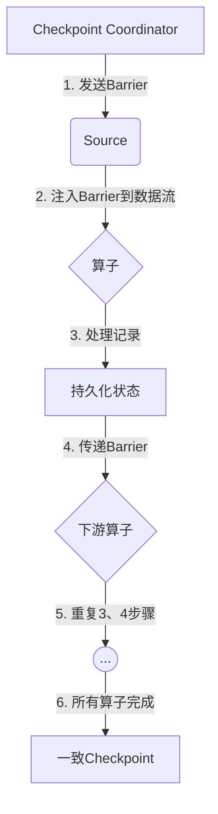
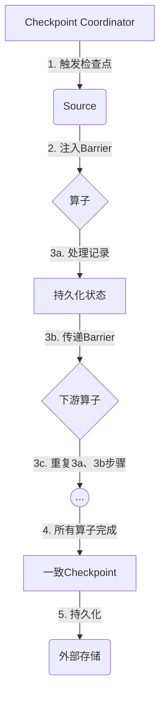
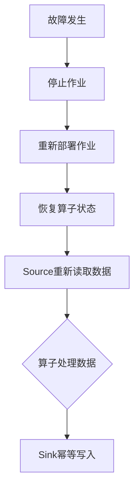

# 第五章：Flink中的exactly-once语义

## 1.背景介绍

在现代分布式系统中,数据处理是一个关键的环节,尤其是在大数据场景下,数据处理的正确性和一致性至关重要。传统的批处理系统虽然可以保证最终一致性,但无法满足实时数据处理的需求。而流处理系统则可以实时处理数据,但很难保证数据处理的精确一次语义(exactly-once)。

Apache Flink作为新一代流处理框架,不仅具备低延迟和高吞吐量等优点,而且还提供了exactly-once语义的保证,使得数据处理过程中不会出现重复计算或数据丢失的情况。本章将深入探讨Flink如何实现exactly-once语义,以及相关的核心概念和算法原理。

### 1.1 什么是Exactly-once语义?

Exactly-once语义是指在分布式系统中,每个事件或消息只被处理一次,不会出现重复处理或遗漏的情况。这对于金融交易、物联网数据处理等场景至关重要,因为任何重复或遗漏都可能导致严重的后果。

在传统的批处理系统中,通常采用幂等写入的方式来保证最终一致性,但无法实现精确一次语义。而流处理系统由于其实时性和低延迟的特点,实现exactly-once语义面临着更大的挑战。

### 1.2 Flink中Exactly-once语义的重要性

在Flink中,实现exactly-once语义是一个核心目标。由于Flink是一个分布式流处理系统,数据需要在多个节点之间传输和处理,任何节点或网络故障都可能导致数据重复或丢失。因此,确保每个事件或消息只被处理一次对于保证数据处理的正确性和一致性至关重要。

Flink通过引入checkpoint机制和端到端精确一次状态一致性等概念,为用户提供了exactly-once语义的保证。这使得Flink不仅可以应用于传统的批处理场景,还可以广泛应用于金融、物联网、电子商务等对数据处理精确性要求极高的领域。

## 2.核心概念与联系

### 2.1 Checkpoint机制

Checkpoint机制是Flink实现exactly-once语义的关键。它定期将作业的状态持久化到外部存储系统(如HDFS或S3),以便在发生故障时能够从最近的一致检查点恢复。

Checkpoint机制包括以下几个核心概念:

1. **Barrier(栅栏)**: 用于标记数据流中的一致性切断点,确保所有之前的记录都已经处理完毕。
2. **Checkpoint(检查点)**: 作业在特定时间点的一致状态快照,包括作业的状态和barrier。
3. **Checkpoint Coordinator(检查点协调器)**: 负责触发和协调检查点的创建和持久化。

在Flink中,Checkpoint Coordinator会定期向所有Source发送Barrier,Source在收到Barrier后会将其注入到数据流中。当Barrier到达算子时,算子会先处理所有之前的记录,然后将当前状态持久化到检查点,最后再将Barrier向下游传递。当所有算子都完成检查点后,该检查点就被认为是一致的,可以用于故障恢复。



### 2.2 端到端精确一次状态一致性

端到端精确一次状态一致性(End-to-End Exactly-Once State Consistency)是Flink实现exactly-once语义的另一个关键概念。它确保了从Source到Sink的整个数据处理流程中,每个记录只被处理一次,并且在发生故障时,可以从最近的一致检查点恢复而不会丢失或重复计算任何记录。

为了实现端到端精确一次状态一致性,Flink引入了以下机制:

1. **Source端**: 通过可重设的Source来确保在故障恢复时,Source可以从上次检查点继续读取数据,而不会丢失或重复数据。
2. **Sink端**: 通过幂等写入或事务写入的方式,确保每条记录只被写入一次。
3. **算子端**: 通过Barrier对齐和检查点机制,确保每个算子在处理数据时都是从一致的状态开始,并且在故障恢复时可以从最近的一致检查点继续执行。

只有当Source、Sink和所有算子都满足精确一次语义时,Flink才能够实现端到端精确一次状态一致性。

## 3.核心算法原理具体操作步骤

### 3.1 Checkpoint创建流程

Checkpoint的创建流程如下:

1. **Checkpoint Coordinator触发检查点**: Checkpoint Coordinator根据配置的时间间隔或数据大小,向所有Source发送Barrier。
2. **Source注入Barrier**: Source在收到Barrier后,将其注入到数据流中。
3. **算子处理Barrier**:
   - 算子先处理所有之前的记录,然后持久化当前状态到检查点。
   - 算子将Barrier向下游传递。
4. **Checkpoint完成**: 当所有算子都完成了状态持久化,该检查点被认为是一致的,Checkpoint Coordinator将其持久化到外部存储系统。



### 3.2 故障恢复流程

当发生故障时,Flink会根据最近的一致检查点进行恢复,具体流程如下:

1. **停止作业**: Flink首先停止当前正在运行的作业。
2. **重新部署作业**: Flink根据最近的一致检查点重新部署作业,并从检查点恢复每个算子的状态。
3. **Source重新读取数据**: 可重设的Source从上次检查点的位置继续读取数据,确保不会丢失或重复数据。
4. **恢复数据处理**: 算子从恢复的状态开始处理数据,确保每条记录只被处理一次。
5. **Sink幂等写入**: Sink通过幂等写入或事务写入的方式,确保每条记录只被写入一次。



通过上述流程,Flink能够在发生故障时快速恢复,并确保数据处理的精确一次语义。

## 4.数学模型和公式详细讲解举例说明

在Flink中,实现exactly-once语义涉及到一些数学模型和公式,用于描述和分析系统的行为。下面将详细介绍其中的一些关键模型和公式。

### 4.1 检查点间隔模型

检查点间隔(Checkpoint Interval)是指两个连续检查点之间的时间或数据大小。合理设置检查点间隔对于系统的性能和可靠性至关重要。

假设检查点间隔为$T$,作业处理速率为$R$,则在时间$T$内需要处理的数据量为$R \times T$。检查点的开销包括持久化状态的时间$T_s$和网络传输时间$T_n$,则总开销为$T_s + T_n$。

为了确保作业能够在检查点间隔内完成数据处理和状态持久化,需要满足以下条件:

$$
R \times T \leq T - (T_s + T_n)
$$

上式表示,在时间$T$内,作业处理数据的时间加上检查点开销不能超过检查点间隔$T$。

通过调整检查点间隔$T$,可以在系统吞吐量和容错能力之间进行权衡。较小的$T$意味着更频繁的检查点,从而提高了容错能力,但也增加了开销,降低了系统吞吐量。反之,较大的$T$则可以提高吞吐量,但容错能力会下降。

### 4.2 Barrier对齐模型

Barrier对齐是Flink实现exactly-once语义的关键机制之一。它确保了每个算子在处理数据时都是从一致的状态开始,并且在故障恢复时可以从最近的一致检查点继续执行。

假设有一个作业由$n$个算子组成,每个算子接收到的Barrier分别为$B_1, B_2, \ldots, B_n$。为了确保所有算子都从一致的状态开始处理数据,需要满足以下条件:

$$
B_1 = B_2 = \ldots = B_n
$$

也就是说,所有算子接收到的Barrier必须是同一个。只有在所有算子都完成了对应Barrier之前的数据处理和状态持久化后,该Barrier才被认为是一致的。

在实际执行过程中,由于网络延迟和算子处理速度的差异,不同算子接收到Barrier的时间可能不同。为了解决这个问题,Flink引入了Barrier对齐机制,具体步骤如下:

1. 每个算子在接收到Barrier后,先处理所有之前的记录,然后持久化当前状态。
2. 算子将Barrier向下游传递,但不会立即处理之后的记录。
3. 当算子收到下游所有分区的Barrier后,才开始处理之后的记录。

通过上述步骤,Flink确保了所有算子在处理数据时都是从一致的状态开始,从而实现了exactly-once语义。

## 5.项目实践: 代码实例和详细解释说明

为了更好地理解Flink中的exactly-once语义,我们将通过一个简单的示例项目来实践相关概念。该项目使用Flink流处理框架,从Kafka消费数据,进行简单的计数统计,并将结果写入到MySQL数据库中。

### 5.1 项目结构

```
exactly-once-example
├── pom.xml
├── src
│   ├── main
│   │   ├── java
│   │   │   └── com
│   │   │       └── example
│   │   │           └── ExactlyOnceExample.java
│   │   └── resources
│   │       └── log4j.properties
└── README.md
```

- `pom.xml`: Maven项目配置文件,包含所需依赖项。
- `ExactlyOnceExample.java`: 主程序入口,实现从Kafka消费数据、计数统计和写入MySQL的功能。
- `log4j.properties`: 日志配置文件。
- `README.md`: 项目说明文件。

### 5.2 代码实现

以下是`ExactlyOnceExample.java`的主要代码,包含了注释说明:

```java
import org.apache.flink.api.common.restartstrategy.RestartStrategies;
import org.apache.flink.streaming.api.environment.StreamExecutionEnvironment;
import org.apache.flink.streaming.connectors.kafka.FlinkKafkaConsumer;
import org.apache.flink.streaming.util.serialization.SimpleStringSchema;

public class ExactlyOnceExample {

    public static void main(String[] args) throws Exception {
        // 创建流执行环境
        StreamExecutionEnvironment env = StreamExecutionEnvironment.getExecutionEnvironment();

        // 设置检查点间隔为1分钟
        env.enableCheckpointing(60000);

        // 设置恢复策略为无限重试
        env.setRestartStrategy(RestartStrategies.fixedDelayRestart(Integer.MAX_VALUE, 10000));

        // 从Kafka消费数据
        FlinkKafkaConsumer<String> kafkaConsumer = new FlinkKafkaConsumer<>("topic", new SimpleStringSchema(), props);
        kafkaConsumer.setStartFromEarliest();

        // 计数统计
        DataStream<String> counts = env
                .addSource(kafkaConsumer)
                .flatMap(new WordCount.Tokenizer())
                .keyBy(value -> value)
                .sum(1);

        // 写入MySQL
        counts.addSink(new MySQLSink("jdbc:mysql://host:3306/database", "user", "password"));

        // 执行作业
        env.execute("ExactlyOnceExample");
    }
}
```

在上述代码中,我们首先创建了流执行环境,并启用了检查点