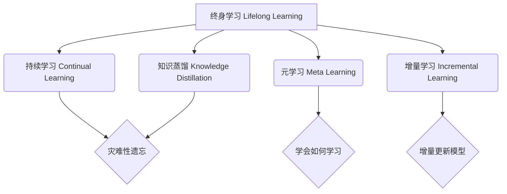

# 终身学习Lifelong Learning原理与代码实例讲解

## 1. 背景介绍

### 1.1 终身学习的定义与意义

终身学习(Lifelong Learning)是指在一个人的一生中持续不断地学习,以适应社会变化和个人发展的需要。在人工智能领域,终身学习指的是使机器模型能够像人类一样,在面对新任务、新环境时,能够持续学习和积累知识,不断提升自身能力。

### 1.2 终身学习的研究背景

传统的机器学习模型通常是在特定任务上进行训练,训练完成后模型参数就固定下来,难以适应新的任务。而现实世界是复杂多变的,机器学习系统需要具备持续学习、积累知识的能力。终身学习正是为了解决这一问题而提出的研究方向。

### 1.3 终身学习的主要挑战

终身学习面临的主要挑战包括:
- 灾难性遗忘(Catastrophic Forgetting):在学习新任务时,之前学习到的知识被快速遗忘
- 知识增量学习:如何在保留原有知识的基础上,高效地学习新知识
- 知识迁移:如何利用已学习的知识,加速对新任务的学习
- 元学习:学会如何学习,提高学习新知识的效率

## 2. 核心概念与联系

### 2.1 持续学习(Continual Learning)

持续学习是终身学习的一个分支,指机器在连续的任务中持续学习,每个任务都会给模型带来新的知识,同时要求模型尽量避免灾难性遗忘。

### 2.2 知识蒸馏(Knowledge Distillation)

知识蒸馏是将一个大模型学习到的知识,传递给一个小模型。在终身学习中,可以用知识蒸馏来保存之前学习到的知识,避免遗忘。

### 2.3 元学习(Meta Learning)

元学习是让机器学会如何学习的方法。通过元学习,可以从以往学习的经验中总结规律,指导未来的学习,提高新任务的学习效率。

### 2.4 增量学习(Incremental Learning)

增量学习是指模型能够在新数据到来时,在已有知识的基础上持续学习,同时保证模型性能。

### 2.5 概念之间的联系

下图展示了终身学习的核心概念之间的关系:



## 3. 核心算法原理具体操作步骤

### 3.1 基于正则化的持续学习算法

#### 3.1.1 EWC(Elastic Weight Consolidation)

EWC通过施加L2正则化来惩罚那些对之前任务很重要的参数的大幅改变,步骤如下:
1. 在任务A上训练模型,得到参数$\theta^A$
2. 计算任务A的Fisher信息矩阵$F^A$,它表示每个参数对任务A的重要程度 
3. 在新任务B上训练模型,损失函数增加一项正则项:$\frac{\lambda}{2} \sum_i F_i^A(\theta_i - \theta_i^A)^2$
4. 不断重复以上过程,学习一系列任务

#### 3.1.2 MAS(Memory Aware Synapses)

MAS的思路是估计参数的重要程度,对那些重要的参数在学习新任务时进行更大的正则化惩罚。
1. 在任务A上训练模型
2. 计算每个参数的重要程度$\Omega_i$,它是参数梯度的L2范数在训练集上的平均值
3. 在新任务B上训练模型,损失函数增加正则项:$\frac{\lambda}{2} \sum_i \Omega_i (\theta_i - \theta_i^A)^2$
4. 重复以上过程,学习一系列任务

### 3.2 基于记忆回放的持续学习算法

#### 3.2.1 iCaRL(Incremental Classifier and Representation Learning)

iCaRL通过选择一部分旧任务的样本进行重放,在学习新任务的同时保持对旧任务的知识。
1. 训练初始模型,只包含第一个任务的分类器和特征提取器 
2. 当新任务到来时,从旧任务的数据集中选择一些样本,与新任务数据一起组成新的训练集
3. 使用知识蒸馏的方法,让新模型在新数据上的输出接近旧模型的预测
4. 微调新模型,同时用分类损失和蒸馏损失进行优化
5. 重复以上过程,不断学习新任务并更新记忆

#### 3.2.2 GEM(Gradient Episodic Memory)

GEM通过梯度约束,让新任务的梯度不会使旧任务的损失增加,从而保证旧知识不被遗忘。
1. 初始化记忆 $\mathcal{M}$,存储旧任务的一些样本
2. 在新任务 $t$ 上计算梯度 $g$
3. 从记忆中采样一个批次数据 $\mathcal{M}_b$,让模型在其上计算梯度 $g_k, k=1,2,...,t-1$
4. 将梯度 $g$ 投影到一个约束空间,使得 $g^\top g_k \ge 0$,即新任务梯度与旧任务梯度夹角不超过90度
5. 用修正后的梯度更新模型,重复以上过程

### 3.3 基于动态结构的持续学习算法

#### 3.3.1 PNN(Progressive Neural Networks)

PNN通过渐进式地增加网络结构来适应新任务,同时旧结构固定不变,保留旧知识。
1. 初始化第一个任务的网络列(列0)
2. 当新任务 $t$ 到来时,添加一个新的网络列(列 $t$)
3. 列 $t$ 可以接收来自列 $0,1,...,t-1$ 的侧向连接,使用adapter模块控制信息传递
4. 冻结列 $0$ 到列 $t-1$ 的参数,只训练列 $t$ 和adapter
5. 重复以上过程,每个新任务增加一个列,实现持续学习

#### 3.3.2 DEN(Dynamically Expandable Networks)

DEN通过自适应地扩展网络容量来学习新知识,同时保持旧知识。
1. 从一个基础网络开始训练第一个任务
2. 当新任务到来时,通过知识蒸馏得到当前任务对每一层的需求
3. 根据需求选择性地增加一些新的神经元/过滤器
4. 用渐进式的方式训练新加入的参数,同时蒸馏旧参数的知识
5. 重复以上过程,不断扩展网络同时保持旧知识

## 4. 数学模型和公式详细讲解举例说明

### 4.1 EWC的数学模型

EWC的目标是在学习新任务时,最小化新参数 $\theta$ 与旧参数 $\theta^*$ 的差异,差异程度由Fisher信息矩阵 $F$ 决定。数学表达为:

$$
\mathcal{L}(\theta) = \mathcal{L}_B(\theta) + \sum_i \frac{\lambda}{2} F_i (\theta_i - \theta_i^*)^2
$$

其中 $\mathcal{L}_B(\theta)$ 是新任务B的损失函数,$\lambda$ 是平衡新旧任务的超参数。$F_i$ 表示参数 $\theta_i$ 的重要程度,计算公式为:

$$
F_i = \mathbb{E}_{x \sim D_A} \left[ \left( \frac{\partial \log p(x|\theta)}{\partial \theta_i} \right)^2 \right]
$$

其中 $D_A$ 是任务A的数据集。直观地说,如果参数 $\theta_i$ 的变化会引起模型在数据集 $D_A$ 上的输出概率有较大改变,那么这个参数对任务A就很重要,对应的 $F_i$ 就较大,在学习任务B时就受到更大的正则化惩罚。

### 4.2 GEM的数学模型

GEM希望找到一个梯度方向 $\tilde{g}$,使得它与旧任务梯度 $g_k$ 夹角都不超过90度,即:

$$
\begin{aligned}
\min_{\tilde{g}} \quad & \frac{1}{2} \| \tilde{g} - g \|_2^2 \\
\text{s.t.} \quad & \tilde{g}^\top g_k \ge 0, \forall k < t
\end{aligned}
$$

这个约束优化问题可以用二次规划求解。直观地说,我们希望 $\tilde{g}$ 尽可能接近原梯度 $g$,但如果 $g$ 与某个旧任务梯度 $g_k$ 夹角过大(内积为负),我们就把 $g$ 投影到与这些 $g_k$ 都垂直的方向上,得到一个修正后的梯度 $\tilde{g}$。这样更新参数时就不会增大旧任务的损失了。

## 5. 项目实践：代码实例和详细解释说明

下面我们用PyTorch实现一个简单的EWC算法,在MNIST数据集上进行持续学习的实验。完整代码可以在这里找到:[https://github.com/ContinualAI/colab/blob/master/notebooks/intro_to_continual_learning.ipynb](https://github.com/ContinualAI/colab/blob/master/notebooks/intro_to_continual_learning.ipynb)

### 5.1 定义EWC的正则项

```python
def ewc_loss(model, lamda, fisher, optpar):
    loss = 0
    for name, param in model.named_parameters():
        if name in fisher:
            loss += lamda * torch.sum(fisher[name] * (optpar[name] - param).pow(2))
    return loss
```

这个函数计算EWC正则项。它遍历模型的所有参数,对于在Fisher信息矩阵中出现的参数,计算它们与优化后参数的差异,加权求和得到正则项。

### 5.2 计算Fisher信息矩阵

```python
def compute_fisher(model, criterion, dataset):
    fisher = {}
    for name, param in model.named_parameters():
        fisher[name] = param.data.clone().zero_()
        
    model.eval()
    for x, y in dataset:
        model.zero_grad()
        out = model(x)
        loss = criterion(out, y)
        loss.backward()
        
        for name, param in model.named_parameters():
            fisher[name] += param.grad.data.clone().pow(2) / len(dataset)
    
    model.train()
    return fisher
```

这个函数用数据集估计模型参数的Fisher信息矩阵。具体做法是:遍历数据集中的每个样本,计算样本的损失对每个参数的梯度,将梯度平方后累加到Fisher矩阵中,最后除以样本数得到平均值。

### 5.3 定义持续学习的训练循环

```python
def train_ewc(model, epochs, task_datasets, batch_size, lamda, log_every=100):
    optpar = {}
    fisher = {}
    
    for task, dataset in enumerate(task_datasets):
        print(f"Training on task {task}")
        
        if task > 0:
            for name, param in model.named_parameters():
                optpar[name] = param.data.clone()
            fisher = compute_fisher(model, criterion, dataset)
        
        loader = torch.utils.data.DataLoader(dataset, batch_size=batch_size, shuffle=True)
        optimizer = torch.optim.SGD(model.parameters(), lr=0.01)
        
        for epoch in range(epochs):
            for i, (x, y) in enumerate(loader):
                loss = criterion(model(x), y)
                if task > 0:
                    loss += ewc_loss(model, lamda, fisher, optpar)
                
                optimizer.zero_grad()
                loss.backward()
                optimizer.step()
                
                if i % log_every == 0:
                    print(f"Epoch {epoch}, iter {i}, loss {loss.item():.3f}")
        
        test_accs = []
        for task in range(len(task_datasets)):
            test_acc = test(model, task_datasets[task])
            test_accs.append(test_acc)
            print(f"Task {task} test accuracy {test_acc:.3f}")
        print(f"Average test accuracy {np.mean(test_accs):.3f}")
```

这个函数定义了EWC算法的完整训练流程。外层循环遍历所有任务,内层循环在每个任务上训练指定轮数。

具体步骤如下:
1. 如果不是第一个任务,