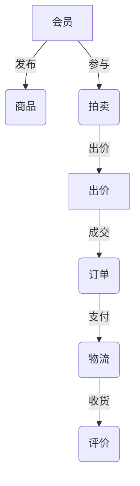
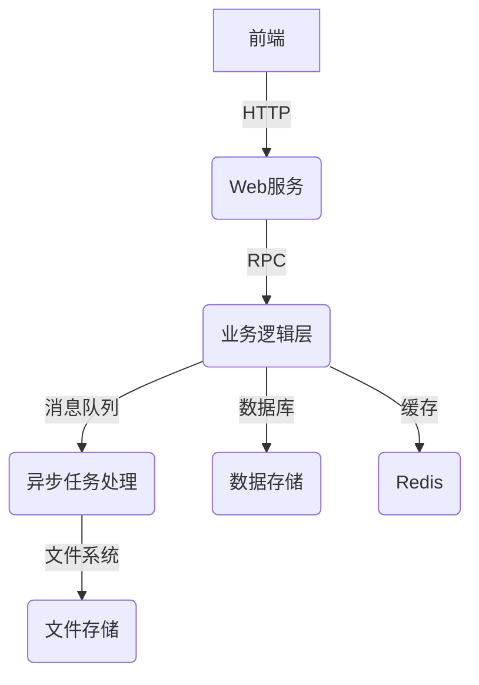

# 网上拖系统详细设计与具体代码实现

## 1.背景介绍

随着互联网技术的快速发展和电子商务的兴起,网上拍卖已经成为一种非常流行的商业模式。网上拍卖系统为买家和卖家提供了一个透明、公平的交易平台,让他们可以方便地进行商品交易。与传统的实体拍卖相比,网上拍卖具有覆盖面广、交易成本低、时间和地点自由等优势。

网上拍卖系统的核心是实现商品的在线展示、竞价和交易流程的自动化管理。系统需要支持会员注册、商品发布、竞价出价、订单支付、物流跟踪等多个环节,并保证整个交易过程的安全性和可靠性。同时,系统还需要具备数据分析和个性化推荐等功能,为用户提供更好的体验。

## 2.核心概念与联系

网上拍卖系统涉及的主要概念有:

1. **会员(User)**: 参与拍卖活动的买家和卖家,需要进行注册和实名认证。

2. **商品(Item)**: 拍卖的物品,包括商品信息、起拍价格、底价等参数。

3. **拍卖(Auction)**: 商品的竞价活动,包括拍卖时间、出价规则等。

4. **出价(Bid)**: 买家对商品的竞价行为,需要遵守拍卖规则。

5. **订单(Order)**: 拍卖成交后生成的交易订单,包括支付、物流等信息。

6. **评价(Comment)**: 交易双方对本次交易的评价反馈。

这些概念之间存在着密切的关系,如会员发布商品、参与拍卖出价、下单支付、评价交易等,构成了完整的拍卖交易流程。



## 3.核心算法原理具体操作步骤

网上拍卖系统的核心算法主要包括:

### 3.1 拍卖竞价算法

拍卖竞价算法决定了最终的拍卖成交价格和获胜者。常见的拍卖竞价算法有:

1. **英式拍卖(English Auction)**: 拍卖师从低价开始,买家不断出价,直到只剩一个买家为止,这个买家获得商品。

2. **荷兰式拍卖(Dutch Auction)**: 拍卖师从高价开始,价格不断下降,直到有买家愿意接受这个价格。

3. **密封出价拍卖(Sealed-bid Auction)**: 买家在不知道其他人出价的情况下密封出价,最高价者获胜。

4. **威克里拍卖(Vickrey Auction)**: 密封出价拍卖的一种变体,获胜者只需支付第二高价。

这些算法各有特点,英式拍卖过程公开透明,但效率较低;密封出价拍卖效率高,但可能存在操纵风险。选择合适的算法需要权衡公平性、效率和抗操纵性等因素。

### 3.2 商品推荐算法

为了提高用户体验和拍卖成交率,系统需要为用户推荐感兴趣的商品。常用的推荐算法有:

1. **协同过滤(Collaborative Filtering)**: 基于用户的历史行为(浏览、购买、评分等)对商品进行推荐。

2. **基于内容(Content-based)**: 根据商品的文本描述,推荐与用户历史兴趣相似的商品。

3. **基于知识(Knowledge-based)**: 根据领域知识和规则,推理出用户可能感兴趣的商品。

4. **混合推荐(Hybrid)**: 将上述多种算法进行融合,发挥各自的优势。

这些算法需要结合用户画像、商品特征、上下文信息等数据进行训练,并持续优化以提高推荐准确率。

### 3.3 信用评级算法

为了维护网上拍卖的信任机制,系统需要对买家和卖家进行信用评级,作为交易决策的重要参考。常用的信用评级算法有:

1. **基于交易记录(Transaction-based)**: 根据历史交易的成功率、违约率、纠纷率等指标计算信用分数。

2. **基于社交网络(Social Network)**: 利用社交网络中的信任关系和口碑传播对信用进行评估。

3. **基于文本分析(Text Analysis)**: 分析买家和卖家的评价内容,挖掘潜在的信用信息。

4. **基于机器学习(Machine Learning)**: 将上述多种信息进行融合,利用机器学习算法对信用进行评级。

信用评级算法需要具备准确性、鲁棒性和可解释性,并与拍卖规则和违约处理机制相结合,维护网上拍卖的公平公正。

## 4.数学模型和公式详细讲解举例说明

### 4.1 拍卖竞价模型

拍卖理论中常用的数学模型包括:

1. **私有价值模型(Private Value Model)**

每个买家对商品的估值 $v_i$ 是私有的,彼此独立,服从某个分布 $F(v)$。买家的目标是最大化自己的期望收益:

$$
\max E[v_i - b_i]
$$

其中 $b_i$ 是买家的出价。在这种模型下,采用英式拍卖可以达到贝叶斯纳什均衡,买家的最优出价策略是:

$$
b_i(v_i) = v_i - \int_{0}^{v_i} \frac{1-F(x)}{1-F(v_i)}dx
$$

2. **共有价值模型(Common Value Model)**

所有买家对商品的估值是相同的,但是存在估值误差。买家的目标是根据自己的私有信号 $s_i$ 估计商品的真实价值 $v$,并最大化期望收益:

$$
\max E[v - b_i | s_i]
$$

在这种模型下,密封出价拍卖具有较好的性质,买家的最优出价策略与信号分布和其他买家的策略相关。

3. **综合模型(Unified Model)**

上述两种模型是拍卖理论的极端情况,实际情况下买家的估值包含私有部分和共有部分。综合模型对应的出价策略更加复杂,需要结合具体的拍卖规则和参数进行分析。

这些模型为拍卖机制的设计提供了理论基础,有助于制定合理的竞价规则和策略。

### 4.2 推荐系统模型

推荐系统常用的数学模型包括:

1. **协同过滤模型**

协同过滤模型基于用户-物品的评分矩阵,通过矩阵分解或者邻域方法预测缺失的评分值。例如,基于矩阵分解的模型可以表示为:

$$
r_{ui} \approx p_u^Tq_i
$$

其中 $r_{ui}$ 是用户 $u$ 对物品 $i$ 的评分, $p_u$ 和 $q_i$ 分别是用户 $u$ 和物品 $i$ 的潜在向量表示。通过优化目标函数:

$$
\min \sum_{r_{ui} \in R} (r_{ui} - p_u^Tq_i)^2 + \lambda(||p_u||^2 + ||q_i||^2)
$$

可以学习到用户和物品的向量表示,并预测缺失的评分值。

2. **主题模型**

主题模型通过挖掘文本的潜在主题结构,为文本建模并进行推荐。常用的主题模型是隐含狄利克雷分布(LDA),其基本思想是:

$$
p(w_i|d) = \sum_{k=1}^K p(w_i|z_k)p(z_k|d)
$$

其中 $w_i$ 是文本中的单词, $z_k$ 是潜在主题, $d$ 是文档。通过采样或者变分推断的方法,可以估计出每个文档的主题分布 $p(z_k|d)$ 和每个主题的单词分布 $p(w_i|z_k)$,并将主题分布作为文本的特征向量,用于相似性计算和推荐。

3. **深度学习模型**

近年来,深度学习模型在推荐系统领域取得了卓越的成绩。例如,基于注意力机制的神经协同过滤模型可以自动学习用户-物品的高阶交互关系,从而提高推荐的准确性。此外,结合知识图谱、上下文信息等辅助数据,也有助于构建更加精准的推荐模型。

通过将传统的机器学习模型与深度神经网络相结合,推荐系统的性能不断提升,为网上拍卖等电子商务应用提供了有力的支撑。

## 5.项目实践:代码实例和详细解释说明

### 5.1 系统架构

网上拍卖系统通常采用分布式架构,由多个子系统组成。以下是一个典型的系统架构示例:



1. **前端(Frontend)**: 提供Web界面和移动端APP,用于展示商品信息、拍卖活动、用户交互等。

2. **Web服务(Web Service)**: 处理HTTP请求,作为前端和后端的通信网关。

3. **业务逻辑层(Business Logic)**: 实现系统的核心功能,如用户管理、商品管理、拍卖管理、订单管理等。

4. **异步任务处理(Async Task)**: 处理一些耗时的异步任动,如发送邮件、生成报表等。

5. **数据存储(Data Storage)**: 使用关系型数据库存储结构化数据,如用户信息、商品信息等。

6. **缓存(Cache)**: 使用分布式缓存(如Redis)提高系统访问性能。

7. **文件存储(File Storage)**: 使用分布式文件系统存储图片、视频等非结构化数据。

这种分层架构有利于系统的水平扩展和维护,各个子系统可以独立部署和升级。同时,采用消息队列、缓存等机制,可以提高系统的吞吐量和响应速度。

### 5.2 关键模块实现

以下是网上拍卖系统中一些关键模块的实现示例,使用Python作为开发语言。

#### 5.2.1 拍卖管理模块

```python
from datetime import datetime

class Auction:
    def __init__(self, item, start_time, end_time, start_price, reserve_price):
        self.item = item
        self.start_time = start_time
        self.end_time = end_time
        self.start_price = start_price
        self.reserve_price = reserve_price
        self.bids = []
        self.status = 'PENDING'

    def start(self):
        if self.status != 'PENDING':
            raise Exception('Auction has already started or ended')
        self.status = 'ACTIVE'

    def bid(self, user, price):
        if self.status != 'ACTIVE':
            raise Exception('Auction is not active')
        if price <= self.current_price:
            raise Exception('Bid price must be higher than current price')
        self.bids.append({'user': user, 'price': price})

    @property
    def current_price(self):
        if not self.bids:
            return self.start_price
        return max(bid['price'] for bid in self.bids)

    def end(self):
        if self.status != 'ACTIVE':
            raise Exception('Auction is not active')
        self.status = 'ENDED'
        if self.current_price >= self.reserve_price:
            winning_bid = max(self.bids, key=lambda bid: bid['price'])
            return winning_bid
        else:
            return None
```

这个 `Auction` 类实现了拍卖的基本流程,包括开始拍卖、出价、结束拍卖等方法。它维护了拍卖的状态、商品信息、出价记录等数据。在 `bid` 方法中,系统会检查当前出价是否合法,并将合法出价记录下来。在 `end` 方法中,如果最高出价超过了底价,则确定获胜者;否则拍卖流拍。

#### 5.2.2 商品推荐模块

```python
import pandas as pd
from sklearn.metrics.pair