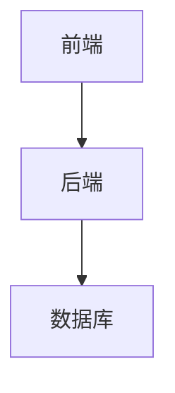

# 网络教学软件中的教学设计与应用

## 1.背景介绍

随着互联网和信息技术的快速发展,网络教学逐渐成为教育领域的一种新兴趋势。网络教学软件作为实现在线教育的重要工具,其教学设计和应用受到了广泛关注。网络教学软件不仅打破了时间和空间的限制,还提供了丰富的互动功能和多媒体资源,为教师和学生创造了全新的教与学方式。

在传统的面授教学中,教师和学生需要同时在同一个物理空间内进行教学活动。然而,网络教学软件使得教师和学生可以在不同地点、不同时间进行教学互动,极大地提高了教育资源的利用效率和覆盖范围。同时,网络教学软件还能够记录学习过程数据,为个性化学习和教学评估提供了有力支持。

## 2.核心概念与联系

网络教学软件的核心概念包括:

1. **在线课程**:通过网络教学软件提供的虚拟教室,教师可以制作和发布在线课程内容,包括课件、视频、测验等多种形式的教学资源。

2. **实时互动**:网络教学软件支持教师和学生之间的实时互动,包括文字聊天、语音讨论、视频会议等方式,实现远程实时教学。

3. **学习管理系统(LMS)**:学习管理系统是网络教学软件的核心部分,用于管理课程内容、学生注册、成绩记录、学习数据分析等功能。

4. **学习对象**:学习对象是指可重用的数字化教学资源单元,如课件、测验题、动画等,可以灵活组合形成在线课程。

5. **个性化学习**:网络教学软件可以根据学生的学习行为和表现,提供个性化的学习资源和学习路径,实现因材施教。

这些核心概念相互关联,共同构建了网络教学软件的整体架构和功能体系。

## 3.核心算法原理具体操作步骤

网络教学软件的核心算法原理主要包括以下几个方面:

### 3.1 内容管理算法

内容管理算法负责组织和管理网络课程的内容,包括文本、图像、视频、测验等多种形式的学习对象。常用的内容管理算法包括:

1. **内容索引算法**: 对课程内容进行分类和索引,方便快速检索和访问。
2. **内容组织算法**: 根据教学逻辑和学习目标,将学习对象组织成有序的课程结构。
3. **内容推荐算法**: 基于学生的学习行为和偏好,推荐相关的学习资源。

### 3.2 学习分析算法

学习分析算法旨在从学生的学习过程数据中提取有价值的信息,为个性化学习和教学决策提供支持。常见的学习分析算法包括:

1. **学习行为分析算法**: 分析学生的学习行为模式,如学习时间、学习路径、互动频率等。
2. **知识掌握度分析算法**: 评估学生对不同知识点的掌握程度,并提供个性化的学习建议。
3. **预测模型算法**: 基于历史数据,预测学生的学习表现和潜在风险,为教学干预提供依据。

### 3.3 智能教学算法

智能教学算法旨在提供个性化的教学策略和资源,优化教学效果。常见的智能教学算法包括:

1. **适应性教学算法**: 根据学生的知识水平、学习风格和偏好,动态调整教学内容和策略。
2. **智能辅导算法**: 模拟人工辅导员的行为,提供个性化的学习指导和反馈。
3. **协作学习算法**: 促进学生之间的协作学习,提高学习效率和互动体验。

这些算法原理通过具体的操作步骤在网络教学软件中得以实现,为教师和学生提供了高效、个性化的在线教育服务。

## 4.数学模型和公式详细讲解举例说明

在网络教学软件中,数学模型和公式扮演着重要的角色,为算法提供理论基础和计算支持。以下是一些常见的数学模型和公式:

### 4.1 内容推荐模型

内容推荐模型旨在为学生推荐最合适的学习资源。常用的推荐算法包括协同过滤算法和基于内容的推荐算法。

协同过滤算法基于用户之间的相似性,推荐其他相似用户喜欢的内容。可以使用皮尔逊相关系数或余弦相似度来度量用户之间的相似性:

$$
\text{sim}(u, v) = \frac{\sum_{i \in I}(r_{ui} - \bar{r}_u)(r_{vi} - \bar{r}_v)}{\sqrt{\sum_{i \in I}(r_{ui} - \bar{r}_u)^2}\sqrt{\sum_{i \in I}(r_{vi} - \bar{r}_v)^2}}
$$

其中,$ \text{sim}(u, v) $表示用户 u 和用户 v 的相似度,$ r_{ui} $和$ r_{vi} $分别表示用户 u 和用户 v 对项目 i 的评分,$ \bar{r}_u $和$ \bar{r}_v $分别表示用户 u 和用户 v 的平均评分。

基于内容的推荐算法则根据学习资源的内容特征和学生的偏好进行推荐。可以使用 TF-IDF 算法计算文本特征向量,然后基于余弦相似度计算相似性:

$$
\text{sim}(d_1, d_2) = \frac{\vec{d}_1 \cdot \vec{d}_2}{|\vec{d}_1| \cdot |\vec{d}_2|}
$$

其中,$ \text{sim}(d_1, d_2) $表示文档$ d_1 $和文档$ d_2 $的相似度,$ \vec{d}_1 $和$ \vec{d}_2 $分别表示文档$ d_1 $和文档$ d_2 $的特征向量。

### 4.2 知识掌握度模型

知识掌握度模型用于评估学生对不同知识点的掌握程度,常用的模型包括 Bayesian Knowledge Tracing (BKT) 模型和 Performance Factors Analysis (PFA) 模型。

BKT 模型基于隐马尔可夫模型,通过观察学生的练习表现来估计其对每个知识点的掌握概率。对于知识点 k,学生的掌握概率$ P(L_t^k = 1) $可以通过以下公式计算:

$$
\begin{align}
P(L_t^k = 1 | L_{t-1}^k = 0, r_t^k = 1) &= P(T^k) \\
P(L_t^k = 1 | L_{t-1}^k = 1, r_t^k = 0) &= P(S^k) \\
P(L_t^k = 1 | L_{t-1}^k = 1, r_t^k = 1) &= 1 \\
P(L_t^k = 0 | L_{t-1}^k = 0, r_t^k = 0) &= 1 - P(T^k)
\end{align}
$$

其中,$ P(T^k) $表示学习知识点 k 的概率,$ P(S^k) $表示遗忘知识点 k 的概率,$ r_t^k $表示学生在时间 t 对知识点 k 的练习表现(正确或错误)。

PFA 模型则将学生的表现分解为多个影响因素,如知识掌握度、练习难度、学生能力等,通过logistic回归模型估计每个因素的权重:

$$
\log \frac{P(r_{ij} = 1)}{1 - P(r_{ij} = 1)} = \beta_0 + \beta_1 \cdot \text{student}_i + \beta_2 \cdot \text{exercise}_j + \beta_3 \cdot \text{skill}_k + \cdots
$$

其中,$ r_{ij} $表示学生 i 对练习 j 的表现,$ \text{student}_i $、$ \text{exercise}_j $和$ \text{skill}_k $分别表示学生能力、练习难度和知识掌握度等影响因素。

通过这些数学模型和公式,网络教学软件可以更准确地评估学生的知识水平,提供个性化的学习资源和路径。

## 5.项目实践:代码实例和详细解释说明

为了更好地理解网络教学软件的实现,我们以一个简单的在线测试系统为例,介绍其中的关键代码和实现细节。

### 5.1 系统架构

该在线测试系统采用了典型的三层架构,包括表现层(前端)、业务逻辑层(后端)和数据访问层。前端使用 React 框架开发,后端使用 Node.js 和 Express 框架开发,数据库使用 MongoDB。



### 5.2 前端实现

前端使用 React 框架开发,主要包括以下几个关键组件:

1. **TestList 组件**: 显示所有可用的测试列表,用户可以选择参加测试。

```jsx
import React, { useEffect, useState } from 'react';
import axios from 'axios';

const TestList = () => {
  const [tests, setTests] = useState([]);

  useEffect(() => {
    axios.get('/api/tests')
      .then(res => setTests(res.data))
      .catch(err => console.error(err));
  }, []);

  return (
    <div>
      <h2>可用测试列表</h2>
      <ul>
        {tests.map(test => (
          <li key={test._id}>
            <a href={`/test/${test._id}`}>{test.name}</a>
          </li>
        ))}
      </ul>
    </div>
  );
};

export default TestList;
```

2. **TestView 组件**: 显示测试题目,用户可以作答并提交。

```jsx
import React, { useState, useEffect } from 'react';
import axios from 'axios';

const TestView = ({ match }) => {
  const [test, setTest] = useState(null);
  const [answers, setAnswers] = useState({});

  useEffect(() => {
    axios.get(`/api/tests/${match.params.id}`)
      .then(res => setTest(res.data))
      .catch(err => console.error(err));
  }, [match.params.id]);

  const handleAnswerChange = (questionId, answer) => {
    setAnswers({ ...answers, [questionId]: answer });
  };

  const handleSubmit = () => {
    axios.post(`/api/tests/${match.params.id}/submit`, answers)
      .then(res => {
        alert(`您的分数是: ${res.data.score}`);
      })
      .catch(err => console.error(err));
  };

  if (!test) {
    return <div>加载中...</div>;
  }

  return (
    <div>
      <h2>{test.name}</h2>
      {test.questions.map(question => (
        <div key={question._id}>
          <p>{question.text}</p>
          {question.options.map(option => (
            <div key={option._id}>
              <input
                type="radio"
                name={`question-${question._id}`}
                value={option.value}
                onChange={() => handleAnswerChange(question._id, option.value)}
              />
              <label>{option.text}</label>
            </div>
          ))}
        </div>
      ))}
      <button onClick={handleSubmit}>提交</button>
    </div>
  );
};

export default TestView;
```

### 5.3 后端实现

后端使用 Node.js 和 Express 框架开发,主要包括以下几个关键路由:

1. **获取测试列表**:

```javascript
const express = require('express');
const router = express.Router();
const Test = require('../models/test');

router.get('/tests', async (req, res) => {
  try {
    const tests = await Test.find({}, 'name');
    res.json(tests);
  } catch (err) {
    res.status(500).json({ message: err.message });
  }
});
```

2. **获取测试详情**:

```javascript
router.get('/tests/:id', getTest, (req, res) => {
  res.json(res.test);
});

async function getTest(req, res, next) {
  let test;
  try {
    test = await Test.findById(req.params.id);
    if (test == null) {
      return res.status(404).json({ message: 'Cannot find test' });
    }
  } catch (err) {
    return res.status(500).json({ message: err.message });
  }

  res.test = test;
  next();
}
```

3. **提交测试答案**:

```javascript
router.post('/tests/:id/submit', getTest, async (req, res) => {
  const answers = req.body;
  let score = 0;

  res.test.questions.forEach(question => {
    if (answers[question._id] === question.answer) {
      score++;
    }
  });

  res.json({ score });
});
```

### 5.4 数据库模型

该系统使用 MongoDB 作