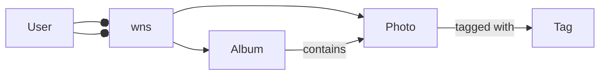

# 网络相册管理系统详细设计与具体代码实现

## 1. 背景介绍

在数字时代,随着智能手机和数码相机的普及,人们拍摄和收集的照片数量呈爆炸式增长。如何有效地管理和分享这些照片成为了一个亟待解决的问题。传统的本地存储方式已经无法满足人们的需求,因此开发一个功能完善、易于使用的网络相册管理系统变得尤为重要。

本文将详细介绍一个网络相册管理系统的设计与实现。该系统采用了当前流行的Web技术和架构,力求为用户提供一个高效、稳定、安全的照片管理平台。

### 1.1 系统目标

本网络相册管理系统的主要目标包括:

1. 提供用户友好的界面,方便用户上传、浏览、管理照片。
2. 支持多用户注册和登录,每个用户拥有独立的照片库。  
3. 实现照片的分类、标签、搜索等功能,便于用户快速查找所需照片。
4. 允许用户创建相册,对照片进行分组管理。
5. 提供照片的分享功能,用户可以方便地与他人分享照片。
6. 确保系统的安全性,保护用户的隐私和数据安全。

### 1.2 技术选型

为了实现上述目标,本系统采用了以下技术:

- 前端:HTML5、CSS3、JavaScript、Vue.js
- 后端:Node.js、Express.js
- 数据库:MongoDB
- 对象存储:阿里云OSS
- 身份验证:JWT(JSON Web Token)

选择这些技术的原因如下:

- Vue.js是一款流行的前端框架,其易学易用、高效灵活的特点非常适合此类项目。
- Node.js和Express.js搭建的后端服务轻量高效,非常适合中小型Web应用。
- MongoDB是一个灵活的NoSQL数据库,支持高效的数据存取和弹性扩展。
- 阿里云OSS提供了可靠、安全、低成本的对象存储服务,可以妥善保管用户上传的照片。
- JWT是一种基于Token的身份验证方案,实现简单,服务端无状态,非常适合分布式Web应用。

## 2. 核心概念与联系

在介绍系统设计之前,我们先来了解一下本系统涉及的几个核心概念:

### 2.1 用户(User)

用户是系统的核心实体之一。每个用户都有一个唯一的账号,包含用户名、密码等基本信息。用户可以上传、管理自己的照片,也可以浏览其他用户分享的照片。

### 2.2 照片(Photo)

照片是系统的另一个核心实体。每张照片都属于一个特定的用户,包含图像数据、拍摄时间、拍摄地点等元信息。照片可以被归入相册,添加标签,以方便管理和检索。

### 2.3 相册(Album) 

相册是照片的容器,用于将照片分组。每个相册都属于一个特定的用户,拥有名称、描述、封面等属性。用户可以创建、删除、重命名相册,也可以在相册中添加或删除照片。

### 2.4 标签(Tag)

标签是描述照片属性的关键词,如"风景"、"人物"、"生活"等。一张照片可以拥有多个标签,一个标签也可以属于多张照片。用户可以通过标签来快速检索照片。

下图展示了这些核心概念之间的关系:



## 3. 核心算法原理具体操作步骤

本节将介绍系统中使用的几个核心算法,包括照片上传、照片检索和推荐算法。

### 3.1 照片上传算法

照片上传是系统的一个关键功能。为了确保上传效率和数据安全,我们采用了分块上传和断点续传的策略。具体步骤如下:

1. 选择要上传的照片文件。
2. 将文件切分成固定大小(如5MB)的块。
3. 计算每个块的MD5哈希值。
4. 检查服务端是否已存在相同哈希值的块。若存在,则跳过该块的上传。
5. 依次上传各个块到服务端。若上传中断,下次可从断点处继续上传。
6. 上传完成后,通知服务端合并各个块成完整的照片文件。

这个算法可以有效利用网络带宽,减少重复上传,提高上传效率和成功率。

### 3.2 照片检索算法

照片检索是另一个常用功能。用户可以通过关键词、标签、拍摄时间等条件来搜索照片。我们采用了倒排索引技术来加速搜索。具体步骤如下:

1. 建立标签到照片ID的倒排索引。
2. 建立照片名称、描述等文本信息到照片ID的倒排索引。
3. 用户输入搜索条件,如关键词"风景"。
4. 在倒排索引中查找包含关键词的照片ID列表。
5. 根据照片ID列表从数据库中获取照片的详细信息。
6. 将搜索结果返回给用户。

倒排索引的核心思想是用属性值来查找数据记录,而不是遍历每条记录来匹配属性值,因此大大提高了检索效率。

### 3.3 照片推荐算法

为了增强用户体验,我们还设计了一个简单的照片推荐算法。该算法基于用户的历史行为(如浏览、点赞等)和照片的属性(如标签、拍摄地点等)来给用户推荐感兴趣的照片。具体步骤如下:

1. 收集用户的历史行为数据,构建用户画像。
2. 对每张照片,提取其属性特征。
3. 计算用户画像与每张照片的相似度得分。
4. 选取得分最高的Top-N张照片作为推荐结果。
5. 定期更新用户画像和推荐结果。

该算法虽然简单,但可以一定程度上提高用户的粘性和活跃度。未来可以考虑引入协同过滤等更高级的推荐算法。

## 4. 数学模型和公式详细讲解举例说明

本节我们将详细讲解系统中用到的一些数学模型和公式,并给出具体的例子。

### 4.1 照片相似度计算

在照片推荐算法中,我们需要计算用户画像与照片属性的相似度。一种常用的相似度度量是余弦相似度(Cosine Similarity)。假设用户画像和照片属性都用一个N维向量表示,则它们的余弦相似度定义为:

$$
\text{similarity} = \cos(\theta) = \frac{\mathbf{A} \cdot \mathbf{B}}{\|\mathbf{A}\| \|\mathbf{B}\|} = \frac{\sum_{i=1}^N A_i B_i}{\sqrt{\sum_{i=1}^N A_i^2} \sqrt{\sum_{i=1}^N B_i^2}}
$$

其中$\mathbf{A}$和$\mathbf{B}$分别是用户画像和照片属性向量,$A_i$和$B_i$是它们的第$i$个分量。

举个例子,假设用户画像向量为$(0.5, 0.3, 0.2)$,某张照片的属性向量为$(0.6, 0.1, 0.3)$,则它们的余弦相似度为:

$$
\text{similarity} = \frac{0.5 \times 0.6 + 0.3 \times 0.1 + 0.2 \times 0.3}{\sqrt{0.5^2 + 0.3^2 + 0.2^2} \sqrt{0.6^2 + 0.1^2 + 0.3^2}} \approx 0.94
$$

可见这张照片与用户的兴趣非常接近,可以作为推荐的候选。

### 4.2 照片压缩

为了节省存储空间和加快传输速度,我们通常需要对照片进行压缩。一种常用的压缩方法是JPEG(Joint Photographic Experts Group)。JPEG的核心思想是利用人眼对高频信号不敏感的特点,在频域上对图像进行量化和编码。其主要步骤如下:

1. 将图像分块,每块大小为8x8像素。
2. 对每个块进行离散余弦变换(DCT),将其从空间域转到频域。
3. 对DCT系数进行量化,高频系数被量化得更多。量化步长决定了压缩率和质量的平衡。
4. 对量化后的DCT系数进行Zig-Zag扫描,并应用游程编码(RLE)和哈夫曼编码进行熵编码。
5. 将编码结果写入JPEG文件。

举个例子,假设一个8x8的像素块如下:

$$
\begin{bmatrix}
  52 & 55 & 61 & 66 & 70 & 61 & 64 & 73 \\
  63 & 59 & 55 & 90 & 109 & 85 & 69 & 72 \\
  62 & 59 & 68 & 113 & 144 & 104 & 66 & 73 \\
  63 & 58 & 71 & 122 & 154 & 106 & 70 & 69 \\
  67 & 61 & 68 & 104 & 126 & 88 & 68 & 70 \\
  79 & 65 & 60 & 70 & 77 & 68 & 58 & 75 \\
  85 & 71 & 64 & 59 & 55 & 61 & 65 & 83 \\
  87 & 79 & 69 & 68 & 65 & 76 & 78 & 94
\end{bmatrix}
$$

对它进行DCT变换,并用一个量化矩阵(如JPEG标准的亮度量化表)进行量化,得到:

$$
\begin{bmatrix}
  6 & 1 & -1 & -1 & 0 & 0 & 0 & 0 \\
  -2 & -1 & 0 & 0 & 0 & 0 & 0 & 0 \\
  0 & 0 & 0 & 0 & 0 & 0 & 0 & 0 \\
  0 & 0 & 0 & 0 & 0 & 0 & 0 & 0 \\
  0 & 0 & 0 & 0 & 0 & 0 & 0 & 0 \\
  0 & 0 & 0 & 0 & 0 & 0 & 0 & 0 \\
  0 & 0 & 0 & 0 & 0 & 0 & 0 & 0 \\
  0 & 0 & 0 & 0 & 0 & 0 & 0 & 0
\end{bmatrix}
$$

可见大部分高频系数已经变为0,从而达到了压缩的目的。后续的熵编码会进一步减小数据量。

## 5. 项目实践：代码实例和详细解释说明

本节我们将展示系统的部分核心代码,并进行详细的解释说明。

### 5.1 用户注册和登录

首先是用户注册和登录的后端代码(使用Node.js和Express.js):

```javascript
// 用户注册
app.post('/api/register', async (req, res) => {
  const { username, password } = req.body;
  
  // 检查用户名是否已存在
  const existingUser = await User.findOne({ username });
  if (existingUser) {
    return res.status(409).json({ message: '用户名已存在' });    
  }
  
  // 创建新用户
  const hashedPassword = await bcrypt.hash(password, 10);
  const newUser = new User({ username, password: hashedPassword });
  await newUser.save();
  
  res.status(201).json({ message: '注册成功' });
});

// 用户登录
app.post('/api/login', async (req, res) => {
  const { username, password } = req.body;
  
  // 查找用户
  const user = await User.findOne({ username });
  if (!user) {
    return res.status(401).json({ message: '用户名或密码错误' });
  }
  
  // 验证密码
  const isMatch = await bcrypt.compare(password, user.password);
  if (!isMatch) {
    return res.status(401).json({ message: '用户名或密码错误' });
  }
  
  // 生成JWT token
  const token = jwt.sign({ userId: user._id }, process.env.JWT_SECRET);
  res.json({ token });  
});
```

这段代码实现了用户注册和登录的API。其中的关键点包括:

- 注册时检查用户名是否已存在,避免