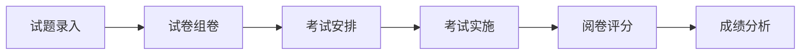

# 考试管理系统详细设计与具体代码实现

## 1. 背景介绍
### 1.1 考试管理系统的重要性
在现代教育领域,考试是评估学生学习效果和教学质量的重要手段。传统的考试管理方式存在诸多问题,如试卷印刷和分发成本高、考试组织流程复杂、成绩统计和分析效率低等。因此,开发一套高效、智能、安全的考试管理系统势在必行。

### 1.2 考试管理系统的主要功能
一个完善的考试管理系统需要具备以下主要功能:

1. 试题管理:包括试题的录入、审核、分类、组卷等
2. 考试安排:包括考试计划制定、考场设置、监考教师安排等  
3. 考试实施:包括考生信息核对、试卷分发、考试时间控制、作弊监测等
4. 阅卷管理:包括主观题在线阅卷、客观题自动判卷、成绩录入与审核等
5. 成绩分析:包括成绩统计、学情分析、试题质量分析等
6. 系统管理:包括用户权限管理、系统日志管理、数据备份与恢复等

### 1.3 考试管理系统的技术选型
为了实现上述功能,考试管理系统在技术选型上主要考虑以下几个方面:

1. Web框架:选择成熟稳定、社区活跃的Web框架,如Spring Boot、Django等
2. 前端技术:采用主流的前端技术如Vue.js、React等,搭配UI组件库如Element UI、Ant Design提升开发效率 
3. 数据库:选择可扩展性好、支持丰富数据类型的数据库如MySQL、PostgreSQL等
4. 缓存:引入缓存中间件如Redis提升系统性能
5. 安全防护:采用加密算法、权限控制、风控策略等保障系统和数据安全
6. 部署架构:采用前后端分离架构,引入微服务、容器化等技术便于系统扩展和运维

## 2. 核心概念与联系
### 2.1 考试管理领域模型
在考试管理系统中,核心领域概念包括:

- Exam(考试):一次考试活动的基本单位
- Subject(科目):考试涉及的学科门类
- Paper(试卷):由题目组成的考卷
- Question(试题):考题的最小单位,可分为客观题和主观题
- Examinee(考生):参加考试的学生
- Room(考场):考试活动进行的物理场所
- Invigilator(监考教师):负责考场秩序和考务工作的教师
- Answer(答卷):考生在规定时间内完成的试卷
- Score(分数):考生答卷的评判结果

### 2.2 考试管理业务流程
考试管理的基本业务流程如下:



1. 试题录入:教师根据教学大纲录入各类试题,再经过审核入库
2. 试卷组卷:根据考试科目、难度等要求,自动或人工从题库抽取试题形成试卷
3. 考试安排:根据教学计划制定考试时间、地点,分配考场和监考教师
4. 考试实施:准备考场,核验考生身份,分发试卷,控制考试时间,监控考场秩序等
5. 阅卷评分:客观题自动判分,主观题由教师在线阅卷,汇总形成考生成绩
6. 成绩分析:对成绩数据进行统计分析,生成各类报表,为教学改进提供数据支撑

## 3. 核心算法原理具体操作步骤
### 3.1 自动组卷算法
传统人工组卷方式费时费力,采用自动组卷算法可显著提高组卷效率和试卷质量。自动组卷算法需要考虑试题的难度、区分度、覆盖知识点等因素,以下是一种基于遗传算法的自动组卷流程:

1. 初始化种群:随机从题库中选取若干试题组成一定数量的个体
2. 适应度评估:根据试卷质量评估函数计算每个个体的适应度
3. 选择操作:适应度高的个体被选中并遗传到下一代的概率更大
4. 交叉操作:选择两个父代个体,在某些位置交换试题形成新的子代个体 
5. 变异操作:对某些个体的某些试题进行替换,引入新的试题基因
6. 终止条件判断:如果达到预设的进化代数或试卷质量标准则终止,否则回到步骤2
7. 输出结果:适应度最高的个体即为自动组卷的结果

### 3.2 考试防作弊算法
考试作弊现象严重影响考试的公平性,需要从试卷生成、身份验证、数据加密、行为分析等多个环节入手综合防控。

1. 试卷水印:在试卷上添加考生姓名、考号等隐藏水印,防止试卷外泄
2. 人脸识别:通过摄像头采集考生人脸数据,与考生档案比对核验身份
3. 试题加密:对试题内容进行加密,只有考试开始后自动解密,防止试题提前泄露
4. 答案加密:考生提交答案时即时加密,防止他人窃取答案
5. 作弊行为分析:通过机器学习算法分析考生答题时间、答题轨迹等,识别出作弊嫌疑
6. 答案相似度分析:通过自然语言处理算法比对考生答案的相似度,识别出抄袭嫌疑

## 4. 数学模型和公式详细讲解举例说明
### 4.1 试卷质量评估模型
自动组卷需要建立试卷质量评估模型,通过数学公式量化计算试卷质量,为遗传算法的适应度评估提供参考。试卷质量评估的因素包括:

- 试卷难度:试题难度的加权平均值
- 试卷区分度:试题区分度的加权平均值
- 知识点覆盖率:试卷覆盖教学大纲知识点的比例
- 题型比例:不同题型的分值占比是否符合要求

设第 $i$ 题的难度为 $d_i$,第 $i$ 题的区分度为 $r_i$,第 $i$ 题的分值为 $s_i$,知识点覆盖向量为 $\vec{k}=(k_1,k_2,...,k_m)$,其中 $k_j=1$ 表示覆盖了第 $j$ 个知识点,否则为0。理想的试卷质量指标为难度 $\bar{d}$,区分度 $\bar{r}$,知识点覆盖率 $\bar{c}$,题型分值比例向量为 $\vec{p}=(p_1,p_2,...,p_n)$。

则试卷质量评估函数可以定义为:

$$
Q = w_1 \cdot \frac{|\sum_{i=1}^{n}d_i s_i - \bar{d}|}{\bar{d}} + w_2 \cdot \frac{|\sum_{i=1}^{n}r_i s_i - \bar{r}|}{\bar{r}}
+ w_3 \cdot \frac{|\sum_{j=1}^{m}k_j - m\bar{c}|}{m\bar{c}} + w_4 \cdot \sum_{l=1}^{n}\frac{|\frac{\sum_{i=1}^{n}s_i \cdot I_{il}}{\sum_{i=1}^{n}s_i} - p_l|}{p_l}
$$

其中 $w_1,w_2,w_3,w_4$ 为四个指标的权重系数,$I_{il}$ 是示性函数,当第 $i$ 题属于第 $l$ 种题型时为1,否则为0。$Q$ 值越小,代表试卷质量越高。

### 4.2 考生答题相似度模型
为了识别出作弊嫌疑,需要度量考生答题的相似程度。可以采用余弦相似度、编辑距离等方法度量两份答卷的相似度。

设答卷 $A$ 和 $B$ 对应的 $n$ 道题的得分向量分别为 $\vec{a}=(a_1,a_2,...,a_n)$ 和 $\vec{b}=(b_1,b_2,...,b_n)$,则余弦相似度为:

$$
\cos \theta = \frac{\vec{a} \cdot \vec{b}}{|\vec{a}||\vec{b}|} = \frac{\sum_{i=1}^{n}a_i b_i}{\sqrt{\sum_{i=1}^{n}a_i^2} \sqrt{\sum_{i=1}^{n}b_i^2}}
$$

余弦相似度的取值范围为 $[-1,1]$,值越大表示两个向量越相似。

对于主观题的答案,还可以通过编辑距离等方法度量文本相似度。设答案 $A$ 和 $B$ 的编辑距离为 $d(A,B)$,它表示将 $A$ 转换为 $B$ 所需的最少字符操作(插入、删除、替换)次数。利用动态规划算法可以高效计算编辑距离:

$$
d(i,j)=
\begin{cases}
\max(i,j) & \text{if} \min(i,j)=0\\
\min \begin{cases}
d(i-1,j) + 1\\
d(i,j-1) + 1\\
d(i-1,j-1) + I(A_i \neq B_j) 
\end{cases} & \text{otherwise}
\end{cases}
$$

其中 $d(i,j)$ 表示 $A$ 的前 $i$ 个字符和 $B$ 的前 $j$ 个字符的编辑距离,$I$ 为示性函数。最终 $d(|A|,|B|)$ 即为两个答案的编辑距离,可以用来度量文本相似程度。

## 5. 项目实践:代码实例和详细解释说明
下面以试题管理和自动组卷模块为例,给出核心代码实现。

### 5.1 试题管理
试题管理包括试题的增删改查等基本操作,下面是使用Spring Boot和MyBatis实现的代码:

```java
@Data
public class Question {
    private Long id;         // 试题编号
    private String type;     // 题型(选择、填空、简答等)
    private String content;  // 题干
    private String answer;   // 参考答案
    private Integer score;   // 分值
    private Double difficulty; // 难度(0-1)
    private Double distinction; // 区分度(0-1) 
    // 其他属性...
}

@Repository
public interface QuestionMapper {
    @Insert("INSERT INTO question(type, content, answer, score, difficulty, distinction) VALUES" +
            "(#{type}, #{content}, #{answer}, #{score}, #{difficulty}, #{distinction})")
    void addQuestion(Question question);
    
    @Select("SELECT * FROM question WHERE id=#{id}")
    Question getQuestionById(Long id);
    
    @Update("UPDATE question SET type=#{type}, content=#{content}, answer=#{answer}, score=#{score}, " + 
            "difficulty=#{difficulty}, distinction=#{distinction} WHERE id=#{id}")
    void updateQuestion(Question question);
    
    @Delete("DELETE FROM question WHERE id=#{id}")
    void deleteQuestion(Long id);
    
    @Select("SELECT * FROM question LIMIT #{offset}, #{limit}")
    List<Question> getQuestions(@Param("offset") int offset, @Param("limit") int limit);
    
    // 其他查询方法...
}

@Service
public class QuestionService {
    @Autowired
    private QuestionMapper questionMapper;
    
    @Transactional
    public void addQuestion(Question question) {
        // 参数校验等逻辑
        questionMapper.addQuestion(question);
    }
    
    public Question getQuestionById(Long id) {
        return questionMapper.getQuestionById(id);
    }
    
    @Transactional
    public void updateQuestion(Question question) {
        // 参数校验等逻辑
        questionMapper.updateQuestion(question);
    }
    
    @Transactional
    public void deleteQuestion(Long id) {
        questionMapper.deleteQuestion(id);
    }
    
    public List<Question> getQuestions(int pageNum, int pageSize) {
        int offset = (pageNum - 1) * pageSize;
        return questionMapper.getQuestions(offset, pageSize); 
    }
    
    // 其他业务方法...
}
```

### 5.2 自动组卷
自动组卷基于遗传算法,下面是使用Java实现的核心代码:

```java
@Data
@AllArgsConstructor
public class Paper {
    private List<Question> questions; // 试卷包含的试题
    private double difficulty;   // 试卷难度
    private double distinction;  // 试卷区分度
    private double coverage;     // 知识点覆