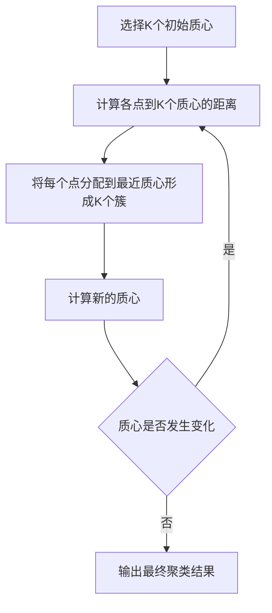
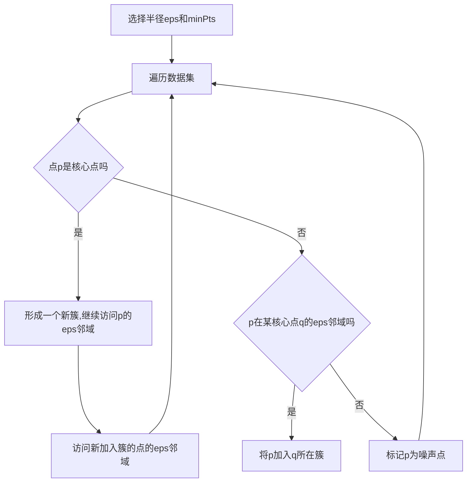

# 聚类算法(Clustering Algorithms) - 原理与代码实例讲解

## 1.背景介绍

### 1.1 什么是聚类

聚类(Clustering)是一种无监督学习技术,旨在将数据集中的对象划分为多个"簇"(clusters),使得同一簇中的对象彼此相似,而不同簇中的对象彼此不相似。聚类广泛应用于多个领域,如生物学、计算机科学、商业智能、城市规划等。

### 1.2 聚类的应用场景

- 客户细分(Customer Segmentation)
- 计算机视觉与图像分割
- 文档分类与网页聚类
- 基因表达数据分析
- 异常检测(Anomaly Detection)

### 1.3 聚类算法的评估指标

- 簇内相似度(Intra-cluster Similarity)
- 簇间差异度(Inter-cluster Differences)
- 簇的连通性(Cluster Connectivity)
- 簇的紧凑性(Cluster Compactness)

## 2.核心概念与联系

### 2.1 距离度量

衡量数据对象间相似性的关键是距离度量(Distance Metric),常用的有:

- 欧几里得距离(Euclidean Distance)
- 曼哈顿距离(Manhattan Distance)
- 夹角余弦(Cosine Similarity)

### 2.2 聚类算法分类

按聚类过程,可分为:

- 分区聚类(Partitioning Clustering)
- 层次聚类(Hierarchical Clustering) 
- 密度聚类(Density-based Clustering)
- 基于模型的聚类(Model-based Clustering)

### 2.3 核心算法

常见的聚类算法包括:

- K-Means聚类
- K-Medoids聚类 
- DBSCAN聚类
- 均值漂移聚类(Mean Shift)
- 高斯混合模型(Gaussian Mixture Models)
- 谱聚类(Spectral Clustering)

## 3.核心算法原理具体操作步骤

### 3.1 K-Means聚类

K-Means是最经典的分区聚类算法,具体步骤如下:



### 3.2 DBSCAN聚类 

DBSCAN是基于密度的聚类算法,核心思想是:

1. 高密度区域中的点为核心点
2. 低密度区域中的点为噪声点
3. 核心点邻域内的非核心点为边界点

具体步骤:



## 4.数学模型和公式详细讲解举例说明

### 4.1 K-Means目标函数

K-Means的目标是最小化所有簇内点到质心的平方距离之和:

$$J = \sum_{i=1}^{K}\sum_{x \in C_i}||x - \mu_i||^2$$

其中:
- $K$是簇的数量
- $C_i$是第$i$个簇
- $\mu_i$是第$i$个簇的质心
- $||x - \mu_i||$是$x$到$\mu_i$的欧几里得距离

### 4.2 DBSCAN核心概念

DBSCAN的核心概念是$\epsilon$-邻域和核心对象:

- $\epsilon$-邻域: 对于点$p$,其$\epsilon$-邻域是以$p$为中心,$\epsilon$为半径的超球体内的所有点的集合。
- 核心对象: 如果点$p$的$\epsilon$-邻域中至少有$MinPts$个点,则$p$是核心对象。

### 4.3 高斯混合模型(GMM)

GMM假设数据由多个高斯分布生成,其概率密度函数为:

$$p(x) = \sum_{i=1}^{K}\pi_i\mathcal{N}(x|\mu_i,\Sigma_i)$$

其中:
- $K$是高斯分布的数量
- $\pi_i$是第$i$个分布的先验概率,满足$\sum_{i=1}^{K}\pi_i=1$
- $\mathcal{N}(x|\mu_i,\Sigma_i)$是第$i$个分布的高斯密度函数

## 5.项目实践：代码实例和详细解释说明

### 5.1 K-Means Python实现

```python
import numpy as np

def kmeans(X, k, max_iters=100):
    # 初始化质心
    centroids = X[np.random.choice(X.shape[0], k, replace=False)]
    
    for _ in range(max_iters):
        # 分配每个点到最近的质心
        clusters = [[] for _ in range(k)]
        for x in X:
            distances = [np.linalg.norm(x - c) for c in centroids]
            cluster = np.argmin(distances)
            clusters[cluster].append(x)
        
        # 更新质心
        new_centroids = []
        for cluster in clusters:
            new_centroids.append(np.mean(cluster, axis=0))
        
        # 检查质心是否发生变化
        if np.array_equal(centroids, new_centroids):
            break
        centroids = new_centroids
    
    return centroids, clusters
```

上述代码实现了K-Means算法,具体步骤如下:

1. 初始化$k$个质心
2. 遍历数据集,将每个点分配到最近的质心所在的簇
3. 计算每个簇的新质心
4. 检查质心是否发生变化,如果没有则终止迭代
5. 返回最终的质心和簇分配结果

### 5.2 DBSCAN Python实现 

```python
import numpy as np

def dbscan(X, eps, min_samples):
    n = len(X)
    visited = [False] * n
    clusters = []
    noise = []
    
    for i in range(n):
        if not visited[i]:
            visited[i] = True
            neighbors = get_neighbors(X, i, eps)
            
            if len(neighbors) < min_samples:
                noise.append(X[i])
            else:
                cluster = [X[i]]
                for j in neighbors:
                    if not visited[j]:
                        visited[j] = True
                        neighbors2 = get_neighbors(X, j, eps)
                        if len(neighbors2) >= min_samples:
                            neighbors.extend(neighbors2)
                    if not X[j] in noise:
                        cluster.append(X[j])
                clusters.append(cluster)
    
    return clusters, noise

def get_neighbors(X, i, eps):
    neighbors = []
    for j in range(len(X)):
        if np.linalg.norm(X[i] - X[j]) < eps:
            neighbors.append(j)
    return neighbors
```

上述代码实现了DBSCAN算法,具体步骤如下:

1. 遍历数据集,对每个未访问的点:
    - 计算其$\epsilon$-邻域
    - 如果$\epsilon$-邻域点数小于$MinPts$,则标记为噪声点
    - 否则形成一个新簇,并递归访问$\epsilon$-邻域内的点
2. 返回最终的簇和噪声点

## 6.实际应用场景

### 6.1 客户细分

利用客户的购买记录、人口统计学信息等数据,对客户进行细分,从而制定有针对性的营销策略。

### 6.2 图像分割

在计算机视觉领域,可以将图像像素点聚类,从而将图像分割为不同的区域,用于目标检测、图像分类等任务。

### 6.3 异常检测

DBSCAN等基于密度的聚类算法可用于异常检测,将低密度区域的点识别为异常值。

## 7.工具和资源推荐

- Python Scikit-learn库: 提供了多种聚类算法的实现
- R语言:拥有多个用于聚类分析的包,如cluster、fpc等
- WEKA: 一款流行的数据挖掘软件,包含多种聚类算法
- 在线聚类可视化工具: 如https://stanford.edu/~cpiech/cs221/apps/clusteringApp.html

## 8.总结:未来发展趋势与挑战

### 8.1 大规模数据集聚类

随着数据量的快速增长,如何在大规模数据集上高效地执行聚类是一个巨大的挑战。需要研究新的分布式算法和近似算法。

### 8.2 高维数据聚类

在高维空间中,距离度量的意义会被削弱,导致聚类性能下降。需要研究新的相似性度量方法。

### 8.3 异构数据聚类 

现实世界的数据通常是异构的,包含不同类型的属性。如何有效地聚类异构数据是一个值得关注的方向。

### 8.4 聚类与深度学习的结合

将聚类算法与深度学习相结合,利用深度神经网络自动学习数据表示,有望提高聚类性能。

## 9.附录:常见问题与解答

### 9.1 如何选择聚类算法?

选择聚类算法时,需要考虑数据的性质、所需的聚类类型(分层或平面)、可用的先验知识、计算效率等因素。同时,也可以尝试多种算法,对比性能。

### 9.2 如何确定最佳簇数K?

有多种启发式方法,如肘部法则、轮廓系数等。也可以根据具体应用场景,利用领域知识或交叉验证的方式确定K值。

### 9.3 聚类结果的评估方法?

可以使用内部评估指标,如簇内平方和、轮廓系数等,或外部评估指标(当有ground truth标签时),如纯度、Rand指数等。

### 9.4 如何处理异常值?

异常值会影响聚类结果。可以先使用基于密度或基于模型的方法检测并移除异常值,也可以使用鲁棒性更好的算法,如K-Medoids。

作者: 禅与计算机程序设计艺术 / Zen and the Art of Computer Programming