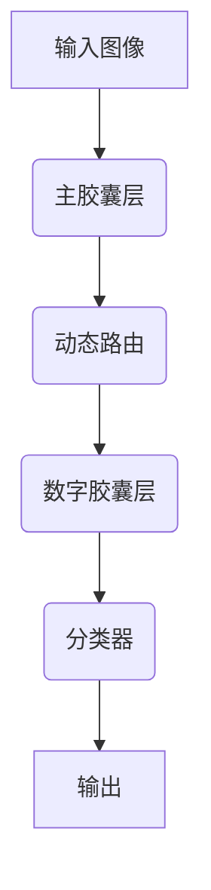

# 胶囊网络 原理与代码实例讲解

## 1.背景介绍

在深度学习领域中,卷积神经网络(CNN)已经取得了巨大的成功,在图像分类、目标检测和语音识别等任务中表现出色。然而,CNN在处理空间层次结构时存在一些固有的局限性。为了解决这些问题,一种新的神经网络架构——胶囊网络(Capsule Network)应运而生。

胶囊网络是由Geoffrey Hinton等人于2017年提出的,旨在更好地捕捉特征之间的空间层次关系,并通过动态路由机制增强表示的鲁棒性。与CNN不同,胶囊网络不是学习像素级的特征,而是学习更高级的实体表示,称为"胶囊"。

传统的CNN在处理高维度数据时存在一些缺陷,例如对旋转和缩放等仿射变换不够鲁棒。另一方面,胶囊网络通过编码实体的位置、姿态等属性,从而更好地捕捉特征之间的层次关系,提高了模型的泛化能力。

## 2.核心概念与联系

### 2.1 胶囊(Capsule)

胶囊是胶囊网络中的基本单元,它是一组神经元的向量,用于编码特定类型实体的存在及其各种属性,如位置、大小、方向等。每个胶囊的输出向量的长度表示实体存在的概率,向量的方向则编码了实体的各种属性。

与传统神经网络中的标量神经元不同,胶囊网络中的神经元是向量值,能够更好地捕捉实体的各种属性。这种向量化的表示方式使得胶囊网络能够更好地处理空间层次结构和变换不变性。

### 2.2 动态路由(Dynamic Routing)

动态路由是胶囊网络中的一个关键机制,用于确定不同层次胶囊之间的连接强度。在传统CNN中,不同层次的特征图是通过手工设计的卷积核进行连接的。而在胶囊网络中,不同层次的胶囊是通过动态路由算法自动学习连接强度的。

动态路由算法通过迭代地调整不同胶囊之间的连接强度,最终确定哪些低层次胶囊应该被路由到哪些高层次胶囊。这种动态的连接方式使得胶囊网络能够更好地捕捉实体之间的层次关系,提高了模型的表示能力。

### 2.3 Mermaid流程图

上图展示了胶囊网络的基本架构。输入图像首先经过主胶囊层提取初级特征,然后通过动态路由机制确定不同胶囊之间的连接强度,最终在数字胶囊层形成对实体的高级表示,并输入到分类器进行预测。

## 3.核心算法原理具体操作步骤

胶囊网络的核心算法包括两个关键步骤:胶囊层计算和动态路由。

### 3.1 胶囊层计算

在胶囊层计算中,每个胶囊的输出向量是通过对其预测向量进行加权求和而得到的。具体步骤如下:

1. 对于每个低层次胶囊 $i$,计算其预测向量 $\hat{u}_{j|i}$,表示该胶囊对高层次胶囊 $j$ 的预测。预测向量是通过将低层次胶囊的输出向量乘以一个权重矩阵而得到的。

$$\hat{u}_{j|i} = W_{ij} \cdot u_i$$

其中 $W_{ij}$ 是从低层次胶囊 $i$ 到高层次胶囊 $j$ 的权重矩阵,用于转换低层次胶囊的输出向量。

2. 对于每个高层次胶囊 $j$,计算其输出向量 $v_j$ 作为所有低层次胶囊的预测向量的加权求和:

$$v_j = \sum_i c_{ij} \hat{u}_{j|i}$$

其中 $c_{ij}$ 是通过动态路由算法计算得到的,表示从低层次胶囊 $i$ 到高层次胶囊 $j$ 的耦合系数。

3. 对输出向量 $v_j$ 进行压缩,以确保其长度在合理范围内:

$$v_j = \frac{||v_j||^2}{1 + ||v_j||^2} \frac{v_j}{||v_j||}$$

这种压缩操作称为"向量化非线性",能够防止向量长度过大或过小。

### 3.2 动态路由

动态路由算法用于计算不同胶囊之间的耦合系数 $c_{ij}$,以确定低层次胶囊应该被路由到哪些高层次胶囊。具体步骤如下:

1. 初始化所有耦合系数 $c_{ij}$ 为0。

2. 对于每个迭代步骤:
    - 计算每个低层次胶囊 $i$ 对高层次胶囊 $j$ 的预测向量 $\hat{u}_{j|i}$。
    - 计算每个高层次胶囊 $j$ 的输出向量 $v_j$,作为所有低层次胶囊预测向量的加权求和。
    - 更新耦合系数 $c_{ij}$ 为低层次胶囊 $i$ 的预测向量 $\hat{u}_{j|i}$ 与高层次胶囊 $j$ 的输出向量 $v_j$ 的余弦相似度:

    $$c_{ij} = \frac{\exp(b_{ij})}{\sum_k \exp(b_{ik})}$$

    其中 $b_{ij} = \hat{u}_{j|i} \cdot v_j$。

3. 重复步骤2,直到达到最大迭代次数或收敛。

通过动态路由算法,低层次胶囊的输出向量将被分配给与之最相关的高层次胶囊,从而形成更高级的实体表示。这种自适应的连接方式使得胶囊网络能够更好地捕捉特征之间的层次关系。

## 4.数学模型和公式详细讲解举例说明

在胶囊网络中,数学模型和公式扮演着重要的角色,用于描述胶囊的计算过程和动态路由机制。让我们通过一些具体的例子来详细解释这些公式。

### 4.1 胶囊层计算

假设我们有一个包含 $N$ 个低层次胶囊和 $M$ 个高层次胶囊的胶囊网络。每个低层次胶囊 $i$ 的输出向量为 $u_i \in \mathbb{R}^{D}$,其中 $D$ 是向量的维度。

对于每个高层次胶囊 $j$,我们需要计算其输出向量 $v_j$。根据前面介绍的公式,我们有:

$$v_j = \sum_i c_{ij} \hat{u}_{j|i}$$

其中 $\hat{u}_{j|i}$ 是低层次胶囊 $i$ 对高层次胶囊 $j$ 的预测向量,计算方式为:

$$\hat{u}_{j|i} = W_{ij} \cdot u_i$$

$W_{ij} \in \mathbb{R}^{D \times D}$ 是从低层次胶囊 $i$ 到高层次胶囊 $j$ 的权重矩阵。

让我们以一个具体的例子来说明。假设我们有 $N=4$ 个低层次胶囊和 $M=2$ 个高层次胶囊,向量维度为 $D=4$。低层次胶囊的输出向量分别为:

$$u_1 = [0.2, 0.4, 0.1, 0.3]$$
$$u_2 = [0.5, 0.1, 0.3, 0.2]$$
$$u_3 = [0.1, 0.6, 0.2, 0.1]$$
$$u_4 = [0.3, 0.2, 0.4, 0.1]$$

权重矩阵为:

$$W_{1j} = \begin{bmatrix}
0.1 & 0.2 & 0.3 & 0.4\\
0.5 & 0.6 & 0.7 & 0.8\\
0.9 & 0.8 & 0.7 & 0.6\\
0.5 & 0.4 & 0.3 & 0.2
\end{bmatrix}, \quad W_{2j} = \begin{bmatrix}
0.2 & 0.1 & 0.4 & 0.3\\
0.6 & 0.7 & 0.5 & 0.8\\
0.8 & 0.9 & 0.6 & 0.7\\
0.4 & 0.3 & 0.2 & 0.1
\end{bmatrix}$$

则低层次胶囊对高层次胶囊 $j$ 的预测向量为:

$$\hat{u}_{j|1} = W_{1j} \cdot u_1 = [1.1, 2.2, 1.9, 1.4]$$
$$\hat{u}_{j|2} = W_{1j} \cdot u_2 = [1.6, 2.7, 2.4, 1.9]$$
$$\hat{u}_{j|3} = W_{1j} \cdot u_3 = [1.7, 2.6, 1.9, 1.2]$$
$$\hat{u}_{j|4} = W_{1j} \cdot u_4 = [1.4, 2.1, 2.2, 1.3]$$

假设动态路由算法计算出的耦合系数为:

$$c_{1j} = 0.2, \quad c_{2j} = 0.3, \quad c_{3j} = 0.4, \quad c_{4j} = 0.1$$

那么高层次胶囊 $j$ 的输出向量为:

$$v_j = 0.2 \hat{u}_{j|1} + 0.3 \hat{u}_{j|2} + 0.4 \hat{u}_{j|3} + 0.1 \hat{u}_{j|4} = [1.52, 2.51, 2.14, 1.48]$$

最后,我们对输出向量 $v_j$ 进行压缩:

$$v_j = \frac{||v_j||^2}{1 + ||v_j||^2} \frac{v_j}{||v_j||} = [0.61, 1.01, 0.86, 0.59]$$

这就是高层次胶囊 $j$ 的最终输出向量。

### 4.2 动态路由

在动态路由算法中,我们需要计算耦合系数 $c_{ij}$,表示从低层次胶囊 $i$ 到高层次胶囊 $j$ 的连接强度。根据前面介绍的公式,我们有:

$$c_{ij} = \frac{\exp(b_{ij})}{\sum_k \exp(b_{ik})}$$

其中 $b_{ij} = \hat{u}_{j|i} \cdot v_j$,表示低层次胶囊 $i$ 的预测向量 $\hat{u}_{j|i}$ 与高层次胶囊 $j$ 的输出向量 $v_j$ 的余弦相似度。

让我们继续上面的例子,假设在某一次迭代中,高层次胶囊 $j$ 的输出向量为 $v_j = [0.6, 1.0, 0.8, 0.5]$。我们计算每个低层次胶囊的预测向量与 $v_j$ 的余弦相似度:

$$b_{1j} = \hat{u}_{j|1} \cdot v_j = 1.1 \times 0.6 + 2.2 \times 1.0 + 1.9 \times 0.8 + 1.4 \times 0.5 = 4.52$$
$$b_{2j} = \hat{u}_{j|2} \cdot v_j = 1.6 \times 0.6 + 2.7 \times 1.0 + 2.4 \times 0.8 + 1.9 \times 0.5 = 5.68$$
$$b_{3j} = \hat{u}_{j|3} \cdot v_j = 1.7 \times 0.6 + 2.6 \times 1.0 + 1.9 \times 0.8 + 1.2 \times 0.5 = 5.12$$
$$b_{4j} = \hat{u}_{j|4} \cdot v_j = 1.4 \times 0.6 + 2.1 \times 1.0 + 2.2 \times 0.8 + 1.3 \times 0.5 = 4.54$$

然后,我们计算每个耦合系数:

$$c_{1j} =