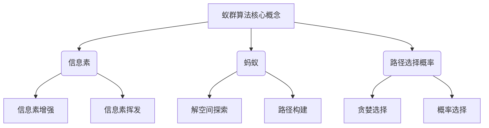
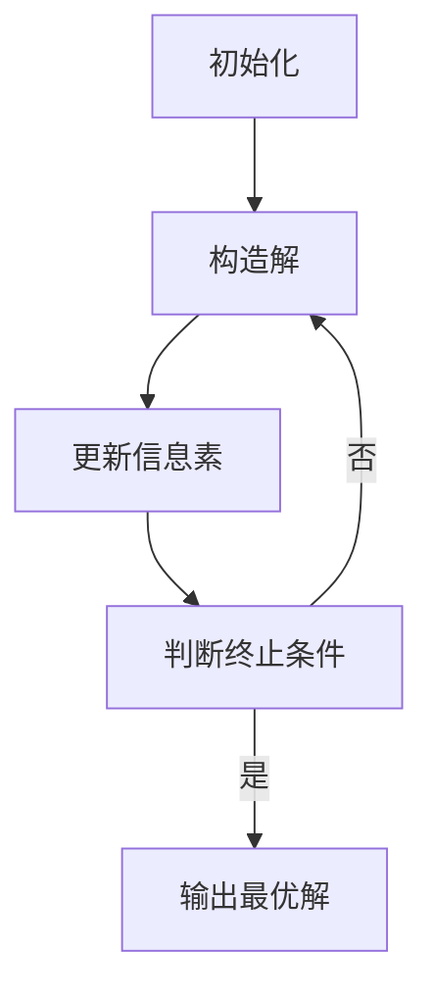

# 蚁群算法(Ant Colony Optimization) - 原理与代码实例讲解

## 1. 背景介绍

### 1.1 优化问题的挑战

在现实生活中,我们经常会遇到各种各样的优化问题,比如旅行商问题(Traveling Salesman Problem,TSP)、车辆路径规划问题、作业调度问题等。这些问题都属于"NP难题"(NP-hard problems),即当问题规模增大时,求解的时间复杂度将呈指数级增长,使用传统的精确算法很难在合理的时间内求解。

### 1.2 蚂蚁仿生算法的启示

大自然是一个充满智慧的宝库,生物进化出许多精妙绝伦的策略来应对生存挑战。蚂蚁在觅食过程中,会释放出信息素,并依据这些信息素的浓度来选择路径,最终形成了一条"最短路径"。这种"集体智能"为我们提供了借鉴,即通过模拟蚂蚁觅食行为,来求解复杂的优化问题。

### 1.3 蚁群算法的诞生

1992年,意大利学者Marco Dorigo受蚂蚁觅食行为的启发,提出了蚁群算法(Ant Colony Optimization,ACO)。蚁群算法是一种基于群体智能的概率算法,通过模拟蚂蚁在觅食过程中释放和感知信息素的行为,来构建出求解优化问题的高效算法。

## 2. 核心概念与联系



蚁群算法的核心概念包括:

1. **信息素(Pheromone)**:模拟蚂蚁在路径上释放的化学物质,用于指引后续蚂蚁的路径选择。信息素会随时间而挥发,同时也会被新的蚂蚁所增强。

2. **蚂蚁(Ant)**:模拟生物蚂蚁的行为,探索解空间并构建可能的解决方案。

3. **路径选择概率(Path Selection Probability)**:蚂蚁选择下一个城市的概率,通常综合考虑信息素浓度和城市间距离等因素。

这些概念相互关联、相互作用,共同构建了蚁群算法的核心机制。

## 3. 核心算法原理具体操作步骤

蚁群算法的核心原理可以概括为以下步骤:



1. **初始化**:设置算法参数,如蚂蚁数量、信息素挥发系数等,并初始化信息素矩阵。

2. **构造解**:每只蚂蚁根据路径选择概率,从起点出发,逐步构建出一条完整的解决方案。

3. **更新信息素**:根据本次迭代中蚂蚁找到的最优解,对信息素矩阵进行更新,包括信息素挥发和增强两个过程。

4. **判断终止条件**:检查是否满足终止条件,如最大迭代次数或找到满意解等。若不满足,则返回第2步继续迭代。

5. **输出最优解**:输出在所有迭代中找到的最优解。

通过不断迭代,算法逐渐收敛于最优解或接近最优解。

## 4. 数学模型和公式详细讲解举例说明

### 4.1 路径选择概率

蚂蚁 $k$ 从城市 $i$ 移动到城市 $j$ 的概率由下式给出:

$$
p_{ij}^k(t) = \begin{cases}
\frac{[\tau_{ij}(t)]^\alpha[\eta_{ij}]^\beta}{\sum\limits_{l\in N_i^k}[\tau_{il}(t)]^\alpha[\eta_{il}]^\beta} &\text{if }j\in N_i^k\\
0 &\text{otherwise}
\end{cases}
$$

其中:

- $\tau_{ij}(t)$ 表示时刻 $t$ 时,城市 $i$ 和城市 $j$ 之间的信息素浓度
- $\eta_{ij}=1/d_{ij}$ 表示启发式信息,即城市 $i$ 和城市 $j$ 之间距离的倒数
- $\alpha$ 和 $\beta$ 分别是信息素重要程度和启发式信息重要程度的控制参数
- $N_i^k$ 表示蚂蚁 $k$ 当前所在城市 $i$ 的可行邻居城市集合

可以看出,路径选择概率综合考虑了信息素浓度和城市距离两个因素。

### 4.2 信息素更新

每次迭代后,需要对信息素进行更新,包括信息素挥发和信息素增强两个过程:

1. **信息素挥发**

$$\tau_{ij}(t+1) = (1-\rho)\tau_{ij}(t)$$

其中 $\rho$ 是信息素挥发系数 $(0<\rho<1)$,模拟信息素随时间的逐渐减少和挥发。

2. **信息素增强**

$$\tau_{ij}(t+1) = \tau_{ij}(t) + \sum\limits_{k=1}^m\Delta\tau_{ij}^k(t)$$

$$\Delta\tau_{ij}^k(t) = \begin{cases}
\frac{Q}{L_k} &\text{if 蚂蚁 k 经过边 (i,j)}\\
0 &\text{otherwise}
\end{cases}$$

其中:

- $m$ 是蚂蚁总数
- $Q$ 是一个常数,表示信息素增量
- $L_k$ 是蚂蚁 $k$ 的路径长度
- $\Delta\tau_{ij}^k(t)$ 表示蚂蚁 $k$ 在边 $(i,j)$ 上留下的信息素增量

通过这种方式,算法会增强那些被优秀蚂蚁经过的路径上的信息素浓度,从而引导后续蚂蚁朝着这些路径前进。

### 4.3 示例:解决旅行商问题(TSP)

假设有一个旅行商问题,需要找到一条最短的闭合路径,经过所有给定的城市且只经过一次。我们可以使用蚁群算法来求解:

1. 初始化信息素矩阵,设置算法参数。
2. 所有蚂蚁从起点城市出发,根据路径选择概率公式,逐步构建出一条完整的路径。
3. 计算每只蚂蚁的路径长度,找到本次迭代的最短路径。
4. 根据最短路径,对信息素矩阵进行更新:
   - 所有边的信息素先按照挥发系数 $\rho$ 进行衰减
   - 对于最短路径上的边,按照 $\Delta\tau_{ij}^k(t)=Q/L_{shortest}$ 增强信息素
5. 重复步骤2-4,直到满足终止条件。

通过多次迭代,算法将逐渐收敛于最优解或接近最优解。

## 5. 项目实践:代码实例和详细解释说明

下面是一个使用Python实现的蚁群算法,用于求解旅行商问题(TSP)的示例代码:

```python
import numpy as np
import matplotlib.pyplot as plt

# 城市坐标
coords = np.array([[565.0, 575.0], [25.0, 185.0], [345.0, 750.0], [945.0, 685.0], [835.0, 655.0],
                   [457.0, 608.0], [332.0, 430.0], [501.0, 938.0], [505.0, 331.0], [630.0, 196.0],
                   [704.0, 528.0], [459.0, 268.0], [260.0, 76.0], [63.0, 314.0], [619.0, 117.0],
                   [161.0, 520.0], [429.0, 600.0], [551.0, 936.0], [351.0, 346.0], [595.0, 445.0]])

# 计算两个城市之间的距离
def dist(city1, city2):
    return np.sqrt((city1[0] - city2[0])**2 + (city1[1] - city2[1])**2)

# 蚁群算法类
class AntColony:
    def __init__(self, coords, m, alpha, beta, rho, Q):
        self.coords = coords  # 城市坐标
        self.m = m  # 蚂蚁数量
        self.alpha = alpha  # 信息素重要程度
        self.beta = beta  # 启发式信息重要程度
        self.rho = rho  # 信息素挥发系数
        self.Q = Q  # 信息素增量常数
        self.n = len(coords)  # 城市数量
        self.eta = np.zeros((self.n, self.n))  # 启发式信息矩阵
        self.tau = np.ones((self.n, self.n))  # 信息素矩阵
        self.table = np.zeros((self.m, self.n)).astype(int)  # 解决方案记录表
        self.iter = 0  # 迭代次数
        self.best_len = np.inf  # 最短路径长度
        self.best_tour = None  # 最短路径

        # 计算启发式信息矩阵
        for i in range(self.n):
            for j in range(self.n):
                self.eta[i][j] = 1 / dist(self.coords[i], self.coords[j])

    # 选择下一个城市
    def choose_next(self, curr_city, unvisited):
        prob = np.zeros(self.n)
        total = 0

        for next_city in unvisited:
            prob[next_city] = self.tau[curr_city][next_city]**self.alpha * self.eta[curr_city][next_city]**self.beta
            total += prob[next_city]

        if total == 0:
            return np.random.choice(unvisited)

        prob /= total
        next_city = np.random.choice(unvisited, p=prob)
        return next_city

    # 构造解决方案
    def construct_tour(self):
        unvisited = list(range(self.n))
        for ant in range(self.m):
            curr_city = np.random.choice(unvisited)
            unvisited.remove(curr_city)
            self.table[ant][0] = curr_city

            for i in range(1, self.n):
                next_city = self.choose_next(curr_city, unvisited)
                self.table[ant][i] = next_city
                unvisited.remove(next_city)
                curr_city = next_city

    # 计算路径长度
    def tour_len(self, tour):
        length = 0
        for i in range(self.n):
            length += dist(self.coords[tour[i]], self.coords[tour[(i + 1) % self.n]])
        return length

    # 更新信息素
    def update_tau(self):
        self.tau = (1 - self.rho) * self.tau

        for ant in range(self.m):
            tour = self.table[ant]
            tour_len = self.tour_len(tour)

            if tour_len < self.best_len:
                self.best_len = tour_len
                self.best_tour = tour

            for i in range(self.n):
                self.tau[tour[i]][tour[(i + 1) % self.n]] += self.Q / tour_len

    # 运行蚁群算法
    def run(self, max_iter):
        for _ in range(max_iter):
            self.construct_tour()
            self.update_tau()
            self.iter += 1

    # 绘制最短路径
    def plot_tour(self):
        x = [self.coords[i][0] for i in self.best_tour]
        x.append(x[0])
        y = [self.coords[i][1] for i in self.best_tour]
        y.append(y[0])

        plt.figure(figsize=(10, 6))
        plt.scatter(self.coords[:, 0], self.coords[:, 1], s=100)
        plt.plot(x, y, '-o')
        plt.xlabel('X')
        plt.ylabel('Y')
        plt.title(f'Shortest Tour Length: {self.best_len:.2f}')
        plt.show()

# 运行示例
if __name__ == '__main__':
    aco = AntColony(coords, m=50, alpha=1, beta=5, rho=0.5, Q=100)
    aco.run(max_iter=100)
    aco.plot_tour()
```

代码解释:

1. 导入所需的库,并定义城市坐标。
2. 定义 `dist` 函数,用于计算两个城市之间的欧几里得距离。
3. 定义 `AntColony` 