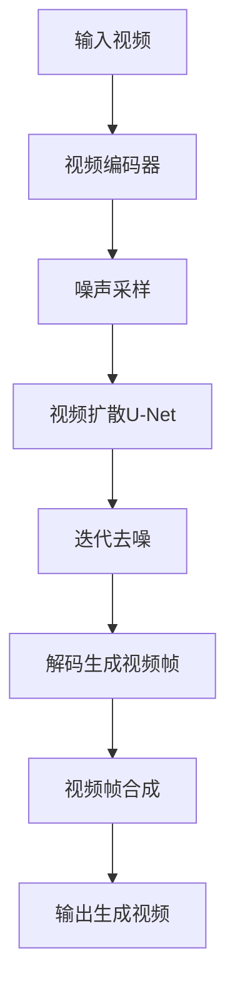

# 视频扩散Video Diffusion原理与代码实例讲解

## 1.背景介绍
### 1.1 视频生成的挑战与机遇
### 1.2 扩散模型在图像生成中的成功应用
### 1.3 将扩散模型扩展到视频领域的意义

## 2.核心概念与联系
### 2.1 扩散模型基本原理
#### 2.1.1 前向扩散过程
#### 2.1.2 反向去噪过程  
### 2.2 视频扩散模型的特点
#### 2.2.1 时间维度的建模
#### 2.2.2 帧间一致性约束
### 2.3 视频扩散与其他视频生成方法的比较
#### 2.3.1 GAN based方法
#### 2.3.2 Autoregressive方法

## 3.核心算法原理具体操作步骤
### 3.1 视频编码器
#### 3.1.1 3D卷积编码器
#### 3.1.2 时间位置编码 
### 3.2 视频扩散U-Net模型
#### 3.2.1 多尺度时空建模
#### 3.2.2 自注意力机制
#### 3.2.3 残差连接
### 3.3 训练过程
#### 3.3.1 噪声采样策略
#### 3.3.2 损失函数设计
### 3.4 采样生成过程
#### 3.4.1 DDPM采样
#### 3.4.2 DDIM采样

## 4.数学模型和公式详细讲解举例说明 
### 4.1 扩散模型数学形式
#### 4.1.1 马尔科夫链
#### 4.1.2 前向扩散过程公式推导
#### 4.1.3 反向去噪过程变分推断
### 4.2 视频扩散中时间信息建模
#### 4.2.1 时间步长选择
#### 4.2.2 连续时间扩散方程
### 4.3 损失函数推导
#### 4.3.1 重构损失
#### 4.3.2 正则化项

## 5.项目实践：代码实例和详细解释说明
### 5.1 数据预处理
#### 5.1.1 视频帧提取
#### 5.1.2 数据增强
### 5.2 模型构建
#### 5.2.1 编码器实现  
#### 5.2.2 U-Net结构搭建
#### 5.2.3 位置编码
### 5.3 训练流程
#### 5.3.1 数据加载
#### 5.3.2 前向传播与反向传播
#### 5.3.3 参数更新
### 5.4 推理生成
#### 5.4.1 噪声采样
#### 5.4.2 迭代去噪
#### 5.4.3 视频帧合成

## 6.实际应用场景
### 6.1 视频内容创作
#### 6.1.1 虚拟主播
#### 6.1.2 游戏场景生成
### 6.2 视频编辑与修复
#### 6.2.1 视频补帧
#### 6.2.2 视频修复
### 6.3 视频压缩与传输
#### 6.3.1 视频超分辨率
#### 6.3.2 视频插帧

## 7.工具和资源推荐
### 7.1 开源代码库
#### 7.1.1 VideoDiffusion官方实现
#### 7.1.2 Hugging Face Diffusers  
### 7.2 数据集
#### 7.2.1 UCF-101
#### 7.2.2 Kinetics
### 7.3 相关论文与教程
#### 7.3.1 扩散模型综述
#### 7.3.2 视频生成相关论文

## 8.总结：未来发展趋势与挑战
### 8.1 多模态视频生成
### 8.2 可控视频生成
### 8.3 提高生成质量与多样性
### 8.4 降低计算资源需求

## 9.附录：常见问题与解答
### 9.1 视频扩散模型的局限性
### 9.2 如何提高视频生成的流畅度
### 9.3 视频扩散能否应用于视频预测任务



视频扩散Video Diffusion是近年来备受关注的视频生成方法，它将扩散模型的成功从图像领域扩展到了视频领域。传统的视频生成方法如GAN和Autoregressive模型存在训练不稳定、生成质量不高等问题。而视频扩散通过引入时间维度的建模，在保证生成视频连贯性的同时，大幅提升了视频质量。

视频扩散的核心思想是将视频看作一个时空序列，通过对每一帧进行扩散去噪，最终实现整个视频的生成。具体来说，它先将视频帧编码为隐空间表示，然后在隐空间中进行前向扩散，加入高斯噪声。接着通过训练一个视频去噪U-Net模型，学习噪声信号到干净视频之间的映射。生成时，先从高斯噪声出发，经过多次迭代去噪，最终解码生成视频帧，再合成为完整视频。

在U-Net模型设计上，视频扩散采用了3D卷积来同时建模时间和空间信息，并引入了自注意力机制增强帧间依赖建模。同时，多尺度的特征图也有助于捕捉不同尺度下的时空动态模式。

在训练过程中，视频扩散采用了加权重构损失和正则化项，以平衡生成质量和多样性。噪声的采样策略也是一个关键点，线性或余弦退火的噪声方差scheduling能有效改善训练稳定性。推理时则可选择DDPM或DDIM等不同的采样方式来权衡生成速度和质量。

在应用方面，视频扩散在视频内容创作、视频编辑修复、视频压缩传输等领域都有广阔的应用前景。比如根据文本提示自动生成相关的视频素材，对视频中的对象进行编辑操控，对低质量视频进行修复提升等。

视频扩散的一个数学基础是将扩散过程看作一个马尔科夫链，前向扩散对应加噪过程，反向去噪对应后验分布的变分推断。假设 $x_0$ 为原始视频帧，$x_1$ 到 $x_T$ 为加噪后的中间序列，前向扩散过程可表示为：

$$
q(x_t|x_{t-1}) = \mathcal{N}(x_t; \sqrt{1-\beta_t} x_{t-1}, \beta_t \mathbf{I})
$$

其中 $\beta_t$ 为噪声方差scheduling系数。反向去噪过程则通过学习每个时间步的条件分布来逼近后验分布：

$$
p_\theta(x_{t-1}|x_t) = \mathcal{N}(x_{t-1}; \mu_\theta(x_t, t), \sigma_\theta(x_t, t)^2\mathbf{I})
$$

其中均值 $\mu_\theta$ 和方差 $\sigma_\theta$ 由U-Net模型估计。损失函数为重构项和先验正则项的加权和：

$$
L = \mathbb{E}_{x_0,\epsilon,t}\left[\|x_0 - \mu_\theta(x_t, t)\|_2^2\right] + \lambda D_{KL}(q(x_T|x_0)||p(x_T))
$$

以上就是视频扩散Video Diffusion的一些核心原理。下面我们通过代码实例来进一步理解其实现细节。

首先是数据预处理部分，我们需要将视频切分为帧序列，并进行一些数据增强操作：

```python
import cv2
import numpy as np

def video_to_frames(video_path, n_frames=None):
    cap = cv2.VideoCapture(video_path) 
    frames = []
    while True:
        ret, frame = cap.read()
        if not ret:
            break
        frame = cv2.cvtColor(frame, cv2.COLOR_BGR2RGB)
        frames.append(frame)
        if n_frames is not None and len(frames) >= n_frames:
            break
    cap.release()
    return np.array(frames)

def data_augmentation(frames):
    # 随机裁剪
    h, w = frames.shape[1:3]
    crop_size = int(min(h, w) * 0.8)
    h_start = np.random.randint(0, h - crop_size)
    w_start = np.random.randint(0, w - crop_size)
    frames = frames[:, h_start:h_start+crop_size, w_start:w_start+crop_size]
    
    # 随机水平翻转
    if np.random.rand() < 0.5:
        frames = frames[:, :, ::-1]
        
    # 随机颜色抖动
    frames = (frames.astype(np.float32) / 255.0) * 2 - 1
    noise = np.random.uniform(-0.05, 0.05, frames.shape)
    frames = np.clip(frames + noise, -1, 1)
    
    return frames
```

接下来是模型构建部分，主要包括编码器和U-Net两个子模块：

```python
import torch
import torch.nn as nn

class Encoder(nn.Module):
    def __init__(self, in_channels, base_channels, dim_mults):
        super().__init__()
        self.conv1 = nn.Conv3d(in_channels, base_channels, 3, padding=1)  
        
        self.downs = nn.ModuleList()
        channels = base_channels
        for i in range(len(dim_mults)):
            out_channels = channels * dim_mults[i]
            self.downs.append(nn.Sequential(
                nn.Conv3d(channels, out_channels, 4, stride=2, padding=1),
                nn.GroupNorm(32, out_channels),
                nn.SiLU()
            ))
            channels = out_channels
            
    def forward(self, x):
        x = self.conv1(x)
        features = [x]
        for down in self.downs:
            x = down(x)
            features.append(x)
        return features
    
class UNet(nn.Module):
    def __init__(self, in_channels, base_channels, dim_mults, time_dim):
        super().__init__()
        self.encoder = Encoder(in_channels, base_channels, dim_mults)
        
        self.bottleneck = nn.Sequential(
            nn.Conv3d(base_channels * dim_mults[-1], base_channels * dim_mults[-1], 3, padding=1),
            nn.GroupNorm(32, base_channels * dim_mults[-1]),
            nn.SiLU(),
            nn.Conv3d(base_channels * dim_mults[-1], base_channels * dim_mults[-1], 3, padding=1)
        )
        
        self.ups = nn.ModuleList()
        channels = base_channels * dim_mults[-1]
        for i in reversed(range(len(dim_mults))):
            out_channels = base_channels * dim_mults[i]
            self.ups.append(nn.Sequential(
                nn.ConvTranspose3d(channels, out_channels, 4, stride=2, padding=1),
                nn.GroupNorm(32, out_channels),
                nn.SiLU()
            ))
            channels = out_channels
            
        self.final_conv = nn.Conv3d(base_channels, in_channels, 3, padding=1)
        self.time_mlp = nn.Sequential(
            nn.SiLU(),
            nn.Linear(time_dim, base_channels * 4),
            nn.SiLU(),
            nn.Linear(base_channels * 4, base_channels)
        )
        
    def forward(self, x, t):
        features = self.encoder(x)
        x = self.bottleneck(features[-1])
        
        time_emb = self.time_mlp(t)
        time_emb = time_emb[(...,) + (None,) * 3]
        
        for up, feat in zip(self.ups, reversed(features[:-1])):
            x = up(x)
            x = x + feat + time_emb
            
        return self.final_conv(x)
```

在训练流程中，我们需要对数据进行加载，并在每个batch上进行前向传播和反向传播，更新模型参数：

```python
def train(model, data_loader, optimizer, diffusion, device):
    model.train()
    
    for batch in data_loader:
        frames = batch['frames'].to(device)
        b, c, t, h, w = frames.shape
        
        # 随机选择时间步
        t = torch.randint(0, diffusion.num_timesteps, (b,), device=device).long()
        
        # 加噪
        x_t, noise = diffusion.noise_images(frames, t)
        
        # 前向传播
        predicted_noise = model(x_t, t)
        
        # 计算损失
        loss = F.mse_loss(noise, predicted_noise)
        
        # 反向传播和参数更新
        optimizer.zero_grad()
        loss.backward()
        optimizer.step()
```

最后是推理生成过程，从高斯噪声出发，迭代