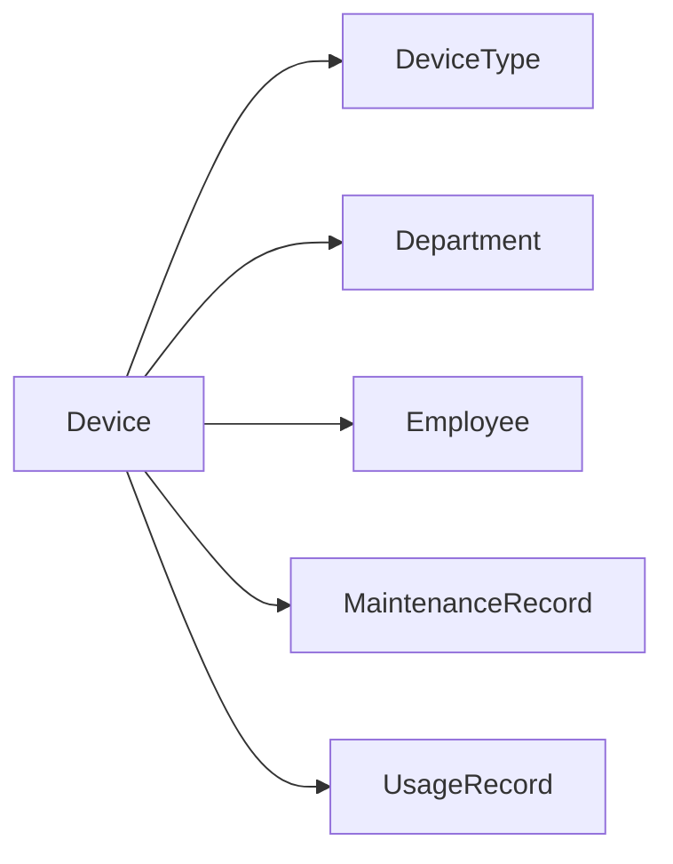

# 设备信息管理系统详细设计与具体代码实现

## 1. 背景介绍

在现代企业中,设备管理是一项至关重要的任务。无论是生产设备、IT设备还是办公设备,高效的管理都能够帮助企业降低成本,提高效率。传统的人工管理方式,难以应对日益增长的设备数量和复杂性。因此,开发一套功能完善、易于使用的设备信息管理系统,成为了企业信息化建设的重要内容。

本文将详细介绍设备信息管理系统的设计与实现。通过对系统需求的分析,设计出合理的系统架构和数据库模型。并使用主流的开发技术,如Spring Boot、MyBatis、Vue.js等,实现一个基于Web的设备信息管理系统。

## 2. 核心概念与关联

在设备信息管理系统中,涉及到以下几个核心概念:

- **设备(Device)**: 企业中需要管理的各类设备,如生产设备、IT设备、办公设备等。每个设备都有自己的属性,如设备编号、名称、型号、购买日期、负责人等。

- **设备类型(DeviceType)**: 对设备进行分类,如生产设备、IT设备、办公设备等。每个设备都属于一个特定的类型。

- **设备状态(DeviceStatus)**: 设备的当前使用状态,如闲置、使用中、维修中、报废等。

- **部门(Department)**: 企业内部的组织机构,如生产部、技术部、行政部等。每个设备都属于一个特定的部门。

- **员工(Employee)**: 企业的员工,可以是设备的负责人或使用人。

- **维修记录(MaintenanceRecord)**: 记录设备的维修历史,包括维修时间、维修内容、维修人员等。

- **使用记录(UsageRecord)**: 记录设备的使用情况,包括使用时间、使用人员、使用用途等。

这些概念之间的关联如下图所示:



从图中可以看出,设备与设备类型、部门、员工都有直接的关联。同时,设备还关联到它的维修记录和使用记录。

## 3. 核心算法原理与具体操作步骤

在设备信息管理系统中,涉及到以下几个核心算法:

### 3.1 设备编号生成算法

为每个设备生成唯一的编号,可以采用如下算法:

1. 获取设备类型代码,如生产设备为"PD"、IT设备为"IT"、办公设备为"OD"等。
2. 获取设备购买日期,格式为"YYYYMMDD"。
3. 获取当天已生成的设备编号数量n,格式化为4位数字,不足4位前面补0。
4. 拼接以上三部分,得到最终的设备编号,格式为"类型代码-购买日期-序号",如"PD-20230604-0001"。

具体的Java代码实现如下:

```java
public String generateDeviceNo(String typeCode, LocalDate purchaseDate) {
    String date = purchaseDate.format(DateTimeFormatter.ofPattern("yyyyMMdd"));
    String seq = String.format("%04d", countByPurchaseDate(purchaseDate) + 1);
    return typeCode + "-" + date + "-" + seq;
}
```

### 3.2 设备使用率计算算法

设备使用率是指一段时间内设备实际使用时长占总时长的比例。计算公式如下:

$$
设备使用率 = \frac{设备实际使用时长}{统计时长} \times 100\%
$$

具体的计算步骤如下:

1. 指定统计的时间范围,如最近30天、最近一年等。
2. 根据时间范围,查询设备的使用记录。
3. 累加使用记录的时长,得到设备实际使用时长。
4. 计算统计时长,即时间范围的总天数乘以24小时。
5. 代入公式,计算设备使用率。

具体的Java代码实现如下:

```java
public double calculateUsageRate(Long deviceId, LocalDate startDate, LocalDate endDate) {
    long usageHours = usageRecordRepository.sumUsageHoursByDeviceIdAndDateRange(deviceId, startDate, endDate);
    long totalHours = ChronoUnit.DAYS.between(startDate, endDate) * 24;
    return usageHours * 100.0 / totalHours;
}
```

## 4. 数学模型和公式详细讲解举例说明

在设备信息管理系统中,主要涉及到设备使用率的计算,其数学模型和公式如下:

设备使用率计算公式:

$$
设备使用率 = \frac{设备实际使用时长}{统计时长} \times 100\%
$$

其中:
- 设备实际使用时长:在统计时间范围内,设备处于使用状态的总时长。
- 统计时长:统计时间范围的总时长,单位为小时。

举例说明:

某设备在2023年6月1日至2023年6月30日期间的使用记录如下:

| 开始时间 | 结束时间 | 使用时长(小时) |
| --- | --- | --- |
| 2023-06-01 09:00:00 | 2023-06-01 12:00:00 | 3 |
| 2023-06-02 14:00:00 | 2023-06-02 17:30:00 | 3.5 |
| 2023-06-05 10:00:00 | 2023-06-05 11:30:00 | 1.5 |
| 2023-06-10 08:00:00 | 2023-06-10 16:00:00 | 8 |
| 2023-06-15 13:00:00 | 2023-06-15 15:00:00 | 2 |
| 2023-06-20 09:30:00 | 2023-06-20 11:00:00 | 1.5 |
| 2023-06-25 14:00:00 | 2023-06-25 18:00:00 | 4 |

根据以上记录,可以计算出:
- 设备实际使用时长 = 3 + 3.5 + 1.5 + 8 + 2 + 1.5 + 4 = 23.5小时
- 统计时长 = 30天 × 24小时/天 = 720小时

代入公式:

$$
设备使用率 = \frac{23.5}{720} \times 100\% \approx 3.26\%
$$

因此,该设备在2023年6月的使用率约为3.26%。

## 5. 项目实践:代码实例和详细解释说明

下面以设备控制器(DeviceController)为例,展示设备信息管理系统的部分代码实现。

```java
@RestController
@RequestMapping("/devices")
public class DeviceController {

    @Autowired
    private DeviceService deviceService;

    /**
     * 分页查询设备列表
     */
    @GetMapping
    public PageResult<DeviceVO> listByPage(@RequestParam(defaultValue = "1") Integer pageNum,
                                           @RequestParam(defaultValue = "10") Integer pageSize,
                                           DeviceQueryDTO queryDTO) {
        return deviceService.listByPage(pageNum, pageSize, queryDTO);
    }

    /**
     * 获取设备详情
     */
    @GetMapping("/{id}")
    public DeviceDetailVO getById(@PathVariable Long id) {
        return deviceService.getById(id);
    }

    /**
     * 新增设备
     */
    @PostMapping
    public void add(@RequestBody DeviceAddDTO addDTO) {
        deviceService.add(addDTO);
    }

    /**
     * 修改设备
     */
    @PutMapping
    public void update(@RequestBody DeviceUpdateDTO updateDTO) {
        deviceService.update(updateDTO);
    }

    /**
     * 删除设备
     */
    @DeleteMapping("/{id}")
    public void delete(@PathVariable Long id) {
        deviceService.delete(id);
    }

    /**
     * 获取设备使用率
     */
    @GetMapping("/{id}/usageRate")
    public double getUsageRate(@PathVariable Long id,
                               @RequestParam @DateTimeFormat(pattern = "yyyy-MM-dd") LocalDate startDate,
                               @RequestParam @DateTimeFormat(pattern = "yyyy-MM-dd") LocalDate endDate) {
        return deviceService.calculateUsageRate(id, startDate, endDate);
    }
}
```

代码解释:

1. `@RestController`:标识该类是一个RESTful风格的控制器。
2. `@RequestMapping("/devices")`:指定该控制器处理"/devices"路径下的请求。
3. `@Autowired`:自动注入DeviceService对象。
4. `listByPage()`:分页查询设备列表,接收pageNum(页码)、pageSize(每页条数)和queryDTO(查询条件)参数,返回分页结果。
5. `getById()`:根据设备ID获取设备详情,接收id参数,返回设备详情对象。
6. `add()`:新增设备,接收addDTO参数,包含新增设备的信息。
7. `update()`:修改设备,接收updateDTO参数,包含要修改的设备信息。
8. `delete()`:删除设备,接收id参数,表示要删除的设备ID。
9. `getUsageRate()`:获取设备使用率,接收id(设备ID)、startDate(开始日期)、endDate(结束日期)参数,返回设备使用率。

以上代码实现了设备管理的基本功能,包括分页查询、详情查询、新增、修改、删除和使用率计算等。

## 6. 实际应用场景

设备信息管理系统可以应用于各种需要管理设备的场景,例如:

1. 生产制造企业:管理各种生产设备,如机床、流水线、机器人等,跟踪设备的使用情况和维修记录,优化生产调度和设备维护。

2. IT企业:管理服务器、网络设备、存储设备等IT基础设施,监控设备的运行状态,及时发现和处理故障。

3. 办公场所:管理电脑、打印机、投影仪等办公设备,统计设备的使用情况,合理调配和更新设备。

4. 医疗机构:管理医疗器械和设备,如CT、MRI、手术设备等,确保设备的正常运转和及时维护,保障医疗质量和患者安全。

5. 教育机构:管理多媒体教室、实验室的各种设备,如电脑、投影仪、实验仪器等,提高教学效果和管理效率。

6. 酒店、商场等服务行业:管理空调、电梯、监控设备等,提供优质的客户服务,降低运营成本。

总之,只要有设备需要管理的场合,都可以应用设备信息管理系统,提高管理效率和决策水平。

## 7. 工具和资源推荐

开发设备信息管理系统,可以使用以下工具和资源:

1. 开发工具:
- IntelliJ IDEA:功能强大的Java IDE,提供智能代码提示、重构、调试等功能。
- Visual Studio Code:轻量级代码编辑器,支持多种编程语言,可以用于编写前端代码。
- Navicat:数据库管理工具,支持多种数据库,可以进行数据库设计和SQL编写。

2. 后端技术:
- Spring Boot:简化Spring应用开发的框架,内置Web服务器,开箱即用。
- MyBatis:优秀的持久层框架,支持自定义SQL、存储过程和高级映射。
- Lombok:通过注解自动生成getter、setter、toString等方法,简化代码。

3. 前端技术:  
- Vue.js:渐进式JavaScript框架,易于上手,适合开发单页应用。
- Element UI:基于Vue的UI组件库,提供丰富的UI组件,快速搭建前端页面。
- Axios:基于Promise的HTTP客户端,用于发送Ajax请求。

4. 数据库:
- MySQL:开源关系型数据库,广泛应用于Web应用。
- Redis:高性能的key-value内存数据库,可用于缓存和session管理。

5. 其他工具:
- Git:分布式版本控制系统,便于团队协作开发。
- Maven:项目管理和构建工具,管理jar包依赖。
- Jenkins:自动化部署工具,实现持续集成和持续部署。

6. 学习资源:
- Spring官方文档:https://spring.io/projects/spring-boot
- MyBatis官方文档:https://mybatis.org/mybatis-3/
- Vue.js官方文档:https://cn.vuejs.org/
- 《Java核心技术》:经典的Java入门教材,适合系统学习Java。
- 《Spring实战》:全面介绍Spring框架的使用,附有丰富的示例代码。

以上工具和资源可以帮助你更高效地开发设备信息管理系统,提高开发质量和效率。

## 8. 总结:未来发展趋势与挑战

设备信息管理系统是现代企业信息化不可或缺的一部分。随着物联网、人工智能等新技术的发展,设备信息管理系统也面临新的机遇