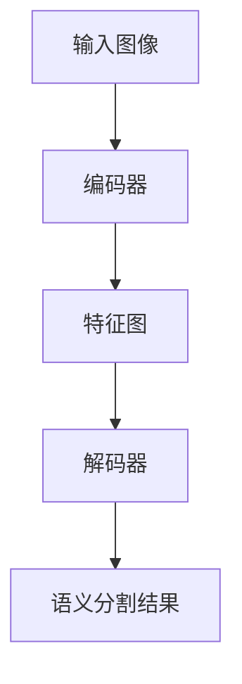
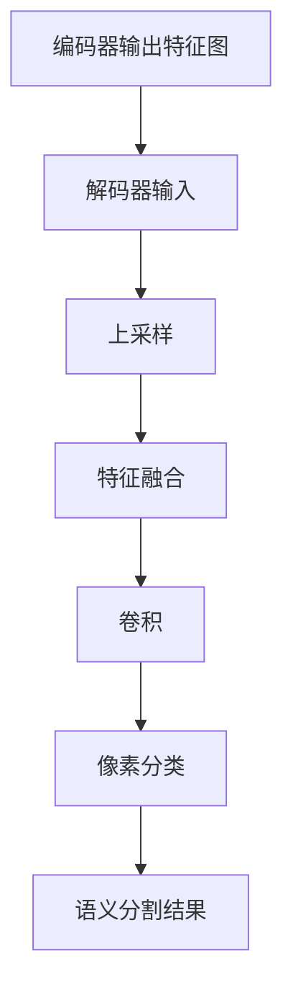

# 语义分割原理与代码实例讲解

## 1.背景介绍

### 1.1 什么是语义分割

语义分割(Semantic Segmentation)是计算机视觉和深度学习领域的一个重要任务,旨在将图像像素级别上进行分类,为每个像素赋予语义标签。与传统的图像分类任务不同,语义分割需要对图像中的每个像素进行精确分类,从而获得对象的精确边界和位置信息。

语义分割广泛应用于无人驾驶、医疗影像分析、遥感图像处理等领域。例如在无人驾驶中,语义分割可以准确识别道路、行人、车辆等对象,为决策系统提供关键输入;在医疗影像分析中,语义分割可以自动分割病灶区域,辅助医生诊断。

### 1.2 语义分割的挑战

尽管语义分割取得了长足进展,但仍面临诸多挑战:

1. **对象尺度变化**:同一场景中的目标物体可能具有不同的尺度,如何有效捕获多尺度信息是一大挑战。
2. **遮挡和重叠**:现实场景中,目标物体常常被其他物体部分遮挡或相互重叠,给分割带来困难。
3. **类内差异**:同一类别的物体在外观、形状等方面可能存在较大差异,需要模型具备强大的泛化能力。
4. **计算资源**:高分辨率图像的语义分割计算量巨大,对GPU等硬件资源要求较高。

## 2.核心概念与联系

### 2.1 像素级语义预测

语义分割的核心是对图像中的每个像素进行语义标注,预测其所属类别。这与传统图像分类任务形成鲜明对比,后者只需为整个图像指定一个类别标签。

在语义分割中,通常将图像划分为相同大小的像素块(如8x8),并为每个像素块预测一个语义标签。最终的分割结果是由所有像素块标签拼接而成的"标签图"。

### 2.2 端到端像素级预测

传统的语义分割方法通常由多个单独模块组成,如底层特征提取、候选区域生成、像素级分类等。这种"分割再整合"的方式存在效率低下、错误累积等问题。

近年来,受深度学习的推动,语义分割领域兴起了端到端(End-to-End)的像素级预测模型。这类模型将整个分割过程集成到一个统一的深度神经网络中,端到端地从原始图像直接预测语义分割结果,避免了中间步骤的错误累积。

### 2.3 编码器-解码器架构

编码器-解码器(Encoder-Decoder)架构是语义分割领域主流模型的核心结构,能够高效地融合多尺度特征信息。

编码器通常由卷积神经网络(如VGG、ResNet等)构成,用于从原始图像中提取特征。解码器则将编码器输出的特征图进行上采样,逐步恢复到与输入图像相同的分辨率,并预测每个像素的语义标签。

该架构的关键在于,编码器和解码器之间存在"跳跃连接",能够将不同尺度的特征融合,捕获目标的细节和语义信息。



## 3.核心算法原理具体操作步骤  

### 3.1 编码器:特征提取

编码器的作用是从输入图像中提取特征,为后续的像素级语义预测做准备。常用的编码器包括VGG、ResNet等,它们由多个卷积层和下采样层组成,能够逐步捕获图像的底层和高层语义特征。

具体操作步骤如下:

1. 将输入图像送入编码器的第一个卷积层。
2. 对卷积层输出的特征图进行激活函数处理(如ReLU)和归一化处理。
3. 使用池化层(如最大池化)对特征图进行下采样,减小分辨率但保留主要特征。
4. 重复步骤2和3,通过多个卷积层和下采样层逐步提取更高层次的语义特征。
5. 在编码器的不同阶段,将提取到的不同尺度特征图传递给解码器,用于特征融合。

### 3.2 解码器:上采样与像素分类

解码器的任务是将编码器输出的特征图进行上采样和像素级分类,最终生成与输入图像分辨率相同的语义分割图。

具体操作步骤如下:

1. 将编码器输出的最终特征图作为解码器的输入。
2. 使用上采样层(如反卷积层)对特征图进行放大,增加分辨率。
3. 将放大后的特征图与编码器传递的对应尺度特征图进行跳跃连接,融合不同尺度的特征信息。
4. 对融合后的特征图进行卷积操作,提取新的特征。
5. 重复步骤2-4,逐步恢复特征图分辨率,直至与输入图像分辨率相同。
6. 在最后一层,对每个像素点使用分类层(如softmax),预测其语义类别。

通过上述步骤,解码器能够生成与输入图像相同分辨率的语义分割图,每个像素都被赋予一个语义标签。



## 4.数学模型和公式详细讲解举例说明

### 4.1 卷积运算

卷积运算是神经网络中的基本运算单元,用于从输入数据(如图像)中提取特征。在语义分割任务中,卷积运算广泛应用于编码器和解码器的各个卷积层。

卷积运算的数学表达式为:

$$
y_{ij} = \sum_{m}\sum_{n}w_{mn}x_{i+m,j+n} + b
$$

其中:
- $y_{ij}$表示输出特征图在$(i,j)$位置的值
- $w_{mn}$表示卷积核的权重
- $x_{i+m,j+n}$表示输入特征图在$(i+m,j+n)$位置的值
- $b$表示偏置项

通过将卷积核在输入特征图上滑动,并进行加权求和运算,可以提取出输入数据的局部特征,如边缘、纹理等。

### 4.2 上采样运算

在解码器中,需要将编码器输出的低分辨率特征图逐步上采样,恢复到与输入图像相同的分辨率。常用的上采样方法是反卷积(Deconvolution)或者反池化(Unpooling)。

反卷积的数学表达式为:

$$
y_{ij} = \sum_{m}\sum_{n}w_{mn}x_{i-m,j-n} + b
$$

其中:
- $y_{ij}$表示输出特征图在$(i,j)$位置的值
- $w_{mn}$表示卷积核的权重
- $x_{i-m,j-n}$表示输入特征图在$(i-m,j-n)$位置的值
- $b$表示偏置项

反卷积通过"扩张"输入特征图,并与学习到的卷积核进行卷积运算,实现特征图的上采样。

### 4.3 像素分类

在解码器的最后一层,需要对每个像素进行分类,预测其语义标签。这通常使用softmax分类器实现。

softmax分类器的数学表达式为:

$$
p(y_i=j|x) = \frac{e^{w_j^Tx+b_j}}{\sum_{k=1}^Ke^{w_k^Tx+b_k}}
$$

其中:
- $p(y_i=j|x)$表示像素$x$被分类为第$j$类的概率
- $w_j$和$b_j$分别表示第$j$类的权重向量和偏置项
- $K$表示语义类别的总数

通过softmax函数,可以将像素的特征向量映射到$[0,1]$范围内的概率值,并确保所有类别概率之和为1。最终,将概率最大的类别作为该像素的语义标签。

## 5.项目实践:代码实例和详细解释说明

以下是一个基于PyTorch实现的语义分割模型示例,采用编码器-解码器架构,使用VGG16作为编码器,反卷积层实现解码器的上采样。

### 5.1 导入所需库

```python
import torch
import torch.nn as nn
import torchvision.models as models
```

### 5.2 定义编码器

```python
class Encoder(nn.Module):
    def __init__(self):
        super(Encoder, self).__init__()
        # 加载预训练的VGG16模型,并去掉最后两层
        vgg = models.vgg16(pretrained=True).features[:-2]
        self.encoder = nn.Sequential(*vgg)
        
    def forward(self, x):
        # 提取多尺度特征
        features = []
        for i in [3, 8, 15, 22, 29]:
            x = self.encoder[:i](x)
            features.append(x)
        return features
```

编码器使用预训练的VGG16模型作为基础,提取输入图像的多尺度特征。在`forward`函数中,我们在VGG16的不同阶段获取特征图,并存储在`features`列表中,用于后续的特征融合。

### 5.3 定义解码器

```python
class Decoder(nn.Module):
    def __init__(self, num_classes):
        super(Decoder, self).__init__()
        # 定义反卷积层
        self.deconv1 = nn.ConvTranspose2d(512, 256, 3, stride=2, padding=1, output_padding=1)
        self.deconv2 = nn.ConvTranspose2d(256, 128, 3, stride=2, padding=1, output_padding=1)
        self.deconv3 = nn.ConvTranspose2d(128, 64, 3, stride=2, padding=1, output_padding=1)
        self.deconv4 = nn.ConvTranspose2d(64, 32, 3, stride=2, padding=1, output_padding=1)
        self.deconv5 = nn.ConvTranspose2d(32, num_classes, 3, stride=2, padding=1, output_padding=1)
        
    def forward(self, features):
        # 解码过程
        x = features[-1]
        x = self.deconv1(x)
        x = torch.cat((x, features[3]), dim=1)
        x = self.deconv2(x)
        x = torch.cat((x, features[2]), dim=1)
        x = self.deconv3(x)
        x = torch.cat((x, features[1]), dim=1)
        x = self.deconv4(x)
        x = torch.cat((x, features[0]), dim=1)
        x = self.deconv5(x)
        return x
```

解码器使用反卷积层实现上采样操作。在`forward`函数中,我们将编码器输出的多尺度特征图与解码器的对应层进行跳跃连接,融合不同尺度的特征信息。最终输出与输入图像相同分辨率的语义分割图。

### 5.4 定义语义分割模型

```python
class SemanticSegmentation(nn.Module):
    def __init__(self, num_classes):
        super(SemanticSegmentation, self).__init__()
        self.encoder = Encoder()
        self.decoder = Decoder(num_classes)
        
    def forward(self, x):
        features = self.encoder(x)
        output = self.decoder(features)
        return output
```

语义分割模型由编码器和解码器组成,在`forward`函数中,输入图像首先通过编码器提取多尺度特征,然后由解码器进行上采样和像素分类,生成最终的语义分割图。

### 5.5 模型训练和测试

使用上述定义的模型,我们可以进行训练和测试。以下是一个简单的训练示例:

```python
# 定义损失函数和优化器
criterion = nn.CrossEntropyLoss()
optimizer = torch.optim.Adam(model.parameters(), lr=0.001)

# 训练循环
for epoch in range(num_epochs):
    for images, labels in train_loader:
        # 前向传播
        outputs = model(images)
        loss = criterion(outputs, labels)
        
        # 反向传播
        optimizer.zero_grad()
        loss.backward()
        optimizer.step()
        
    # 评估模型
    model.eval()
    with torch.no_grad():
        for images, labels in test_loader:
            outputs = model(images)
            # 计算指标
```

在训练过