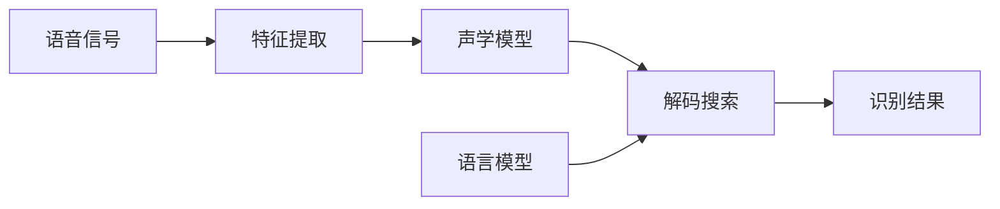

# 语音识别(Speech Recognition) - 原理与代码实例讲解

## 1. 背景介绍

语音识别是人工智能和机器学习领域的一个重要分支,旨在让计算机能够理解和转换人类语音。随着智能设备的普及,语音交互已成为人机交互的主要方式之一。语音识别技术在智能助手、语音搜索、语音控制等方面有广泛应用。

### 1.1 语音识别的发展历程

#### 1.1.1 早期的语音识别系统

早在20世纪50年代,贝尔实验室就开始了语音识别的研究。最初的系统只能识别有限的词汇,准确率较低。

#### 1.1.2 基于隐马尔可夫模型的语音识别

20世纪80年代,隐马尔可夫模型(HMM)被引入语音识别领域,极大地提高了识别准确率。基于HMM的系统可以处理连续语音,并在不同说话人和环境下表现稳定。

#### 1.1.3 深度学习时代的语音识别

近年来,随着深度学习的兴起,语音识别技术取得了突破性进展。基于深度神经网络(DNN)的端到端语音识别系统,在大规模数据的训练下,识别准确率大幅提升,逐渐接近甚至超过人类水平。

### 1.2 语音识别的应用场景

#### 1.2.1 智能助手

如苹果的Siri、谷歌助手、亚马逊Alexa等,通过语音识别实现自然语言交互。

#### 1.2.2 语音搜索 

用户可以直接用语音输入搜索关键词,快速获取信息。

#### 1.2.3 语音控制

通过语音指令控制智能家居、车载系统等设备。

#### 1.2.4 语音转写

将语音实时转换为文字,用于会议记录、字幕生成等。

## 2. 核心概念与联系

要理解语音识别的工作原理,需要掌握以下几个核心概念:

### 2.1 语音信号处理

语音识别的第一步是对语音信号进行预处理,包括:
- 端点检测:判断语音的起止点
- 预加重:增强高频部分,平衡频谱
- 分帧:将语音信号划分为等长的帧
- 加窗:减少帧与帧之间的不连续性

### 2.2 特征提取

从语音信号中提取能够表征语音特性的参数,常用的特征有:
- MFCC(Mel频率倒谱系数):模拟人耳的听觉特性
- LPCC(线性预测倒谱系数):基于语音产生模型
- Fbank(Mel滤波器组特征):Mel频率的功率谱

### 2.3 声学模型

声学模型用于建立语音特征和音素/词汇之间的对应关系,主要有:
- 隐马尔可夫模型(HMM):统计学习方法,可以建模时序信号
- 高斯混合模型(GMM):用多个高斯分布拟合观测数据的分布
- 深度神经网络(DNN):强大的非线性建模能力,可以直接预测音素/字符的后验概率

### 2.4 语言模型 

语言模型刻画了词与词之间的转移概率,为识别结果提供语义信息。常用的语言模型有:
- N-gram:基于词的出现频率估计概率
- RNN语言模型:利用循环神经网络建模长距离依赖

### 2.5 解码搜索

解码过程是在声学模型和语言模型的指导下,寻找最优的识别结果,主要方法有:
- Viterbi解码:动态规划算法,寻找最优路径
- Beam Search:广度优先的启发式搜索,平衡精度和效率

下图展示了语音识别系统的核心模块及其关系:

## 3. 核心算法原理与具体步骤

本节将详细介绍语音识别的核心算法,包括特征提取、声学模型训练和解码搜索。

### 3.1 MFCC特征提取

MFCC是最常用的语音特征之一,提取步骤如下:

1. 预加重:通过一阶高通滤波器,增强高频部分。
   
   $S_{pre}(n) = S(n) - \alpha \cdot S(n-1), 0.9 < \alpha < 1.0$

2. 分帧加窗:将语音信号划分为帧,并乘以汉明窗以减少频谱泄露。
   
   $S_{win}(n) = S_{pre}(n) \cdot W(n), W(n)=0.54-0.46\cos(\frac{2\pi n}{N-1})$

3. FFT:对每帧信号进行快速傅里叶变换,得到频谱。

4. Mel滤波器组:将频谱通过一组Mel尺度的三角形滤波器,得到Mel频谱。
   
   $M(m)=\sum_{k=0}^{N-1}|X(k)|^2 \cdot H_m(k)$

5. 取对数:对Mel频谱取对数,得到对数Mel频谱。

6. DCT:对对数Mel频谱进行离散余弦变换,得到MFCC特征。
   
   $C(n)=\sum_{m=0}^{M-1}{\log M(m) \cos[\frac{\pi n}{M}(m+0.5)]}$

### 3.2 HMM-GMM声学模型训练

HMM-GMM是传统语音识别系统的主流声学模型,训练过程如下:

1. 初始化:随机初始化HMM参数(状态转移概率、高斯混合参数等)。

2. 前向-后向算法:计算每个状态在每个时刻的前向概率和后向概率。
   
   $\alpha_t(i)=P(o_1,o_2,...,o_t,q_t=s_i|\lambda)$
   
   $\beta_t(i)=P(o_{t+1},o_{t+2},...,o_T|q_t=s_i,\lambda)$

3. Baum-Welch算法:基于前向-后向概率,迭代更新模型参数以最大化似然函数。
   
   $\xi_t(i,j)=P(q_t=s_i,q_{t+1}=s_j|O,\lambda)$
   
   $\gamma_t(i)=P(q_t=s_i|O,\lambda)$

4. 重复步骤2-3,直到收敛或达到最大迭代次数。

### 3.3 Viterbi解码

Viterbi解码是一种动态规划算法,用于寻找HMM状态序列的最优路径,步骤如下:

1. 初始化:
   
   $\delta_1(i)=\pi_i b_i(o_1), \psi_1(i)=0$

2. 递推:
   
   $\delta_t(j)=\max_{1\leq i\leq N} [\delta_{t-1}(i)a_{ij}]b_j(o_t)$
   
   $\psi_t(j)=\arg\max_{1\leq i\leq N} [\delta_{t-1}(i)a_{ij}]$

3. 终止:
   
   $P^*=\max_{1\leq i\leq N} [\delta_T(i)]$
   
   $q_T^*=\arg\max_{1\leq i\leq N} [\delta_T(i)]$

4. 回溯:
   
   $q_t^*=\psi_{t+1}(q_{t+1}^*), t=T-1,T-2,...,1$

其中,$\delta_t(i)$表示时刻$t$状态$i$的最优局部路径得分,$\psi_t(i)$为时刻$t$状态$i$的最优前驱状态。

## 4. 数学模型与公式详解

本节将详细推导语音识别中用到的几个关键数学模型和公式。

### 4.1 隐马尔可夫模型(HMM)

HMM是一种用于建模时序数据的统计学习模型,由初始概率分布、状态转移概率和观测概率定义:

- 初始概率分布:$\pi=\{\pi_i\}, \pi_i=P(q_1=s_i), 1\leq i\leq N$

- 状态转移概率:$A=\{a_{ij}\}, a_{ij}=P(q_{t+1}=s_j|q_t=s_i), 1\leq i,j\leq N$

- 观测概率:$B=\{b_i(o_t)\}, b_i(o_t)=P(o_t|q_t=s_i), 1\leq i\leq N$

其中,$N$为状态数,$q_t$为时刻$t$的状态,$o_t$为时刻$t$的观测。

HMM的三个基本问题:

1. 概率计算:给定模型$\lambda=(A,B,\pi)$和观测序列$O=(o_1,o_2,...,o_T)$,计算$P(O|\lambda)$。

   可以用前向算法高效计算:
   
   $\alpha_1(i)=\pi_i b_i(o_1), 1\leq i\leq N$
   
   $\alpha_{t+1}(j)=[\sum_{i=1}^N \alpha_t(i)a_{ij}]b_j(o_{t+1}), 1\leq t\leq T-1, 1\leq j\leq N$
   
   $P(O|\lambda)=\sum_{i=1}^N \alpha_T(i)$

2. 学习:给定观测序列$O=(o_1,o_2,...,o_T)$,估计模型参数$\lambda=(A,B,\pi)$使$P(O|\lambda)$最大。

   通常使用Baum-Welch算法(EM算法)迭代优化:
   
   $\bar{\pi}_i=\gamma_1(i)$
   
   $\bar{a}_{ij}=\frac{\sum_{t=1}^{T-1}\xi_t(i,j)}{\sum_{t=1}^{T-1}\gamma_t(i)}$
   
   $\bar{b}_i(k)=\frac{\sum_{t=1,o_t=v_k}^T \gamma_t(i)}{\sum_{t=1}^T \gamma_t(i)}$

3. 解码:给定模型$\lambda=(A,B,\pi)$和观测序列$O=(o_1,o_2,...,o_T)$,找到最可能的状态序列$Q=(q_1,q_2,...,q_T)$。

   即求解$\arg\max_Q P(Q|O,\lambda)$,可以用Viterbi算法高效解码(见3.3节)。

### 4.2 高斯混合模型(GMM)

GMM是一种用于估计概率密度函数的参数模型,由$K$个高斯分量的加权和表示:

$p(x)=\sum_{k=1}^K w_k \mathcal{N}(x|\mu_k,\Sigma_k)$

其中,$w_k$为第$k$个分量的权重,$\mu_k$和$\Sigma_k$分别为第$k$个分量的均值和协方差矩阵。

GMM的参数估计通常使用EM算法:

1. E步:计算每个样本属于每个分量的后验概率(责任)
   
   $\gamma_{nk}=\frac{w_k \mathcal{N}(x_n|\mu_k,\Sigma_k)}{\sum_{j=1}^K w_j \mathcal{N}(x_n|\mu_j,\Sigma_j)}$

2. M步:基于责任更新模型参数
   
   $\bar{w}_k=\frac{1}{N}\sum_{n=1}^N \gamma_{nk}$
   
   $\bar{\mu}_k=\frac{\sum_{n=1}^N \gamma_{nk}x_n}{\sum_{n=1}^N \gamma_{nk}}$
   
   $\bar{\Sigma}_k=\frac{\sum_{n=1}^N \gamma_{nk}(x_n-\bar{\mu}_k)(x_n-\bar{\mu}_k)^T}{\sum_{n=1}^N \gamma_{nk}}$

在HMM-GMM声学模型中,每个HMM状态的观测概率通过一个GMM来建模:

$b_i(o_t)=\sum_{k=1}^K w_{ik} \mathcal{N}(o_t|\mu_{ik},\Sigma_{ik})$

### 4.3 深度神经网络(DNN)

DNN是一种前馈式人工神经网络,由多个隐藏层组成,可以学习输入和输出之间的复杂非线性映射关系。

对于$L$层的DNN,第$l$层的输出为:

$h^{(l)}=f(W^{(l)}h^{(l-1)}+b^{(l)})$