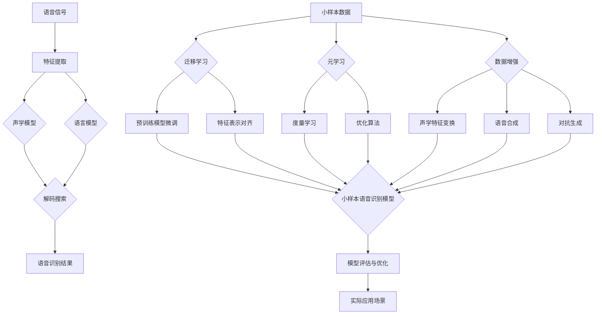

# 语音识别：小样本语音识别

## 1. 背景介绍
### 1.1 语音识别的发展历程
### 1.2 小样本语音识别的提出背景
### 1.3 小样本语音识别的研究意义

## 2. 核心概念与联系
### 2.1 语音识别的基本概念
#### 2.1.1 语音信号的特征提取
#### 2.1.2 声学模型
#### 2.1.3 语言模型
#### 2.1.4 解码搜索
### 2.2 小样本学习的基本概念  
#### 2.2.1 小样本学习的定义
#### 2.2.2 小样本学习的分类
#### 2.2.3 小样本学习的挑战
### 2.3 小样本语音识别的关键技术
#### 2.3.1 基于迁移学习的小样本语音识别
#### 2.3.2 基于元学习的小样本语音识别
#### 2.3.3 基于数据增强的小样本语音识别

## 3. 核心算法原理具体操作步骤
### 3.1 基于迁移学习的小样本语音识别算法
#### 3.1.1 预训练模型的选择与微调
#### 3.1.2 特征表示的对齐与适配
#### 3.1.3 领域自适应与知识蒸馏
### 3.2 基于元学习的小样本语音识别算法  
#### 3.2.1 度量学习与原型网络
#### 3.2.2 优化算法：MAML与Reptile
#### 3.2.3 基于记忆力增强的元学习
### 3.3 基于数据增强的小样本语音识别算法
#### 3.3.1 基于声学特征变换的数据增强
#### 3.3.2 基于语音合成的数据增强 
#### 3.3.3 基于对抗生成网络的数据增强

## 4. 数学模型和公式详细讲解举例说明
### 4.1 语音识别的数学建模
#### 4.1.1 隐马尔可夫模型HMM
#### 4.1.2 高斯混合模型GMM
#### 4.1.3 深度神经网络DNN
### 4.2 小样本学习的数学建模
#### 4.2.1 Few-Shot Learning的数学定义
#### 4.2.2 度量学习的数学原理
#### 4.2.3 元学习的数学原理
### 4.3 迁移学习的数学建模
#### 4.3.1 领域自适应的数学原理 
#### 4.3.2 知识蒸馏的数学原理

## 5. 项目实践：代码实例和详细解释说明
### 5.1 基于Pytorch的小样本语音识别实现
#### 5.1.1 数据准备与预处理
#### 5.1.2 模型构建与训练
#### 5.1.3 模型评估与优化
### 5.2 基于Tensorflow的小样本语音识别实现
#### 5.2.1 数据准备与预处理
#### 5.2.2 模型构建与训练  
#### 5.2.3 模型评估与优化
### 5.3 实验结果分析与讨论
#### 5.3.1 不同方法的性能对比
#### 5.3.2 超参数对模型性能的影响
#### 5.3.3 小样本数量对模型性能的影响

## 6. 实际应用场景
### 6.1 智能语音助手
### 6.2 语音控制系统
### 6.3 语音搜索引擎
### 6.4 语音内容审核
### 6.5 语音异常检测

## 7. 工具和资源推荐
### 7.1 开源语音识别工具包
#### 7.1.1 Kaldi
#### 7.1.2 ESPnet
#### 7.1.3 DeepSpeech
### 7.2 语音数据集
#### 7.2.1 LibriSpeech
#### 7.2.2 VoxCeleb
#### 7.2.3 CommonVoice
### 7.3 预训练模型
#### 7.3.1 Wav2Vec
#### 7.3.2 HuBERT
#### 7.3.3 WavLM

## 8. 总结：未来发展趋势与挑战
### 8.1 小样本语音识别的研究进展
### 8.2 跨语言与跨领域的小样本语音识别
### 8.3 低资源语言的小样本语音识别
### 8.4 面向终端设备的小样本语音识别
### 8.5 人机交互中的小样本语音识别

## 9. 附录：常见问题与解答
### 9.1 如何选择合适的小样本学习方法？
### 9.2 如何应对小样本数据的类别不平衡问题？
### 9.3 如何评估小样本语音识别系统的性能？
### 9.4 如何进一步提升小样本语音识别的准确率？
### 9.5 小样本语音识别在实际应用中还有哪些难点？

小样本语音识别是语音识别领域的一个重要研究方向，旨在利用少量的标注数据来训练高性能的语音识别模型。传统的语音识别系统通常需要大量的标注数据来训练声学模型和语言模型，而收集和标注大规模语音数据非常耗时耗力。小样本语音识别技术可以显著降低语音识别系统对标注数据的依赖，从而加速语音识别技术在不同领域和语言中的应用。

小样本语音识别的核心思想是充分利用先验知识和少量标注数据来学习语音信号的特征表示和分类决策边界。目前主要有三类小样本语音识别方法：基于迁移学习、基于元学习和基于数据增强。基于迁移学习的方法通过在大规模语音数据上预训练声学模型，然后在小样本数据上微调模型参数来适应新的语音识别任务。基于元学习的方法通过学习在不同语音识别任务上快速适应的优化策略，从而实现在小样本数据上的快速学习。基于数据增强的方法通过对小样本数据进行转换、合成等操作来扩充训练数据，从而提升模型的泛化性能。

在实践中，小样本语音识别算法的核心步骤包括：1)利用大规模无标注语音数据进行预训练；2)使用少量标注数据对预训练模型进行微调；3)利用元学习算法优化模型的小样本学习能力；4)通过数据增强扩充小样本数据集；5)在目标语音识别任务上评估模型性能并进行优化。其中，预训练模型的选择、元学习算法的设计和数据增强策略的选取都是影响小样本语音识别性能的关键因素。

小样本语音识别技术可以应用于智能语音助手、语音控制、语音搜索、内容审核等多个领域。目前，小样本语音识别仍面临着跨语言、跨领域、低资源等诸多挑战。未来的研究方向包括探索更高效的小样本学习算法、开发面向终端设备的轻量级模型、研究人机交互场景下的小样本语音识别等。随着人工智能技术的不断发展，小样本语音识别有望在更广泛的应用场景中发挥重要作用，为人机语音交互带来更自然、更智能的体验。

小样本语音识别中的一个关键问题是如何从少量标注数据中学习到鲁棒的语音特征表示。传统的语音特征如MFCC、Fbank等通常难以刻画语音信号的高层语义信息。近年来，基于深度学习的语音特征学习方法取得了显著进展。通过在大规模无标注语音数据上预训练卷积神经网络(CNN)或自注意力机制(Self-Attention)等模型，可以学习到语音信号的高层特征表示，再利用少量标注数据微调模型，从而显著提升语音识别的性能。例如，Wav2Vec[1]通过对比学习从语音信号中学习到了与文本表示高度一致的语音特征，在多个语音识别任务上取得了state-of-the-art的结果。HuBERT[2]通过掩码预测从无标注语音中学习到了丰富的语音内容信息和韵律信息，在下游的语音识别、说话人识别等任务上表现优异。这些基于自监督学习的语音预训练模型为小样本语音识别提供了高质量的语音特征，为后续的模型微调和优化奠定了基础。

除了语音特征学习，小样本语音识别中的另一个关键问题是如何从少量标注数据中快速适应新的语音识别任务。元学习是解决这一问题的重要方法之一。元学习的目标是学习一个快速适应不同任务的优化策略，从而实现在小样本数据上的快速学习。例如，MAML(Model-Agnostic Meta-Learning)[3]通过学习模型参数在不同任务上的梯度更新方向，实现了对新任务的快速适应。Reptile[4]通过最小化不同任务上的损失函数来学习初始化参数，使得模型能够在少量步骤内适应新任务。这些元学习算法可以显著提升小样本语音识别模型的泛化能力和学习效率。

在实际应用中，小样本语音识别还面临着诸多挑战。其中一个重要挑战是如何应对不同场景下的环境噪声和语音变体。环境噪声会显著降低语音识别的准确率，而说话人的年龄、性别、口音等因素也会导致语音特征的变化。为了提升小样本语音识别的鲁棒性，可以利用数据增强技术生成不同噪声和变体条件下的语音样本，扩充训练数据集。例如，可以对语音信号施加随机裁剪、时间拉伸、频谱扰动等变换[5]，或利用生成对抗网络(GAN)合成不同噪声条件下的语音[6]。数据增强可以有效缓解小样本数据的类别不平衡问题，提升模型的泛化性能。

另一个挑战是如何在资源受限的终端设备上部署小样本语音识别模型。终端设备通常面临着计算资源、存储空间、能耗等多方面的限制，难以支持大规模语音识别模型的运行。为了实现小样本语音识别在终端设备上的应用，需要开发轻量级的模型架构和推理优化技术。例如，可以利用模型剪枝、量化、知识蒸馏等方法压缩模型体积，降低计算复杂度[7]。也可以利用神经网络加速芯片(如NPU、TPU等)来加速模型推理过程[8]。这些优化技术可以显著降低小样本语音识别模型的资源消耗，实现在终端设备上的实时运行。

未来，小样本语音识别技术还有许多值得探索的研究方向。一方面，可以进一步挖掘语音信号中的领域知识和常识信息，如语音的韵律特征、说话人特征等，用于指导小样本学习过程。另一方面，可以研究语音识别与其他模态信息(如视觉、文本等)的融合方法，实现多模态小样本学习。同时，还需要探索小样本语音识别在更多实际场景中的应用，如会议记录、医疗诊断、法庭庭审等，并研究相应的隐私保护和安全问题。随着人工智能技术的不断发展，小样本语音识别有望在智能语音交互领域发挥更大的作用，为人们的生活和工作带来更多便利。

## 参考文献
[1] Schneider S, Baevski A, Collobert R, et al. wav2vec: Unsupervised Pre-Training for Speech Recognition[J]. arXiv preprint arXiv:1