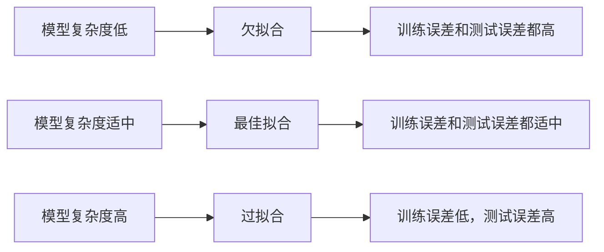

## 1.背景介绍

在机器学习和深度学习中，我们经常会遇到过拟合和欠拟合的问题。这两种现象都会影响模型的性能，因此，理解它们的原理，并知道如何解决这些问题，对于我们来说是非常重要的。

过拟合（Overfitting）是指模型在训练集上的表现很好，但在测试集上的表现却很差。这是因为模型过于复杂，以至于它“记住”了训练数据中的噪声，而没有“学习”到数据的真实分布。

欠拟合（Underfitting）则是指模型在训练集和测试集上的表现都不好。这是因为模型过于简单，以至于它无法捕捉到数据的复杂性。

## 2.核心概念与联系

过拟合和欠拟合是机器学习中的两个核心概念，它们之间的关系可以通过模型复杂度和误差的关系来理解。

模型复杂度和误差之间的关系可以用一个“U”形曲线来描述。当模型复杂度很低时，模型容易出现欠拟合，这时训练误差和测试误差都会很高。随着模型复杂度的增加，训练误差会逐渐降低，但测试误差会先降低后增加，当模型复杂度过高时，模型会出现过拟合，此时训练误差很低，但测试误差却很高。



## 3.核心算法原理具体操作步骤

解决过拟合和欠拟合的问题，通常可以采用以下几种策略：

1. 增加或减少模型复杂度：如果模型出现欠拟合，可以通过增加模型复杂度来解决，例如增加神经网络的层数或节点数；如果模型出现过拟合，可以通过减少模型复杂度来解决，例如减少神经网络的层数或节点数。

2. 增加或减少训练数据：如果模型出现欠拟合，可以通过增加训练数据来解决；如果模型出现过拟合，可以通过减少训练数据来解决。但是，这种方法并不总是可行，因为获取更多的训练数据可能是困难的，或者需要花费大量的时间和资源。

3. 使用正则化：正则化是一种常用的防止过拟合的技术，它通过在损失函数中添加一个正则项来限制模型的复杂度。常用的正则化方法有L1正则化和L2正则化。

4. 使用早停法：早停法是一种防止过拟合的技术，它通过在训练过程中监控验证集的误差，当验证集的误差开始增加时，就停止训练，以防止模型过拟合。

## 4.数学模型和公式详细讲解举例说明

正则化是一种常用的防止过拟合的技术，它通过在损失函数中添加一个正则项来限制模型的复杂度。常用的正则化方法有L1正则化和L2正则化。

L1正则化是指在损失函数中添加模型参数的绝对值之和作为正则项，其数学形式为：

$$
L = L_0 + \lambda \sum |w_i|
$$

其中，$L_0$是原始的损失函数，$w_i$是模型参数，$\lambda$是正则化参数，用来控制正则项的权重。

L2正则化是指在损失函数中添加模型参数的平方和作为正则项，其数学形式为：

$$
L = L_0 + \lambda \sum w_i^2
$$

其中，$L_0$是原始的损失函数，$w_i$是模型参数，$\lambda$是正则化参数，用来控制正则项的权重。

## 5.项目实践：代码实例和详细解释说明

下面我们将通过一个简单的线性回归问题来说明如何使用正则化来防止过拟合。

首先，我们生成一些模拟数据：

```python
import numpy as np
import matplotlib.pyplot as plt

np.random.seed(0)
x = np.random.uniform(-3, 3, size=100)
X = x.reshape(-1, 1)
y = 0.5 * x**2 + x + 2 + np.random.normal(0, 1, size=100)

plt.scatter(x, y)
plt.show()
```

然后，我们使用多项式回归来拟合这些数据：

```python
from sklearn.preprocessing import PolynomialFeatures
from sklearn.linear_model import LinearRegression

poly = PolynomialFeatures(degree=2)
X_poly = poly.fit_transform(X)

lin_reg = LinearRegression()
lin_reg.fit(X_poly, y)
y_predict = lin_reg.predict(X_poly)

plt.scatter(x, y)
plt.plot(np.sort(x), y_predict[np.argsort(x)], color='r')
plt.show()
```

最后，我们使用L2正则化（也称为岭回归）来防止过拟合：

```python
from sklearn.linear_model import Ridge

ridge = Ridge(alpha=1)
ridge.fit(X_poly, y)
y_predict = ridge.predict(X_poly)

plt.scatter(x, y)
plt.plot(np.sort(x), y_predict[np.argsort(x)], color='r')
plt.show()
```

从上面的例子中，我们可以看到，通过使用L2正则化，我们可以有效地防止过拟合。

## 6.实际应用场景

过拟合和欠拟合的问题在机器学习和深度学习中非常常见，它们在各种实际应用场景中都可能出现，例如：

- 在图像识别中，如果模型过于复杂，可能会“记住”训练图像中的噪声，导致在新的图像上的表现不佳。

- 在自然语言处理中，如果模型过于简单，可能无法捕捉到语言的复杂性，导致在新的文本上的表现不佳。

- 在推荐系统中，如果模型过于复杂，可能会过度拟合用户的历史行为，导致推荐的结果过于狭窄。

## 7.工具和资源推荐

解决过拟合和欠拟合的问题，有很多工具和资源可以帮助我们，例如：

- Scikit-Learn：这是一个非常强大的机器学习库，它提供了很多用于防止过拟合和欠拟合的工具，例如正则化、早停法等。

- TensorFlow和Keras：这两个库是深度学习的主要工具，它们提供了很多用于防止过拟合和欠拟合的工具，例如Dropout、Batch Normalization等。

- 书籍《深度学习》：这本书是深度学习的经典教材，它详细介绍了过拟合和欠拟合的原理，以及如何解决这些问题。

## 8.总结：未来发展趋势与挑战

随着机器学习和深度学习的不断发展，过拟合和欠拟合的问题仍然是一个重要的研究方向。未来的发展趋势可能会包括：

- 开发更有效的正则化技术：虽然我们已经有了很多正则化技术，但是它们并不总是能够有效地防止过拟合。因此，开发更有效的正则化技术是一个重要的研究方向。

- 开发更好的模型选择和模型评估方法：选择合适的模型复杂度，以及评估模型的泛化能力，是防止过拟合和欠拟合的关键。因此，开发更好的模型选择和模型评估方法是一个重要的研究方向。

- 利用大数据和分布式计算：随着数据量的增加和计算能力的提高，我们有可能通过更大的数据和更强的计算能力来解决过拟合和欠拟合的问题。

## 9.附录：常见问题与解答

1. 问题：为什么模型复杂度过高会导致过拟合？
   答：当模型复杂度过高时，模型可能会“记住”训练数据中的噪声，而没有“学习”到数据的真实分布，这就是过拟合。

2. 问题：为什么模型复杂度过低会导致欠拟合？
   答：当模型复杂度过低时，模型可能无法捕捉到数据的复杂性，因此在训练数据和新的数据上的表现都不好，这就是欠拟合。

3. 问题：如何选择合适的模型复杂度？
   答：选择合适的模型复杂度通常需要通过交叉验证来进行。具体来说，我们可以选择不同的模型复杂度，然后通过交叉验证来评估它们的性能，最后选择性能最好的那个模型复杂度。

作者：禅与计算机程序设计艺术 / Zen and the Art of Computer Programming