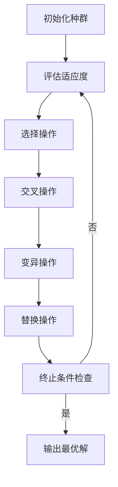

# 适者生存：理解适应度函数

## 1.背景介绍

### 1.1 进化算法概述

进化算法是一种基于生物进化过程的优化算法,它模拟自然界中生物进化的过程,通过模拟生物的遗传、变异、交叉和选择等操作,从初始种群中不断产生新的个体,使种群不断进化,最终获得满足要求的最优解。

进化算法的基本思想源于达尔文的"物竞天择、适者生存"理论。在自然界中,生物体为了生存和繁衍,必须不断地适应环境的变化。那些较强的个体会生存下来并繁衍后代,而较弱的个体则被淘汰。经过漫长的进化过程,生物体逐渐适应了环境,形成了各种各样的物种。

进化算法将待优化的问题看作是一个适应度函数,将可能的解看作是种群中的个体。通过不断地进行选择、交叉和变异等操作,产生新的个体,使种群不断进化,直到找到满足要求的最优解为止。

### 1.2 适应度函数的重要性

在进化算法中,适应度函数扮演着至关重要的角色。它用于评估个体的优劣程度,决定了哪些个体会被选择用于繁衍下一代,哪些个体会被淘汰。适应度函数的设计直接影响了算法的收敛速度和解的质量。

一个好的适应度函数应该能够准确地反映问题的目标,使得算法能够有效地寻找到最优解。同时,适应度函数还应该具有一定的平滑性,避免出现过多的局部极值点,从而降低算法陷入局部最优的风险。

## 2.核心概念与联系

### 2.1 适应度函数的定义

适应度函数(Fitness Function)是进化算法中一个非常重要的概念,它用于评估个体的优劣程度,决定了个体在种群中的生存能力。适应度函数将问题的目标函数映射到一个非负实数值,用于衡量个体解决问题的能力。

适应度函数可以表示为:

$$f(x) : X \rightarrow \mathbb{R}^+$$

其中,X表示可能解的空间,f(x)表示个体x的适应度值。适应度值越大,表示个体越优秀,越有可能被选择用于繁衍下一代。

### 2.2 适应度函数与目标函数的关系

在许多优化问题中,我们需要最小化或最大化一个目标函数。目标函数可以直接用作适应度函数,但在某些情况下,这可能会导致一些问题。

例如,在最小化问题中,如果目标函数的值为负,那么适应度函数就会出现负值,这可能会导致算法出现异常。此外,如果目标函数的值范围过大,可能会导致算法收敛缓慢或者无法收敛。

为了解决这些问题,我们通常需要对目标函数进行一些变换,将其映射到一个非负实数范围内,同时保持原有的排序关系不变。常见的变换方法包括线性变换、指数变换、对数变换等。

### 2.3 适应度函数的设计原则

设计一个好的适应度函数是进化算法成功的关键。一个好的适应度函数应该具备以下几个特性:

1. **准确性**: 适应度函数应该能够准确地反映问题的目标,使得算法能够有效地寻找到最优解。

2. **平滑性**: 适应度函数应该具有一定的平滑性,避免出现过多的局部极值点,从而降低算法陷入局部最优的风险。

3. **计算效率**: 适应度函数的计算应该尽可能高效,因为在进化算法中需要对每个个体进行多次评估。

4. **无偏性**: 适应度函数不应该对特定的解有偏好,否则可能会导致算法过早收敛到次优解。

5. **可扩展性**: 适应度函数应该具有良好的可扩展性,能够适应问题规模的变化。

## 3.核心算法原理具体操作步骤

进化算法的核心操作步骤可以概括为以下几个步骤:

1. **初始化种群**: 随机生成一个初始种群,包含一定数量的个体。每个个体表示问题的一个可能解。

2. **评估适应度**: 对种群中的每个个体计算其适应度值,根据适应度函数评估个体的优劣程度。

3. **选择操作**: 根据适应度值,从种群中选择一些优秀的个体,用于繁衍下一代。常见的选择方法包括轮盘赌选择、锦标赛选择、排名选择等。

4. **交叉操作**: 对选择出的个体进行交叉操作,产生新的个体。交叉操作模拟了生物体基因重组的过程,有助于保持种群的多样性。

5. **变异操作**: 对交叉后的个体进行变异操作,引入一些新的基因,增加种群的多样性,避免算法过早收敛。

6. **替换操作**: 用新产生的个体替换种群中的一些个体,形成新的种群。

7. **终止条件检查**: 检查是否满足算法终止条件,如达到最大迭代次数、找到满意解等。如果满足,则输出最优解并终止算法;否则,返回步骤2,对新的种群进行评估和进化操作。

这个过程不断重复,直到满足终止条件为止。进化算法的核心在于通过选择、交叉和变异等操作,不断产生新的个体,使种群朝着更优的方向进化,最终找到满足要求的最优解。



## 4.数学模型和公式详细讲解举例说明

### 4.1 适应度函数的数学表示

适应度函数可以用数学公式来表示,它将问题的可能解映射到一个非负实数值,用于衡量个体解决问题的能力。

对于一个优化问题,假设我们需要最小化目标函数f(x),其中x是决策变量向量,X是可行解空间。那么,适应度函数可以表示为:

$$\text{Fitness}(x) = \begin{cases}
\frac{1}{1 + f(x)}, & \text{if } f(x) \geq 0\\
1 + |f(x)|, & \text{if } f(x) < 0
\end{cases}$$

这个适应度函数将目标函数的值映射到(0, 1]范围内,并保持了原有的排序关系。对于最小化问题,适应度值越大,表示个体越优秀。

对于最大化问题,我们可以将目标函数取负号,然后使用上述适应度函数。

### 4.2 适应度函数的线性缩放

在某些情况下,适应度函数的值可能分布不均匀,导致算法收敛缓慢或无法收敛。为了解决这个问题,我们可以对适应度函数进行线性缩放,使其值分布在一个合适的范围内。

线性缩放的公式如下:

$$\text{Fitness}_\text{scaled}(x) = a \times \text{Fitness}(x) + b$$

其中,a和b是缩放系数,可以根据适应度函数的值范围和期望的缩放范围来确定。

例如,假设我们希望将适应度函数的值缩放到[0, 1]范围内,并且已知适应度函数的最小值为f_min,最大值为f_max,那么缩放系数可以计算如下:

$$a = \frac{1}{f_\text{max} - f_\text{min}}$$
$$b = -\frac{f_\text{min}}{f_\text{max} - f_\text{min}}$$

经过线性缩放后,适应度函数的值将落在[0, 1]范围内,有利于算法的收敛。

### 4.3 适应度函数的指数缩放

除了线性缩放,我们还可以使用指数缩放来调整适应度函数的值分布。指数缩放的公式如下:

$$\text{Fitness}_\text{scaled}(x) = e^{\alpha \times \text{Fitness}(x)}$$

其中,α是一个正常数,用于控制缩放的程度。α越大,缩放效果越明显。

指数缩放可以将适应度函数的值映射到(0, 1)范围内,同时放大了适应度值之间的差异,有利于算法选择优秀个体。但是,过度缩放也可能导致算法过早收敛到次优解,因此需要合理选择α的值。

### 4.4 适应度函数的约束处理

在许多实际问题中,我们需要考虑一些约束条件,即解必须满足某些等式或不等式约束。在这种情况下,我们需要对适应度函数进行修改,以惩罚那些违反约束的个体。

常见的约束处理方法包括:

1. **惩罚函数法**: 在适应度函数中加入一个惩罚项,对违反约束的个体进行惩罚。惩罚项的大小取决于约束违反的程度。

2. **可行性规则法**: 将种群分为两部分,一部分是可行解,另一部分是不可行解。在选择操作时,优先选择可行解,如果可行解数量不足,再从不可行解中选择。

3. **修复算子法**: 对违反约束的个体进行修复,使其满足约束条件。修复算子的设计需要根据具体问题进行。

4. **多目标优化法**: 将约束条件转化为另一个优化目标,将原问题转化为多目标优化问题。

不同的约束处理方法各有优缺点,需要根据具体问题的特点进行选择。

## 5.项目实践:代码实例和详细解释说明

为了更好地理解适应度函数在进化算法中的作用,我们以一个简单的数值优化问题为例,使用Python实现一个基本的进化算法。

### 5.1 问题描述

我们需要求解以下函数的最小值:

$$f(x) = x^2 + 10\sin(x)$$

其中,x的取值范围为[-10, 10]。

### 5.2 适应度函数设计

由于目标函数的值可能为负,因此我们需要对其进行变换,使适应度函数的值落在非负实数范围内。我们采用以下适应度函数:

$$\text{Fitness}(x) = \frac{1}{1 + f(x)}$$

这个适应度函数将目标函数的值映射到(0, 1]范围内,并保持了原有的排序关系。对于最小化问题,适应度值越大,表示个体越优秀。

### 5.3 代码实现

```python
import random
import math

# 目标函数
def objective_function(x):
    return x**2 + 10 * math.sin(x)

# 适应度函数
def fitness_function(x):
    return 1 / (1 + objective_function(x))

# 初始化种群
def initialize_population(population_size, bounds):
    population = []
    for _ in range(population_size):
        individual = random.uniform(bounds[0], bounds[1])
        population.append(individual)
    return population

# 选择操作
def selection(population, fitness_values, selection_size):
    sorted_indices = sorted(range(len(fitness_values)), key=lambda k: fitness_values[k], reverse=True)
    selected_indices = sorted_indices[:selection_size]
    selected_individuals = [population[i] for i in selected_indices]
    return selected_individuals

# 交叉操作
def crossover(parent1, parent2, bounds):
    child1 = random.uniform(bounds[0], bounds[1])
    child2 = random.uniform(bounds[0], bounds[1])
    return child1, child2

# 变异操作
def mutation(individual, bounds, mutation_rate):
    if random.random() < mutation_rate:
        individual = random.uniform(bounds[0], bounds[1])
    return individual

# 进化算法主函数
def evolutionary_algorithm(population_size, selection_size, mutation_rate, max_generations, bounds):
    population = initialize_population(population_size, bounds)
    fitness_values = [fitness_function(individual) for individual in population]

    for generation in range(max_generations):
        # 选择操作
        selected_individuals = selection(population, fitness_values, selection_size)

        # 交叉操作
        offspring = []
        for i in range(0, selection_size, 2):
            parent1 = selected_individuals[i]
            if i + 1 < selection_size:
                parent2 = selected_individuals[i + 1]
            else:
                parent2