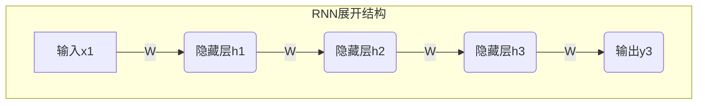
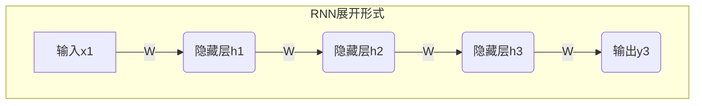

# 递归神经网络 (RNN)

## 1.背景介绍

在自然语言处理、语音识别、机器翻译等序列数据处理任务中,传统的前馈神经网络无法有效捕捉序列数据中的长期依赖关系,因为它们对于每个输入只有一个独立的权重矩阵进行计算。为了解决这个问题,递归神经网络(Recurrent Neural Network, RNN)应运而生。

RNN是一种特殊类型的人工神经网络,它通过将序列数据的每个元素进行迭代,并将当前元素与前一状态进行组合,从而捕获序列数据中的长期依赖关系。与传统神经网络不同,RNN在处理序列数据时具有"记忆"能力,可以利用之前的信息来影响当前的输出。

## 2.核心概念与联系

### 2.1 RNN的基本结构

RNN的基本结构由一个循环体组成,每个时间步都会对输入进行处理,并将处理结果与上一时间步的隐藏状态进行组合,生成当前时间步的隐藏状态。这种循环结构使得RNN能够捕捉序列数据中的长期依赖关系。

$$h_t = f_W(x_t, h_{t-1})$$

其中,$h_t$表示时间步t的隐藏状态,$x_t$表示时间步t的输入,$h_{t-1}$表示前一时间步的隐藏状态,$f_W$表示由权重矩阵W参数化的非线性函数。

### 2.2 RNN的展开结构

为了更好地理解RNN的计算过程,我们可以将其展开成一个深层前馈神经网络。在展开的结构中,每一个时间步对应一层网络,并且每一层之间共享相同的权重矩阵。这种展开结构使得我们可以更清晰地看到RNN在捕捉序列数据长期依赖关系的过程。



### 2.3 RNN的变体

基于标准RNN的结构,研究人员提出了多种变体,以解决RNN在实际应用中存在的一些问题,例如梯度消失和梯度爆炸问题。一些著名的RNN变体包括:

- 长短期记忆网络(LSTM)
- 门控循环单元(GRU)
- 双向RNN(Bidirectional RNN)
- 深层RNN

这些变体通过引入门控机制、双向传播等方式,提高了RNN在处理长序列数据时的性能。

## 3.核心算法原理具体操作步骤

### 3.1 RNN的前向传播

RNN的前向传播过程可以概括为以下步骤:

1. 初始化隐藏状态$h_0$,通常将其设置为全0向量。
2. 在时间步t,计算当前隐藏状态$h_t$:
   $$h_t = f_W(x_t, h_{t-1})$$
   其中$f_W$通常为一个非线性函数,例如tanh或ReLU。
3. 计算当前时间步的输出$y_t$:
   $$y_t = g_U(h_t)$$
   其中$g_U$为输出层的函数,例如softmax或线性函数。
4. 重复步骤2和3,直到处理完整个序列。

### 3.2 RNN的反向传播

RNN的反向传播过程需要计算每个时间步的误差梯度,并通过时间反向传播误差梯度,更新网络参数。具体步骤如下:

1. 计算最后一个时间步的误差梯度$\frac{\partial E}{\partial y_T}$。
2. 对于时间步t,计算隐藏状态的误差梯度:
   $$\frac{\partial E}{\partial h_t} = \frac{\partial E}{\partial y_t}\frac{\partial y_t}{\partial h_t} + \frac{\partial E}{\partial h_{t+1}}\frac{\partial h_{t+1}}{\partial h_t}$$
3. 计算输入和权重的误差梯度:
   $$\frac{\partial E}{\partial x_t} = \frac{\partial E}{\partial h_t}\frac{\partial h_t}{\partial x_t}$$
   $$\frac{\partial E}{\partial W} = \frac{\partial E}{\partial h_t}\frac{\partial h_t}{\partial W}$$
4. 使用优化算法(如梯度下降)更新网络参数。
5. 重复步骤2-4,直到处理完整个序列。

## 4.数学模型和公式详细讲解举例说明

### 4.1 RNN的数学模型

RNN的数学模型可以表示为:

$$h_t = f_W(x_t, h_{t-1})$$
$$y_t = g_U(h_t)$$

其中:

- $x_t$表示时间步t的输入
- $h_t$表示时间步t的隐藏状态
- $h_{t-1}$表示前一时间步的隐藏状态
- $y_t$表示时间步t的输出
- $f_W$表示由权重矩阵W参数化的非线性函数,通常为tanh或ReLU
- $g_U$表示由权重矩阵U参数化的输出层函数,通常为softmax或线性函数

### 4.2 RNN的展开形式

为了更好地理解RNN的计算过程,我们可以将其展开成一个深层前馈神经网络。在展开的形式中,每一个时间步对应一层网络,并且每一层之间共享相同的权重矩阵。



在这个展开形式中,我们可以看到每一个时间步的隐藏状态$h_t$不仅依赖于当前输入$x_t$,也依赖于前一时间步的隐藏状态$h_{t-1}$。这种递归结构使得RNN能够捕捉序列数据中的长期依赖关系。

### 4.3 RNN的反向传播

RNN的反向传播过程需要计算每个时间步的误差梯度,并通过时间反向传播误差梯度,更新网络参数。具体公式如下:

1. 计算最后一个时间步的误差梯度:
   $$\frac{\partial E}{\partial y_T}$$
2. 对于时间步t,计算隐藏状态的误差梯度:
   $$\frac{\partial E}{\partial h_t} = \frac{\partial E}{\partial y_t}\frac{\partial y_t}{\partial h_t} + \frac{\partial E}{\partial h_{t+1}}\frac{\partial h_{t+1}}{\partial h_t}$$
3. 计算输入和权重的误差梯度:
   $$\frac{\partial E}{\partial x_t} = \frac{\partial E}{\partial h_t}\frac{\partial h_t}{\partial x_t}$$
   $$\frac{\partial E}{\partial W} = \frac{\partial E}{\partial h_t}\frac{\partial h_t}{\partial W}$$

通过计算这些梯度,我们可以使用优化算法(如梯度下降)更新网络参数,从而使模型在训练数据上的性能不断提高。

### 4.4 RNN的梯度消失和梯度爆炸问题

在训练RNN时,我们经常会遇到梯度消失和梯度爆炸的问题。这是因为在反向传播过程中,梯度会通过多个时间步进行传递,导致梯度值呈指数级增长或衰减。

梯度消失问题会导致RNN无法有效捕捉长期依赖关系,因为随着时间步的增加,梯度值会变得非常小,使得网络参数无法被有效更新。

梯度爆炸问题则会导致网络参数的更新非常不稳定,甚至可能导致模型发散。

为了解决这些问题,研究人员提出了一些解决方案,例如梯度剪裁、LSTM和GRU等门控机制等。这些方法可以有效缓解梯度消失和梯度爆炸的问题,提高RNN在处理长序列数据时的性能。

## 5.项目实践:代码实例和详细解释说明

在本节中,我们将使用Python和PyTorch框架实现一个基本的RNN模型,并在一个简单的序列数据集上进行训练和测试。

### 5.1 准备数据

我们将使用一个简单的序列数据集,其中包含一系列数字序列,每个序列的长度为5。我们的目标是训练一个RNN模型,能够根据前4个数字预测第5个数字。

```python
import torch
from torch.utils.data import TensorDataset, DataLoader

# 生成训练数据
X_train = torch.randint(0, 10, (1000, 4))  # 生成1000个长度为4的随机数字序列
y_train = torch.sum(X_train, dim=1) % 7  # 计算每个序列的和,取模7作为目标值

# 生成测试数据
X_test = torch.randint(0, 10, (100, 4))
y_test = torch.sum(X_test, dim=1) % 7

# 创建数据加载器
train_dataset = TensorDataset(X_train, y_train)
test_dataset = TensorDataset(X_test, y_test)
train_loader = DataLoader(train_dataset, batch_size=32, shuffle=True)
test_loader = DataLoader(test_dataset, batch_size=32, shuffle=False)
```

### 5.2 定义RNN模型

我们将使用PyTorch中的`nn.RNN`模块定义一个基本的RNN模型。

```python
import torch.nn as nn

class RNNModel(nn.Module):
    def __init__(self, input_size, hidden_size, output_size):
        super(RNNModel, self).__init__()
        self.hidden_size = hidden_size
        self.rnn = nn.RNN(input_size, hidden_size, batch_first=True)
        self.fc = nn.Linear(hidden_size, output_size)

    def forward(self, x):
        batch_size = x.size(0)
        h0 = torch.zeros(1, batch_size, self.hidden_size)  # 初始化隐藏状态
        out, _ = self.rnn(x, h0)  # 通过RNN获取输出和最后一个隐藏状态
        out = self.fc(out[:, -1, :])  # 取最后一个时间步的输出,送入全连接层
        return out

# 创建模型实例
input_size = 1  # 每个时间步的输入维度
hidden_size = 32  # 隐藏层维度
output_size = 7  # 输出维度
model = RNNModel(input_size, hidden_size, output_size)
```

在这个模型中,我们首先初始化一个全0的隐藏状态`h0`,然后将输入序列`x`和`h0`一起送入`nn.RNN`模块,获取输出序列和最后一个隐藏状态。接着,我们取输出序列的最后一个时间步的输出,送入一个全连接层,得到最终的预测结果。

### 5.3 训练模型

我们将使用交叉熵损失函数和Adam优化器来训练RNN模型。

```python
import torch.nn.functional as F

# 定义损失函数和优化器
criterion = nn.CrossEntropyLoss()
optimizer = torch.optim.Adam(model.parameters(), lr=0.01)

# 训练循环
num_epochs = 100
for epoch in range(num_epochs):
    total_loss = 0
    for x, y in train_loader:
        x = x.view(-1, 4, 1)  # 将输入reshape为(batch_size, seq_len, input_size)
        y_pred = model(x)
        loss = criterion(y_pred, y)
        
        optimizer.zero_grad()
        loss.backward()
        optimizer.step()
        
        total_loss += loss.item()
    
    print(f'Epoch {epoch+1}, Loss: {total_loss / len(train_loader):.4f}')
```

在每个epoch中,我们遍历训练数据加载器,将输入数据`x`reshape为(batch_size, seq_len, input_size)的形式,然后通过模型获取预测结果`y_pred`。我们计算预测结果与真实标签`y`之间的交叉熵损失,并使用反向传播更新模型参数。

### 5.4 测试模型

最后,我们在测试数据集上评估训练好的模型的性能。

```python
# 测试循环
model.eval()
with torch.no_grad():
    correct = 0
    total = 0
    for x, y in test_loader:
        x = x.view(-1, 4, 1)
        y_pred = model(x)
        _, predicted = torch